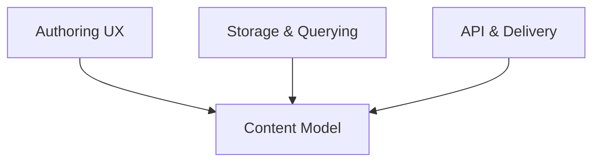
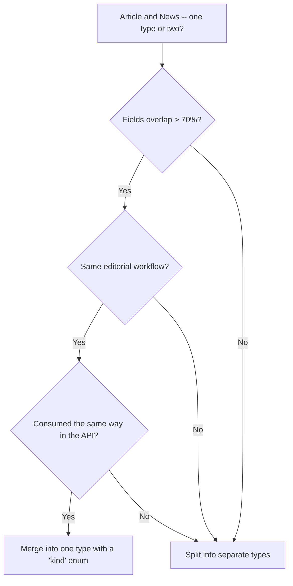
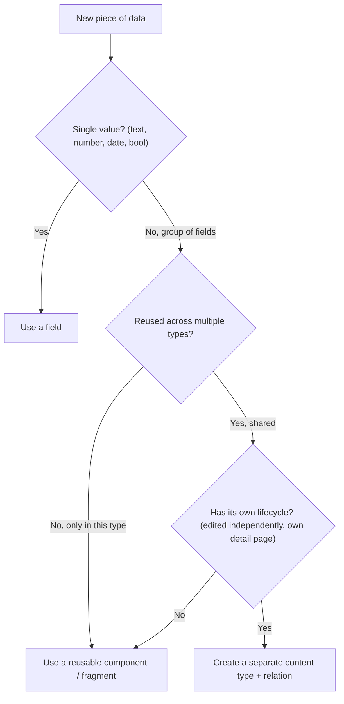
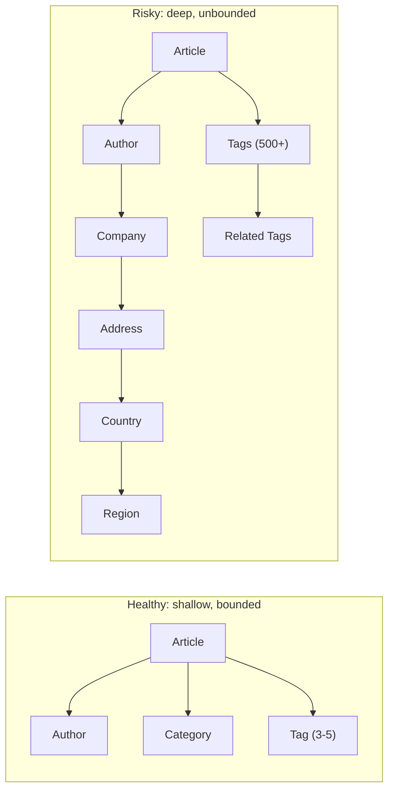
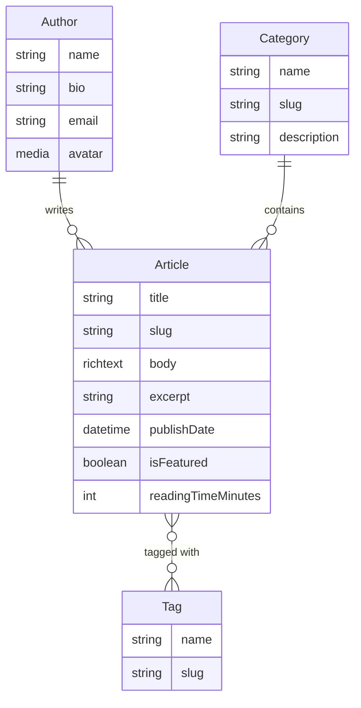

# Content Modeling

A content model is the **schema** that defines your content types, their fields, and the relationships between them. It is the single most important architectural decision in any CMS project -- it shapes the authoring experience, the API surface, query performance, caching behavior, and how hard future changes will be.

This guide is **CMS-agnostic**. The principles apply whether you use Strapi, AEM, Contentful, Sanity, WordPress, or any other platform. Platform-specific implementations are linked throughout.

## What is a content model?

Think of it as the intersection of three concerns:



| Concern | What it cares about |
|---------|---------------------|
| **Authoring UX** | Are the forms intuitive? Can editors find what they need? Is the editing flow fast? |
| **Storage & Querying** | Can we query this efficiently? Will it scale to thousands of entries? Are indexes possible? |
| **API & Delivery** | Is the API shape clean? Can frontends consume it without transformation? Does it cache well? |

A good content model balances all three. A model that is technically elegant but painful to author will fail. A model that is author-friendly but impossible to query will fail differently.

### How it differs from database design

Content modeling borrows from relational database design, but adds CMS-specific constraints:

| Database design | Content modeling adds |
|-----------------|---------------------|
| Tables, columns, foreign keys | Content types, fields, relations |
| Normalize to reduce redundancy | Sometimes **denormalize** for authoring speed and API shape |
| Schema changes are DBA work | Schema changes affect **live editors** and **published content** |
| Queries are developer-written | Queries are often **auto-generated** (GraphQL, REST filters) |
| No UI concern | The model **is** the authoring UI |

## Content types

Content types are the nouns in your system -- Article, Author, Product, Category, Page.

### Collection types vs single types

| Type | Instances | Examples |
|------|-----------|---------|
| **Collection type** | Many (0 to thousands) | Article, Product, Event, Author, FAQ |
| **Single type** | Exactly one | Homepage config, Site settings, Footer, Navigation |

Collection types are the core of most projects. Single types are useful for global configuration that editors need to manage but that does not repeat.

### When to split vs merge

A common question: should "Article" and "News" be one type with a discriminator field, or two separate types?



**Rules of thumb:**

- If fields diverge by more than ~30%, split
- If they share the same editorial workflow and API shape, merge
- If in doubt, start merged -- splitting later is easier than merging

**Anti-pattern: the "Universal Content" type** -- a single type with 50+ fields and boolean flags to toggle sections. It looks flexible but is a nightmare to author and impossible to validate.

> For platform-specific type definitions, see [Strapi: Content Modeling](/strapi/beginners-guide/content-modeling) (collection vs single types) and [AEM: Content Fragments](/aem/beginners-guide/content-fragments-and-graphql) (Content Fragment Models).

## Choosing field types

Every CMS offers a set of primitive field types. Picking the right one matters for validation, querying, and the authoring UX.

### Common primitives

| Field type | Use for | Not for |
|-----------|---------|---------|
| **Short text** | Titles, names, slugs, labels | Paragraphs, formatted content |
| **Long text / Rich text** | Body content, descriptions | Structured data (use separate fields) |
| **Number** (int/float) | Prices, counts, ratings, positions | IDs (use auto-generated), phone numbers (use text) |
| **Boolean** | Flags, toggles | Multi-state values (use enum) |
| **Date / DateTime** | Publish dates, event times | Durations (use number + unit) |
| **Enum** | Fixed option sets (status, category) | Open-ended values (use relation to a collection) |
| **Media / Asset** | Images, PDFs, videos | External URLs (use text with URL validation) |
| **JSON** | Arbitrary structured data | Anything you need to query or filter on |

### Structured fields vs rich text blobs

A common mistake: putting everything into a single rich text field.

```
Bad:  [Rich Text: body]  -- contains title, subtitle, pull quotes, CTAs, everything

Good: [Short Text: title]
      [Short Text: subtitle]
      [Rich Text: body]
      [Short Text: pullQuote]
      [Relation: callToAction -> CTA]
```

Structured fields are:

- **Queryable** -- find all articles with a specific subtitle
- **Translatable** -- translators see each field separately
- **Validatable** -- enforce max lengths, required fields
- **Reusable** -- display the title in a card, the body on the detail page

Rich text is appropriate for **freeform body content** where the structure is genuinely unpredictable.

### Anti-pattern: the "god field"

A single JSON or rich-text field that holds an entire page's content. It kills:

- **Querying** -- you cannot filter by fields inside a JSON blob
- **Caching** -- any change invalidates the entire blob
- **Translation** -- translators get a wall of unstructured text
- **Validation** -- no per-field constraints

### Anti-pattern: over-enumeration

An enum field with 50+ values is usually a sign that it should be a **separate content type** with a relation:

```
Bad:  [Enum: category] with 47 values that editors keep requesting changes to

Good: [Relation: category -> Category]  -- editors manage categories themselves
```

Convert to a relation when:

- The list changes frequently
- Editors need to manage the values
- The values have their own metadata (description, icon, sort order)

### Decision tree: field, component, or separate type?



## Reusable field groups

Most CMS platforms offer a way to group fields into reusable units:

| Platform | Concept | Storage |
|----------|---------|---------|
| **Strapi** | Components, Dynamic Zones | Embedded in the parent record |
| **AEM** | Component nodes, Content Fragment fields | Child nodes in the JCR |
| **Contentful** | Embedded entries | Separate entries, linked |
| **Sanity** | Objects, Arrays of objects | Embedded in the document |

### Embed vs reference

The key decision: should the group be **embedded** (travels with the parent) or **referenced** (lives independently)?

| Criterion | Embed | Reference (relation) |
|-----------|-------|---------------------|
| **Ownership** | Parent owns it -- delete parent, delete group | Independent -- survives parent deletion |
| **Reuse** | Cannot be shared across instances | Can be shared (one Author, many Articles) |
| **Editing** | Edited inline in the parent form | Edited separately, linked |
| **Queryability** | Hard to query across parents | Easy to query independently |
| **API shape** | Nested in the parent response | Separate endpoint / requires population |
| **Performance** | No extra query (already loaded) | Extra query or join to populate |

**Embed when:**

- The data belongs to exactly one parent (an address on a company profile)
- It has no meaning outside the parent context
- You want inline editing in the parent form

**Reference when:**

- The data is shared (one Author across many Articles)
- It has an independent lifecycle (edited, versioned, published separately)
- You need to query it independently (list all Authors)

> For Strapi-specific patterns, see [Strapi: Content Modeling](/strapi/beginners-guide/content-modeling) (components vs dynamic zones table).

## Relations -- the good, the bad, and the slow

Relations connect content types. They are powerful and necessary -- but every relation has a cost.

### Relation types

| Type | Example | Storage |
|------|---------|---------|
| **One-to-one** | Author -- Profile | Foreign key on one side |
| **One-to-many** | Author -- Articles | Foreign key on the "many" side |
| **Many-to-many** | Articles -- Tags | Join table |

### When relations are good

Relations are the right choice when:

- **True entity references** -- an Article has an Author who exists independently
- **Lookup tables** -- a Category that many Articles share
- **Shared assets** -- a Logo used on multiple pages
- **Navigation structures** -- parent/child page hierarchies

These are **stable, well-bounded relationships** with clear semantics.

### When relations become risky



**Deep nesting** -- every level in Article -> Author -> Company -> Address -> Country is an extra query or join. Most CMS APIs resolve this via "population" or "depth" parameters, but each level:

- Adds latency
- Increases response size
- Makes caching harder (one change deep in the chain can invalidate the whole tree)

**Unbounded many-to-many** -- an Article with 500 Tags, or a Tag used by 10,000 Articles:

- The join table grows quadratically
- Populating "all articles for this tag" becomes a full table scan
- Bidirectional population (article -> tags AND tag -> articles) doubles the problem

**Circular references** -- A references B, B references A:

- Infinite loops in API population
- Unclear ownership (who is the "parent"?)
- Cache invalidation cascades

**Bidirectional relations that must stay in sync** -- if Article has `tags` and Tag has `articles`, updating one side must update the other. Some CMS platforms handle this automatically; others require manual sync.

### Performance implications

| Issue | Cause | Mitigation |
|-------|-------|------------|
| **N+1 queries** | Fetching a list, then fetching relations per item | Use eager loading / population in a single query |
| **Deep population** | Resolving 4+ levels of nested relations | Limit depth to 2-3 levels; flatten the model |
| **Large join tables** | Many-to-many with thousands of entries per side | Cap the relation, paginate, or denormalize |
| **Cache invalidation chains** | Changing an Author invalidates all their Articles | Use targeted invalidation, not blanket flushes |
| **Response bloat** | Populating everything on every request | Use sparse fieldsets / field selection |

### Denormalization trade-offs

Sometimes the right answer is to **duplicate data** for read performance:

```
Normalized:  Article -> Author (relation)
             API must populate Author on every Article request

Denormalized: Article has authorName (text) + authorId (relation)
              API returns authorName directly, no population needed
              Author detail page still uses the relation
```

| | Normalized | Denormalized |
|--|-----------|-------------|
| **Reads** | Slower (extra query) | Faster (already present) |
| **Writes** | Simple (update in one place) | Complex (update Author name -> must update all Articles) |
| **Consistency** | Always correct | Can drift if sync fails |
| **Use when** | Data changes frequently, consistency is critical | Data is read-heavy, rarely changes, performance matters |

> For platform-specific relation patterns, see [Strapi: Relations](/strapi/beginners-guide/relations), [Strapi: Relations and Population](/strapi/relations-and-population), and [AEM: Content Fragments & GraphQL](/aem/beginners-guide/content-fragments-and-graphql).

## Naming conventions

Consistent naming prevents confusion as models grow.

### Content type names

| Convention | Example | Recommendation |
|-----------|---------|----------------|
| **Singular** | `Article`, `Author`, `Category` | Always singular -- the CMS pluralizes for collections |
| **PascalCase** | `BlogArticle`, `ProductCategory` | Most CMS platforms use this |
| **No prefixes** | `Article`, not `CmsArticle` | Avoid redundant prefixes |

### Field names

| Convention | Example | Why |
|-----------|---------|-----|
| **camelCase** | `publishDate`, `featuredImage` | Maps cleanly to JSON/JS |
| **Descriptive** | `authorBio`, not `bio` | Avoids ambiguity when querying across types |
| **No abbreviations** | `description`, not `desc` | Readability over brevity |
| **Boolean as question** | `isFeatured`, `hasComments` | Reads naturally in code |

### Relation field names

Name relations by **what they represent**, not by their type:

```
Good: author, categories, featuredImage, relatedArticles
Bad:  relation1, authorRelation, categoryManyToMany
```

For inverse relations, use the plural of the referring type:

```
On Author: articles (the articles this author wrote)
On Category: articles (the articles in this category)
On Tag: articles (the articles tagged with this)
```

### Slug fields

Every content type that has a detail page should have a slug:

- Lowercase, hyphenated: `getting-started-with-content-modeling`
- Auto-generated from the title, but editable
- Unique within the type (enforce with a unique constraint)
- URL-safe: no spaces, no special characters

## Complexity traps

Content modeling has a Goldilocks problem -- too simple and too complex both fail.

### Over-modeling

Creating a content type for everything:

```
Bad:
  Color         { name: "Red", hex: "#ff0000" }
  Icon          { name: "Arrow", svg: "..." }
  ButtonStyle   { label: "Primary", cssClass: "btn-primary" }

  Article -> Color, Icon, ButtonStyle  (three relations for styling)
```

If a "type" has one or two fields and never changes, it is an **enum** or a **config value**, not a content type. Types should represent **things editors create and manage**.

### Under-modeling

The opposite extreme -- one giant type:

```
Bad:
  Page {
    title, subtitle, heroImage, heroText, heroCTA,
    section1Title, section1Text, section1Image,
    section2Title, section2Text, section2Image,
    section3Title, section3Text, section3Image,
    sidebarTitle, sidebarLinks,
    showNewsletter, newsletterHeading,
    metaTitle, metaDescription, ogImage,
    ... 30 more fields
  }
```

Problems: most fields are empty on most pages, the editing form is overwhelming, validation is impossible (which fields are required depends on which "sections" are active).

**Fix:** break into components (hero, content section, sidebar, newsletter signup) and compose pages from those building blocks.

### Premature abstraction

Building a fully dynamic "block builder" system with 20 block types before you know what content editors actually need:

```
Bad (too early):
  Page -> Dynamic Zone [
    HeroBlock, TextBlock, ImageBlock, VideoBlock,
    CTABlock, TestimonialBlock, PricingBlock,
    TeamBlock, FAQBlock, MapBlock, FormBlock,
    TimelineBlock, StatsBlock, LogoGridBlock,
    AccordionBlock, TabsBlock, CarouselBlock,
    ComparisonBlock, QuoteBlock, CodeBlock
  ]
```

Start with 3-5 block types based on real content. Add more when editors actually need them. Every block type is maintenance burden -- dialog fields, rendering templates, preview logic, migration support.

### Ignoring the authoring UX

A model can be technically perfect but painful to use:

- **Too many required fields** -- editors abandon half-written entries
- **Deeply nested forms** -- 4 clicks to reach a field
- **Unclear field labels** -- "Reference ID" instead of "Related Article"
- **No defaults** -- every field starts empty even when 80% of entries use the same value
- **No help text** -- editors guess what each field expects

Always test the authoring flow with real editors. Watch them create content. If they struggle, simplify the model.

### Migration cost

The earlier you change the model, the cheaper it is:

| Stage | Cost of change |
|-------|---------------|
| **Design phase** | Free -- just edit a diagram |
| **Development** | Low -- update code, re-seed test data |
| **Staging with test content** | Medium -- write a migration script |
| **Production with live content** | High -- migration script + data validation + rollback plan + downtime |

Get the model reviewed early. Create realistic test content early. Changing a model with 10,000 live entries is an order of magnitude harder than changing one with 10.

## Performance checklist

Use this checklist when reviewing a content model:

- [ ] **Relation depth** is 2-3 levels max (Article -> Author -> Avatar, not deeper)
- [ ] **Many-to-many relations** are bounded (e.g., max 20 tags per article, not unlimited)
- [ ] **Fields you filter/sort on** are indexed (or indexable on your platform)
- [ ] **Hot read paths** are denormalized where needed (e.g., author name on article cards)
- [ ] **API responses** use sparse fieldsets -- do not populate everything by default
- [ ] **Tested with realistic data volumes** -- not just 5 test entries, but hundreds or thousands
- [ ] **Query times monitored** -- have alerts for slow queries as content grows
- [ ] **Caching strategy considered** -- CDN, Dispatcher, API-level cache, and how relations affect invalidation
- [ ] **No circular relations** without explicit depth limits
- [ ] **No "god fields"** (single JSON/rich-text blobs holding structured data)

## Practical example -- blog platform

Let's model a blog with: articles, authors, categories, and tags.

### Entity-relationship diagram



### Design decisions

| Decision | Reasoning |
|----------|-----------|
| `Author` is a **separate type** (relation) | Authors are shared across articles, have their own profile page, edited independently |
| `Category` is a **relation** (one-to-many) | Categories are a managed list; each article belongs to one category |
| `Tag` is a **relation** (many-to-many) | Tags are shared; an article can have multiple tags. **Cap at 10-15 per article** to keep join tables manageable |
| `readingTimeMinutes` is a **field**, not computed on read | Computed once on save (word count / 200), stored as a number. Avoids computing on every API call |
| `excerpt` is a **separate field**, not derived from body | Editors write a custom excerpt; auto-truncating body text rarely produces good summaries |
| `isFeatured` is a **boolean on Article** | Simple flag -- no need for a separate "Featured" type. If featuring becomes complex (start/end dates, position), upgrade to a relation |
| **No `Comment` type** | Comments have different scaling characteristics (spam, moderation, real-time) -- better handled by a dedicated service (Disqus, Giscus) than the CMS |
| **No nested categories** (Category -> SubCategory) | Keep it flat. Hierarchies add complexity; if needed later, add a `parent` self-relation |

### What this model does well

- **Shallow relations** -- max 1 level deep for most queries
- **Bounded many-to-many** -- tags are capped
- **Clean API shape** -- Article card only needs title, slug, excerpt, publishDate, category name, author name
- **Authorable** -- editors see clear, focused forms

### What to watch

- If the blog grows to 10,000+ articles, add indexes on `slug`, `publishDate`, and `category`
- If tags grow to 500+, consider whether some should be categories instead
- If articles need multiple authors, upgrade the one-to-many to many-to-many

## Platform-specific implementation

The concepts above map to specific CMS features:

| Concept | Strapi | AEM |
|---------|--------|-----|
| **Collection type** | Collection Type (Content-Type Builder) | Content Fragment Model |
| **Single type** | Single Type | Page Properties / Single CF instance |
| **Field types** | Text, Number, Boolean, Date, Enum, Media, etc. | CF Model fields (text, number, date, enum, content ref, etc.) |
| **Reusable groups** | Components | Component nodes / Nested CF Models |
| **Dynamic content** | Dynamic Zones | Editable template containers / Experience Fragments |
| **Relations** | Relation field (1:1, 1:N, N:N) | Fragment Reference |
| **Slug** | UID field | Custom text field with unique constraint |
| **API** | Auto-generated REST + optional GraphQL | Sling Model Exporter + GraphQL (Persisted Queries) |

### Further reading

For hands-on implementation of these patterns:

**Strapi:**

- [Content Modeling](/strapi/beginners-guide/content-modeling) -- types, fields, components, dynamic zones
- [Relations](/strapi/beginners-guide/relations) -- relation types, owning vs inverse side, best practices
- [Relations and Population](/strapi/relations-and-population) -- population depth, filtering, N+1 prevention

**AEM:**

- [Content Fragments & GraphQL](/aem/beginners-guide/content-fragments-and-graphql) -- CF Models, field types, fragment references, persisted queries
- [Your First Component](/aem/beginners-guide/your-first-component) -- component structure, dialogs, Sling Models
- [Component Dialogs](/aem/beginners-guide/component-dialogs) -- field types for page-level content modeling

**General:**

- [SQL Guide](/other/sql-guide) -- relational database fundamentals that underpin CMS storage
- [Design Patterns](/design-patterns/overview) -- architectural patterns applicable to content model design
