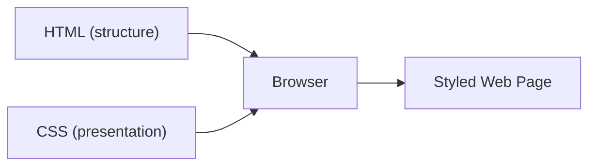
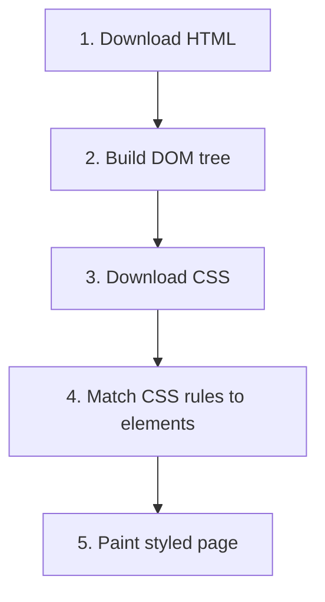

# Introduction & First Styles

CSS - **Cascading Style Sheets** - is the language that controls how web pages look. Every colour, font, spacing
decision, and layout you see on the web is defined with CSS.

This guide takes you from zero CSS knowledge to writing professional, modern stylesheets - step by step. We assume you
know basic HTML (tags, attributes, nesting). If not, work through the
[JavaScript Beginners Guide](/javascript/beginners-guide/introduction) first - it covers HTML fundamentals in chapter 7.

## How this guide is structured

| Part                            | Chapters | What you will learn                                                          |
|---------------------------------|----------|------------------------------------------------------------------------------|
| **1 - Foundations**            | 1-5     | How CSS works, selectors, the box model, colours, fonts, units               |
| **2 - Layout**                 | 6-9     | Display, positioning, Flexbox, CSS Grid, responsive design                   |
| **3 - Visual Design**         | 10-12   | Backgrounds, shadows, transitions, animations, pseudo-classes/elements       |
| **4 - Intermediate Concepts** | 13-15   | Custom properties, specificity & cascade, modern CSS features                |
| **5 - Professional CSS**      | 16-17   | Architecture, best practices, debugging, common pitfalls                     |
| **6 - Practice**              | 18       | Six hands-on projects from beginner to advanced                              |

By the end you will be able to style any web page from scratch, build responsive layouts, add animations, and organise
your CSS like a professional.

## What is CSS?

HTML defines the **structure** of a web page - headings, paragraphs, images, links. But HTML alone looks plain and
unstyled. CSS is a separate language that tells the browser **how** to display that structure.

Think of it this way:

- **HTML** = the skeleton and organs of a body
- **CSS** = the skin, clothing, and makeup



CSS handles everything visual:

- **Colours** - text colour, background colour, borders
- **Typography** - font family, size, weight, line spacing
- **Spacing** - margins, padding, gaps between elements
- **Layout** - how elements are arranged on the page (side by side, stacked, in a grid)
- **Effects** - shadows, rounded corners, animations, transitions

Without CSS, every website would look like a plain white page with black text and blue links. CSS is what makes the web
beautiful.

## How HTML and CSS work together

When a browser loads a web page, it follows these steps:

1. **Download the HTML** - the browser reads the HTML file
2. **Build the DOM** - it creates a tree structure of all the HTML elements (the Document Object Model)
3. **Download the CSS** - it fetches any linked stylesheets
4. **Apply styles** - it matches CSS rules to HTML elements
5. **Paint the page** - it renders the final, styled result on screen



The important point: HTML and CSS are **separate languages** that work together. You write them in separate files (most
of the time) and the browser combines them.

## Three ways to add CSS

There are three ways to attach CSS to an HTML page. We will cover all three, but the third one - **external
stylesheets** - is the one you should use in real projects.

### 1. Inline styles

You add a `style` attribute directly on an HTML element:

```html
<p style="color: red; font-size: 20px;">This text is red and large.</p>
```

This works, but it has serious downsides:

- You have to repeat yourself for every element
- HTML becomes cluttered and hard to read
- You cannot reuse styles across pages

> **Note:** Avoid inline styles in real projects. They are useful only for quick testing or when a tool generates them
> automatically.

### 2. Internal stylesheet

You place CSS inside a `<style>` tag in the HTML `<head>`:

```html
<!doctype html>
<html lang="en">
<head>
    <meta charset="utf-8" />
    <title>My Page</title>
    <style>
        p {
            color: red;
            font-size: 20px;
        }
    </style>
</head>
<body>
    <p>This text is red and large.</p>
    <p>So is this one -- no need to repeat the style attribute.</p>
</body>
</html>
```

Better than inline styles because you write the rule once and it applies to all matching elements. But the styles only
work for this single HTML file.

### 3. External stylesheet (recommended)

You write CSS in a separate `.css` file and link it from the HTML:

**styles.css:**

```css
p {
    color: red;
    font-size: 20px;
}
```

**index.html:**

```html
<!doctype html>
<html lang="en">
<head>
    <meta charset="utf-8" />
    <title>My Page</title>
    <link rel="stylesheet" href="styles.css" />
</head>
<body>
    <p>This text is red and large.</p>
    <p>So is this one.</p>
</body>
</html>
```

This is the standard approach for real projects because:

- **Separation of concerns** - HTML handles structure, CSS handles presentation
- **Reusability** - one stylesheet can be linked from multiple HTML pages
- **Caching** - the browser downloads the CSS file once and reuses it across pages
- **Maintainability** - all your styles live in one place

> **Tip:** For the rest of this guide, we use external stylesheets. Create an `index.html` and a `styles.css` file in
> the same folder and link them with the `<link>` tag shown above.

## Anatomy of a CSS rule

Every piece of CSS follows the same structure. Let's break it down:

```css
h1 {
    color: navy;
    font-size: 32px;
    margin-bottom: 16px;
}
```

This CSS rule has four parts:

| Part             | Example          | What it does                                             |
|------------------|------------------|----------------------------------------------------------|
| **Selector**     | `h1`             | Targets which HTML elements to style                     |
| **Declaration block** | `{ ... }`   | The curly braces that wrap all the declarations          |
| **Property**     | `color`          | The visual aspect you want to change                     |
| **Value**        | `navy`           | The setting you want for that property                   |

A single **declaration** is a property-value pair separated by a colon and ended with a semicolon:

```
property: value;
```

You can put as many declarations as you want inside one rule:

```css
p {
    color: darkslategray;
    font-size: 18px;
    line-height: 1.6;
    margin-top: 0;
    margin-bottom: 12px;
}
```

> **Tip:** Always end every declaration with a semicolon. The last one is technically optional, but leaving it off is a
> common source of bugs when you add more declarations later.

## Your first stylesheet

Let's build a minimal but complete example. Create two files in the same folder:

**index.html:**

```html
<!doctype html>
<html lang="en">
<head>
    <meta charset="utf-8" />
    <meta name="viewport" content="width=device-width, initial-scale=1" />
    <title>My First Styled Page</title>
    <link rel="stylesheet" href="styles.css" />
</head>
<body>
    <h1>Hello, CSS!</h1>
    <p>This is my first styled web page.</p>
    <p>CSS makes everything look better.</p>

    <h2>What I will learn</h2>
    <ul>
        <li>How to change colours</li>
        <li>How to pick fonts</li>
        <li>How to build layouts</li>
    </ul>
</body>
</html>
```

**styles.css:**

```css
body {
    font-family: Georgia, serif;
    line-height: 1.6;
    margin: 40px;
    background-color: #f5f5f5;
    color: #333;
}

h1 {
    color: #1a1a2e;
    font-size: 36px;
    margin-bottom: 8px;
}

h2 {
    color: #16213e;
    font-size: 24px;
    margin-top: 32px;
}

p {
    font-size: 18px;
    margin-bottom: 12px;
}

ul {
    font-size: 18px;
    padding-left: 24px;
}

li {
    margin-bottom: 6px;
}
```

Open `index.html` in your browser. You should see a page with a light grey background, dark text, and Georgia font -
a huge improvement over the default browser styles.

Try changing some values:

1. Change `background-color: #f5f5f5` to `background-color: #e8f4f8` (a light blue)
2. Change `font-family: Georgia, serif` to `font-family: Arial, sans-serif`
3. Change `color: #333` to `color: #660033` (a dark red)

Save the CSS file and refresh the browser. You will see the changes immediately.

## How the browser reads CSS

The browser reads your CSS **top to bottom**, one rule at a time. If two rules target the same element and set the same
property, the rule that appears **later** in the file wins:

```css
p {
    color: blue;
}

p {
    color: red;
}
```

In this example, paragraphs will be **red** because the second rule comes later. This is part of the **cascade** - one
of the most important concepts in CSS. We cover it in depth in chapter 14.

## Comments

You can add comments to your CSS to explain what the code does. Comments are ignored by the browser:

```css
/* This is a comment */
p {
    color: red; /* Make paragraphs red */
}

/*
 * Multi-line comments work too.
 * Use them to separate sections of your stylesheet.
 */
```

Comments use `/* ... */` syntax. Unlike HTML comments (`<!-- -->`), CSS only has this one comment style.

## A quick look at browser DevTools

Every modern browser has built-in developer tools that let you inspect and experiment with CSS in real time. This is one
of the most important tools you will use as a web developer.

### Opening DevTools

- **Chrome / Edge / Brave:** Right-click any element and select "Inspect", or press `F12`
- **Firefox:** Right-click and select "Inspect Element", or press `F12`
- **Safari:** Enable the Develop menu in Preferences first, then right-click and select "Inspect Element"

### What you can do

1. **Inspect elements** - click any element on the page to see which CSS rules apply to it
2. **Edit styles live** - change property values in the Styles panel and see results instantly
3. **See the box model** - a visual diagram shows the element's content, padding, border, and margin
4. **Toggle declarations** - click the checkbox next to any declaration to turn it on or off
5. **Add new declarations** - click inside a rule to type new property-value pairs

> **Tip:** Get comfortable with DevTools early. Professional developers spend a lot of time there. It is the fastest way
> to experiment with CSS without saving and refreshing.

### Try it now

1. Open your `index.html` in the browser
2. Right-click the `<h1>` element and select "Inspect"
3. In the Styles panel on the right, find the `color` property
4. Click on the colour value and change it to `tomato`
5. The heading changes colour instantly - but only in the browser. Your file is unchanged.

This live editing is perfect for experimenting. Once you find values you like, copy them back into your `.css` file.

## What you learned

- CSS controls the **visual presentation** of HTML
- There are three ways to add CSS: inline, internal, and **external stylesheets** (the recommended approach)
- A CSS rule has a **selector**, **properties**, and **values**
- The browser reads CSS top to bottom - later rules can override earlier ones
- **Browser DevTools** let you inspect and edit CSS in real time

## Next step

In the next chapter, you will learn about **selectors** - the part of a CSS rule that targets which HTML elements to
style. Selectors are the foundation of everything else in CSS.
