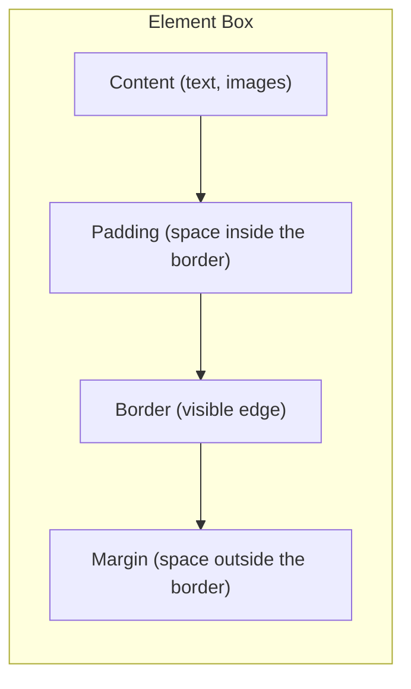

# The Box Model

Every HTML element the browser renders is a **rectangular box**. The box model describes how the browser calculates the
size of that box. Understanding it is essential -- almost every layout problem you will encounter comes down to the box
model.

## The four layers

Every box has four layers, from inside to outside:



| Layer       | What it is                                                | Affects background? |
|-------------|-----------------------------------------------------------|---------------------|
| **Content** | The actual text, image, or child elements                 | Yes                 |
| **Padding** | Space between the content and the border                  | Yes                 |
| **Border**  | A visible (or invisible) edge around the padding          | Has its own colour  |
| **Margin**  | Space between this element's border and neighbouring ones | No (transparent)    |

Think of it like a picture in a frame:

- **Content** = the picture itself
- **Padding** = the matting around the picture
- **Border** = the frame
- **Margin** = the space between this frame and the next one on the wall

## Setting padding

Padding adds space **inside** the element, between the content and the border. The background colour extends into the
padding area.

```css
.card {
    padding: 20px;
    background-color: #f0f0f0;
}
```

You can set each side individually:

```css
.card {
    padding-top: 20px;
    padding-right: 16px;
    padding-bottom: 20px;
    padding-left: 16px;
}
```

Or use the **shorthand**:

```css
/* All four sides */
padding: 20px;

/* Vertical | Horizontal */
padding: 20px 16px;

/* Top | Horizontal | Bottom */
padding: 20px 16px 24px;

/* Top | Right | Bottom | Left (clockwise) */
padding: 20px 16px 24px 16px;
```

> **Tip:** The clockwise order -- top, right, bottom, left -- applies to all box model shorthands. Think of a clock
> starting at 12 o'clock.

## Setting borders

Borders draw a visible line around the padding area:

```css
.card {
    border: 2px solid #333;
}
```

The `border` shorthand takes three values:

1. **Width** -- `1px`, `2px`, `thin`, `medium`, `thick`
2. **Style** -- `solid`, `dashed`, `dotted`, `double`, `none`
3. **Colour** -- any valid colour value

You can set individual sides:

```css
.card {
    border-top: 3px solid red;
    border-bottom: 1px dashed #ccc;
    border-left: none;
    border-right: none;
}
```

Or target individual properties:

```css
.card {
    border-width: 2px;
    border-style: solid;
    border-color: #333;
}
```

## Setting margins

Margins create space **outside** the element, pushing other elements away. Margins are always transparent -- the
background does not extend into them.

```css
.card {
    margin: 20px;
}
```

The shorthand works the same way as padding (clockwise):

```css
/* All sides */
margin: 20px;

/* Vertical | Horizontal */
margin: 20px auto;

/* Top | Right | Bottom | Left */
margin: 20px 16px 24px 16px;
```

### Centring with auto margins

Setting horizontal margins to `auto` centres a block element inside its parent:

```css
.container {
    width: 800px;
    margin: 0 auto;
}
```

This works because `auto` tells the browser to divide the remaining horizontal space equally between left and right.

> **Note:** `margin: auto` only works for horizontal centring of block elements with a set width. For vertical centring
> or flexible layouts, use Flexbox (chapter 7) or Grid (chapter 8).

### Negative margins

Unlike padding, margins can be **negative**. A negative margin pulls an element in that direction, making it overlap
with neighbours:

```css
.overlap {
    margin-top: -20px;
}
```

Use negative margins sparingly. They can solve specific layout problems but make code harder to understand.

## How size is calculated (content-box)

By default, CSS calculates an element's total size like this:

```
Total width  = content width  + padding-left + padding-right  + border-left + border-right
Total height = content height + padding-top  + padding-bottom + border-top  + border-bottom
```

This is called `box-sizing: content-box` -- the default.

Example:

```css
.box {
    width: 200px;
    padding: 20px;
    border: 2px solid black;
}
```

The **total width** on screen is:

```
200 + 20 + 20 + 2 + 2 = 244px
```

This catches beginners off guard. You set `width: 200px` but the element takes up 244 pixels. The `width` property
only controls the **content area**, not the overall box.

## box-sizing: border-box

The `border-box` model changes the calculation. When you set `width: 200px`, the browser includes padding and border
**inside** that 200px:

```css
.box {
    box-sizing: border-box;
    width: 200px;
    padding: 20px;
    border: 2px solid black;
}
```

Now the total width on screen is exactly **200px**. The browser shrinks the content area to make room for padding and
border.

| Model         | `width` controls     | Total width                            |
|---------------|----------------------|----------------------------------------|
| `content-box` | Content area only    | content + padding + border             |
| `border-box`  | Entire box           | Exactly the `width` value              |

### Use border-box everywhere

Almost every modern CSS codebase starts with this reset:

```css
*,
*::before,
*::after {
    box-sizing: border-box;
}
```

This applies `border-box` to every element, making width and height calculations intuitive. Add this to the top of
every stylesheet you create.

> **Tip:** This is such a universal pattern that you should memorise it. When `width: 200px` means the box is 200px
> wide, layout math becomes straightforward.

## Margin collapsing

When two vertical margins touch, they do not add together. Instead, the browser **collapses** them and uses only the
larger value. This only happens with **vertical** (top/bottom) margins, never horizontal ones.

```html
<h2>Heading</h2>
<p>Paragraph</p>
```

```css
h2 {
    margin-bottom: 24px;
}

p {
    margin-top: 16px;
}
```

You might expect 40px of space between the heading and paragraph (24 + 16). But the actual space is **24px** -- the
larger of the two margins wins.

Rules of margin collapsing:

1. Only **vertical** margins collapse (top and bottom)
2. Only margins of **block-level** elements collapse
3. The **larger** margin wins
4. Margins separated by padding, border, or content do **not** collapse

> **Note:** Margin collapsing often confuses beginners. If spacing between elements is not what you expect, check
> whether margins are collapsing. Adding `padding: 1px` or `border: 1px solid transparent` to a parent prevents it.

## Inspecting the box model in DevTools

The browser DevTools show the box model visually:

1. Right-click an element and select "Inspect"
2. In the Styles panel, look for the box model diagram
3. It shows content (blue), padding (green), border (yellow), and margin (orange)
4. Hover over each layer to see it highlighted on the page

You can also see computed sizes in the "Computed" tab. This shows the final calculated values for every property after
the browser has resolved all the CSS rules.

### Try it now

Using the stylesheet from chapter 1, add this CSS:

```css
p {
    padding: 12px;
    border: 2px solid #ddd;
    margin-bottom: 20px;
    background-color: #fafafa;
}
```

Open DevTools, click on a paragraph, and examine the box model diagram. Notice how:

- The content area is inside
- Padding adds space around the content (and the grey background extends into it)
- The border is visible around the padding
- Margin pushes the next element away (but the background does not extend into it)

## Practical example

Here is a common card component using all four box model properties:

```css
.card {
    box-sizing: border-box;
    width: 300px;
    padding: 24px;
    border: 1px solid #e0e0e0;
    border-radius: 8px;
    margin: 16px;
    background-color: white;
}

.card h3 {
    margin-top: 0;
    margin-bottom: 12px;
}

.card p {
    margin-top: 0;
    margin-bottom: 0;
}
```

```html
<div class="card">
    <h3>Card Title</h3>
    <p>This card uses all four layers of the box model.</p>
</div>
```

The card is exactly 300px wide (thanks to `border-box`). It has 24px of breathing room inside, a subtle border, and
16px of space between itself and neighbouring elements.

## What you learned

- Every element is a **rectangular box** with four layers: content, padding, border, margin
- **Padding** adds space inside the element; the background extends into it
- **Border** draws a visible edge around the padding
- **Margin** adds space outside the element; it is always transparent
- The default `content-box` model makes width calculations unintuitive -- use `box-sizing: border-box` everywhere
- **Margin collapsing** merges vertical margins -- the larger one wins
- **DevTools** show a visual box model diagram for any element

## Next step

In the next chapter you will learn about **colours and typography** -- how to control the visual appearance of text and
backgrounds with colour values and font properties.
