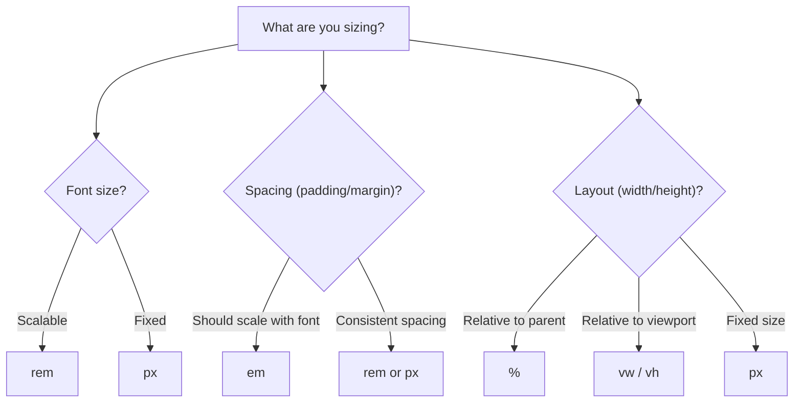

# Units & Sizing

CSS has many units for expressing sizes. Picking the right one for the right job is critical for building layouts that
scale well across screen sizes and respect user preferences.

## Absolute units

Absolute units are fixed -- they do not change based on context.

### px (pixels)

The most common absolute unit. One `px` is one device-independent pixel:

```css
h1 {
    font-size: 32px;
    margin-bottom: 16px;
}
```

Pixels are predictable and easy to reason about. Their downside: they do not scale when a user changes their browser's
default font size.

> **Note:** On high-DPI (Retina) screens, one CSS pixel may be rendered by two or more physical screen pixels. CSS
> handles this automatically -- you do not need to worry about it.

Other absolute units (`cm`, `mm`, `in`, `pt`) exist but are meant for print stylesheets. Stick with `px` for screens.

## Relative units

Relative units scale based on some reference value. They are the key to responsive, accessible designs.

### em

`1em` equals the **font size of the current element** (or, for the `font-size` property itself, the parent's font
size):

```css
.parent {
    font-size: 20px;
}

.parent .child {
    font-size: 0.8em;      /* 0.8 × 20px = 16px */
    padding: 1.5em;         /* 1.5 × 16px = 24px (uses the child's own font-size) */
}
```

The tricky part: `em` **compounds** when elements are nested. If three nested elements each set `font-size: 1.2em`,
the innermost text is 1.2 &times; 1.2 &times; 1.2 = 1.728 times the base size. This compounding makes `em` unreliable
for font sizes in deep component trees.

`em` is still useful for **spacing** that should scale with the local font size -- for example, padding and margins
inside a component.

### rem (root em)

`1rem` equals the **root element's font size** -- the `<html>` element. The default root font size in all browsers is
**16px** (unless the user has changed it).

```css
h1 {
    font-size: 2rem;      /* 2 × 16px = 32px */
    margin-bottom: 1rem;  /* 1 × 16px = 16px */
}

p {
    font-size: 1.125rem;  /* 1.125 × 16px = 18px */
}
```

Unlike `em`, `rem` does **not** compound. No matter how deeply nested the element is, `1rem` always refers to the same
base value.

> **Tip:** Use `rem` for font sizes and major spacing. It respects the user's browser font-size setting (an important
> accessibility feature) and never compounds.

### Common rem values

When the root font size is 16px:

| rem     | Pixels |
|---------|--------|
| `0.75rem` | 12px |
| `0.875rem` | 14px |
| `1rem`    | 16px |
| `1.125rem` | 18px |
| `1.25rem` | 20px |
| `1.5rem`  | 24px |
| `2rem`    | 32px |
| `2.5rem`  | 40px |
| `3rem`    | 48px |

### Percentage (%)

Percentages are relative to the **parent element**. The reference property depends on context:

```css
.container {
    width: 80%;          /* 80% of the parent's width */
}

.sidebar {
    width: 25%;
}

.main {
    width: 75%;
}
```

For `width`, the percentage refers to the parent's width. For `padding` and `margin`, the percentage also refers to the
**parent's width** -- even for `padding-top` and `margin-top`. This catches many people off guard.

```css
.box {
    padding-top: 10%;    /* 10% of the parent's WIDTH, not height */
}
```

### Viewport units

Viewport units are relative to the **browser window** (viewport):

| Unit  | Reference                      |
|-------|--------------------------------|
| `vw`  | 1% of the viewport width       |
| `vh`  | 1% of the viewport height      |
| `vmin`| 1% of the smaller dimension    |
| `vmax`| 1% of the larger dimension     |

```css
.hero {
    height: 100vh;
    width: 100vw;
}

.half-screen {
    height: 50vh;
}
```

Common use cases:

- **Full-screen sections:** `height: 100vh`
- **Fluid font sizes:** `font-size: 5vw` (but see `clamp()` below)
- **Full-width backgrounds:** `width: 100vw`

> **Note:** On mobile browsers, `100vh` can be larger than the visible area because the browser's address bar takes up
> space. Modern CSS offers `dvh` (dynamic viewport height), `svh` (small), and `lvh` (large) to handle this. Use `dvh`
> when you need precise full-screen behaviour on mobile.

### ch

`1ch` equals the width of the `0` (zero) character in the current font. It is useful for setting widths based on
character count:

```css
.article {
    max-width: 65ch;
}
```

This limits the article to roughly 65 characters per line -- the recommended range for comfortable reading (45--75
characters).

## Which unit to use



A practical cheat sheet:

| Use case                           | Recommended unit  | Why                                                  |
|------------------------------------|-------------------|------------------------------------------------------|
| Font sizes                         | `rem`             | Respects user settings, no compounding               |
| Component padding/margins          | `rem` or `em`     | Scales with text; `em` for local, `rem` for global   |
| Layout widths                      | `%` or `fr`       | Fluid, adapts to container                           |
| Max-width for readability          | `ch`              | Limits line length to ~65 characters                 |
| Full-screen hero sections          | `vh` / `dvh`      | Fills the viewport height                            |
| Borders, box-shadows, small detail | `px`              | Needs to stay crisp at any zoom level                |
| Media query breakpoints            | `em` or `px`      | Both work; `em` for zoom-friendly breakpoints        |

## min, max, and clamp

CSS provides three functions for setting **bounds** on sizes:

### min()

Uses the **smaller** of the given values:

```css
.container {
    width: min(800px, 90%);
}
```

The container is 90% of the parent, but never wider than 800px. This is equivalent to `max-width: 800px; width: 90%`
in a single declaration.

### max()

Uses the **larger** of the given values:

```css
.sidebar {
    width: max(200px, 20%);
}
```

The sidebar is 20% of the parent, but never narrower than 200px.

### clamp()

Sets a **preferred value** with a **minimum** and **maximum**:

```css
h1 {
    font-size: clamp(1.5rem, 4vw, 3rem);
}
```

This reads as: "The font size should be `4vw`, but never smaller than `1.5rem` and never larger than `3rem`."

`clamp()` is ideal for **fluid typography** that scales smoothly between breakpoints without media queries:

```css
body {
    font-size: clamp(1rem, 0.9rem + 0.5vw, 1.25rem);
}

h1 {
    font-size: clamp(1.75rem, 1.5rem + 2vw, 3.5rem);
}
```

> **Tip:** `clamp()` is one of the most useful modern CSS features. Whenever you find yourself writing a size with a
> `min-width` or `max-width` guard, consider whether `clamp()` can replace all three declarations.

## The width and height trap

Setting fixed widths and heights on elements is the most common source of overflow bugs:

```css
/* Risky */
.card {
    width: 400px;
    height: 300px;
}
```

If the content inside `.card` exceeds 300px of height, it overflows and clips or bleeds outside the box.

Prefer flexible sizing:

```css
.card {
    max-width: 400px;
    width: 100%;
    min-height: 300px;
}
```

- `max-width` prevents the card from growing too wide
- `width: 100%` makes it fill the available space up to the max
- `min-height` ensures a minimum height but allows the card to grow with its content

> **Tip:** As a rule of thumb, set `max-width` instead of `width` and `min-height` instead of `height`. Let content
> determine the actual size whenever possible.

## Practical example

Here is a responsive article layout using multiple unit types:

```css
*,
*::before,
*::after {
    box-sizing: border-box;
}

body {
    font-size: clamp(1rem, 0.9rem + 0.4vw, 1.2rem);
    line-height: 1.6;
    margin: 0;
    padding: 2rem;
    color: #333;
}

.article {
    max-width: 65ch;
    margin: 0 auto;
}

.article h1 {
    font-size: clamp(1.75rem, 1.5rem + 1.5vw, 3rem);
    line-height: 1.2;
    margin-bottom: 0.5em;
}

.article h2 {
    font-size: clamp(1.25rem, 1.1rem + 1vw, 2rem);
    margin-top: 2rem;
    margin-bottom: 0.5rem;
}

.article p {
    margin-bottom: 1rem;
}

.article img {
    max-width: 100%;
    height: auto;
}
```

This layout uses `ch` for readable line length, `rem` for spacing, `clamp()` for fluid font sizes, and `%` for
responsive images.

## What you learned

- **px** is fixed; **rem** scales with the root font size; **em** scales with the local font size and compounds
- **Percentages** are relative to the parent; viewport units (`vw`, `vh`) are relative to the browser window
- **ch** is great for limiting line length to ~65 characters
- `clamp(min, preferred, max)` creates fluid values that scale smoothly
- Use `max-width` instead of `width` and `min-height` instead of `height` to avoid overflow
- The right unit depends on context -- font sizes get `rem`, spacing gets `rem` or `em`, layout gets `%` or viewport
  units

## Next step

You now control how things are sized. In the next chapter, you will learn about **display and positioning** -- how
elements flow on the page and how to move them out of the normal flow.
