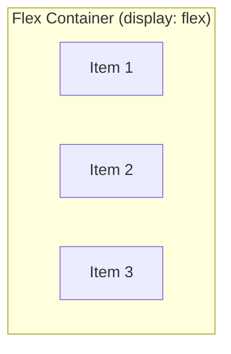

# Flexbox

Flexbox is a **one-dimensional** layout system. It arranges items in a single row or column and gives you precise
control over alignment, spacing, and sizing. Before Flexbox, tasks like centring an element or creating equal-height
columns required awkward workarounds. Flexbox makes these trivial.

## Flex container and flex items

Flexbox has two roles:

1. **Flex container** - the parent element with `display: flex`
2. **Flex items** - the direct children of the container

```css
.container {
    display: flex;
}
```

```html
<div class="container">
    <div>Item 1</div>
    <div>Item 2</div>
    <div>Item 3</div>
</div>
```

The moment you set `display: flex`, the three child divs stop stacking vertically and line up **side by side** in a row.
That is the default behaviour.



> **Note:** Only **direct children** become flex items. Grandchildren and deeper descendants are not affected by the
> flex container.

## flex-direction

Controls the **main axis** - the direction items flow:

| Value              | Direction                          |
|--------------------|------------------------------------|
| `row` (default)    | Left to right (horizontal)         |
| `row-reverse`      | Right to left                      |
| `column`           | Top to bottom (vertical)           |
| `column-reverse`   | Bottom to top                      |

```css
.horizontal {
    display: flex;
    flex-direction: row;
}

.vertical {
    display: flex;
    flex-direction: column;
}
```

The **main axis** is the direction items flow. The **cross axis** is perpendicular to it. For `flex-direction: row`,
the main axis is horizontal and the cross axis is vertical. For `flex-direction: column`, they swap.

## flex-wrap

By default, flex items try to fit on a **single line**, shrinking if necessary. `flex-wrap` lets items wrap to new
lines:

```css
.container {
    display: flex;
    flex-wrap: wrap;
}
```

| Value           | Behaviour                            |
|-----------------|--------------------------------------|
| `nowrap` (default) | All items on one line (may shrink) |
| `wrap`          | Items wrap to the next line          |
| `wrap-reverse`  | Items wrap upward                    |

```css
.card-grid {
    display: flex;
    flex-wrap: wrap;
    gap: 16px;
}

.card-grid .card {
    width: 250px;
}
```

Cards that do not fit on one line wrap to the next row.

### flex-flow shorthand

Combines `flex-direction` and `flex-wrap`:

```css
.container {
    flex-flow: row wrap;
}
```

## Alignment

Flexbox has four alignment properties. Two control the main axis, two control the cross axis.

### justify-content (main axis)

Distributes space along the main axis:

| Value            | Behaviour                                          |
|------------------|----------------------------------------------------|
| `flex-start`     | Pack items at the start (default)                  |
| `flex-end`       | Pack items at the end                              |
| `center`         | Centre items                                       |
| `space-between`  | Equal space between items, no space at edges       |
| `space-around`   | Equal space around each item (half-space at edges) |
| `space-evenly`   | Truly equal space between and around items         |

```css
.nav {
    display: flex;
    justify-content: space-between;
    padding: 16px;
}
```

### align-items (cross axis)

Aligns items along the cross axis:

| Value         | Behaviour                                      |
|---------------|-------------------------------------------------|
| `stretch`     | Items stretch to fill the container (default)   |
| `flex-start`  | Align items to the start of the cross axis      |
| `flex-end`    | Align items to the end                          |
| `center`      | Centre items on the cross axis                  |
| `baseline`    | Align items by their text baseline              |

```css
.container {
    display: flex;
    align-items: center;
    height: 200px;
}
```

### align-self (cross axis, per item)

Overrides `align-items` for a **single** flex item:

```css
.container {
    display: flex;
    align-items: flex-start;
}

.special {
    align-self: flex-end;
}
```

### align-content (multi-line cross axis)

Controls spacing between **wrapped lines**. Only applies when `flex-wrap: wrap` is set and there are multiple lines:

```css
.container {
    display: flex;
    flex-wrap: wrap;
    align-content: space-between;
    height: 400px;
}
```

Same values as `justify-content`: `flex-start`, `flex-end`, `center`, `space-between`, `space-around`, `space-evenly`,
`stretch`.

## The gap property

`gap` adds space **between** flex items without adding space at the edges:

```css
.container {
    display: flex;
    gap: 16px;
}
```

You can set row and column gaps separately:

```css
.container {
    display: flex;
    flex-wrap: wrap;
    row-gap: 24px;
    column-gap: 16px;
}
```

> **Tip:** Before `gap` existed for flexbox, developers used margins on items and negative margins on containers. That
> hack is no longer necessary. `gap` is supported in all modern browsers.

## Flex item sizing

Three properties control how flex items grow and shrink.

### flex-grow

Determines how much an item **grows** to fill available space. The default is `0` (do not grow).

```css
.item {
    flex-grow: 1;
}
```

If all items have `flex-grow: 1`, they share extra space equally. If one item has `flex-grow: 2`, it gets twice as much
extra space as items with `flex-grow: 1`.

### flex-shrink

Determines how much an item **shrinks** when there is not enough space. The default is `1` (shrink proportionally).

```css
.sidebar {
    flex-shrink: 0;
}
```

Setting `flex-shrink: 0` prevents an item from shrinking below its natural size. This is useful for fixed-width
sidebars.

### flex-basis

Sets the **initial size** of an item before growing or shrinking. It replaces `width` (for rows) or `height` (for
columns) in a flex context:

```css
.sidebar {
    flex-basis: 250px;
    flex-shrink: 0;
}

.main {
    flex-basis: 0;
    flex-grow: 1;
}
```

### The flex shorthand

Combines all three into one declaration:

```css
/* flex: grow shrink basis */
.item {
    flex: 1 1 0;
}
```

Common shorthands:

| Shorthand    | Equivalent                          | Meaning                          |
|-------------|-------------------------------------|----------------------------------|
| `flex: 1`    | `flex: 1 1 0`                      | Grow and shrink equally          |
| `flex: auto` | `flex: 1 1 auto`                   | Grow/shrink from content size    |
| `flex: none` | `flex: 0 0 auto`                   | Fixed size, no grow, no shrink   |
| `flex: 0 0 200px` | `flex: 0 0 200px`            | Fixed 200px, never grows/shrinks |

> **Tip:** Use the `flex` shorthand instead of setting `flex-grow`, `flex-shrink`, and `flex-basis` separately. It is
> more readable and sets sensible defaults.

## order

By default, flex items appear in their HTML source order. The `order` property overrides this:

```css
.first {
    order: -1;
}

.last {
    order: 1;
}
```

Lower values appear first. The default is `0`. Use `order` sparingly - it can make the visual order inconsistent with
the DOM order, which hurts accessibility.

## Common Flexbox patterns

### Centring anything

The most famous use case. Centre an element both horizontally and vertically:

```css
.center-wrapper {
    display: flex;
    justify-content: center;
    align-items: center;
    min-height: 100vh;
}
```

### Navigation bar

```css
.navbar {
    display: flex;
    justify-content: space-between;
    align-items: center;
    padding: 12px 24px;
    background-color: #1a1a2e;
}

.navbar .logo {
    font-size: 1.5rem;
    font-weight: bold;
    color: white;
}

.navbar .links {
    display: flex;
    gap: 20px;
}

.navbar .links a {
    color: white;
    text-decoration: none;
}
```

### Card row

```css
.card-row {
    display: flex;
    flex-wrap: wrap;
    gap: 20px;
}

.card-row .card {
    flex: 1 1 280px;
    padding: 24px;
    border: 1px solid #ddd;
    border-radius: 8px;
    background-color: white;
}
```

`flex: 1 1 280px` means: start at 280px, grow to fill space, wrap when there is not enough room. This creates a
responsive card layout without media queries.

### Sidebar + main content

```css
.layout {
    display: flex;
    min-height: 100vh;
}

.sidebar {
    flex: 0 0 260px;
    padding: 24px;
    background-color: #f5f5f5;
}

.main {
    flex: 1;
    padding: 24px;
}
```

The sidebar stays at 260px. The main content takes up all remaining space.

### Footer pushed to the bottom

A common problem: make the footer stick to the bottom of the page even when content is short.

```css
body {
    display: flex;
    flex-direction: column;
    min-height: 100vh;
    margin: 0;
}

main {
    flex: 1;
}

footer {
    padding: 16px;
    background-color: #333;
    color: white;
}
```

`flex: 1` on `main` makes it grow to fill all available vertical space, pushing the footer down.

## Flexbox vs older techniques

| Task               | Old way                              | Flexbox way                           |
|--------------------|--------------------------------------|---------------------------------------|
| Centre vertically  | `transform: translateY(-50%)`        | `align-items: center`                 |
| Equal-height cols  | `display: table-cell` or JS          | Items stretch by default              |
| Space between items| Margins + negative margins           | `gap`                                 |
| Reorder items      | Change HTML or use floats            | `order`                               |
| Sticky footer      | `calc(100vh - header - footer)`      | `flex: 1` on main                     |

## What you learned

- Set `display: flex` on a container to create a flex context
- `flex-direction` controls the main axis (row or column)
- `justify-content` aligns items along the main axis; `align-items` along the cross axis
- `gap` adds space between items without edge spacing
- `flex-grow`, `flex-shrink`, and `flex-basis` (or the `flex` shorthand) control item sizing
- Common patterns: centring, nav bars, card grids, sidebars, and sticky footers

## Next step

Flexbox handles one-dimensional layouts. The next chapter introduces **CSS Grid** - a two-dimensional layout system for
rows and columns simultaneously.
