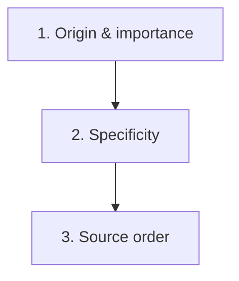

# Specificity & the Cascade

When multiple CSS rules target the same element and set the same property, the browser must decide which value to apply.
The **cascade** is the algorithm that makes this decision. Understanding it prevents the most frustrating CSS debugging
sessions.

## The cascade algorithm

The browser resolves conflicts in this order:



1. **Origin and importance** -- where the style comes from and whether it uses `!important`
2. **Specificity** -- how specific the selector is
3. **Source order** -- which rule comes last in the code

If step 1 does not resolve the conflict, the browser moves to step 2. If step 2 is a tie, step 3 decides.

## Step 1: Origin and importance

CSS rules come from three origins:

| Origin        | Source                                      | Priority (normal) | Priority (!important) |
|---------------|---------------------------------------------|--------------------|-----------------------|
| User agent    | Browser defaults                            | Lowest             | Highest               |
| User          | User stylesheets (rare)                     | Middle             | Middle                |
| Author        | Your stylesheets                            | Highest            | Lowest (among !important) |

In normal circumstances, your author styles override browser defaults. This is why you can change a link's colour from
the default blue.

The `!important` keyword **reverses** the priority order within each origin. An `!important` browser default beats an
`!important` author style. But in practice, the important thing to remember is: `!important` author styles beat normal
author styles.

## Step 2: Specificity

When two rules from the same origin target the same property, the one with **higher specificity** wins.

### How specificity is calculated

Specificity is a four-part score: **(inline, IDs, classes, elements)**

| Component | What counts                                                          | Weight |
|-----------|----------------------------------------------------------------------|--------|
| Inline    | The `style` attribute on an HTML element                             | 1,0,0,0 |
| IDs       | Each `#id` in the selector                                          | 0,1,0,0 |
| Classes   | Each `.class`, `[attribute]`, `:pseudo-class`                        | 0,0,1,0 |
| Elements  | Each `element`, `::pseudo-element`                                   | 0,0,0,1 |

The score is compared left to right. A selector with **any** ID beats a selector with **no** IDs, regardless of how
many classes or elements it has.

### Specificity examples

| Selector                     | Specificity  | Score   |
|------------------------------|-------------|---------|
| `p`                          | (0,0,0,1)  | 1       |
| `.intro`                     | (0,0,1,0)  | 10      |
| `p.intro`                    | (0,0,1,1)  | 11      |
| `#header`                    | (0,1,0,0)  | 100     |
| `#header .nav a`             | (0,1,1,1)  | 111     |
| `#header .nav a:hover`       | (0,1,2,1)  | 121     |
| `style="color: red"`        | (1,0,0,0)  | 1000    |

> **Note:** The "score" column is a simplified way to think about it, but specificity is **not** a single number. A
> selector with 11 classes (0,0,11,0) does **not** beat a selector with one ID (0,1,0,0). The components never carry
> over.

### What does NOT affect specificity

- The **universal selector** (`*`) has zero specificity
- `:where()` has zero specificity (by design)
- `:is()` and `:not()` use the specificity of their most specific argument
- **Combinators** (`>`, `+`, `~`, ` `) do not affect specificity
- **Media queries** do not affect specificity

## Step 3: Source order

When origin, importance, and specificity are all equal, the rule that appears **last** in the stylesheet wins:

```css
.button {
    color: blue;
}

.button {
    color: red;
}
```

The button text is red. The second rule has the same specificity but comes later.

This also applies across stylesheets. If you load two CSS files, rules in the second file override rules in the first
(when specificity is equal).

## Inheritance

Some CSS properties are **inherited** by default -- child elements receive the parent's value without you writing a
rule.

### Inherited properties (partial list)

- `color`
- `font-family`, `font-size`, `font-weight`, `font-style`
- `line-height`
- `text-align`, `text-transform`, `text-decoration`
- `letter-spacing`, `word-spacing`
- `visibility`
- `cursor`
- `list-style`

### Non-inherited properties (partial list)

- `background`, `background-color`
- `border`, `border-radius`
- `padding`, `margin`
- `width`, `height`
- `display`, `position`
- `box-shadow`
- `overflow`

```css
body {
    color: #333;
    font-family: sans-serif;
}
```

Every element inside `<body>` inherits `color` and `font-family` without you writing additional rules. But
`background-color` is **not** inherited -- children get a transparent background by default.

### Forcing inheritance

Use the `inherit` keyword to force a non-inherited property to inherit:

```css
.child {
    border: inherit;
}
```

### Other special values

| Value     | Behaviour                                                     |
|-----------|---------------------------------------------------------------|
| `inherit` | Use the parent's computed value                               |
| `initial` | Use the property's default value (from the CSS specification) |
| `unset`   | Use `inherit` if the property inherits, otherwise `initial`   |
| `revert`  | Roll back to the value from the previous cascade origin       |

## The !important keyword

Adding `!important` to a declaration gives it the highest priority within its origin:

```css
.text {
    color: red !important;
}

#header .text {
    color: blue;
}
```

The text is red. Even though `#header .text` has higher specificity, `!important` overrides it.

### Why to avoid !important

- It makes the cascade unpredictable -- other developers cannot override without their own `!important`
- It creates an escalation war: `!important` vs `!important` is resolved by specificity again
- It is a signal of a structural problem in your CSS

Legitimate uses of `!important`:

- **Utility classes** that must always win: `.hidden { display: none !important; }`
- **Overriding third-party CSS** you cannot modify
- **Accessibility overrides** (e.g., forced colours for readability)

> **Tip:** If you find yourself reaching for `!important`, step back and look for the specificity conflict. The solution
> is usually to simplify your selectors, not to escalate.

## Cascade layers

CSS `@layer` (introduced in 2022) gives you explicit control over the cascade order of entire groups of rules:

```css
@layer reset, base, components, utilities;

@layer reset {
    * {
        margin: 0;
        padding: 0;
        box-sizing: border-box;
    }
}

@layer base {
    body {
        font-family: sans-serif;
        color: #333;
    }
}

@layer components {
    .button {
        padding: 12px 24px;
        background-color: #4a90d9;
        color: white;
    }
}

@layer utilities {
    .hidden {
        display: none;
    }
}
```

The first line declares the layer order. Rules in later layers beat rules in earlier layers, **regardless of
specificity**. A simple `.hidden` in the utilities layer beats a complex `#main .sidebar .widget.active` in the
components layer.

This solves the specificity escalation problem: you no longer need to match or exceed the specificity of existing rules.
You just put your override in a higher layer.

> **Note:** Cascade layers are a more advanced topic. They are most useful in large projects and design systems. For
> small projects, understanding specificity and source order is sufficient.

## Debugging specificity conflicts

When a style does not apply as expected:

1. **Open DevTools** and inspect the element
2. Look at the **Styles panel** -- it shows all matching rules, most specific at the top
3. **Crossed-out declarations** are being overridden by higher-specificity rules
4. Hover over a crossed-out rule to see what is overriding it
5. If `!important` is involved, it will be visible in the Styles panel

### Common fixes

| Problem                       | Fix                                            |
|-------------------------------|------------------------------------------------|
| Class rule overridden by ID   | Remove the ID selector; use a class instead    |
| Rule not applying at all      | Check if the selector actually matches the HTML|
| Inline style winning          | Remove the inline style                        |
| !important blocking override  | Add your own !important or refactor selectors  |
| Source order conflict          | Reorder your stylesheets or selectors          |

## Specificity strategy

Follow these guidelines to keep specificity manageable:

1. **Use classes for everything** -- avoid IDs and element selectors for styling
2. **Keep selectors short** -- `.card-title` instead of `.main .content .card .card-title`
3. **Avoid nesting deeper than two levels** -- `.card .title` is fine, `.page .section .card .title` is not
4. **Never use !important** for layout or cosmetic styles
5. **Use BEM or a similar naming convention** to avoid selector conflicts (covered in chapter 16)
6. **Use cascade layers** for large projects with multiple stylesheet sources

## What you learned

- The cascade resolves conflicts in three steps: origin/importance, specificity, source order
- Specificity is scored as (inline, IDs, classes, elements) -- compared left to right
- Some properties **inherit** from parents (colour, font); others do not (margin, border)
- `!important` wins within its origin but causes maintenance problems -- avoid it
- **Cascade layers** (`@layer`) give explicit ordering that overrides specificity
- DevTools show which rules win and which are overridden

## Next step

Now that you understand how CSS resolves conflicts, the next chapter covers **modern CSS features** -- nesting, `:has()`,
container queries, and other recent additions to the language.
