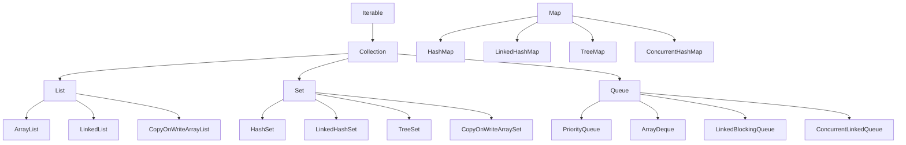

# Collections and Concurrent Data Structures

The Java Collections Framework is the backbone of everyday Java programming. Choosing
the right collection type impacts performance, correctness, and readability. This page
covers the core types, immutable collections, concurrent alternatives, and a decision
guide.

## Collection hierarchy



---

## Lists

### ArrayList (default choice)

Backed by a resizable array. Fast random access, slow insertion in the middle.

```java
List<String> names = new ArrayList<>();
names.add("Alice");
names.add("Bob");
names.add(1, "Charlie"); // insert at index 1
String first = names.get(0); // O(1)
names.remove("Bob");
```

| Operation | Time complexity |
|-----------|----------------|
| `get(index)` | O(1) |
| `add(element)` (end) | O(1) amortised |
| `add(index, element)` (middle) | O(n) |
| `remove(index)` | O(n) |
| `contains(element)` | O(n) |

### LinkedList

Doubly-linked list. Fast insertion/removal at both ends, slow random access.

```java
LinkedList<String> deque = new LinkedList<>();
deque.addFirst("first");
deque.addLast("last");
String head = deque.getFirst(); // O(1)
deque.removeFirst();            // O(1)
```

> Use `ArrayList` by default. Use `LinkedList` only when you need a `Deque` (double-ended
> queue) with frequent head/tail operations and never index into the middle.

### When to use which List

| Scenario | Choose |
|----------|--------|
| General purpose | `ArrayList` |
| Frequent head/tail add/remove, no indexing | `LinkedList` |
| Thread-safe, read-heavy | `CopyOnWriteArrayList` |
| Fixed content, never changes | `List.of(...)` |

---

## Sets

### HashSet (default choice)

Backed by a `HashMap`. Fast lookups, no ordering guarantee.

```java
Set<String> tags = new HashSet<>();
tags.add("java");
tags.add("streams");
tags.add("java"); // ignored (duplicate)
boolean has = tags.contains("java"); // O(1) average
```

### LinkedHashSet

Maintains **insertion order**:

```java
Set<String> ordered = new LinkedHashSet<>();
ordered.add("c");
ordered.add("a");
ordered.add("b");
// Iteration order: c, a, b
```

### TreeSet

Maintains **sorted order** (natural or custom Comparator):

```java
Set<String> sorted = new TreeSet<>();
sorted.add("banana");
sorted.add("apple");
sorted.add("cherry");
// Iteration order: apple, banana, cherry

// With custom comparator (case-insensitive)
Set<String> ci = new TreeSet<>(String.CASE_INSENSITIVE_ORDER);
```

| Set type | Order | Lookup | Null values |
|----------|-------|--------|-------------|
| `HashSet` | None | O(1) average | One null |
| `LinkedHashSet` | Insertion order | O(1) average | One null |
| `TreeSet` | Sorted | O(log n) | No nulls |
| `EnumSet` | Enum declaration order | O(1) | No nulls |

---

## Maps

### HashMap (default choice)

```java
Map<String, Integer> scores = new HashMap<>();
scores.put("Alice", 95);
scores.put("Bob", 87);

int aliceScore = scores.get("Alice");           // 95
int unknown = scores.getOrDefault("Eve", 0);    // 0

scores.putIfAbsent("Charlie", 80);              // only if absent
scores.computeIfAbsent("Diana", k -> computeScore(k)); // lazy

// Iteration
for (Map.Entry<String, Integer> entry : scores.entrySet()) {
    System.out.println(entry.getKey() + ": " + entry.getValue());
}

// forEach
scores.forEach((name, score) -> System.out.println(name + ": " + score));
```

### Useful Map methods (Java 8+)

```java
// merge: combine existing and new values
scores.merge("Alice", 5, Integer::sum); // Alice: 95 + 5 = 100

// compute: recompute value
scores.compute("Bob", (key, val) -> val == null ? 0 : val + 10);

// replaceAll
scores.replaceAll((name, score) -> score + 5); // add 5 to everyone
```

### LinkedHashMap

Maintains **insertion order** (or access order for LRU caches):

```java
// Insertion-ordered
Map<String, Integer> ordered = new LinkedHashMap<>();

// Access-ordered (LRU cache)
Map<String, Integer> lru = new LinkedHashMap<>(16, 0.75f, true) {
    @Override
    protected boolean removeEldestEntry(Map.Entry<String, Integer> eldest) {
        return size() > 100; // evict when over 100 entries
    }
};
```

### TreeMap

Sorted by key (natural order or custom Comparator):

```java
TreeMap<String, Integer> sorted = new TreeMap<>(scores);
String firstKey = sorted.firstKey();
String lastKey = sorted.lastKey();
NavigableMap<String, Integer> sub = sorted.subMap("A", true, "D", false);
```

| Map type | Order | Lookup | Null keys |
|----------|-------|--------|-----------|
| `HashMap` | None | O(1) average | One null |
| `LinkedHashMap` | Insertion / access order | O(1) average | One null |
| `TreeMap` | Sorted | O(log n) | No null keys |
| `EnumMap` | Enum order | O(1) | No null keys |

---

## Immutable collections

### Factory methods (Java 9+)

```java
// Immutable List
List<String> names = List.of("Alice", "Bob", "Charlie");
// names.add("Diana"); // throws UnsupportedOperationException

// Immutable Set
Set<Integer> primes = Set.of(2, 3, 5, 7, 11);

// Immutable Map
Map<String, Integer> scores = Map.of(
    "Alice", 95,
    "Bob", 87,
    "Charlie", 80
);

// For more than 10 entries
Map<String, Integer> large = Map.ofEntries(
    Map.entry("Alice", 95),
    Map.entry("Bob", 87)
    // ...
);
```

### Copying to immutable

```java
List<String> mutable = new ArrayList<>(List.of("a", "b", "c"));

// Unmodifiable view (shares backing data -- changes to original are visible)
List<String> view = Collections.unmodifiableList(mutable);

// True immutable copy (Java 10+)
List<String> copy = List.copyOf(mutable); // independent snapshot
```

### Streams to immutable

```java
List<String> result = names.stream()
    .filter(n -> n.length() > 3)
    .toList();                     // Java 16+: returns unmodifiable list

Set<String> resultSet = names.stream()
    .collect(Collectors.toUnmodifiableSet());

Map<String, Integer> resultMap = names.stream()
    .collect(Collectors.toUnmodifiableMap(n -> n, String::length));
```

---

## Concurrent collections

For multi-threaded access, use the dedicated concurrent types instead of wrapping
with `Collections.synchronizedXxx()`:

### ConcurrentHashMap

Thread-safe map with fine-grained locking (segments, not the whole map):

```java
ConcurrentHashMap<String, AtomicInteger> wordCount = new ConcurrentHashMap<>();

// Thread-safe increment
wordCount.computeIfAbsent("hello", k -> new AtomicInteger(0)).incrementAndGet();

// Bulk operations
wordCount.forEach(4, (key, value) ->
    System.out.println(key + ": " + value));

long total = wordCount.reduceValues(4, AtomicInteger::get, Integer::sum);
```

### CopyOnWriteArrayList

Thread-safe list optimised for **read-heavy** workloads. Writes create a new copy
of the underlying array:

```java
CopyOnWriteArrayList<String> listeners = new CopyOnWriteArrayList<>();
listeners.add("listener1"); // creates a new array copy

// Safe to iterate while another thread adds/removes
for (String listener : listeners) {
    notify(listener);
}
```

### BlockingQueue

Producer-consumer pattern:

```java
BlockingQueue<String> queue = new LinkedBlockingQueue<>(100);

// Producer
queue.put("task1"); // blocks if queue is full

// Consumer
String task = queue.take(); // blocks if queue is empty

// With timeout
String task = queue.poll(5, TimeUnit.SECONDS);
```

### Choosing the right concurrent collection

| Collection | Thread safety | Best for |
|-----------|--------------|----------|
| `ConcurrentHashMap` | Segment-level locking | Read/write-balanced maps |
| `CopyOnWriteArrayList` | Copy-on-write | Read-heavy lists (event listeners) |
| `CopyOnWriteArraySet` | Copy-on-write | Read-heavy small sets |
| `ConcurrentLinkedQueue` | Lock-free (CAS) | High-throughput FIFO queues |
| `LinkedBlockingQueue` | Lock-based | Producer-consumer with backpressure |
| `ConcurrentSkipListMap` | Lock-free | Sorted concurrent map |

---

## Choosing the right collection

| I need... | Use |
|-----------|-----|
| Indexed access, general purpose | `ArrayList` |
| Unique elements, fast lookup | `HashSet` |
| Key-value pairs | `HashMap` |
| Sorted elements | `TreeSet` / `TreeMap` |
| Insertion-ordered key-values | `LinkedHashMap` |
| FIFO queue | `ArrayDeque` |
| Thread-safe map | `ConcurrentHashMap` |
| Thread-safe list (read-heavy) | `CopyOnWriteArrayList` |
| Producer-consumer queue | `LinkedBlockingQueue` |
| Immutable list / set / map | `List.of()` / `Set.of()` / `Map.of()` |

---

## Common pitfalls

| Pitfall | Problem | Fix |
|---------|---------|-----|
| Modifying `List.of()` / `Map.of()` | `UnsupportedOperationException` | Copy to `new ArrayList<>(list)` if you need mutability |
| `HashMap` with mutable keys | If the key's `hashCode` changes, the entry is lost | Use immutable keys (String, Integer, records) |
| `ConcurrentModificationException` | Modifying a collection while iterating it | Use `Iterator.remove()`, or collect changes and apply after |
| `Collections.synchronizedList` for iteration | Iteration is not synchronized | Hold the lock manually, or use `CopyOnWriteArrayList` |
| Using `LinkedList` for indexing | `get(index)` is O(n) | Use `ArrayList` |
| `TreeSet` / `TreeMap` with inconsistent `equals` / `compareTo` | Elements disappear or duplicate | Ensure `compareTo` is consistent with `equals` |
| Null keys in `TreeMap` | `NullPointerException` | Use `HashMap` if you need null keys |

---

## See also

- [Streams and Collectors](./java-streams.md) -- processing collections functionally
- [Generics and Type Erasure](./generics.md) -- generic collection types
- [Concurrency](./concurrency.md) -- thread safety and concurrent patterns
- [Modern Java Features](./modern-java-features.md) -- sequenced collections (Java 21)
