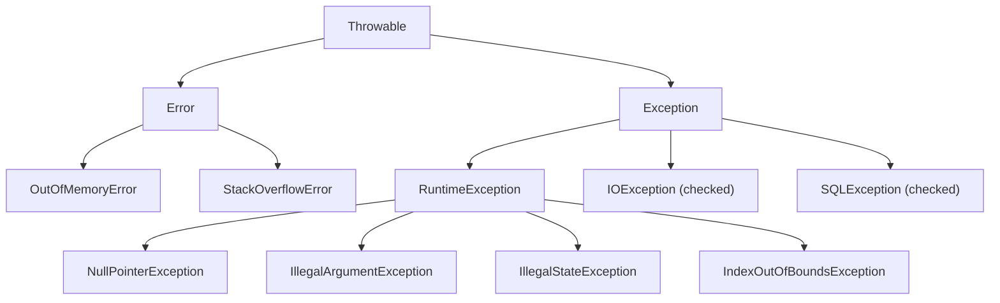

# Error Handling: Exceptions, Try-with-Resources, and Result Patterns

Good error handling is the difference between an application that crashes mysteriously
and one that fails gracefully with actionable information. This page covers Java's
exception model, resource management, and functional alternatives.

## Exception hierarchy



| Type | Checked? | Catch required? | When to use |
|------|----------|----------------|-------------|
| `Error` | No | No (don't catch) | JVM problems (OutOfMemory, StackOverflow) |
| `Exception` (checked) | Yes | Yes | Recoverable failures (IO, SQL, network) |
| `RuntimeException` (unchecked) | No | Optional | Programming errors, validation failures |

---

## Checked vs unchecked exceptions

### Checked exceptions

The compiler forces you to handle them (try/catch or declare `throws`):

```java
// Must handle IOException
public String readFile(Path path) throws IOException {
    return Files.readString(path);
}

// Caller option 1: catch
try {
    String content = readFile(Path.of("data.txt"));
} catch (IOException e) {
    log.error("Failed to read file", e);
    return "default";
}

// Caller option 2: propagate
public void process() throws IOException {
    String content = readFile(Path.of("data.txt"));
    // ...
}
```

### Unchecked exceptions

No compiler enforcement -- they indicate programming errors or precondition violations:

```java
public void setAge(int age) {
    if (age < 0 || age > 150) {
        throw new IllegalArgumentException("Age must be 0-150, got: " + age);
    }
    this.age = age;
}

public void withdraw(BigDecimal amount) {
    if (amount.compareTo(balance) > 0) {
        throw new IllegalStateException(
            "Insufficient balance: " + balance + ", requested: " + amount);
    }
    balance = balance.subtract(amount);
}
```

### When to use which

| Use checked exceptions | Use unchecked exceptions |
|----------------------|------------------------|
| Caller can reasonably recover | Programming error (bug) |
| External system failure (I/O, network, DB) | Validation failure (bad input) |
| Unusual but expected condition | Invariant violation |
| API boundary (forces caller to think about failure) | Internal logic errors |

> Modern Java style leans toward **unchecked exceptions** for most application-level
> errors, reserving checked exceptions for truly recoverable I/O operations.

---

## Try-with-resources

Automatically closes `AutoCloseable` resources when the block exits (normally or via
exception):

```java
// Single resource
try (var reader = new BufferedReader(new FileReader("data.txt"))) {
    String line = reader.readLine();
}
// reader is closed automatically, even if an exception occurs

// Multiple resources
try (var conn = dataSource.getConnection();
     var stmt = conn.prepareStatement("SELECT * FROM users");
     var rs = stmt.executeQuery()) {

    while (rs.next()) {
        System.out.println(rs.getString("name"));
    }
}
// rs, stmt, and conn are closed in reverse order
```

### Implementing AutoCloseable

```java
public class DatabasePool implements AutoCloseable {
    private final List<Connection> connections = new ArrayList<>();

    public Connection acquire() { /* ... */ }

    @Override
    public void close() {
        connections.forEach(conn -> {
            try { conn.close(); }
            catch (SQLException e) { log.warn("Failed to close connection", e); }
        });
        connections.clear();
    }
}

// Usage
try (var pool = new DatabasePool()) {
    Connection conn = pool.acquire();
    // ...
} // pool.close() called automatically
```

### Suppressed exceptions

If both the try block and the `close()` method throw, the close exception is
**suppressed** (attached to the primary exception):

```java
try (var resource = new FailingResource()) {
    throw new RuntimeException("primary");
} catch (RuntimeException e) {
    System.out.println(e.getMessage()); // "primary"
    for (Throwable suppressed : e.getSuppressed()) {
        System.out.println("Suppressed: " + suppressed.getMessage());
    }
}
```

---

## Custom exception hierarchies

### Base exception

```java
public abstract class AppException extends RuntimeException {
    private final String errorCode;

    protected AppException(String errorCode, String message) {
        super(message);
        this.errorCode = errorCode;
    }

    protected AppException(String errorCode, String message, Throwable cause) {
        super(message, cause);
        this.errorCode = errorCode;
    }

    public String getErrorCode() { return errorCode; }
}
```

### Specific exceptions

```java
public class NotFoundException extends AppException {
    public NotFoundException(String entity, String id) {
        super("NOT_FOUND", entity + " not found: " + id);
    }
}

public class ValidationException extends AppException {
    private final Map<String, String> fieldErrors;

    public ValidationException(Map<String, String> fieldErrors) {
        super("VALIDATION_ERROR", "Validation failed: " + fieldErrors);
        this.fieldErrors = Map.copyOf(fieldErrors);
    }

    public Map<String, String> getFieldErrors() { return fieldErrors; }
}

public class ExternalServiceException extends AppException {
    public ExternalServiceException(String service, Throwable cause) {
        super("EXTERNAL_ERROR", "Call to " + service + " failed", cause);
    }
}
```

### Usage

```java
public User findUser(String id) {
    return userRepository.findById(id)
        .orElseThrow(() -> new NotFoundException("User", id));
}

public void createUser(UserRequest request) {
    Map<String, String> errors = validate(request);
    if (!errors.isEmpty()) {
        throw new ValidationException(errors);
    }
    // ...
}
```

---

## Multi-catch and finally

```java
try {
    process();
} catch (IOException | SQLException e) {
    // Multi-catch: handle both the same way
    log.error("I/O or DB error", e);
} catch (AppException e) {
    // App-specific handling
    log.warn("Application error: {}", e.getErrorCode());
} finally {
    // Always runs (even if exception is thrown or caught)
    cleanup();
}
```

> Prefer try-with-resources over `finally` for resource cleanup. Use `finally` only
> for non-resource cleanup logic.

---

## Result / Either pattern

A functional alternative to exceptions for expected failure cases. The method returns
a value that explicitly represents success or failure:

### Simple Result type

```java
sealed interface Result<T> permits Result.Success, Result.Failure {

    record Success<T>(T value) implements Result<T> {}
    record Failure<T>(String error) implements Result<T> {}

    static <T> Result<T> success(T value) { return new Success<>(value); }
    static <T> Result<T> failure(String error) { return new Failure<>(error); }

    default <R> Result<R> map(Function<T, R> fn) {
        return switch (this) {
            case Success<T> s -> Result.success(fn.apply(s.value()));
            case Failure<T> f -> Result.failure(f.error());
        };
    }

    default <R> Result<R> flatMap(Function<T, Result<R>> fn) {
        return switch (this) {
            case Success<T> s -> fn.apply(s.value());
            case Failure<T> f -> Result.failure(f.error());
        };
    }

    default T orElse(T defaultValue) {
        return switch (this) {
            case Success<T> s -> s.value();
            case Failure<T> f -> defaultValue;
        };
    }
}
```

### Usage

```java
Result<User> findUser(String email) {
    if (email == null || email.isBlank()) {
        return Result.failure("Email must not be blank");
    }
    return userRepo.findByEmail(email)
        .map(Result::success)
        .orElse(Result.failure("User not found: " + email));
}

// Chain operations
Result<String> greeting = findUser("alice@example.com")
    .map(User::name)
    .map(name -> "Hello, " + name);

// Handle both cases
switch (greeting) {
    case Result.Success<String> s -> System.out.println(s.value());
    case Result.Failure<String> f -> System.err.println("Error: " + f.error());
}
```

### When to use Result vs Exceptions

| Use Result | Use Exceptions |
|-----------|---------------|
| Expected failure (validation, not-found) | Unexpected failure (bug, infrastructure) |
| Caller should handle inline | Error should propagate up the stack |
| Functional pipelines | Traditional imperative code |
| You want exhaustive handling at compile time | You want a global error handler |

---

## Logging exceptions properly

```java
// GOOD: pass the exception as the last argument (SLF4J prints the stack trace)
try {
    riskyOperation();
} catch (Exception e) {
    log.error("Operation failed for user {}", userId, e);
}

// BAD: toString() only -- loses the stack trace
log.error("Operation failed: " + e.toString());

// BAD: getMessage() only -- loses the exception type and stack trace
log.error("Operation failed: {}", e.getMessage());

// BAD: manual stack trace printing (use the logger instead)
e.printStackTrace();
```

---

## Exception handling in streams

Streams do not support checked exceptions. Workarounds:

### Wrapping in unchecked

```java
@FunctionalInterface
interface ThrowingFunction<T, R> {
    R apply(T t) throws Exception;

    static <T, R> Function<T, R> unchecked(ThrowingFunction<T, R> fn) {
        return t -> {
            try { return fn.apply(t); }
            catch (Exception e) { throw new RuntimeException(e); }
        };
    }
}

// Usage
List<String> contents = paths.stream()
    .map(ThrowingFunction.unchecked(Files::readString))
    .toList();
```

### Collecting successes and failures

```java
record ParseResult(List<Integer> successes, List<String> failures) {}

ParseResult parseNumbers(List<String> inputs) {
    var successes = new ArrayList<Integer>();
    var failures = new ArrayList<String>();

    for (String input : inputs) {
        try {
            successes.add(Integer.parseInt(input));
        } catch (NumberFormatException e) {
            failures.add(input);
        }
    }
    return new ParseResult(successes, failures);
}
```

---

## Common pitfalls

| Pitfall | Problem | Fix |
|---------|---------|-----|
| Catching `Exception` or `Throwable` broadly | Masks bugs, catches things you cannot handle | Catch specific exception types |
| Empty catch block | Exception silently swallowed | At minimum, log the error |
| Catching and rethrowing without the cause | Loses the original stack trace | `throw new AppException("msg", originalException)` |
| Using exceptions for control flow | Very slow (stack trace creation is expensive) | Use `if`/`else`, Optional, or Result |
| `finally` with return | Return in finally overrides the try-block return | Never return from `finally` |
| Logging and rethrowing | Same error logged twice (or more as it propagates) | Either log OR rethrow, not both |
| Not closing resources | File handles, connections leak | Use try-with-resources |

---

## See also

- [Logging](./logging.md) -- SLF4J, Logback, and structured logging
- [Optionals](./optionals.md) -- functional alternative for "no value" cases
- [Functional Interfaces](./functional-interfaces.md) -- checked exceptions in lambdas
- [Testing](./testing.md) -- testing exception scenarios
