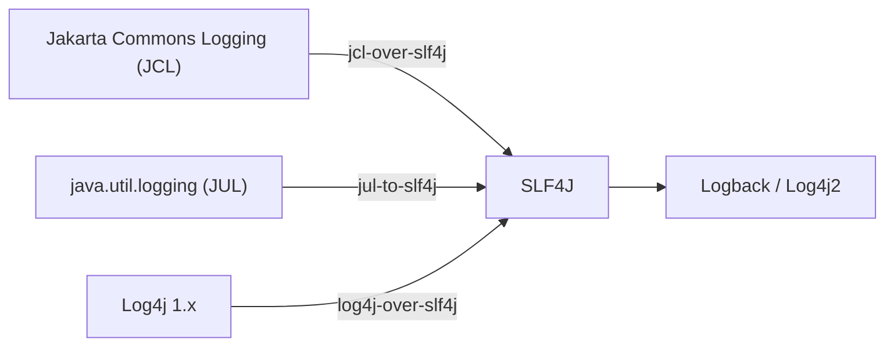

# Logging: SLF4J, Logback, and Log4j2

Logging is how your application communicates what it is doing at runtime. A good logging
setup helps you debug issues, monitor production health, and audit system behaviour.

The modern Java logging stack has two layers:

1. **Facade** -- SLF4J (Simple Logging Facade for Java) -- your code depends on this
2. **Implementation** -- Logback or Log4j2 -- the actual engine that writes logs


---

## SLF4J basics

### Getting a logger

```java
import org.slf4j.Logger;
import org.slf4j.LoggerFactory;

public class UserService {
    // Logger named after the class (convention)
    private static final Logger log = LoggerFactory.getLogger(UserService.class);

    public void createUser(String name) {
        log.info("Creating user: {}", name);
        try {
            // ...
            log.debug("User {} created successfully", name);
        } catch (Exception e) {
            log.error("Failed to create user {}", name, e);
        }
    }
}
```

> Many projects use Lombok's `@Slf4j` annotation to generate the logger field
> automatically.

### Log levels

| Level | Use case | Example |
|-------|----------|---------|
| `TRACE` | Very detailed diagnostic info | Method entry/exit, loop iterations |
| `DEBUG` | Diagnostic info useful during development | Variable values, query parameters |
| `INFO` | Normal operational events | Service started, user created, request handled |
| `WARN` | Unexpected but recoverable conditions | Retry attempt, deprecated API usage, slow query |
| `ERROR` | Failures that need attention | Unhandled exception, external service down |

```java
log.trace("Entering method with args: {}, {}", a, b);
log.debug("Query returned {} results", results.size());
log.info("User {} logged in from {}", userId, ipAddress);
log.warn("API rate limit approaching: {}/{}", current, max);
log.error("Failed to connect to database", exception);
```

### Parameterised messages (important!)

```java
// GOOD: parameterised -- string concatenation only happens if the level is enabled
log.debug("Processing order {} for user {}", orderId, userId);

// BAD: string concatenation happens regardless of log level
log.debug("Processing order " + orderId + " for user " + userId);

// GOOD: expensive computation guarded
if (log.isDebugEnabled()) {
    log.debug("Current state: {}", computeExpensiveState());
}

// Java 8+: lazy evaluation with suppliers (SLF4J 2.0+)
log.atDebug().addArgument(() -> computeExpensiveState())
    .log("Current state: {}");
```

---

## Logback configuration

Logback is the default SLF4J implementation (written by the same author).

### Maven dependencies

```xml
<dependency>
    <groupId>ch.qos.logback</groupId>
    <artifactId>logback-classic</artifactId>
    <version>1.5.6</version>
</dependency>
<!-- This transitively includes slf4j-api and logback-core -->
```

### logback.xml (basic)

Place in `src/main/resources/logback.xml`:

```xml
<configuration>

    <!-- Console appender -->
    <appender name="CONSOLE" class="ch.qos.logback.core.ConsoleAppender">
        <encoder>
            <pattern>%d{yyyy-MM-dd HH:mm:ss.SSS} [%thread] %-5level %logger{36} - %msg%n</pattern>
        </encoder>
    </appender>

    <!-- File appender with rolling -->
    <appender name="FILE" class="ch.qos.logback.core.rolling.RollingFileAppender">
        <file>logs/app.log</file>
        <rollingPolicy class="ch.qos.logback.core.rolling.SizeAndTimeBasedRollingPolicy">
            <fileNamePattern>logs/app.%d{yyyy-MM-dd}.%i.log.gz</fileNamePattern>
            <maxFileSize>50MB</maxFileSize>
            <maxHistory>30</maxHistory>
            <totalSizeCap>1GB</totalSizeCap>
        </rollingPolicy>
        <encoder>
            <pattern>%d{yyyy-MM-dd HH:mm:ss.SSS} [%thread] %-5level %logger{36} - %msg%n</pattern>
        </encoder>
    </appender>

    <!-- Package-level log levels -->
    <logger name="com.example.myapp" level="DEBUG" />
    <logger name="org.hibernate" level="WARN" />
    <logger name="org.apache" level="INFO" />

    <!-- Root logger -->
    <root level="INFO">
        <appender-ref ref="CONSOLE" />
        <appender-ref ref="FILE" />
    </root>

</configuration>
```

### Pattern format reference

| Token | Output | Example |
|-------|--------|---------|
| `%d{pattern}` | Date/time | `2024-01-15 14:30:45.123` |
| `%thread` | Thread name | `main`, `http-nio-8080-exec-1` |
| `%-5level` | Log level (left-padded) | `INFO `, `DEBUG` |
| `%logger{n}` | Logger name (abbreviated to n chars) | `c.e.m.UserService` |
| `%msg` | Log message | `Creating user: Alice` |
| `%n` | Newline | |
| `%X{key}` | MDC value | see MDC section below |
| `%ex` | Exception stack trace | (auto-appended for error logs) |

### Environment-specific config

Use `logback-spring.xml` (Spring Boot) or system properties:

```xml
<!-- logback.xml with conditional -->
<configuration>
    <if condition='property("ENV").equals("prod")'>
        <then>
            <root level="WARN">
                <appender-ref ref="FILE" />
            </root>
        </then>
        <else>
            <root level="DEBUG">
                <appender-ref ref="CONSOLE" />
            </root>
        </else>
    </if>
</configuration>
```

---

## Log4j2 configuration

### Maven dependencies

```xml
<dependency>
    <groupId>org.apache.logging.log4j</groupId>
    <artifactId>log4j-slf4j2-impl</artifactId>
    <version>2.23.0</version>
</dependency>
<!-- Bridges SLF4J to Log4j2 -->
```

### log4j2.xml (basic)

Place in `src/main/resources/log4j2.xml`:

```xml
<?xml version="1.0" encoding="UTF-8"?>
<Configuration status="WARN">
    <Appenders>
        <Console name="Console" target="SYSTEM_OUT">
            <PatternLayout pattern="%d{yyyy-MM-dd HH:mm:ss.SSS} [%t] %-5level %logger{36} - %msg%n"/>
        </Console>

        <RollingFile name="File" fileName="logs/app.log"
                     filePattern="logs/app-%d{yyyy-MM-dd}-%i.log.gz">
            <PatternLayout pattern="%d{yyyy-MM-dd HH:mm:ss.SSS} [%t] %-5level %logger{36} - %msg%n"/>
            <Policies>
                <SizeBasedTriggeringPolicy size="50MB"/>
                <TimeBasedTriggeringPolicy/>
            </Policies>
            <DefaultRolloverStrategy max="30"/>
        </RollingFile>
    </Appenders>

    <Loggers>
        <Logger name="com.example" level="debug"/>
        <Root level="info">
            <AppenderRef ref="Console"/>
            <AppenderRef ref="File"/>
        </Root>
    </Loggers>
</Configuration>
```

---

## Logback vs Log4j2

| Feature | Logback | Log4j2 |
|---------|---------|--------|
| **Performance** | Good | Better (async logging, lock-free) |
| **Config format** | XML, Groovy | XML, JSON, YAML, properties |
| **Async logging** | Via `AsyncAppender` | Built-in `AsyncLogger` (LMAX Disruptor) |
| **Conditional config** | With Janino library | Built-in `<Filters>` |
| **Garbage-free** | No | Yes (reduces GC pressure) |
| **Popularity** | Spring Boot default | Common in high-performance apps |
| **SLF4J integration** | Native (same author) | Via bridge (`log4j-slf4j2-impl`) |

> For most projects, Logback is fine. Choose Log4j2 if you need maximum throughput
> or garbage-free logging.

---

## MDC (Mapped Diagnostic Context)

MDC lets you attach **contextual data** to every log statement within a thread
(e.g., request ID, user ID, session ID):

```java
import org.slf4j.MDC;

// Set in a filter or interceptor
public void handleRequest(HttpServletRequest req) {
    MDC.put("requestId", UUID.randomUUID().toString());
    MDC.put("userId", req.getHeader("X-User-Id"));

    try {
        // All log statements in this thread now include requestId and userId
        log.info("Handling request");
        service.process();
    } finally {
        MDC.clear(); // always clear in finally!
    }
}
```

### Include MDC in log pattern

```xml
<!-- Logback pattern -->
<pattern>%d [%thread] [%X{requestId}] [%X{userId}] %-5level %logger{36} - %msg%n</pattern>
```

Output:

```text
2024-01-15 14:30:45.123 [http-8080-1] [abc-123-def] [user42] INFO  c.e.UserService - Processing order
```

### MDC with virtual threads / async

MDC is thread-local, so it does not propagate to child threads automatically. Solutions:

```java
// Manual propagation
Map<String, String> context = MDC.getCopyOfContextMap();

executor.submit(() -> {
    MDC.setContextMap(context);
    try {
        // MDC available here
        log.info("Async task running");
    } finally {
        MDC.clear();
    }
});
```

---

## Structured logging (JSON)

For production systems, JSON logs are easier to parse, search, and aggregate (ELK,
Splunk, Datadog):

### Logback JSON (logstash-logback-encoder)

```xml
<dependency>
    <groupId>net.logstash.logback</groupId>
    <artifactId>logstash-logback-encoder</artifactId>
    <version>8.0</version>
</dependency>
```

```xml
<appender name="JSON" class="ch.qos.logback.core.ConsoleAppender">
    <encoder class="net.logstash.logback.encoder.LogstashEncoder">
        <includeMdc>true</includeMdc>
    </encoder>
</appender>
```

Output:

```json
{
  "@timestamp": "2024-01-15T14:30:45.123Z",
  "level": "INFO",
  "logger_name": "com.example.UserService",
  "thread_name": "http-8080-1",
  "message": "Creating user: Alice",
  "requestId": "abc-123-def",
  "userId": "user42"
}
```

### Log4j2 JSON

```xml
<Console name="Console">
    <JsonLayout compact="true" eventEol="true" stacktraceAsString="true">
        <KeyValuePair key="service" value="my-app"/>
    </JsonLayout>
</Console>
```

---

## Bridging legacy logging frameworks

Many libraries use different logging APIs. Bridge them all to SLF4J:



```xml
<!-- Bridge JCL to SLF4J -->
<dependency>
    <groupId>org.slf4j</groupId>
    <artifactId>jcl-over-slf4j</artifactId>
    <version>2.0.13</version>
</dependency>

<!-- Bridge JUL to SLF4J -->
<dependency>
    <groupId>org.slf4j</groupId>
    <artifactId>jul-to-slf4j</artifactId>
    <version>2.0.13</version>
</dependency>

<!-- Exclude the original implementations -->
<!-- (in the dependency that pulls them in) -->
```

---

## Performance tips

| Tip | Explanation |
|-----|-------------|
| Use parameterised messages | `log.debug("User {}", user)` avoids string concatenation when DEBUG is off |
| Guard expensive computations | `if (log.isDebugEnabled()) { log.debug("State: {}", computeState()); }` |
| Use async appenders for I/O | Writing to files blocks the calling thread; async decouples this |
| Avoid logging in tight loops | Millions of log calls per second overwhelm any appender |
| Set appropriate levels per package | `com.example=DEBUG`, `org.hibernate=WARN` |
| Use MDC instead of string formatting | Structured context is searchable; string concatenation is not |
| Rotate and compress log files | Prevent disk exhaustion |

---

## Common pitfalls

| Pitfall | Problem | Fix |
|---------|---------|-----|
| String concatenation in log messages | `log.debug("x=" + x)` always evaluates, even if DEBUG is off | Use `log.debug("x={}", x)` |
| Logging sensitive data | Passwords, tokens, PII in logs | Mask or exclude sensitive fields; review log output |
| Multiple SLF4J bindings on classpath | `SLF4J: Class path contains multiple SLF4J bindings` | Exclude duplicate bindings (check `mvn dependency:tree`) |
| Not clearing MDC | MDC leaks between requests in thread pools | Always `MDC.clear()` in a `finally` block |
| Logging and rethrowing | Same error appears multiple times in logs | Either log OR rethrow -- not both |
| `e.printStackTrace()` | Prints to stderr, not the logging framework | Use `log.error("message", e)` |
| Catching `Exception` just to log it | Swallows the exception silently | Log and rethrow, or handle appropriately |
| Missing logback.xml / log4j2.xml | SLF4J falls back to NOP logger (no output) | Include the config file in `src/main/resources/` |

---

## See also

- [Error Handling](./error-handling.md) -- exception logging patterns
- [Maven](./maven.md) -- managing logging dependencies
- [Testing](./testing.md) -- testing log output
- [Concurrency](./concurrency.md) -- MDC with async and virtual threads
