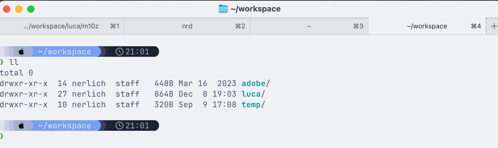
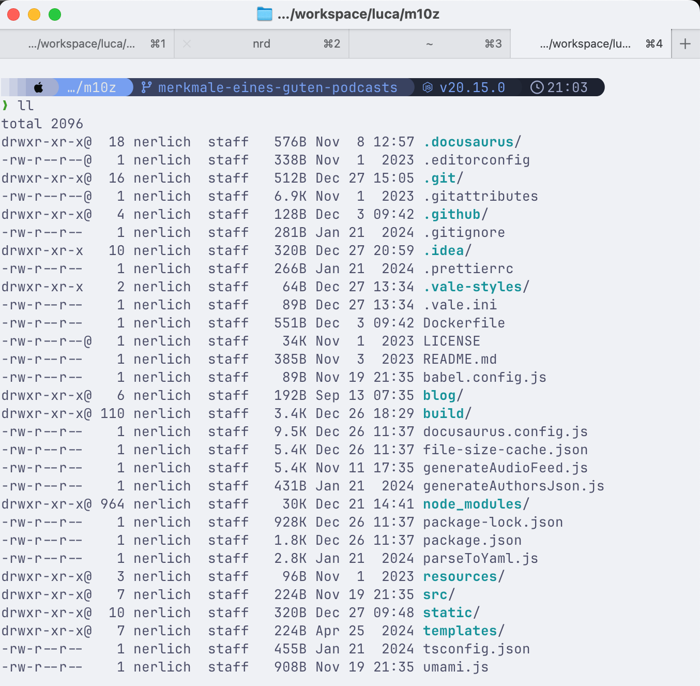
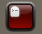

# My zsh Shell setup

The following steps setup my shell (zsh + oh-my-zsh).

1. Install `ghostty` terminal
    - https://ghostty.org/download
2. Install `zsh`
    - https://github.com/ohmyzsh/ohmyzsh/wiki/Installing-ZSH
3. Install `oh-my-zsh`
    - https://ohmyz.sh/#install
4. Install `starship.rs`
    - https://starship.rs
5. Setup starship theme
    - https://starship.rs/presets/tokyo-night
    - `starship preset tokyo-night -o ~/.config/starship.toml`

:::warning[Keep secrets out of your shell config]
The dotfiles below are sanitized examples. **Never commit real tokens, passwords, or API keys to a
shell profile** - they end up in your shell history, backups, and any synced dotfiles repo. Load
secrets from an untracked file instead (see [Managing secrets](#managing-secrets) at the end of this
page).
:::

Example terminal tab in my home directory


Example terminal tab in a folder with a node project


When using ssh to connect to remote servers,
they might be missing
the [shell info for Ghostty](https://ghostty.org/docs/help/terminfo#copy-ghostty's-terminfo-to-a-remote-machine).
You can copy them with the following command

```bash
infocmp -x | ssh YOUR-SERVER - tic -x -
```

## Ghostty Config

- [Keybind Documentation](https://ghostty.org/docs/config/keybind)
- [MacOS Icon Config](https://ghostty.org/docs/config/reference#macos-icon)

```
# Create window splits
keybind = alt+a=new_split:left
keybind = alt+s=new_split:down
keybind = alt+w=new_split:up
keybind = alt+d=new_split:right
keybind = alt+d=new_split:right
keybind = alt+e=new_split:auto

# Navigate window splits
keybind = alt+shift+a=goto_split:left
keybind = alt+shift+s=goto_split:bottom
keybind = alt+shift+w=goto_split:top
keybind = alt+shift+d=goto_split:right

# Other
mouse-hide-while-typing = true
keybind = cmd+w=close_surface
keybind = performable:ctrl+c=copy_to_clipboard

# Custom Icon Colors
macos-icon = custom-style
macos-icon-frame = plastic
macos-icon-ghost-color = 1C2021
macos-icon-screen-color = FA0C00

# Cursor
shell-integration-features = no-cursor
cursor-style = block
cursor-style-blink = false

# Tab Style
macos-titlebar-style = tabs
macos-titlebar-proxy-icon = hidden
split-divider-color = #222
unfocused-split-opacity = 1
```



## .zshrc

```bash
# If you come from bash you might have to change your $PATH.
# export PATH=$HOME/bin:$HOME/.local/bin:/usr/local/bin:$PATH

# Path to your Oh My Zsh installation.
export ZSH="$HOME/.oh-my-zsh"

# Set name of the theme to load --- if set to "random", it will
# load a random theme each time Oh My Zsh is loaded, in which case,
# to know which specific one was loaded, run: echo $RANDOM_THEME
# See https://github.com/ohmyzsh/ohmyzsh/wiki/Themes
ZSH_THEME="robbyrussell"

# Set list of themes to pick from when loading at random
# Setting this variable when ZSH_THEME=random will cause zsh to load
# a theme from this variable instead of looking in $ZSH/themes/
# If set to an empty array, this variable will have no effect.
# ZSH_THEME_RANDOM_CANDIDATES=( "robbyrussell" "agnoster" )

# Uncomment the following line to use case-sensitive completion.
# CASE_SENSITIVE="true"

# Uncomment the following line to use hyphen-insensitive completion.
# Case-sensitive completion must be off. _ and - will be interchangeable.
# HYPHEN_INSENSITIVE="true"

# Uncomment one of the following lines to change the auto-update behavior
# zstyle ':omz:update' mode disabled  # disable automatic updates
# zstyle ':omz:update' mode auto      # update automatically without asking
# zstyle ':omz:update' mode reminder  # just remind me to update when it's time

# Uncomment the following line to change how often to auto-update (in days).
# zstyle ':omz:update' frequency 13

# Uncomment the following line if pasting URLs and other text is messed up.
# DISABLE_MAGIC_FUNCTIONS="true"

# Uncomment the following line to disable colors in ls.
# DISABLE_LS_COLORS="true"

# Uncomment the following line to disable auto-setting terminal title.
# DISABLE_AUTO_TITLE="true"

# Uncomment the following line to enable command auto-correction.
ENABLE_CORRECTION="true"

# Uncomment the following line to display red dots whilst waiting for completion.
# You can also set it to another string to have that shown instead of the default red dots.
# e.g. COMPLETION_WAITING_DOTS="%F{yellow}waiting...%f"
# Caution: this setting can cause issues with multiline prompts in zsh < 5.7.1 (see #5765)
COMPLETION_WAITING_DOTS="true"

# Uncomment the following line if you want to disable marking untracked files
# under VCS as dirty. This makes repository status check for large repositories
# much, much faster.
# DISABLE_UNTRACKED_FILES_DIRTY="true"

# Uncomment the following line if you want to change the command execution time
# stamp shown in the history command output.
# You can set one of the optional three formats:
# "mm/dd/yyyy"|"dd.mm.yyyy"|"yyyy-mm-dd"
# or set a custom format using the strftime function format specifications,
# see 'man strftime' for details.
# HIST_STAMPS="mm/dd/yyyy"

# Would you like to use another custom folder than $ZSH/custom?
# ZSH_CUSTOM=/path/to/new-custom-folder

# Which plugins would you like to load?
# Standard plugins can be found in $ZSH/plugins/
# Custom plugins may be added to $ZSH_CUSTOM/plugins/
# Example format: plugins=(rails git textmate ruby lighthouse)
# Add wisely, as too many plugins slow down shell startup.
plugins=(
  git
)

source $ZSH/oh-my-zsh.sh

# User configuration

# export MANPATH="/usr/local/man:$MANPATH"

# You may need to manually set your language environment
# export LANG=en_US.UTF-8

# Preferred editor for local and remote sessions
# if [[ -n $SSH_CONNECTION ]]; then
#   export EDITOR='vim'
# else
#   export EDITOR='nvim'
# fi

# Compilation flags
# export ARCHFLAGS="-arch $(uname -m)"

# Set personal aliases, overriding those provided by Oh My Zsh libs,
# plugins, and themes. Aliases can be placed here, though Oh My Zsh
# users are encouraged to define aliases within a top-level file in
# the $ZSH_CUSTOM folder, with .zsh extension. Examples:
# - $ZSH_CUSTOM/aliases.zsh
# - $ZSH_CUSTOM/macos.zsh
# For a full list of active aliases, run `alias`.
#
# Example aliases
# alias zshconfig="mate ~/.zshrc"
# alias ohmyzsh="mate ~/.oh-my-zsh"

fpath=(~/.local/share/zsh/functions $fpath)
autoload -Uz compinit
compinit -u

## ZSH Config
PROMPT='%(?.%F{green}√.%F{red}?%?)%f %B%F{240}%~%f%b %# '

## Java 8
#export JAVA_HOME='/Users/nerlich/tech/jdk8u292-b10/Contents/Home'
#export PATH=$JAVA_HOME:$PATH

## mise
# node, java, maven, python etc. are installed and version-pinned by mise
# (see "Local version management" below), e.g.:
#   mise use --global node@22 java@temurin-21 maven
# This replaces the old hand-pinned JAVA_HOME / MAVEN_HOME exports and nvm.

## Ngrok
export PATH="/Users/nerlich/tech/ngrok:$PATH"

## Secrets (tokens, etc.) - loaded from an untracked file, never hardcoded here.
# See "Managing secrets" below. Create ~/.zshrc.local (chmod 600, git-ignored) with:
#   export GITHUB_TOKEN='ghp_...'
#   export GITHUB_ACCESS_TOKEN_CLASSIC='ghp_...'
[ -f "$HOME/.zshrc.local" ] && source "$HOME/.zshrc.local"

# FileSystem
alias ls='ls -GFh'
alias cp='cp -iv'                           # Preferred 'cp' implementation
alias mv='mv -iv'                           # Preferred 'mv' implementation
alias mkdir='mkdir -pv'                     # Preferred 'mkdir' implementation
alias ll='ls -FGlAhp'                       # Preferred 'ls' implementation
alias less='less -FSRXc'                    # Preferred 'less' implementation
cd() { builtin cd "$@"; [[ -o interactive ]] && ll; }   # List dir contents upon 'cd' (interactive shells only)
alias cd2='cd ../../'                       # Go back 2 directory levels
alias cd3='cd ../../../'                     # Go back 3 directory levels
alias cd4='cd ../../../../'                  # Go back 4 directory levels
alias cd5='cd ../../../../../'               # Go back 5 directory levels
alias cd6='cd ../../../../../../'            # Go back 6 directory levels
alias f='open .'

# Docker
alias dcu='docker-compose pull && docker-compose up -d'
alias dcd='docker-compose down'
alias dcl='docker-compose logs -f'
alias dcb='docker-compose build'

# Git
alias gitfast='git pull && git add . && git commit -m "shortcut alias for minor changes" && git push'
export gh='/Users/nerlich/tech/gh_2.64.0/bin'
export PATH=$gh:$PATH

# Maven
alias mci='mvn clean install'
alias mcip='mvn clean install -PautoInstallSinglePackage'
alias mcipp='mvn clean install -PautoInstallSinglePackagePublish'
alias mcipst='mvn clean install -PautoInstallSinglePackage -DskipTests'

# Node
alias nrd='npm run dev'
alias nrb='npm run build'
alias nrbs='npm run build && npm run start'

# Networking
alias myip="ifconfig | grep -Eo 'inet (addr:)?([0-9]*\.){3}[0-9]*' | grep -Eo '([0-9]*\.){3}[0-9]*' | grep -v '127.0.0.1'"
alias netCons='lsof -i'                             # netCons:      Show all open TCP/IP sockets
alias lsock='sudo /usr/sbin/lsof -i -P'             # lsock:        Display open sockets
alias lsockU='sudo /usr/sbin/lsof -nP | grep UDP'   # lsockU:       Display only open UDP sockets
alias lsockT='sudo /usr/sbin/lsof -nP | grep TCP'   # lsockT:       Display only open TCP sockets
alias flushdns='sudo dscacheutil -flushcache; sudo killall -HUP mDNSResponder; say DNS cache flushed '

# Adobe AppBuilder
alias aiodev='aio app dev'
alias aiodep='aio app deploy'
alias aiodpl='aio app deploy'
alias aiolog='aio app logs'
alias aiouse='aio app use'
alias aiort='aio rt'
alias aioact='aio rt activation'
alias aioinv='aio rt action invoke'
alias aiores='aio rt activation result'
alias aioll='aio rt activations list -l 60'
alias aiols='aio rt activations list -l 10'
alias aiolst='aio rt activations list -l 10'
alias aiocm='aio cloudmanager'
alias aiorde='aio aem rde'
alias aiolgi='aio login --no-open'
alias aiolgo='aio logout --force'
alias aiocsl='aio console'
alias aioorg='aio console org select'
alias aioprj='aio console project select'
alias aiows='aio console ws select'
alias aiocfg='aio config'
alias aioplg='aio plugins'
alias aioinf='aio info'
alias aioo='aio where'

# mise: loads tools + env vars per directory (replaces nvm, pyenv, sdkman, direnv)
eval "$(mise activate zsh)"

export PATH="$PATH:/Users/nerlich/.local/bin" # Added by Docker Labs Debug Tools"

# Added by LM Studio CLI (lms)
export PATH="$PATH:/Users/nerlich/.cache/lm-studio/bin"

# Starship.rs
# curl -sS https://starship.rs/install.sh | sh
eval "$(starship init zsh)"
```

## powershell .profile

File Location: `C:\Users\lucan\Documents\WindowsPowerShell\Microsoft.PowerShell_profile.ps1`

```powershell title="C:\Users\lucan\Documents\WindowsPowerShell\Microsoft.PowerShell_profile.ps1"
# Linux-like aliases for PowerShell
Set-Alias -Name ll -Value Get-ChildItem
function ll { Get-ChildItem -Force @args | Format-Table -AutoSize }
function ls { Get-ChildItem @args }
function grep { Select-String @args }
function pwd { (Get-Location).Path }
function touch { New-Item -ItemType File @args }
function cp { Copy-Item @args }
function mv { Move-Item @args }
function rm { Remove-Item @args }
function cat { Get-Content @args }
function clear { Clear-Host }
function mkdir { New-Item -ItemType Directory @args }
function man { Get-Help @args }
function find { Get-ChildItem -Recurse -Filter @args }
function diff { Compare-Object @args }
function history { Get-History }

Write-Host "Linux-like aliases loaded!" -ForegroundColor Green

#region Environment path additions
$env:PATH = "$env:ConEmuBaseDir\Scripts;$env:PATH"
$env:PATH = "C:\Users\Luca\WPy64-3910\python-3.9.1.amd64;$env:PATH"
#endregion

#region Directory navigation aliases
function cd2 { Set-Location -Path ..\.. }
function cd3 { Set-Location -Path ..\..\.. }
function cd4 { Set-Location -Path ..\..\..\.. }
function f { Start-Process . }
#endregion

#region Project directory shortcuts
function cdi { Set-Location -Path "E:\workspace\luca\" }
function cds { Set-Location -Path "E:\workspace\luca\code\projects\strapi\cffc-v4\" }
function cdc { Set-Location -Path "E:\workspace\luca\code\projects\cffc\" }
function cdc4ca { Set-Location -Path "E:\workspace\adobe\VW\author-c4c\crx-quickstart\bin\" }
function cdc4cp { Set-Location -Path "E:\workspace\adobe\VW\publish-c4c\crx-quickstart\bin\" }
#endregion

#region NPM aliases
function npmil { npm install --legacy-peer-deps }
function nrd { npm run dev }
function nrb { npm run build }
function nrs { npm run start }
function nrbs { npm run build; npm run start }
function npmu { npm update }
function npmi { npm install }
#endregion

#region Maven aliases
function mci { mvn clean install -T 1C }
function mcip { mvn clean install -PautoInstallSinglePackage }
function mcipst { mvn clean install -PautoInstallSinglePackage -DskipTests }
function mcipp { mvn clean install -PautoInstallSinglePackagePublish }
function mcib { mvn clean install -PautoInstallBundle }
function msonar { mvn clean verify sonar:sonar -Dsonar.projectKey=R4C -Dsonar.host.url=http://localhost:9000 -Dsonar.token=$env:SONAR_TOKEN }
#endregion

#region Docker aliases
function dcu { docker-compose pull; docker-compose up -d --remove-orphans }
function dcul { docker-compose -f docker-compose-local.yml build; docker-compose -f docker-compose-local.yml up }
function dcd { docker-compose down }
#endregion

#region Version check alias
function ii { java -version; mvn -version }
#endregion

#region Dispatcher reload
function dispatcherreload { 
    if (Test-Path out) { Remove-Item -Recurse -Force out } 
    bin\validator.exe full -d out src 
    bin\docker_run.cmd out host.docker.internal:4503 8081 
}
#endregion

#region Project navigation aliases - SAP
function edge { Set-Location -Path "E:\workspace\adobe\SAP\builder-prospect-edge-worker\root\qa-headless-commerce" }
function eds { Set-Location -Path "E:\workspace\adobe\SAP\builder-prospect-aem-dev" }
function sapa { 
    Set-Location -Path "E:\workspace\adobe\SAP\author\crx-quickstart\bin"
    .\start.bat
}
function appb { Set-Location -Path "E:\workspace\adobe\SAP\builder-prospect-app-builder-pdp" }
function sap { Set-Location -Path "E:\workspace\adobe\SAP\builder-prospect-aem-sapdx" }
#endregion

#region Adobe I/O aliases
function aiodev { aio app dev }
function aiodep { aio app deploy }
function aiodpl { aio app deploy }
function aiolog { aio app logs }
function aiouse { aio app use }
function aiort { aio rt }
function aioact { aio rt activation }
function aioinv { aio rt action invoke }
function aiores { aio rt activation result }
function aioll { aio rt activations list -l 60 }
function aiols { aio rt activations list -l 10 }
function aiolst { aio rt activations list -l 10 }
function aiocm { aio cloudmanager }
function aiorde { aio aem rde }
function aiolgi { aio login --no-open }
function aiolgo { aio logout --force }
function aiocsl { aio console }
function aioorg { aio console org select }
function aioprj { aio console project select }
function aiows { aio console ws select }
function aiocfg { aio config }
function aioplg { aio plugins }
function aioinf { aio info }
function aioo { aio where }
#endregion

Write-Host "Custom aliases loaded successfully!" -ForegroundColor Cyan
```

## Recommended extensions

A few oh-my-zsh plugins and CLI tools that make day-to-day work noticeably nicer. Install the tools
with [Homebrew](https://brew.sh) on macOS (`brew install fzf zoxide eza bat`).

| Tool | What it does | Link |
|------|--------------|------|
| `zsh-autosuggestions` | Fish-style suggestions from history as you type | [GitHub](https://github.com/zsh-users/zsh-autosuggestions) |
| `zsh-syntax-highlighting` | Highlights valid/invalid commands while typing | [GitHub](https://github.com/zsh-users/zsh-syntax-highlighting) |
| `fzf` | Fuzzy finder for files, history (`Ctrl-R`), and more | [GitHub](https://github.com/junegunn/fzf) |
| `zoxide` | Smarter `cd` that learns your most-used directories | [GitHub](https://github.com/ajeetdsouza/zoxide) |
| `eza` | Modern `ls` replacement with colors, icons, git status | [eza.rocks](https://eza.rocks) |
| `bat` | `cat` with syntax highlighting and paging | [GitHub](https://github.com/sharkdp/bat) |
| `direnv` | Per-directory environment variables (great for project secrets) | [direnv.net](https://direnv.net) |

To enable the zsh plugins, clone them into `$ZSH_CUSTOM/plugins` and add them to the `plugins` array
(after `git`):

```bash
git clone https://github.com/zsh-users/zsh-autosuggestions \
  "${ZSH_CUSTOM:-$HOME/.oh-my-zsh/custom}/plugins/zsh-autosuggestions"
git clone https://github.com/zsh-users/zsh-syntax-highlighting \
  "${ZSH_CUSTOM:-$HOME/.oh-my-zsh/custom}/plugins/zsh-syntax-highlighting"
```

```bash title="~/.zshrc - plugins"
plugins=(
  git
  zsh-autosuggestions
  zsh-syntax-highlighting
)
```

## Daily tools: fzf and zoxide

The two tools I use in literally every terminal session. Both install with one
Homebrew command and need a two-line addition to `~/.zshrc`.

### fzf

[Fuzzy finder](https://github.com/junegunn/fzf) for your history, files, and
command output. Once you have used `Ctrl-R` with fzf you never go back.

Install:

```bash
brew install fzf
```

Add to `~/.zshrc` (requires fzf 0.48+, which ships the built-in zsh
integration -- key bindings and fuzzy completion in one line):

```bash title="~/.zshrc - fzf"
# fzf: enables Ctrl-R (history), Ctrl-T (insert file paths), Alt-C (cd into dir)
source <(fzf --zsh)
```

Usage highlights:

| Keys / command | What it does |
|----------------|--------------|
| `Ctrl-R` | Fuzzy search through shell history |
| `Ctrl-T` | Fuzzy-find files and paste the path into the current command |
| `Alt-C` | Fuzzy-find a directory and `cd` into it |
| `vim **<TAB>` | Fuzzy completion after `**` (works with `cd`, `kill`, `ssh`, ...) |
| `fzf` | Standalone fuzzy finder over stdin, e.g. `git branch \| fzf` |

### zoxide

A smarter `cd` that [learns which directories you visit
often](https://github.com/ajeetdsouza/zoxide). `z` jumps straight to the best
match -- this fully replaces my old `cd2` ... `cd6` alias pile.

Install:

```bash
brew install zoxide
```

Add to `~/.zshrc` (put it at the very end, after everything else):

```bash title="~/.zshrc - zoxide"
eval "$(zoxide init zsh)"

# Make plain `cd` behave like `z` (fuzzy directory jumping).
# Note: use "builtin cd" where you need the real cd, e.g. inside scripts/functions.
alias cd='z'
```

If you prefer zoxide to own `cd` natively instead of an alias, init it with the
`--cmd` flag -- `eval "$(zoxide init zsh --cmd cd)"` -- which registers `cd`
(and `cdi` for interactive mode) directly and needs no alias.

Usage highlights:

| Command | What it does |
|---------|--------------|
| `z foo` | Jump to the most-frequently/most-recently visited directory matching `foo` |
| `z foo bar` | Multiple keywords refine the match |
| `zi foo` | Interactive pick with fzf when several directories match |
| `z -` | Not needed -- plain `cd -` still works, zoxide only adds commands |

## Git and Docker TUIs: lazygit and lazydocker

Full terminal UIs for the two things I stare at all day. Both are single Go
binaries from the same author.

### lazygit

A [terminal UI for git](https://github.com/jesseduffield/lazygit): stage
hunks interactively, rebase, cherry-pick, resolve conflicts, and browse refs
without typing porcelain commands.

Install:

```bash
brew install lazygit
```

```bash title="~/.zshrc - lazygit"
alias lg='lazygit'
```

Usage: run `lg` inside a repository. Navigate with `j`/`k`, `space` to stage
files or hunks, `c` to commit, `p` to push, `shift+P` to force-push, `?` shows
all keybindings for the focused panel.

### lazydocker

The [same idea for Docker](https://github.com/jesseduffield/lazydocker):
watch container state, logs, and resource usage in one screen, restart or
remove containers, and prune dangling images.

Install:

```bash
brew install lazydocker
```

```bash title="~/.zshrc - lazydocker"
alias lzd='lazydocker'
```

Usage: run `lzd`. Left panel switches between containers / images / volumes
with `[` and `]`, `enter` shows logs, `r` restarts a container, `x` opens the
context menu (stop, remove, prune), `?` for help.

## Local version management: mise

[mise](https://mise.jdx.dev) (short for *mise-en-place*, "everything in its
place") is a single tool that replaces a whole drawer full of version managers:
`nvm`, `pyenv`, `rbenv`, `asdf`, `sdkman`, and friends. It is written in Rust,
so version switching is essentially instant -- no slow `nvm.sh` sourcing on
every shell startup.

One tool, three jobs:

1. **Dev tools** -- install and pin per-project versions of node, python, java,
   maven, and hundreds of other tools.
2. **Environment variables** -- per-directory env vars (the `direnv`
   experience) defined right next to the tool versions.
3. **Tasks** -- a small task runner (a lighter `make` / `just`) that always
   runs with the correct tools and env loaded.

### Install and activate

```bash
brew install mise
# or: curl https://mise.run | sh
```

Add to `~/.zshrc` (mise adds its tool paths automatically when active -- you do
not need it on `PATH` first). `mise activate` re-evaluates your environment on
every prompt or `cd`, so entering a project directory instantly switches to
that project's tools:

```bash title="~/.zshrc - mise"
eval "$(mise activate zsh)"
```

Verify with `mise doctor`.

### Global tools

`mise use --global` installs a tool and pins it as the default in
`~/.config/mise/config.toml`:

```bash
mise use --global node@22
mise use --global java@temurin-21
mise use --global maven
mise use --global python@3.13
```

That writes a plain TOML file you can also edit by hand:

```toml title="~/.config/mise/config.toml"
[tools]
node = "22"
java = "temurin-21"
maven = "latest"
python = "3.13"
```

### Per-project tools: `mise.toml`

Run `mise use` inside a project and it creates a `mise.toml` there. Commit it
to the repo and every teammate (or your CI, or your future self on a new
machine) gets the exact same toolchain with a single `mise install`:

```bash
cd my-project
mise use node@20          # writes ./mise.toml, installs the tool
mise install              # (re)install everything the config asks for
```

```toml title="./mise.toml"
[tools]
node = "20"
```

Fuzzy versions like `node = "20"` resolve to the newest installed 20.x, so you
get patches automatically but never a major-version surprise.

### How resolution works: global config vs. the directory you stand in

The one thing to internalize about mise: **config is hierarchical, and the
closest file wins**. When your shell needs a tool version, mise

1. walks up the directory tree from your current directory,
2. collects every `mise.toml` it finds along the way (plus the global config at
   `~/.config/mise/config.toml` and the system config in `/etc/mise`),
3. merges them, with configs **closer to you overriding** broader ones.

Concretely:

```
~/.config/mise/config.toml      # global defaults:      node@22, maven
~/workspace/aem/mise.toml       # work-wide settings:   java@temurin-11
~/workspace/aem/site/mise.toml  # this project:         node@20
```

Standing in `~/workspace/aem/site` you get node 20, java 11, and maven from
global. `node` in the parent directory is still 22 -- only the `node` entry is
overridden, everything else is inherited (tools and env vars merge per-key;
tasks from a deeper file replace same-named ones entirely).

Where this bites people: **`mise use` always writes to the directory you are
standing in**. `cd ~/projects/site && mise use node@20` creates
`~/projects/site/mise.toml` -- but run the same command in your home directory
by accident and you have just created `~/mise.toml`, which now shadows your
global config for every subdirectory of `$HOME`. Use:

- `mise use -g ...` / `mise use --global ...` -- write to
  `~/.config/mise/config.toml` (system-wide tooling)
- `mise use ...` (no flag) -- write to `./mise.toml` in the current directory
  (local workdir, commit it)
- `mise use --env local ...` -- write to `mise.local.toml`, a personal override
  file you git-ignore (e.g. your own preferred python version on top of the
  team's pin)

A few extras worth knowing:

- `mise cfg` (short for `mise config`) lists every config file mise is loading
  and its precedence -- the fastest way to answer "why is this node version
  active?". `mise which <tool>` shows the binary actually on your `PATH`.
- mise can also read idiomatic version files from other managers like
  `.nvmrc`, `.java-version`, or `rust-toolchain.toml`, so projects that never
  heard of mise still get the right versions (opt-in per tool via
  `mise settings add idiomatic_version_file_enable_tools node`).
- A `mise.toml` anywhere between `$HOME` and your project takes effect for
  everything beneath it -- handy for a monorepo-wide default, but it also means
  a stray file in a parent folder silently changes your environment.

### More than version managers: backends

mise pulls tools from many package ecosystems, not just prebuilt language
runtimes. The same `mise use` syntax works for npm packages, PyPI tools,
GitHub release binaries, and more:

```bash
mise use --global npm:@anthropic-ai/claude-code   # npm package
mise use --global pipx:black                      # PyPI via pipx
mise use --global github:BurntSushi/ripgrep       # GitHub release binary
mise use --global opencode                        # from the mise registry
```

That last one is the neat part: the tools mentioned on this page -- opencode,
ripgrep, fzf, zoxide, even `gh` -- can all be installed and updated through
mise instead of Homebrew. One config file, one `mise upgrade` to update
everything, and your dotfiles describe your entire toolchain. Homebrew stays
useful for GUI apps and casks; mise is great for anything CLI-shaped and
version-sensitive.

### Environment variables

mise also replaces the `export` pile in `.zshrc` for project-specific values.
Variables in `mise.toml` are set automatically while you are in the directory:

```toml title="./mise.toml"
[tools]
node = "20"

[env]
NODE_ENV = "development"
_.file = ".env"   # also load a .env file, like direnv
```

If you set per-project secrets with `direnv` today (see
[Managing secrets](#managing-secrets)), `_.file = ".env"` does the same job
without a second tool. One caveat: since these are project config files that
can define tasks and hooks, mise asks you to trust them once per project --
just accept the prompt or run `mise trust`.

### Tasks

A light bonus: define tasks in `mise.toml` and run them with `mise run`. Tasks
always execute with the project's tools and env vars loaded, and mise
auto-installs missing tools first:

```toml title="./mise.toml"
[tasks]
dev = "npm run dev"
build = "npm run build"
```

```bash
mise run build
```

### Migrating off nvm

If you currently load `nvm` in `.zshrc` (as my config above does), replace this
slow block:

```bash
export NVM_DIR="$HOME/.nvm"
[ -s "$NVM_DIR/nvm.sh" ] && \. "$NVM_DIR/nvm.sh"
[ -s "$NVM_DIR/bash_completion" ] && \. "$NVM_DIR/bash_completion"
```

with `eval "$(mise activate zsh)"` and `mise use --global node@22`. The nvm
loader alone typically costs 100--300ms of shell startup; mise's hook is a few
milliseconds. The same applies to the hand-pinned `JAVA_HOME` / `MAVEN_HOME`
exports -- `mise use --global java@... maven` makes them unnecessary.

### Handy commands

| Command | What it does |
|---------|--------------|
| `mise ls` | List installed and active tools |
| `mise current` | Show which versions are active in the current directory |
| `mise outdated` | Check for newer tool versions |
| `mise upgrade` | Update all installed tools (add `--bump` to also bump pins in config) |
| `mise x node@20 -- node -v` | Run a one-off command with a specific version, without installing it |
| `mise cfg` | List every config file being loaded and its precedence ("why is this version active?") |
| `mise which \<tool\>` | Show the binary that is actually on your `PATH` for a tool |
| `mise settings` | View/change settings (e.g. `mise settings experimental=true`) |
| `mise doctor` | Diagnose shell activation and config problems |
| `mise trust` | Trust a project's `mise.toml` after reviewing it |

## AI harness

AI coding agents are converging on a common shape: a **harness** is the
program that wraps the model -- it runs the agent loop, gives the model tools
(shell, file edits, search), manages sessions and context, and renders the
terminal UI. These are the three harnesses I currently run.

### opencode

[OpenCode](https://opencode.ai/v2/) ([GitHub](https://github.com/sst/opencode))
is an open-source terminal coding agent with a client-server architecture: a
background service owns sessions, providers, and tool execution, while the TUI,
scripts, and HTTP clients all attach to it.

- **V2 highlights:** client/server split with an [HTTP
  API](https://opencode.ai/v2/docs/api), background service that survives
  terminal restarts, 75+ providers, agents, commands, plugins, skills, and MCP
  support.
- **Install:** follow the [V2 docs](https://opencode.ai/v2/docs/); the V2 CLI
  binary is `opencode2`.
- **Usage:**
  - `opencode2` -- start the TUI in the current project
  - `opencode2 run "explain this repo"` -- one-shot print mode
  - `opencode2 service status` / `opencode2 service restart` -- manage the
    background service
  - Configuration lives in `~/.config/opencode/opencode.json` (global) and
    `opencode.json` per project; see the [config
    guide](https://opencode.ai/v2/docs/config).

No `.zshrc` additions required -- it is fully self-contained.

### pi

[pi](https://pi.dev) ([GitHub](https://github.com/earendil-works/pi)) is a
minimal agent harness by Mario Zechner. Its philosophy: ship a small, solid
core (agent loop, tools, sessions, provider auth) and let you **extend the
harness instead of adapting to it** -- with TypeScript extensions, skills,
prompt templates, and themes bundled as shareable packages.

- **Highlights:** no MCP, sub-agents, or plan mode built in -- you add exactly
  what you want; tree-structured sessions with compaction; 15+ providers;
  four runtime modes (interactive, print/JSON, RPC, SDK).
- **Install:**

  ```bash
  npm install -g @earendil-works/pi-coding-agent
  ```

- **Usage:**
  - `pi` -- interactive TUI in the current project
  - `pi "fix the failing test"` -- one-shot prompt
  - `/reload` -- pick up extension changes mid-session; ask pi to modify its
    own extensions and it will
  - Press `Enter` to steer the current run, `Alt+Enter` to queue a follow-up

### herdr

[herdr](https://herdr.dev) ([GitHub](https://github.com/herdrdev/herdr)) is an
agent-aware terminal multiplexer -- tmux rebuilt for running several AI coding
agents at once. A background server owns the terminals, so your agents keep
working when you close the lid, drop the network, or restart the machine.

- **Highlights:**
  - Every pane is classified as `working`, `blocked`, `idle`, or `done` --
    the sidebar tells you which agent is waiting for you instead of you
    polling panes
  - Runs Claude Code, Codex, Cursor, OpenCode, pi, Grok, and 20+ others out
    of the box -- it does not wrap or replace them, it owns their terminals
  - Mouse-first (click, drag, right-click to split) plus tmux-style `ctrl+b`
    prefix keys
  - A CLI and socket API let scripts and agents spawn panes, prompt each
    other, and wait until another agent is genuinely blocked
- **Install:** one binary for macOS, Linux, and Windows -- see the [quick
  start](https://herdr.dev/docs/quick-start/).
- **Usage:**
  - `herdr` -- start or reattach to your workspace
  - Start any supported agent (e.g. `claude`, `opencode2`, `pi`) in a pane;
    herdr detects it automatically
  - `ctrl+b q` -- detach; everything keeps running
  - `herdr` again -- reattach, sessions are restored
  - `herdr agent list` / `herdr agent explain` -- inspect what herdr sees

## macshot

[macshot](https://macshot.io)
([GitHub](https://github.com/sw33tLie/macshot)) is the screenshot and screen
recording tool macOS forgot to make: annotate, blur/redact (with automatic
PII detection), beautify, scroll capture, OCR, translate, and record MP4/GIF.
Free, open source, pure Swift -- no Electron.

Install:

```bash
brew install --cask macshot
```

Usage (defaults, all configurable):

| Keys | What it does |
|------|--------------|
| `Cmd+Shift+X` | Capture an area, then annotate |
| `Cmd+Shift+S` | Quick save |
| `Cmd+Shift+T` | Quick OCR -- copy text from the screen |
| `Cmd+Shift+R` | Record an area as MP4 or GIF |
| `Cmd+Shift+H` | Screenshot history panel |

## Managing secrets

Tokens and credentials must **never** live in a committed dotfile. Two safe patterns:

**1. An untracked local file** - keep machine-specific secrets in `~/.zshrc.local`, lock down its
permissions, and source it from `~/.zshrc` (as shown in the `.zshrc` above):

```bash
touch ~/.zshrc.local
chmod 600 ~/.zshrc.local        # only your user can read it
cat >> ~/.zshrc.local <<'EOF'
export GITHUB_TOKEN='ghp_your_real_token_here'
export SONAR_TOKEN='sqp_your_real_token_here'
EOF
```

If you sync your dotfiles to a public/private git repo, add `.zshrc.local` to `.gitignore` so it is
never committed.

**2. `direnv` for per-project env** - drop a `.envrc` in a project folder and `direnv` loads/unloads
the variables automatically as you `cd` in and out. Add `eval "$(direnv hook zsh)"` to your `.zshrc`,
keep `.envrc` out of version control, and run `direnv allow` once per project.

For shared machines or CI, prefer a real secrets manager (1Password CLI, `pass`, Vault, or your
CI provider's secret store) over plaintext files.

:::danger[Rotate leaked tokens]
If a real token has ever been committed or pasted somewhere public, **revoke and regenerate it** --
removing it from the file is not enough, because it remains in git history. Rotate
[GitHub tokens](https://github.com/settings/tokens) and SonarQube tokens from their respective
account settings.
:::
