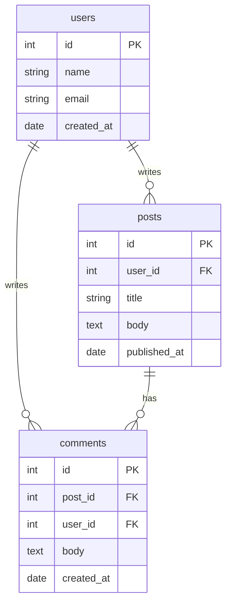
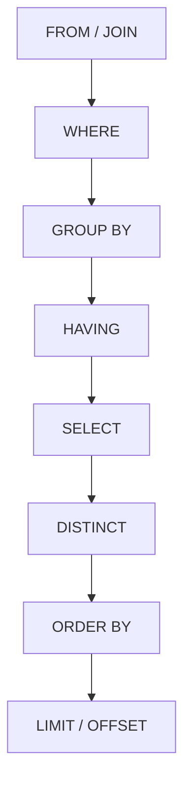
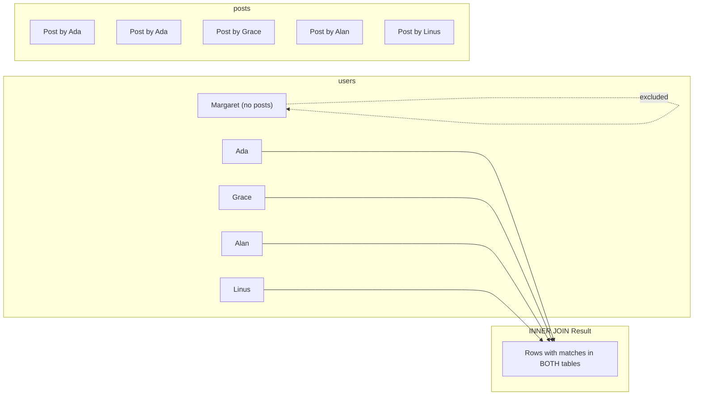
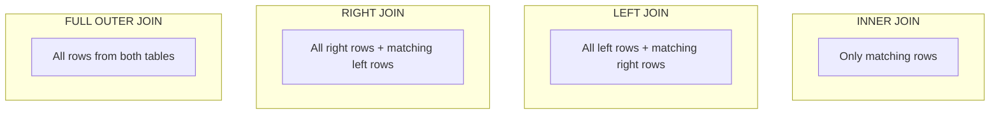
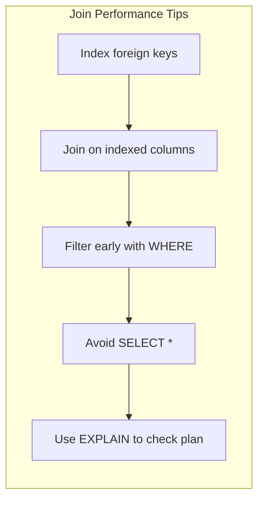
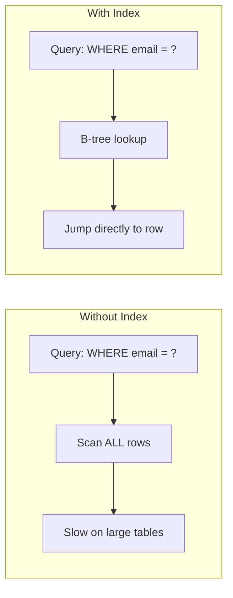
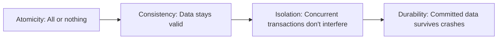
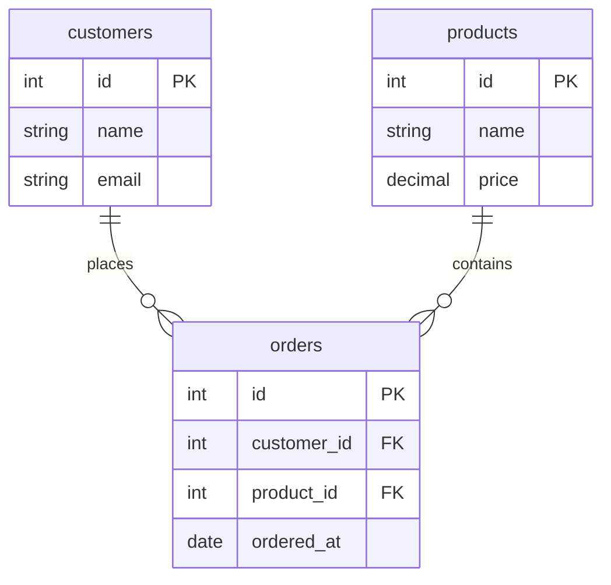

# SQL: A Complete Guide

SQL (Structured Query Language) is the standard language for working with relational databases. Whether you use PostgreSQL, MySQL, SQLite, MariaDB, or SQL Server -- the core SQL syntax is the same. This guide covers everything from basic queries to database design.

## What is a relational database?

A relational database stores data in **tables** (also called relations). Each table has **columns** (attributes) and **rows** (records). Tables are related to each other through **keys**.



Key concepts:

| Term | Meaning |
|------|---------|
| **Table** | A collection of related data organized in rows and columns |
| **Row** (record) | One entry in a table |
| **Column** (field) | One attribute of a record |
| **Primary key (PK)** | A column (or set of columns) that uniquely identifies each row |
| **Foreign key (FK)** | A column that references a primary key in another table |
| **Schema** | The structure of the database -- all tables, columns, types, and relationships |

## Setting up a practice database

Any of these work for following along:

- **SQLite** -- zero installation, file-based: `sqlite3 practice.db`
- **PostgreSQL** -- production-grade, most feature-rich
- **MySQL / MariaDB** -- widely used in web applications
- **DB Fiddle** ([db-fiddle.com](https://www.db-fiddle.com/)) -- browser-based, nothing to install

This guide uses standard SQL that works across all databases. Where syntax differs, it is noted.

## Creating tables

### `CREATE TABLE`

```sql
CREATE TABLE users (
    id        INTEGER PRIMARY KEY,
    name      TEXT NOT NULL,
    email     TEXT NOT NULL UNIQUE,
    age       INTEGER,
    active    BOOLEAN DEFAULT TRUE,
    created_at TIMESTAMP DEFAULT CURRENT_TIMESTAMP
);
```

### Common data types

| Type | Description | Example |
|------|-------------|---------|
| `INTEGER` / `INT` | Whole numbers | `42` |
| `BIGINT` | Large integers | `9000000000` |
| `REAL` / `FLOAT` | Floating-point | `3.14` |
| `NUMERIC(p,s)` / `DECIMAL` | Fixed-precision | `99.99` |
| `TEXT` / `VARCHAR(n)` | Variable-length string | `'hello'` |
| `CHAR(n)` | Fixed-length string | `'US'` |
| `BOOLEAN` | True/false | `TRUE` |
| `DATE` | Date only | `'2025-01-15'` |
| `TIMESTAMP` | Date and time | `'2025-01-15 10:30:00'` |
| `BLOB` | Binary data | Images, files |

### Column constraints

| Constraint | Meaning |
|-----------|---------|
| `PRIMARY KEY` | Unique identifier for each row |
| `NOT NULL` | Column cannot be empty |
| `UNIQUE` | No duplicate values |
| `DEFAULT value` | Value used when none is provided |
| `CHECK (condition)` | Value must satisfy a condition |
| `REFERENCES table(col)` | Foreign key to another table |

### Creating related tables

```sql
CREATE TABLE posts (
    id          INTEGER PRIMARY KEY,
    user_id     INTEGER NOT NULL REFERENCES users(id),
    title       TEXT NOT NULL,
    body        TEXT,
    published   BOOLEAN DEFAULT FALSE,
    created_at  TIMESTAMP DEFAULT CURRENT_TIMESTAMP
);

CREATE TABLE tags (
    id   INTEGER PRIMARY KEY,
    name TEXT NOT NULL UNIQUE
);

-- Junction table for many-to-many relationship
CREATE TABLE post_tags (
    post_id INTEGER NOT NULL REFERENCES posts(id),
    tag_id  INTEGER NOT NULL REFERENCES tags(id),
    PRIMARY KEY (post_id, tag_id)
);
```

## Inserting data

### `INSERT INTO`

```sql
-- Single row
INSERT INTO users (name, email, age)
VALUES ('Ada Lovelace', 'ada@example.com', 36);

-- Multiple rows
INSERT INTO users (name, email, age) VALUES
    ('Grace Hopper', 'grace@example.com', 85),
    ('Alan Turing', 'alan@example.com', 41),
    ('Linus Torvalds', 'linus@example.com', 54),
    ('Margaret Hamilton', 'margaret@example.com', 88);
```

Insert posts:

```sql
INSERT INTO posts (user_id, title, body, published) VALUES
    (1, 'Introduction to SQL', 'SQL is the language of databases...', TRUE),
    (1, 'Advanced Joins', 'Understanding join types...', TRUE),
    (2, 'COBOL to SQL', 'Migrating legacy systems...', TRUE),
    (3, 'Turing Machines', 'A theoretical framework...', FALSE),
    (4, 'Linux Kernel Design', 'How the kernel handles...', TRUE);
```

## Querying data

### `SELECT` basics

```sql
-- All columns
SELECT * FROM users;

-- Specific columns
SELECT name, email FROM users;

-- With an alias
SELECT name AS user_name, email AS contact FROM users;
```

Result:
```text
user_name          | contact
-------------------+------------------------
Ada Lovelace       | ada@example.com
Grace Hopper       | grace@example.com
Alan Turing        | alan@example.com
Linus Torvalds     | linus@example.com
Margaret Hamilton  | margaret@example.com
```

### `WHERE` -- filtering rows

```sql
-- Equality
SELECT * FROM users WHERE name = 'Ada Lovelace';

-- Comparison
SELECT * FROM users WHERE age > 50;

-- Multiple conditions
SELECT * FROM users WHERE age > 30 AND active = TRUE;

-- OR
SELECT * FROM users WHERE name = 'Ada Lovelace' OR name = 'Alan Turing';

-- NOT
SELECT * FROM users WHERE NOT active;

-- NULL checks (never use = NULL)
SELECT * FROM users WHERE age IS NULL;
SELECT * FROM users WHERE age IS NOT NULL;

-- Pattern matching
SELECT * FROM users WHERE email LIKE '%example.com';
SELECT * FROM users WHERE name LIKE 'A%'; -- starts with A

-- Range
SELECT * FROM users WHERE age BETWEEN 30 AND 60;

-- List membership
SELECT * FROM users WHERE name IN ('Ada Lovelace', 'Alan Turing', 'Grace Hopper');
```

### `ORDER BY` -- sorting

```sql
-- Ascending (default)
SELECT * FROM users ORDER BY name;

-- Descending
SELECT * FROM users ORDER BY age DESC;

-- Multiple columns
SELECT * FROM users ORDER BY active DESC, name ASC;
```

### `LIMIT` and `OFFSET` -- pagination

```sql
-- First 3 rows
SELECT * FROM users ORDER BY id LIMIT 3;

-- Skip 2, then take 3 (page 2 of size 3)
SELECT * FROM users ORDER BY id LIMIT 3 OFFSET 2;
```

**Note:** In SQL Server, use `TOP` or `FETCH FIRST` instead of `LIMIT`.

### `DISTINCT` -- unique values

```sql
SELECT DISTINCT active FROM users;
```

## Updating data

### `UPDATE`

```sql
-- Update one row
UPDATE users SET age = 37 WHERE name = 'Ada Lovelace';

-- Update multiple columns
UPDATE users SET age = 86, active = FALSE WHERE name = 'Grace Hopper';

-- Update multiple rows
UPDATE users SET active = TRUE WHERE age < 60;
```

**Always use `WHERE`** with `UPDATE`. Without it, every row in the table is updated.

## Deleting data

### `DELETE`

```sql
-- Delete specific rows
DELETE FROM users WHERE name = 'Alan Turing';

-- Delete all rows (use with extreme caution)
DELETE FROM users;
```

**Always use `WHERE`** with `DELETE`. Without it, every row is deleted.

### `TRUNCATE` -- faster bulk delete

```sql
-- Removes all rows, resets auto-increment (not available in SQLite)
TRUNCATE TABLE users;
```

## Aggregate functions

Aggregate functions compute a value across multiple rows:

```sql
SELECT COUNT(*) AS total_users FROM users;
SELECT COUNT(*) AS active_users FROM users WHERE active = TRUE;
SELECT AVG(age) AS average_age FROM users;
SELECT SUM(age) AS total_age FROM users;
SELECT MIN(age) AS youngest FROM users;
SELECT MAX(age) AS oldest FROM users;
```

Result:
```text
total_users: 5
active_users: 4
average_age: 60.8
youngest: 36
oldest: 88
```

## `GROUP BY` -- aggregating groups

Group rows and compute aggregates per group:

```sql
SELECT active, COUNT(*) AS count
FROM users
GROUP BY active;
```

Result:
```text
active | count
-------+------
FALSE  | 1
TRUE   | 4
```

### `HAVING` -- filtering groups

`HAVING` filters groups after aggregation (like `WHERE` for groups):

```sql
-- Users who have published more than 1 post
SELECT user_id, COUNT(*) AS post_count
FROM posts
WHERE published = TRUE
GROUP BY user_id
HAVING COUNT(*) > 1;
```

### Query execution order

Understanding the order SQL processes clauses helps avoid mistakes:



This is why you cannot use a column alias from `SELECT` in `WHERE` -- `WHERE` runs before `SELECT`.

## Joins

Joins combine rows from two or more tables based on a related column. This is the core power of relational databases.

### Sample data for join examples

```sql
-- Users: Ada (id=1), Grace (id=2), Alan (id=3), Linus (id=4), Margaret (id=5)
-- Posts: Ada has 2 posts, Grace has 1, Alan has 1, Linus has 1, Margaret has 0
```

### `INNER JOIN` -- matching rows only

Returns rows where the join condition matches in **both** tables:



```sql
SELECT users.name, posts.title
FROM users
INNER JOIN posts ON users.id = posts.user_id;
```

Result:
```text
name           | title
---------------+-------------------------
Ada Lovelace   | Introduction to SQL
Ada Lovelace   | Advanced Joins
Grace Hopper   | COBOL to SQL
Alan Turing    | Turing Machines
Linus Torvalds | Linux Kernel Design
```

Margaret does not appear -- she has no posts. `INNER JOIN` only returns rows with matches in both tables.

### `LEFT JOIN` -- all rows from the left table

Returns all rows from the left table, with matching rows from the right table (or `NULL` if no match):

```sql
SELECT users.name, posts.title
FROM users
LEFT JOIN posts ON users.id = posts.user_id;
```

Result:
```text
name              | title
------------------+-------------------------
Ada Lovelace      | Introduction to SQL
Ada Lovelace      | Advanced Joins
Grace Hopper      | COBOL to SQL
Alan Turing       | Turing Machines
Linus Torvalds    | Linux Kernel Design
Margaret Hamilton | NULL
```

Margaret appears with `NULL` for the post title -- she has no posts, but `LEFT JOIN` includes her.

### `RIGHT JOIN` -- all rows from the right table

The mirror of `LEFT JOIN`. Returns all rows from the right table, with `NULL` where the left has no match:

```sql
SELECT users.name, posts.title
FROM users
RIGHT JOIN posts ON users.id = posts.user_id;
```

Not all databases support `RIGHT JOIN` (e.g., SQLite does not). You can always rewrite it as a `LEFT JOIN` by swapping the table order.

### `FULL OUTER JOIN` -- all rows from both tables

Returns all rows from both tables, with `NULL` where there is no match:

```sql
SELECT users.name, posts.title
FROM users
FULL OUTER JOIN posts ON users.id = posts.user_id;
```

### Join type visual summary



### `CROSS JOIN` -- every combination

Returns the Cartesian product -- every row from the left table paired with every row from the right:

```sql
SELECT users.name, tags.name AS tag
FROM users
CROSS JOIN tags;
```

If `users` has 5 rows and `tags` has 3 rows, the result has 15 rows. Rarely useful, but good to understand.

### Self join -- joining a table to itself

Useful when rows in the same table have a parent-child relationship:

```sql
CREATE TABLE employees (
    id         INTEGER PRIMARY KEY,
    name       TEXT NOT NULL,
    manager_id INTEGER REFERENCES employees(id)
);

INSERT INTO employees (id, name, manager_id) VALUES
    (1, 'Alice', NULL),
    (2, 'Bob', 1),
    (3, 'Charlie', 1),
    (4, 'Diana', 2);

-- Find each employee's manager
SELECT
    e.name AS employee,
    m.name AS manager
FROM employees e
LEFT JOIN employees m ON e.manager_id = m.id;
```

Result:
```text
employee | manager
---------+--------
Alice    | NULL
Bob      | Alice
Charlie  | Alice
Diana    | Bob
```

### Multiple joins

You can chain joins:

```sql
SELECT
    u.name AS author,
    p.title AS post,
    t.name AS tag
FROM posts p
INNER JOIN users u ON p.user_id = u.id
INNER JOIN post_tags pt ON p.id = pt.post_id
INNER JOIN tags t ON pt.tag_id = t.id
ORDER BY u.name, p.title;
```

### Join performance



## Subqueries

A subquery is a `SELECT` inside another query:

### In `WHERE`

```sql
-- Users who have published posts
SELECT name FROM users
WHERE id IN (
    SELECT user_id FROM posts WHERE published = TRUE
);
```

### Correlated subquery

A subquery that references the outer query:

```sql
-- Users with more than 1 post
SELECT name FROM users u
WHERE (
    SELECT COUNT(*) FROM posts p WHERE p.user_id = u.id
) > 1;
```

### In `SELECT` (scalar subquery)

```sql
SELECT
    name,
    (SELECT COUNT(*) FROM posts p WHERE p.user_id = u.id) AS post_count
FROM users u;
```

Result:
```text
name              | post_count
------------------+-----------
Ada Lovelace      | 2
Grace Hopper      | 1
Alan Turing       | 1
Linus Torvalds    | 1
Margaret Hamilton | 0
```

### In `FROM` (derived table)

```sql
SELECT author, post_count
FROM (
    SELECT u.name AS author, COUNT(p.id) AS post_count
    FROM users u
    LEFT JOIN posts p ON u.id = p.user_id
    GROUP BY u.name
) AS stats
WHERE post_count > 0
ORDER BY post_count DESC;
```

### `EXISTS`

Checks whether a subquery returns any rows (more efficient than `IN` for large datasets):

```sql
-- Users who have at least one published post
SELECT name FROM users u
WHERE EXISTS (
    SELECT 1 FROM posts p
    WHERE p.user_id = u.id AND p.published = TRUE
);
```

## Common Table Expressions (CTEs)

CTEs (`WITH` clause) make complex queries more readable by breaking them into named steps:

```sql
WITH post_counts AS (
    SELECT user_id, COUNT(*) AS cnt
    FROM posts
    WHERE published = TRUE
    GROUP BY user_id
),
active_authors AS (
    SELECT u.name, pc.cnt AS published_posts
    FROM users u
    INNER JOIN post_counts pc ON u.id = pc.user_id
    WHERE pc.cnt >= 1
)
SELECT * FROM active_authors ORDER BY published_posts DESC;
```

Result:
```text
name           | published_posts
---------------+----------------
Ada Lovelace   | 2
Grace Hopper   | 1
Linus Torvalds | 1
```

CTEs are essentially named subqueries. They make long queries significantly easier to read, test, and debug.

## Window functions

Window functions compute values across a set of rows related to the current row, without collapsing them into groups:

### `ROW_NUMBER` -- sequential numbering

```sql
SELECT
    name,
    age,
    ROW_NUMBER() OVER (ORDER BY age DESC) AS rank
FROM users;
```

Result:
```text
name              | age | rank
------------------+-----+-----
Margaret Hamilton | 88  | 1
Grace Hopper      | 85  | 2
Linus Torvalds    | 54  | 3
Alan Turing       | 41  | 4
Ada Lovelace      | 36  | 5
```

### `RANK` and `DENSE_RANK`

```sql
SELECT
    name,
    age,
    RANK() OVER (ORDER BY age DESC) AS rank,
    DENSE_RANK() OVER (ORDER BY age DESC) AS dense_rank
FROM users;
```

`RANK` skips numbers after ties; `DENSE_RANK` does not.

### `PARTITION BY` -- windowing within groups

```sql
SELECT
    u.name,
    p.title,
    p.created_at,
    ROW_NUMBER() OVER (PARTITION BY u.id ORDER BY p.created_at DESC) AS post_rank
FROM users u
INNER JOIN posts p ON u.id = p.user_id;
```

This numbers each user's posts from newest to oldest. You can then filter to get the latest post per user:

```sql
WITH ranked AS (
    SELECT
        u.name,
        p.title,
        ROW_NUMBER() OVER (PARTITION BY u.id ORDER BY p.created_at DESC) AS rn
    FROM users u
    INNER JOIN posts p ON u.id = p.user_id
)
SELECT name, title FROM ranked WHERE rn = 1;
```

### Running totals

```sql
SELECT
    name,
    age,
    SUM(age) OVER (ORDER BY id) AS running_total
FROM users;
```

## Modifying table structure

### `ALTER TABLE`

```sql
-- Add a column
ALTER TABLE users ADD COLUMN bio TEXT;

-- Rename a column (PostgreSQL)
ALTER TABLE users RENAME COLUMN bio TO biography;

-- Drop a column
ALTER TABLE users DROP COLUMN biography;

-- Add a constraint
ALTER TABLE users ADD CONSTRAINT unique_email UNIQUE (email);
```

### `DROP TABLE`

```sql
-- Delete a table and all its data
DROP TABLE IF EXISTS post_tags;
```

## Indexes

Indexes make queries faster by creating a data structure (usually a B-tree) that lets the database find rows without scanning the entire table.



### Creating indexes

```sql
-- Single column
CREATE INDEX idx_users_email ON users(email);

-- Multi-column (composite)
CREATE INDEX idx_posts_user_published ON posts(user_id, published);

-- Unique index (enforces uniqueness)
CREATE UNIQUE INDEX idx_users_email_unique ON users(email);
```

### When to create indexes

| Index on | When |
|----------|------|
| Primary keys | Automatic -- every PK is indexed |
| Foreign keys | Always -- speeds up joins |
| Columns in `WHERE` | If queried frequently |
| Columns in `ORDER BY` | If sorted frequently |
| Columns in `JOIN ON` | If joined frequently |

### When NOT to index

- Tables with very few rows (index overhead is not worth it)
- Columns that are rarely queried
- Columns with very low cardinality (e.g., a boolean with 50/50 distribution)
- Tables with heavy write loads (indexes slow down inserts/updates)

### `EXPLAIN` -- understanding query plans

```sql
EXPLAIN ANALYZE SELECT * FROM users WHERE email = 'ada@example.com';
```

This shows how the database executes the query -- whether it uses an index, a full table scan, and how long each step takes. Use it to diagnose slow queries.

## Transactions

A **transaction** groups multiple SQL statements into a single atomic operation -- either all succeed, or none do.

### ACID properties



| Property | Meaning |
|----------|---------|
| **Atomicity** | All statements in the transaction succeed, or all are rolled back |
| **Consistency** | The database moves from one valid state to another |
| **Isolation** | Concurrent transactions do not see each other's uncommitted changes |
| **Durability** | Once committed, data is permanent even after a crash |

### Using transactions

```sql
BEGIN;

UPDATE accounts SET balance = balance - 100 WHERE id = 1;
UPDATE accounts SET balance = balance + 100 WHERE id = 2;

-- If both succeed:
COMMIT;

-- If something goes wrong:
-- ROLLBACK;
```

Without a transaction, if the first `UPDATE` succeeds but the second fails, money disappears. With a transaction, both updates are rolled back on failure.

### Transaction example -- transferring money

```sql
BEGIN;

-- Check sender has enough funds
SELECT balance FROM accounts WHERE id = 1;
-- Assume balance is 500

-- Debit sender
UPDATE accounts SET balance = balance - 200 WHERE id = 1;

-- Credit receiver
UPDATE accounts SET balance = balance + 200 WHERE id = 2;

-- All good
COMMIT;
```

## Views

A **view** is a saved query that acts like a virtual table:

```sql
CREATE VIEW published_posts AS
SELECT
    u.name AS author,
    p.title,
    p.created_at
FROM posts p
INNER JOIN users u ON p.user_id = u.id
WHERE p.published = TRUE;
```

Now you can query it like a table:

```sql
SELECT * FROM published_posts ORDER BY created_at DESC;
```

Views:
- Simplify complex queries by giving them a name
- Provide a layer of abstraction over the underlying tables
- Do not store data themselves (they execute the query each time)

## Database design principles

### Normalization

Normalization reduces data duplication by organizing data into separate, related tables.

**Before normalization (denormalized):**

```text
| order_id | customer_name | customer_email  | product | price |
|----------|--------------|-----------------|---------|-------|
| 1        | Ada          | ada@example.com | Laptop  | 999   |
| 2        | Ada          | ada@example.com | Mouse   | 29    |
| 3        | Bob          | bob@example.com | Laptop  | 999   |
```

Problem: Ada's name and email are repeated. If her email changes, you must update every row.

**After normalization:**



```sql
CREATE TABLE customers (
    id    INTEGER PRIMARY KEY,
    name  TEXT NOT NULL,
    email TEXT NOT NULL UNIQUE
);

CREATE TABLE products (
    id    INTEGER PRIMARY KEY,
    name  TEXT NOT NULL,
    price DECIMAL(10,2) NOT NULL
);

CREATE TABLE orders (
    id          INTEGER PRIMARY KEY,
    customer_id INTEGER NOT NULL REFERENCES customers(id),
    product_id  INTEGER NOT NULL REFERENCES products(id),
    ordered_at  TIMESTAMP DEFAULT CURRENT_TIMESTAMP
);
```

Now Ada's email is stored once. Orders reference customers and products by ID.

### Relationship types

| Type | Example | Implementation |
|------|---------|---------------|
| **One-to-many** | One user has many posts | FK on the "many" side (`posts.user_id`) |
| **Many-to-many** | Posts have many tags, tags have many posts | Junction table (`post_tags`) |
| **One-to-one** | One user has one profile | FK with UNIQUE constraint, or same PK |

### Primary key strategies

| Strategy | Example | Pros | Cons |
|----------|---------|------|------|
| Auto-increment `INTEGER` | `1, 2, 3, ...` | Simple, small, fast | Predictable, gaps on delete |
| UUID | `a1b2c3d4-...` | Globally unique, no collisions | Larger, slower index |
| ULID | `01ARZ3...` | Sortable, unique | Less common |

For most applications, auto-increment integers are fine. Use UUIDs when you need globally unique IDs (distributed systems, public-facing IDs).

## Practical patterns

### Soft deletes

Instead of deleting rows, mark them as deleted:

```sql
ALTER TABLE users ADD COLUMN deleted_at TIMESTAMP;

-- "Delete" a user
UPDATE users SET deleted_at = CURRENT_TIMESTAMP WHERE id = 3;

-- Query only active users
SELECT * FROM users WHERE deleted_at IS NULL;
```

### Timestamps

Always track when rows are created and updated:

```sql
CREATE TABLE articles (
    id         INTEGER PRIMARY KEY,
    title      TEXT NOT NULL,
    body       TEXT,
    created_at TIMESTAMP DEFAULT CURRENT_TIMESTAMP,
    updated_at TIMESTAMP DEFAULT CURRENT_TIMESTAMP
);
```

### Pagination

```sql
-- Offset-based (simple but slow for large offsets)
SELECT * FROM posts ORDER BY created_at DESC LIMIT 20 OFFSET 40;

-- Cursor-based (fast for large datasets)
SELECT * FROM posts
WHERE created_at < '2025-01-10 00:00:00'
ORDER BY created_at DESC
LIMIT 20;
```

### Full-text search (PostgreSQL)

```sql
-- Create a text search index
CREATE INDEX idx_posts_search ON posts USING GIN (to_tsvector('english', title || ' ' || body));

-- Search
SELECT title FROM posts
WHERE to_tsvector('english', title || ' ' || body) @@ to_tsquery('english', 'SQL & joins');
```

### Upsert (INSERT or UPDATE)

```sql
-- PostgreSQL
INSERT INTO users (email, name) VALUES ('ada@example.com', 'Ada L.')
ON CONFLICT (email) DO UPDATE SET name = EXCLUDED.name;

-- MySQL
INSERT INTO users (email, name) VALUES ('ada@example.com', 'Ada L.')
ON DUPLICATE KEY UPDATE name = VALUES(name);

-- SQLite
INSERT OR REPLACE INTO users (email, name) VALUES ('ada@example.com', 'Ada L.');
```

## String functions

```sql
SELECT
    UPPER('hello'),              -- HELLO
    LOWER('HELLO'),              -- hello
    LENGTH('hello'),             -- 5
    TRIM('  hello  '),           -- hello
    SUBSTRING('hello' FROM 2 FOR 3), -- ell (PostgreSQL)
    REPLACE('hello', 'l', 'r'), -- herro
    CONCAT('hello', ' ', 'world'); -- hello world
```

## Date functions

```sql
-- Current date/time
SELECT CURRENT_DATE, CURRENT_TIMESTAMP;

-- Extract parts (PostgreSQL)
SELECT EXTRACT(YEAR FROM created_at) AS year FROM posts;
SELECT EXTRACT(MONTH FROM created_at) AS month FROM posts;

-- Date arithmetic (PostgreSQL)
SELECT created_at + INTERVAL '7 days' AS next_week FROM posts;

-- Group by month
SELECT
    DATE_TRUNC('month', created_at) AS month,
    COUNT(*) AS post_count
FROM posts
GROUP BY DATE_TRUNC('month', created_at)
ORDER BY month;
```

## `CASE` expressions

Conditional logic inside queries:

```sql
SELECT
    name,
    age,
    CASE
        WHEN age >= 80 THEN 'Senior'
        WHEN age >= 50 THEN 'Experienced'
        WHEN age >= 30 THEN 'Mid-career'
        ELSE 'Junior'
    END AS category
FROM users;
```

Result:
```text
name              | age | category
------------------+-----+------------
Ada Lovelace      | 36  | Mid-career
Grace Hopper      | 85  | Senior
Alan Turing       | 41  | Mid-career
Linus Torvalds    | 54  | Experienced
Margaret Hamilton | 88  | Senior
```

## `UNION` -- combining result sets

```sql
-- UNION removes duplicates
SELECT name FROM users WHERE age > 50
UNION
SELECT name FROM users WHERE active = TRUE;

-- UNION ALL keeps duplicates (faster)
SELECT name FROM users WHERE age > 50
UNION ALL
SELECT name FROM users WHERE active = TRUE;
```

## Security: SQL injection

**Never** build SQL queries by concatenating user input:

```text
-- DANGEROUS: SQL injection vulnerability
query = "SELECT * FROM users WHERE name = '" + userInput + "'"

-- If userInput is: ' OR '1'='1
-- The query becomes:
SELECT * FROM users WHERE name = '' OR '1'='1'
-- This returns ALL users
```

**Always use parameterized queries / prepared statements:**

```sql
-- Safe: parameterized query (syntax depends on your language/driver)
-- Java:    PreparedStatement: "SELECT * FROM users WHERE name = ?"
-- Python:  cursor.execute("SELECT * FROM users WHERE name = %s", (name,))
-- Node.js: db.query("SELECT * FROM users WHERE name = $1", [name])
```

## Quick reference

### Query template

```sql
SELECT columns
FROM table
JOIN other_table ON condition
WHERE filter
GROUP BY columns
HAVING group_filter
ORDER BY columns
LIMIT count OFFSET skip;
```

### CRUD operations

| Operation | SQL |
|-----------|-----|
| **C**reate | `INSERT INTO table (cols) VALUES (vals)` |
| **R**ead | `SELECT cols FROM table WHERE condition` |
| **U**pdate | `UPDATE table SET col = val WHERE condition` |
| **D**elete | `DELETE FROM table WHERE condition` |

### Join cheat sheet

| Join | Returns |
|------|---------|
| `INNER JOIN` | Only matching rows from both tables |
| `LEFT JOIN` | All left rows + matching right rows (NULL if no match) |
| `RIGHT JOIN` | All right rows + matching left rows (NULL if no match) |
| `FULL OUTER JOIN` | All rows from both tables (NULL where no match) |
| `CROSS JOIN` | Every combination of rows |

## Summary

- SQL is the standard language for relational databases -- learn it once, use it everywhere.
- **Tables** store data in rows and columns; **keys** link tables together.
- `SELECT`, `INSERT`, `UPDATE`, `DELETE` are the four core operations.
- **Joins** combine data from multiple tables -- `INNER JOIN` for matches, `LEFT JOIN` to include unmatched rows.
- **Aggregate functions** (`COUNT`, `SUM`, `AVG`) summarize data; `GROUP BY` groups rows before aggregating.
- **CTEs** (`WITH`) break complex queries into readable named steps.
- **Window functions** (`ROW_NUMBER`, `RANK`) compute values across rows without collapsing groups.
- **Indexes** speed up reads but slow down writes -- index foreign keys and frequently queried columns.
- **Transactions** guarantee atomicity -- all changes commit or all roll back.
- **Normalization** reduces duplication by splitting data into related tables.
- **Always use parameterized queries** to prevent SQL injection.
