# SQL: A Complete Guide

SQL (Structured Query Language) is the standard language for working with relational databases. Whether you use
PostgreSQL, MySQL, SQLite, MariaDB, or SQL Server -- the core SQL syntax is the same. This guide covers everything from
basic queries to database design.

## Before you start -- the very basics

This section covers the foundational concepts behind databases and SQL. If you already know what tables, rows, and
queries are, skip ahead to [What is a relational database?](#what-is-a-relational-database).

### What is a database?

A **database** is an organized collection of data stored electronically and managed by software called a **database
management system** (DBMS). You interact with the DBMS -- not with the raw files on disk.

Without a database, you might store data in text files or spreadsheets. That works for small amounts of data, but it
breaks down quickly:

- How do you prevent two people from editing the same record at the same time?
- How do you enforce that every order has a valid customer?
- How do you efficiently search through millions of rows?

Databases solve all of these problems. They come in two broad families:

| Family                      | Also called | Examples                          | Data model              |
|-----------------------------|-------------|-----------------------------------|-------------------------|
| **Relational databases**    | SQL         | PostgreSQL, MySQL, SQLite, Oracle | Tables with rows/columns |
| **Non-relational databases** | NoSQL       | MongoDB, Redis, Cassandra         | Documents, key-value, graphs |

This guide focuses entirely on **relational databases** and the SQL language used to interact with them.

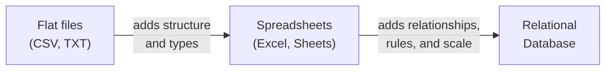
```mermaid
flowchart LR
    A["Flat files<br/>(CSV, TXT)"] -->|"adds structure<br/>and types"| B["Spreadsheets<br/>(Excel, Sheets)"]
    B -->|"adds relationships,<br/>rules, and scale"| C["Relational<br/>Database"]
```

### Why use a relational database?

| Concern              | Spreadsheet                          | Relational database                             |
|----------------------|--------------------------------------|-------------------------------------------------|
| **Data integrity**   | No enforcement -- any cell can hold anything | Strict types, constraints, and foreign keys     |
| **Relationships**    | Manual cross-referencing between sheets | Built-in joins across tables                    |
| **Concurrent access** | Conflicts when multiple users edit   | Transactions guarantee consistency              |
| **Querying**         | Filters and formulas, limited        | Full SQL -- aggregation, joins, subqueries      |
| **Scalability**      | Slows at thousands of rows           | Handles millions to billions of rows            |

### What is SQL?

SQL stands for **Structured Query Language**. It is pronounced either "S-Q-L" (letter by letter) or "sequel" -- both
are common.

SQL is a **declarative** language. You describe **what** data you want, not **how** to get it. The database engine
figures out the most efficient way to retrieve or modify the data. This is different from imperative languages like
Java or Python, where you write step-by-step instructions.

SQL commands fall into four categories:

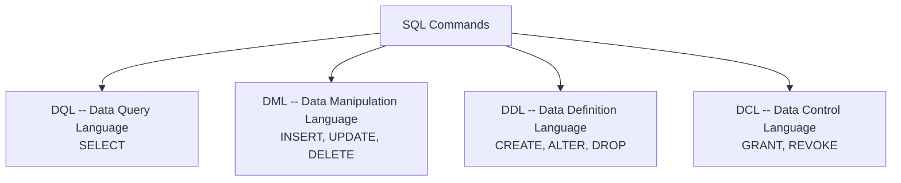
```mermaid
flowchart TD
    SQL["SQL Commands"]
    SQL --> DQL["DQL -- Data Query Language<br/>SELECT"]
    SQL --> DML["DML -- Data Manipulation Language<br/>INSERT, UPDATE, DELETE"]
    SQL --> DDL["DDL -- Data Definition Language<br/>CREATE, ALTER, DROP"]
    SQL --> DCL["DCL -- Data Control Language<br/>GRANT, REVOKE"]
```

| Category | Purpose                          | Key statements              |
|----------|----------------------------------|-----------------------------|
| **DQL**  | Read data                        | `SELECT`                    |
| **DML**  | Create, modify, or remove data   | `INSERT`, `UPDATE`, `DELETE` |
| **DDL**  | Define or change database structure | `CREATE`, `ALTER`, `DROP`  |
| **DCL**  | Control access permissions       | `GRANT`, `REVOKE`          |

### How a SQL query works -- a mental model

When you send a SQL query to the database, several things happen before you get results back:

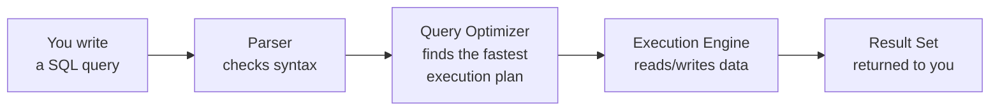
```mermaid
flowchart LR
    A["You write<br/>a SQL query"] --> B["Parser<br/>checks syntax"]
    B --> C["Query Optimizer<br/>finds the fastest<br/>execution plan"]
    C --> D["Execution Engine<br/>reads/writes data"]
    D --> E["Result Set<br/>returned to you"]
```

The **query optimizer** is the reason SQL is powerful. You write `SELECT name FROM users WHERE age > 30` and the
database decides whether to scan the whole table, use an index, or combine multiple strategies -- whichever is fastest.

### Anatomy of a table

A table is the fundamental structure in a relational database. Here is a `users` table:

```text
                         Table: users
    ┌────────────────────────────────────────────────┐
    │  id (PK)  │  name           │  email           │
    ├───────────┼─────────────────┼──────────────────┤
    │  1        │  Ada Lovelace   │  ada@example.com │  ← row (record)
    │  2        │  Grace Hopper   │  grace@example.com│
    │  3        │  Alan Turing    │  alan@example.com │
    └────────────────────────────────────────────────┘
         ↑              ↑                 ↑
      column         column            column
    (integer)       (text)             (text)
```

- **Table** -- a named collection of data about one type of thing (users, orders, products).
- **Column** -- a single attribute. Every column has a **name** and a **data type** (integer, text, date). The database
  rejects data that does not match the type.
- **Row** -- one record. Each row contains one value per column.
- **Primary key (PK)** -- a column (or set of columns) that uniquely identifies each row. No two rows can share the
  same primary key value.

### Reading your first query

Before diving into the full guide, read through this single query line by line:

```sql
SELECT name, email
FROM users
WHERE active = TRUE
ORDER BY name;
```

1. **`SELECT name, email`** -- pick the columns you want in the result. You do not have to retrieve every column.
2. **`FROM users`** -- specify which table to read from.
3. **`WHERE active = TRUE`** -- filter: only include rows where the `active` column is `TRUE`.
4. **`ORDER BY name`** -- sort the results alphabetically by the `name` column.

The result is a new table containing only the `name` and `email` columns of active users, sorted by name. You described
*what* you wanted. The database figured out *how* to get it.

---

## What is a relational database?

A relational database stores data in **tables** (also called relations). Each table has **columns** (attributes) and
**rows** (records). Tables are related to each other through **keys**.

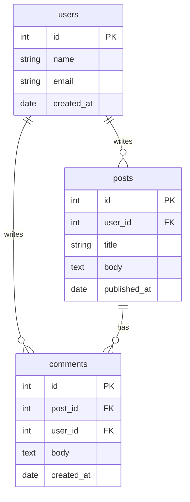
```mermaid
erDiagram
    users {
        int id PK
        string name
        string email
        date created_at
    }
    posts {
        int id PK
        int user_id FK
        string title
        text body
        date published_at
    }
    comments {
        int id PK
        int post_id FK
        int user_id FK
        text body
        date created_at
    }
    users ||--o{ posts : writes
    users ||--o{ comments : writes
    posts ||--o{ comments : has
```

Key concepts:

| Term                 | Meaning                                                                        |
|----------------------|--------------------------------------------------------------------------------|
| **Table**            | A collection of related data organized in rows and columns                     |
| **Row** (record)     | One entry in a table                                                           |
| **Column** (field)   | One attribute of a record                                                      |
| **Primary key (PK)** | A column (or set of columns) that uniquely identifies each row                 |
| **Foreign key (FK)** | A column that references a primary key in another table                        |
| **Schema**           | The structure of the database -- all tables, columns, types, and relationships |

## Setting up a practice database

Any of these work for following along:

- **SQLite** -- zero installation, file-based: `sqlite3 practice.db`
- **PostgreSQL** -- production-grade, most feature-rich
- **MySQL / MariaDB** -- widely used in web applications
- **DB Fiddle** ([db-fiddle.com](https://www.db-fiddle.com/)) -- browser-based, nothing to install

This guide uses standard SQL that works across all databases. Where syntax differs, it is noted.

## Creating tables

### `CREATE TABLE`

```sql
CREATE TABLE users (
    id        INTEGER PRIMARY KEY,
    name      TEXT NOT NULL,
    email     TEXT NOT NULL UNIQUE,
    age       INTEGER,
    active    BOOLEAN DEFAULT TRUE,
    created_at TIMESTAMP DEFAULT CURRENT_TIMESTAMP
);
```

### Common data types

| Type                       | Description            | Example                 |
|----------------------------|------------------------|-------------------------|
| `INTEGER` / `INT`          | Whole numbers          | `42`                    |
| `BIGINT`                   | Large integers         | `9000000000`            |
| `REAL` / `FLOAT`           | Floating-point         | `3.14`                  |
| `NUMERIC(p,s)` / `DECIMAL` | Fixed-precision        | `99.99`                 |
| `TEXT` / `VARCHAR(n)`      | Variable-length string | `'hello'`               |
| `CHAR(n)`                  | Fixed-length string    | `'US'`                  |
| `BOOLEAN`                  | True/false             | `TRUE`                  |
| `DATE`                     | Date only              | `'2025-01-15'`          |
| `TIMESTAMP`                | Date and time          | `'2025-01-15 10:30:00'` |
| `BLOB`                     | Binary data            | Images, files           |

**Note on `BOOLEAN`:** Not all databases have a native boolean type. MySQL stores `BOOLEAN` as `TINYINT(1)` (0 or 1),
SQL Server uses `BIT`, and SQLite stores booleans as plain integers. Standard SQL uses `TRUE` and `FALSE`, but the
underlying storage varies.

### Column constraints

| Constraint              | Meaning                          |
|-------------------------|----------------------------------|
| `PRIMARY KEY`           | Unique identifier for each row   |
| `NOT NULL`              | Column cannot be empty           |
| `UNIQUE`                | No duplicate values              |
| `DEFAULT value`         | Value used when none is provided |
| `CHECK (condition)`     | Value must satisfy a condition   |
| `REFERENCES table(col)` | Foreign key to another table     |

### Creating related tables

```sql
CREATE TABLE posts (
    id          INTEGER PRIMARY KEY,
    user_id     INTEGER NOT NULL REFERENCES users(id),
    title       TEXT NOT NULL,
    body        TEXT,
    published   BOOLEAN DEFAULT FALSE,
    created_at  TIMESTAMP DEFAULT CURRENT_TIMESTAMP
);

CREATE TABLE tags (
    id   INTEGER PRIMARY KEY,
    name TEXT NOT NULL UNIQUE
);

-- Junction table for many-to-many relationship
CREATE TABLE post_tags (
    post_id INTEGER NOT NULL REFERENCES posts(id),
    tag_id  INTEGER NOT NULL REFERENCES tags(id),
    PRIMARY KEY (post_id, tag_id)
);
```

### Foreign key actions -- `ON DELETE` and `ON UPDATE`

When you define a foreign key, you can specify what happens when the referenced row is deleted or updated. Without an
explicit action, most databases default to `RESTRICT` -- the operation fails if dependent rows exist.

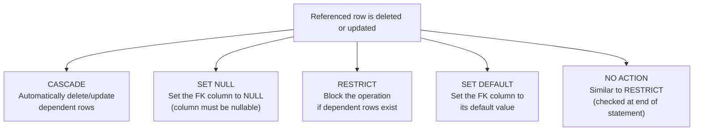
```mermaid
flowchart TD
    Q["Referenced row is deleted or updated"]
    Q --> CASCADE["CASCADE<br/>Automatically delete/update<br/>dependent rows"]
    Q --> SET_NULL["SET NULL<br/>Set the FK column to NULL<br/>(column must be nullable)"]
    Q --> RESTRICT["RESTRICT<br/>Block the operation<br/>if dependent rows exist"]
    Q --> SET_DEFAULT["SET DEFAULT<br/>Set the FK column to<br/>its default value"]
    Q --> NO_ACTION["NO ACTION<br/>Similar to RESTRICT<br/>(checked at end of statement)"]
```

| Action          | On DELETE                                | On UPDATE                                |
|-----------------|------------------------------------------|------------------------------------------|
| `CASCADE`       | Delete dependent rows                    | Update the FK value in dependent rows    |
| `SET NULL`      | Set FK to `NULL`                         | Set FK to `NULL`                         |
| `RESTRICT`      | Block the delete                         | Block the update                         |
| `SET DEFAULT`   | Set FK to its default value              | Set FK to its default value              |
| `NO ACTION`     | Same as `RESTRICT` (deferred checking)   | Same as `RESTRICT` (deferred checking)   |

```sql
-- Deleting a user also deletes their posts
CREATE TABLE posts (
    id      INTEGER PRIMARY KEY,
    user_id INTEGER NOT NULL REFERENCES users(id) ON DELETE CASCADE,
    title   TEXT NOT NULL,
    body    TEXT
);

-- Deleting a user keeps comments but sets user_id to NULL (anonymous)
CREATE TABLE comments (
    id      INTEGER PRIMARY KEY,
    user_id INTEGER REFERENCES users(id) ON DELETE SET NULL,
    post_id INTEGER NOT NULL REFERENCES posts(id) ON DELETE CASCADE,
    body    TEXT NOT NULL
);
```

Choose the action that matches your business logic. `CASCADE` is convenient but dangerous -- deleting one user could
remove thousands of related rows. `RESTRICT` is the safest default.

## Inserting data

### `INSERT INTO`

```sql
-- Single row
INSERT INTO users (id, name, email, age)
VALUES (1, 'Ada Lovelace', 'ada@example.com', 36);

-- Multiple rows
INSERT INTO users (id, name, email, age) VALUES
    (2, 'Grace Hopper', 'grace@example.com', 85),
    (3, 'Alan Turing', 'alan@example.com', 41),
    (4, 'Linus Torvalds', 'linus@example.com', 54),
    (5, 'Margaret Hamilton', 'margaret@example.com', 88);
```

Insert posts:

```sql
INSERT INTO posts (user_id, title, body, published) VALUES
    (1, 'Introduction to SQL', 'SQL is the language of databases...', TRUE),
    (1, 'Advanced Joins', 'Understanding join types...', TRUE),
    (2, 'COBOL to SQL', 'Migrating legacy systems...', TRUE),
    (3, 'Turing Machines', 'A theoretical framework...', FALSE),
    (4, 'Linux Kernel Design', 'How the kernel handles...', TRUE);
```

### `INSERT INTO ... SELECT` -- inserting from a query

You can insert rows by selecting from another table or query. This is useful for archiving, copying, or transforming
data:

```sql
-- Copy all published posts into an archive table
INSERT INTO archived_posts (user_id, title, body)
SELECT user_id, title, body
FROM posts
WHERE published = TRUE;

-- Create a summary table from aggregated data
INSERT INTO user_stats (user_id, post_count)
SELECT user_id, COUNT(*)
FROM posts
GROUP BY user_id;
```

## Querying data

### `SELECT` basics

```sql
-- All columns
SELECT * FROM users;

-- Specific columns
SELECT name, email FROM users;

-- With an alias
SELECT name AS user_name, email AS contact FROM users;
```

Result:

| user_name         | contact               |
|-------------------|-----------------------|
| Ada Lovelace      | ada@example.com       |
| Grace Hopper      | grace@example.com     |
| Alan Turing       | alan@example.com      |
| Linus Torvalds    | linus@example.com     |
| Margaret Hamilton | margaret@example.com  |

### `WHERE` -- filtering rows

```sql
-- Equality
SELECT * FROM users WHERE name = 'Ada Lovelace';

-- Comparison
SELECT * FROM users WHERE age > 50;
```

Result of `WHERE age > 50`:

| id | name              | email                | age | active |
|----|-------------------|----------------------|-----|--------|
| 2  | Grace Hopper      | grace@example.com    | 85  | TRUE   |
| 4  | Linus Torvalds    | linus@example.com    | 54  | TRUE   |
| 5  | Margaret Hamilton | margaret@example.com | 88  | TRUE   |

```sql
-- Multiple conditions
SELECT * FROM users WHERE age > 30 AND active = TRUE;

-- OR
SELECT * FROM users WHERE name = 'Ada Lovelace' OR name = 'Alan Turing';

-- NOT
SELECT * FROM users WHERE NOT active;

-- NULL checks (never use = NULL)
SELECT * FROM users WHERE age IS NULL;
SELECT * FROM users WHERE age IS NOT NULL;

-- Pattern matching
SELECT * FROM users WHERE email LIKE '%example.com';
SELECT * FROM users WHERE name LIKE 'A%'; -- starts with A
```

Result of `WHERE name LIKE 'A%'`:

| id | name         | email            | age | active |
|----|--------------|------------------|-----|--------|
| 1  | Ada Lovelace | ada@example.com  | 36  | TRUE   |
| 3  | Alan Turing  | alan@example.com | 41  | TRUE   |

```sql
-- Range
SELECT * FROM users WHERE age BETWEEN 30 AND 60;
```

Result:

| id | name           | email             | age | active |
|----|----------------|-------------------|-----|--------|
| 1  | Ada Lovelace   | ada@example.com   | 36  | TRUE   |
| 3  | Alan Turing    | alan@example.com  | 41  | TRUE   |
| 4  | Linus Torvalds | linus@example.com | 54  | TRUE   |

```sql
-- List membership
SELECT * FROM users WHERE name IN ('Ada Lovelace', 'Alan Turing', 'Grace Hopper');
```

### `ORDER BY` -- sorting

```sql
-- Ascending (default)
SELECT * FROM users ORDER BY name;

-- Descending
SELECT * FROM users ORDER BY age DESC;

-- Multiple columns
SELECT * FROM users ORDER BY active DESC, name ASC;
```

Result of `ORDER BY age DESC`:

| id | name              | email                | age | active |
|----|-------------------|----------------------|-----|--------|
| 5  | Margaret Hamilton | margaret@example.com | 88  | TRUE   |
| 2  | Grace Hopper      | grace@example.com    | 85  | TRUE   |
| 4  | Linus Torvalds    | linus@example.com    | 54  | TRUE   |
| 3  | Alan Turing       | alan@example.com     | 41  | TRUE   |
| 1  | Ada Lovelace      | ada@example.com      | 36  | TRUE   |

### `LIMIT` and `OFFSET` -- pagination

```sql
-- First 3 rows
SELECT * FROM users ORDER BY id LIMIT 3;

-- Skip 2, then take 3 (page 2 of size 3)
SELECT * FROM users ORDER BY id LIMIT 3 OFFSET 2;
```

Result of `LIMIT 3`:

| id | name         | email             | age | active |
|----|--------------|-------------------|-----|--------|
| 1  | Ada Lovelace | ada@example.com   | 36  | TRUE   |
| 2  | Grace Hopper | grace@example.com | 85  | TRUE   |
| 3  | Alan Turing  | alan@example.com  | 41  | TRUE   |

Result of `LIMIT 3 OFFSET 2`:

| id | name              | email                | age | active |
|----|-------------------|----------------------|-----|--------|
| 3  | Alan Turing       | alan@example.com     | 41  | TRUE   |
| 4  | Linus Torvalds    | linus@example.com    | 54  | TRUE   |
| 5  | Margaret Hamilton | margaret@example.com | 88  | TRUE   |

**Note:** In SQL Server, use `TOP` or `FETCH FIRST` instead of `LIMIT`.

### `DISTINCT` -- unique values

```sql
SELECT DISTINCT active FROM users;
```

Result:

| active |
|--------|
| TRUE   |
| FALSE  |

## Updating data

### `UPDATE`

```sql
-- Update one row
UPDATE users SET age = 37 WHERE name = 'Ada Lovelace';

-- Update multiple columns
UPDATE users SET age = 86, active = FALSE WHERE name = 'Grace Hopper';

-- Update multiple rows
UPDATE users SET active = TRUE WHERE age < 60;
```

**Always use `WHERE`** with `UPDATE`. Without it, every row in the table is updated.

## Deleting data

### `DELETE`

```sql
-- Delete specific rows
DELETE FROM users WHERE name = 'Alan Turing';

-- Delete all rows (use with extreme caution)
DELETE FROM users;
```

**Always use `WHERE`** with `DELETE`. Without it, every row is deleted.

### `TRUNCATE` -- faster bulk delete

```sql
-- Removes all rows, resets auto-increment (not available in SQLite)
TRUNCATE TABLE users;
```

`TRUNCATE` is **DDL** (Data Definition Language), not DML. This has important consequences:

- In most databases (MySQL, Oracle, SQL Server), `TRUNCATE` **cannot be rolled back** inside a transaction.
- PostgreSQL is the exception -- it supports transactional `TRUNCATE`.
- `TRUNCATE` resets auto-increment counters; `DELETE` does not.
- `TRUNCATE` does not fire row-level `DELETE` triggers.

## Aggregate functions

Aggregate functions compute a value across multiple rows:

```sql
SELECT COUNT(*) AS total_users FROM users;
SELECT COUNT(*) AS active_users FROM users WHERE active = TRUE;
SELECT AVG(age) AS average_age FROM users;
SELECT SUM(age) AS total_age FROM users;
SELECT MIN(age) AS youngest FROM users;
SELECT MAX(age) AS oldest FROM users;
```

Result:

| metric       | value |
|--------------|-------|
| total_users  | 5     |
| active_users | 4     |
| average_age  | 60.8  |
| youngest     | 36    |
| oldest       | 88    |

## `GROUP BY` -- aggregating groups

Group rows and compute aggregates per group:

```sql
SELECT active, COUNT(*) AS count
FROM users
GROUP BY active;
```

Result:

| active | count |
|--------|-------|
| FALSE  | 1     |
| TRUE   | 4     |

### `HAVING` -- filtering groups

`HAVING` filters groups after aggregation (like `WHERE` for groups):

```sql
-- Users who have published more than 1 post
SELECT user_id, COUNT(*) AS post_count
FROM posts
WHERE published = TRUE
GROUP BY user_id
HAVING COUNT(*) > 1;
```

Result:

| user_id | post_count |
|---------|------------|
| 1       | 2          |

Only Ada (user_id 1) has more than one published post.

### Query execution order

Understanding the order SQL processes clauses helps avoid mistakes:

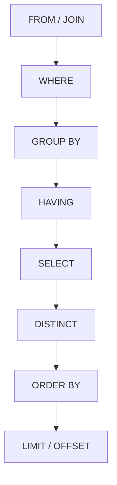
```mermaid
flowchart TD
    A["FROM / JOIN"] --> B["WHERE"]
    B --> C["GROUP BY"]
    C --> D["HAVING"]
    D --> E["SELECT"]
    E --> F["DISTINCT"]
    F --> G["ORDER BY"]
    G --> H["LIMIT / OFFSET"]
```

This is why you cannot use a column alias from `SELECT` in `WHERE` -- `WHERE` runs before `SELECT`.

## Joins

Joins combine rows from two or more tables based on a related column. This is the core power of relational databases.

### Sample data for join examples

```sql
-- Users: Ada (id=1), Grace (id=2), Alan (id=3), Linus (id=4), Margaret (id=5)
-- Posts: Ada has 2 posts, Grace has 1, Alan has 1, Linus has 1, Margaret has 0
```

### `INNER JOIN` -- matching rows only

Returns rows where the join condition matches in **both** tables:

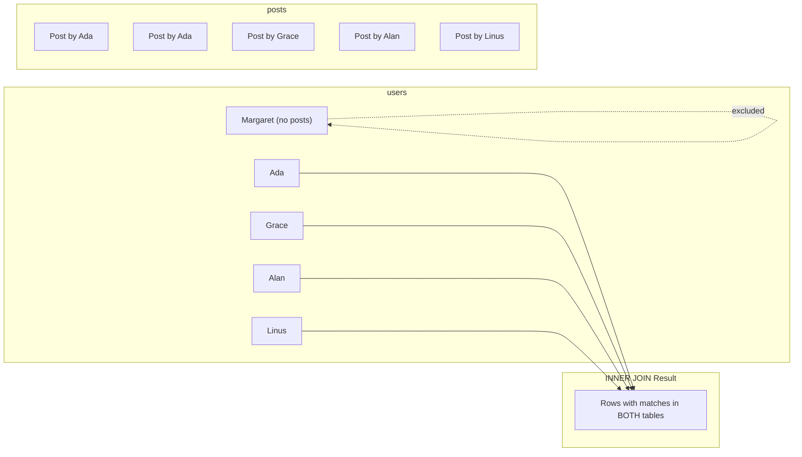
```mermaid
flowchart LR
    subgraph result [INNER JOIN Result]
        R1["Rows with matches in BOTH tables"]
    end
    subgraph left_tbl [users]
        L1[Ada]
        L2[Grace]
        L3[Alan]
        L4[Linus]
        L5["Margaret (no posts)"]
    end
    subgraph right_tbl [posts]
        R_1["Post by Ada"]
        R_2["Post by Ada"]
        R_3["Post by Grace"]
        R_4["Post by Alan"]
        R_5["Post by Linus"]
    end
    L1 --> R1
    L2 --> R1
    L3 --> R1
    L4 --> R1
    L5 -.->|excluded| L5
```

```sql
SELECT users.name, posts.title
FROM users
INNER JOIN posts ON users.id = posts.user_id;
```

Result:

| name           | title                |
|----------------|----------------------|
| Ada Lovelace   | Introduction to SQL  |
| Ada Lovelace   | Advanced Joins       |
| Grace Hopper   | COBOL to SQL         |
| Alan Turing    | Turing Machines      |
| Linus Torvalds | Linux Kernel Design  |

Margaret does not appear -- she has no posts. `INNER JOIN` only returns rows with matches in both tables.

### `LEFT JOIN` -- all rows from the left table

Returns all rows from the left table, with matching rows from the right table (or `NULL` if no match):

```sql
SELECT users.name, posts.title
FROM users
LEFT JOIN posts ON users.id = posts.user_id;
```

Result:

| name              | title                |
|-------------------|----------------------|
| Ada Lovelace      | Introduction to SQL  |
| Ada Lovelace      | Advanced Joins       |
| Grace Hopper      | COBOL to SQL         |
| Alan Turing       | Turing Machines      |
| Linus Torvalds    | Linux Kernel Design  |
| Margaret Hamilton | NULL                 |

Margaret appears with `NULL` for the post title -- she has no posts, but `LEFT JOIN` includes her.

### `RIGHT JOIN` -- all rows from the right table

The mirror of `LEFT JOIN`. Returns all rows from the right table, with `NULL` where the left has no match:

```sql
SELECT users.name, posts.title
FROM users
RIGHT JOIN posts ON users.id = posts.user_id;
```

Result (identical to `INNER JOIN` here because every post has a valid `user_id`):

| name           | title                |
|----------------|----------------------|
| Ada Lovelace   | Introduction to SQL  |
| Ada Lovelace   | Advanced Joins       |
| Grace Hopper   | COBOL to SQL         |
| Alan Turing    | Turing Machines      |
| Linus Torvalds | Linux Kernel Design  |

Not all databases support `RIGHT JOIN` (e.g., SQLite does not). You can always rewrite it as a `LEFT JOIN` by swapping
the table order.

### `FULL OUTER JOIN` -- all rows from both tables

Returns all rows from both tables, with `NULL` where there is no match:

```sql
SELECT users.name, posts.title
FROM users
FULL OUTER JOIN posts ON users.id = posts.user_id;
```

Result:

| name              | title                |
|-------------------|----------------------|
| Ada Lovelace      | Introduction to SQL  |
| Ada Lovelace      | Advanced Joins       |
| Grace Hopper      | COBOL to SQL         |
| Alan Turing       | Turing Machines      |
| Linus Torvalds    | Linux Kernel Design  |
| Margaret Hamilton | NULL                 |

In this dataset the result looks like `LEFT JOIN` because every post has a valid user. In practice, `FULL OUTER JOIN`
also shows orphaned right-side rows (e.g., posts with a deleted user would appear as `NULL | title`).

### Join type visual summary

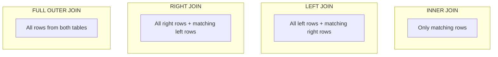
```mermaid
flowchart TB
    subgraph inner [INNER JOIN]
        I["Only matching rows"]
    end
    subgraph leftj [LEFT JOIN]
        L["All left rows + matching right rows"]
    end
    subgraph rightj [RIGHT JOIN]
        R["All right rows + matching left rows"]
    end
    subgraph fullj [FULL OUTER JOIN]
        F["All rows from both tables"]
    end
```

### `CROSS JOIN` -- every combination

Returns the Cartesian product -- every row from the left table paired with every row from the right:

```sql
SELECT users.name, tags.name AS tag
FROM users
CROSS JOIN tags;
```

If `users` has 5 rows and `tags` has 3 rows, the result has 15 rows. Example (assuming tags: sql, linux, theory):

| name         | tag    |
|--------------|--------|
| Ada Lovelace | sql    |
| Ada Lovelace | linux  |
| Ada Lovelace | theory |
| Grace Hopper | sql    |
| Grace Hopper | linux  |
| Grace Hopper | theory |
| ...          | ...    |

Rarely useful, but good to understand.

### Self join -- joining a table to itself

Useful when rows in the same table have a parent-child relationship:

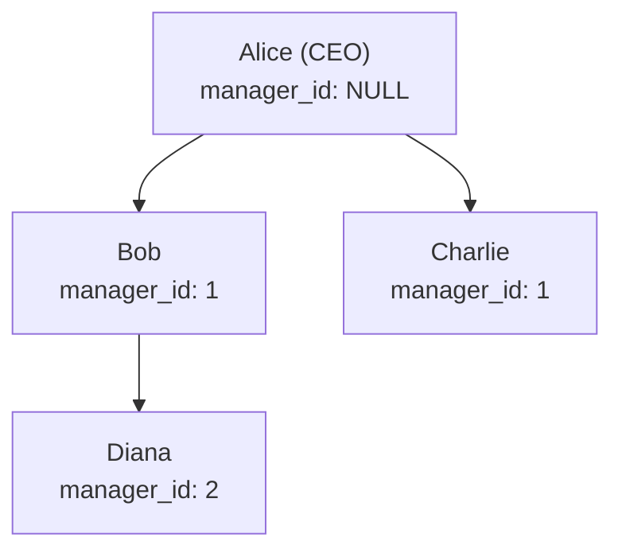
```mermaid
flowchart TD
    Alice["Alice (CEO)<br/>manager_id: NULL"]
    Bob["Bob<br/>manager_id: 1"]
    Charlie["Charlie<br/>manager_id: 1"]
    Diana["Diana<br/>manager_id: 2"]
    Alice --> Bob
    Alice --> Charlie
    Bob --> Diana
```

```sql
CREATE TABLE employees (
    id         INTEGER PRIMARY KEY,
    name       TEXT NOT NULL,
    manager_id INTEGER REFERENCES employees(id)
);

INSERT INTO employees (id, name, manager_id) VALUES
    (1, 'Alice', NULL),
    (2, 'Bob', 1),
    (3, 'Charlie', 1),
    (4, 'Diana', 2);

-- Find each employee's manager
SELECT
    e.name AS employee,
    m.name AS manager
FROM employees e
LEFT JOIN employees m ON e.manager_id = m.id;
```

Result:

| employee | manager |
|----------|---------|
| Alice    | NULL    |
| Bob      | Alice   |
| Charlie  | Alice   |
| Diana    | Bob     |

### Multiple joins

You can chain joins:

```sql
SELECT
    u.name AS author,
    p.title AS post,
    t.name AS tag
FROM posts p
INNER JOIN users u ON p.user_id = u.id
INNER JOIN post_tags pt ON p.id = pt.post_id
INNER JOIN tags t ON pt.tag_id = t.id
ORDER BY u.name, p.title;
```

Result (assuming tags have been assigned via the `post_tags` junction table):

| author         | post                | tag      |
|----------------|---------------------|----------|
| Ada Lovelace   | Advanced Joins      | sql      |
| Ada Lovelace   | Introduction to SQL | sql      |
| Ada Lovelace   | Introduction to SQL | database |
| Linus Torvalds | Linux Kernel Design | linux    |

### Join performance

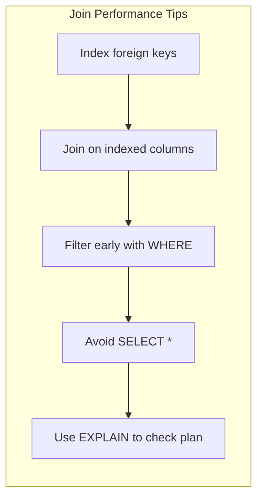
```mermaid
flowchart LR
    subgraph tips [Join Performance Tips]
        A["Index foreign keys"] --> B["Join on indexed columns"]
        B --> C["Filter early with WHERE"]
        C --> D["Avoid SELECT *"]
        D --> E["Use EXPLAIN to check plan"]
    end
```

## Subqueries

A subquery is a `SELECT` inside another query. Subqueries can appear in several places:

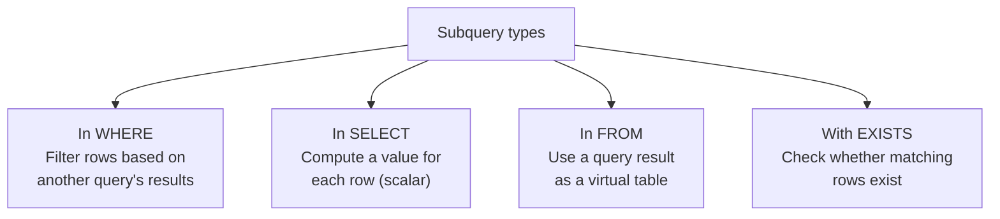
```mermaid
flowchart TD
    SQ["Subquery types"]
    SQ --> W["In WHERE<br/>Filter rows based on<br/>another query's results"]
    SQ --> S["In SELECT<br/>Compute a value for<br/>each row (scalar)"]
    SQ --> F["In FROM<br/>Use a query result<br/>as a virtual table"]
    SQ --> E["With EXISTS<br/>Check whether matching<br/>rows exist"]
```

### In `WHERE`

```sql
-- Users who have published posts
SELECT name FROM users
WHERE id IN (
    SELECT user_id FROM posts WHERE published = TRUE
);
```

Result:

| name           |
|----------------|
| Ada Lovelace   |
| Grace Hopper   |
| Linus Torvalds |

### Correlated subquery

A subquery that references the outer query:

```sql
-- Users with more than 1 post
SELECT name FROM users u
WHERE (
    SELECT COUNT(*) FROM posts p WHERE p.user_id = u.id
) > 1;
```

Result:

| name         |
|--------------|
| Ada Lovelace |

### In `SELECT` (scalar subquery)

```sql
SELECT
    name,
    (SELECT COUNT(*) FROM posts p WHERE p.user_id = u.id) AS post_count
FROM users u;
```

Result:

| name              | post_count |
|-------------------|------------|
| Ada Lovelace      | 2          |
| Grace Hopper      | 1          |
| Alan Turing       | 1          |
| Linus Torvalds    | 1          |
| Margaret Hamilton | 0          |

### In `FROM` (derived table)

```sql
SELECT author, post_count
FROM (
    SELECT u.name AS author, COUNT(p.id) AS post_count
    FROM users u
    LEFT JOIN posts p ON u.id = p.user_id
    GROUP BY u.name
) AS stats
WHERE post_count > 0
ORDER BY post_count DESC;
```

Result:

| author         | post_count |
|----------------|------------|
| Ada Lovelace   | 2          |
| Grace Hopper   | 1          |
| Alan Turing    | 1          |
| Linus Torvalds | 1          |

### `EXISTS`

Checks whether a subquery returns any rows (more efficient than `IN` for large datasets):

```sql
-- Users who have at least one published post
SELECT name FROM users u
WHERE EXISTS (
    SELECT 1 FROM posts p
    WHERE p.user_id = u.id AND p.published = TRUE
);
```

Result:

| name           |
|----------------|
| Ada Lovelace   |
| Grace Hopper   |
| Linus Torvalds |

### `NOT EXISTS` -- anti-join

The inverse of `EXISTS`. Finds rows that have **no** matching rows in the subquery. This is often called an anti-join:

```sql
-- Users who have NO published posts
SELECT name FROM users u
WHERE NOT EXISTS (
    SELECT 1 FROM posts p
    WHERE p.user_id = u.id AND p.published = TRUE
);
```

Result:

| name              |
|-------------------|
| Alan Turing       |
| Margaret Hamilton |

`NOT EXISTS` is generally more efficient than `NOT IN` for this type of query, especially when the subquery might
contain `NULL` values (which cause `NOT IN` to behave unexpectedly).

## Common Table Expressions (CTEs)

CTEs (`WITH` clause) make complex queries more readable by breaking them into named steps:

```sql
WITH post_counts AS (
    SELECT user_id, COUNT(*) AS cnt
    FROM posts
    WHERE published = TRUE
    GROUP BY user_id
),
active_authors AS (
    SELECT u.name, pc.cnt AS published_posts
    FROM users u
    INNER JOIN post_counts pc ON u.id = pc.user_id
    WHERE pc.cnt >= 1
)
SELECT * FROM active_authors ORDER BY published_posts DESC;
```

Result:

| name           | published_posts |
|----------------|-----------------|
| Ada Lovelace   | 2               |
| Grace Hopper   | 1               |
| Linus Torvalds | 1               |

CTEs are essentially named subqueries. They make long queries significantly easier to read, test, and debug.

## Window functions

Window functions compute values across a set of rows related to the current row, without collapsing them into groups:

### `ROW_NUMBER` -- sequential numbering

```sql
SELECT
    name,
    age,
    ROW_NUMBER() OVER (ORDER BY age DESC) AS rank
FROM users;
```

Result:

| name              | age | rank |
|-------------------|-----|------|
| Margaret Hamilton | 88  | 1    |
| Grace Hopper      | 85  | 2    |
| Linus Torvalds    | 54  | 3    |
| Alan Turing       | 41  | 4    |
| Ada Lovelace      | 36  | 5    |

### `RANK` and `DENSE_RANK`

```sql
SELECT
    name,
    age,
    RANK() OVER (ORDER BY age DESC) AS rank,
    DENSE_RANK() OVER (ORDER BY age DESC) AS dense_rank
FROM users;
```

Result (all ages are unique here, so `RANK` and `DENSE_RANK` are identical):

| name              | age | rank | dense_rank |
|-------------------|-----|------|------------|
| Margaret Hamilton | 88  | 1    | 1          |
| Grace Hopper      | 85  | 2    | 2          |
| Linus Torvalds    | 54  | 3    | 3          |
| Alan Turing       | 41  | 4    | 4          |
| Ada Lovelace      | 36  | 5    | 5          |

`RANK` skips numbers after ties; `DENSE_RANK` does not. For example, if two users shared age 85, `RANK` would assign
both rank 1, then skip to 3. `DENSE_RANK` would assign both rank 1, then continue with 2.

### `PARTITION BY` -- windowing within groups

```sql
SELECT
    u.name,
    p.title,
    p.created_at,
    ROW_NUMBER() OVER (PARTITION BY u.id ORDER BY p.created_at DESC) AS post_rank
FROM users u
INNER JOIN posts p ON u.id = p.user_id;
```

Result:

| name           | title               | created_at           | post_rank |
|----------------|---------------------|----------------------|-----------|
| Ada Lovelace   | Advanced Joins      | 2025-01-15 10:30:00  | 1         |
| Ada Lovelace   | Introduction to SQL | 2025-01-10 08:00:00  | 2         |
| Grace Hopper   | COBOL to SQL        | 2025-01-12 14:00:00  | 1         |
| Alan Turing    | Turing Machines     | 2025-01-11 09:00:00  | 1         |
| Linus Torvalds | Linux Kernel Design | 2025-01-14 16:00:00  | 1         |

This numbers each user's posts from newest to oldest. You can then filter to get the latest post per user:

```sql
WITH ranked AS (
    SELECT
        u.name,
        p.title,
        ROW_NUMBER() OVER (PARTITION BY u.id ORDER BY p.created_at DESC) AS rn
    FROM users u
    INNER JOIN posts p ON u.id = p.user_id
)
SELECT name, title FROM ranked WHERE rn = 1;
```

Result:

| name           | title                |
|----------------|----------------------|
| Ada Lovelace   | Advanced Joins       |
| Grace Hopper   | COBOL to SQL         |
| Alan Turing    | Turing Machines      |
| Linus Torvalds | Linux Kernel Design  |

### Running totals

```sql
SELECT
    name,
    age,
    SUM(age) OVER (ORDER BY id) AS running_total
FROM users;
```

Result:

| name              | age | running_total |
|-------------------|-----|---------------|
| Ada Lovelace      | 36  | 36            |
| Grace Hopper      | 85  | 121           |
| Alan Turing       | 41  | 162           |
| Linus Torvalds    | 54  | 216           |
| Margaret Hamilton | 88  | 304           |

### `LAG` and `LEAD` -- accessing adjacent rows

`LAG` looks at the **previous** row and `LEAD` looks at the **next** row in the window order. These are essential for
comparing a row to its neighbors:

```sql
SELECT
    name,
    age,
    LAG(age) OVER (ORDER BY age) AS prev_age,
    LEAD(age) OVER (ORDER BY age) AS next_age,
    age - LAG(age) OVER (ORDER BY age) AS gap_from_prev
FROM users;
```

Result:

| name              | age | prev_age | next_age | gap_from_prev |
|-------------------|-----|----------|----------|---------------|
| Ada Lovelace      | 36  | NULL     | 41       | NULL          |
| Alan Turing       | 41  | 36       | 54       | 5             |
| Linus Torvalds    | 54  | 41       | 85       | 13            |
| Grace Hopper      | 85  | 54       | 88       | 31            |
| Margaret Hamilton | 88  | 85       | NULL     | 3             |

`LAG` and `LEAD` accept an optional offset (default 1) and a default value:

```sql
-- Look 2 rows back, default to 0 if no row exists
LAG(age, 2, 0) OVER (ORDER BY age)
```

## Modifying table structure

### `ALTER TABLE`

```sql
-- Add a column
ALTER TABLE users ADD COLUMN bio TEXT;

-- Rename a column (PostgreSQL)
ALTER TABLE users RENAME COLUMN bio TO biography;

-- Drop a column
ALTER TABLE users DROP COLUMN biography;

-- Add a constraint
ALTER TABLE users ADD CONSTRAINT unique_email UNIQUE (email);
```

### `DROP TABLE`

```sql
-- Delete a table and all its data
DROP TABLE IF EXISTS post_tags;
```

## Indexes

Indexes make queries faster by creating a data structure (usually a B-tree) that lets the database find rows without
scanning the entire table.

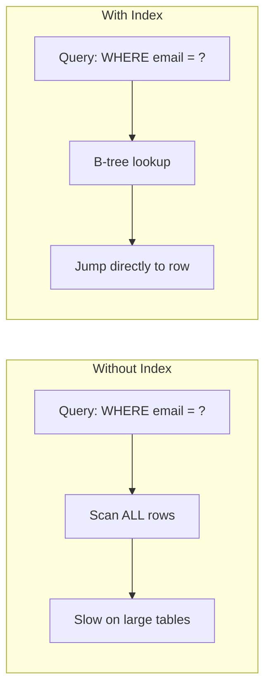
```mermaid
flowchart LR
    subgraph without [Without Index]
        A1["Query: WHERE email = ?"] --> A2["Scan ALL rows"]
        A2 --> A3["Slow on large tables"]
    end
    subgraph with_idx [With Index]
        B1["Query: WHERE email = ?"] --> B2["B-tree lookup"]
        B2 --> B3["Jump directly to row"]
    end
```

A **B-tree index** works like a sorted tree structure. Instead of scanning every row, the database navigates through a
few levels to find the exact row:

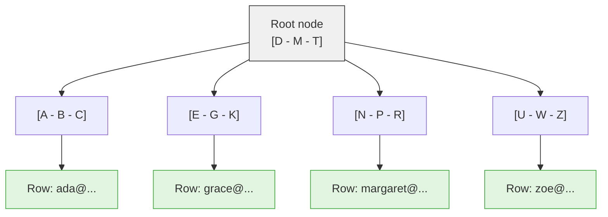
```mermaid
flowchart TD
    Root["Root node<br/>[D - M - T]"]
    Root --> L1["[A - B - C]"]
    Root --> L2["[E - G - K]"]
    Root --> L3["[N - P - R]"]
    Root --> L4["[U - W - Z]"]
    L1 --> R1["Row: ada@..."]
    L2 --> R2["Row: grace@..."]
    L3 --> R3["Row: margaret@..."]
    L4 --> R4["Row: zoe@..."]
    style Root fill:#f0f0f0,stroke:#333
    style R1 fill:#e1f5e1,stroke:#4a4
    style R2 fill:#e1f5e1,stroke:#4a4
    style R3 fill:#e1f5e1,stroke:#4a4
    style R4 fill:#e1f5e1,stroke:#4a4
```

With an index, looking up `email = 'grace@...'` takes 2-3 steps instead of scanning thousands of rows.

### Creating indexes

```sql
-- Single column
CREATE INDEX idx_users_email ON users(email);

-- Multi-column (composite)
CREATE INDEX idx_posts_user_published ON posts(user_id, published);

-- Unique index (enforces uniqueness)
CREATE UNIQUE INDEX idx_users_email_unique ON users(email);

-- Partial index (PostgreSQL) -- index only a subset of rows
-- Smaller and faster than indexing the entire table
CREATE INDEX idx_active_users_email ON users(email) WHERE active = TRUE;

-- Covering index -- includes extra columns to avoid table lookups
-- PostgreSQL uses INCLUDE, other databases vary
CREATE INDEX idx_posts_user ON posts(user_id) INCLUDE (title, created_at);
```

### When to create indexes

| Index on              | When                             |
|-----------------------|----------------------------------|
| Primary keys          | Automatic -- every PK is indexed |
| Foreign keys          | Always -- speeds up joins        |
| Columns in `WHERE`    | If queried frequently            |
| Columns in `ORDER BY` | If sorted frequently             |
| Columns in `JOIN ON`  | If joined frequently             |

### When NOT to index

- Tables with very few rows (index overhead is not worth it)
- Columns that are rarely queried
- Columns with very low cardinality (e.g., a boolean with 50/50 distribution)
- Tables with heavy write loads (indexes slow down inserts/updates)

### `EXPLAIN` -- understanding query plans

```sql
EXPLAIN ANALYZE SELECT * FROM users WHERE email = 'ada@example.com';
```

This shows how the database executes the query -- whether it uses an index, a full table scan, and how long each step
takes. Use it to diagnose slow queries.

## Transactions

A **transaction** groups multiple SQL statements into a single atomic operation -- either all succeed, or none do.

### ACID properties

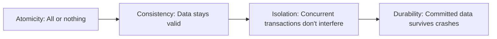
```mermaid
flowchart LR
    A["Atomicity: All or nothing"] --> C["Consistency: Data stays valid"]
    C --> I["Isolation: Concurrent transactions don't interfere"]
    I --> D["Durability: Committed data survives crashes"]
```

| Property        | Meaning                                                             |
|-----------------|---------------------------------------------------------------------|
| **Atomicity**   | All statements in the transaction succeed, or all are rolled back   |
| **Consistency** | The database moves from one valid state to another                  |
| **Isolation**   | Concurrent transactions do not see each other's uncommitted changes |
| **Durability**  | Once committed, data is permanent even after a crash                |

### Transaction lifecycle

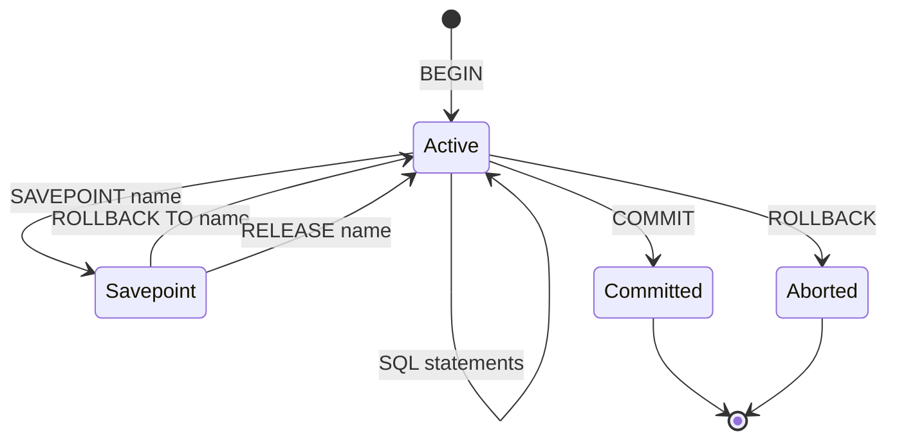
```mermaid
stateDiagram-v2
    [*] --> Active : BEGIN
    Active --> Active : SQL statements
    Active --> Savepoint : SAVEPOINT name
    Savepoint --> Active : ROLLBACK TO name
    Savepoint --> Active : RELEASE name
    Active --> Committed : COMMIT
    Active --> Aborted : ROLLBACK
    Committed --> [*]
    Aborted --> [*]
```

A transaction starts with `BEGIN` and ends with either `COMMIT` (save all changes) or `ROLLBACK` (discard all changes).
**Savepoints** allow partial rollbacks within a transaction -- useful for complex operations where you want to undo one
step without losing everything.

### Using transactions

```sql
BEGIN;

UPDATE accounts SET balance = balance - 100 WHERE id = 1;
UPDATE accounts SET balance = balance + 100 WHERE id = 2;

-- If both succeed:
COMMIT;

-- If something goes wrong:
-- ROLLBACK;
```

Without a transaction, if the first `UPDATE` succeeds but the second fails, money disappears. With a transaction, both
updates are rolled back on failure.

### Transaction example -- transferring money

```sql
BEGIN;

-- Check sender has enough funds
SELECT balance FROM accounts WHERE id = 1;
-- Assume balance is 500

-- Debit sender
UPDATE accounts SET balance = balance - 200 WHERE id = 1;

-- Credit receiver
UPDATE accounts SET balance = balance + 200 WHERE id = 2;

-- All good
COMMIT;
```

## Views

A **view** is a saved query that acts like a virtual table:

```sql
CREATE VIEW published_posts AS
SELECT
    u.name AS author,
    p.title,
    p.created_at
FROM posts p
INNER JOIN users u ON p.user_id = u.id
WHERE p.published = TRUE;
```

Now you can query it like a table:

```sql
SELECT * FROM published_posts ORDER BY created_at DESC;
```

Result:

| author         | title               | created_at           |
|----------------|---------------------|----------------------|
| Linus Torvalds | Linux Kernel Design | 2025-01-14 16:00:00  |
| Ada Lovelace   | Advanced Joins      | 2025-01-15 10:30:00  |
| Grace Hopper   | COBOL to SQL        | 2025-01-12 14:00:00  |
| Ada Lovelace   | Introduction to SQL | 2025-01-10 08:00:00  |

Views:

- Simplify complex queries by giving them a name
- Provide a layer of abstraction over the underlying tables
- Do not store data themselves (they execute the query each time)

## Database design principles

### Normalization

Normalization reduces data duplication by organizing data into separate, related tables. There are several levels
(normal forms), each building on the previous:

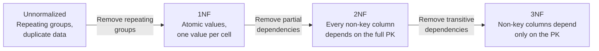
```mermaid
flowchart LR
    UNF["Unnormalized<br/>Repeating groups,<br/>duplicate data"] -->|"Remove repeating<br/>groups"| 1NF["1NF<br/>Atomic values,<br/>one value per cell"]
    1NF -->|"Remove partial<br/>dependencies"| 2NF["2NF<br/>Every non-key column<br/>depends on the full PK"]
    2NF -->|"Remove transitive<br/>dependencies"| 3NF["3NF<br/>Non-key columns depend<br/>only on the PK"]
```

| Normal form | Rule                                                                 | In plain terms                                          |
|-------------|----------------------------------------------------------------------|---------------------------------------------------------|
| **1NF**     | All columns contain atomic (single) values; no repeating groups      | One value per cell, no lists or nested tables            |
| **2NF**     | 1NF + every non-key column depends on the entire primary key         | No column depends on only *part* of a composite key      |
| **3NF**     | 2NF + no transitive dependencies between non-key columns            | Non-key columns describe the PK, not each other          |

For most applications, **3NF is sufficient**. Higher normal forms (BCNF, 4NF, 5NF) exist but are rarely needed in
practice.

**Before normalization (denormalized):**

```text
| order_id | customer_name | customer_email  | product | price |
|----------|--------------|-----------------|---------|-------|
| 1        | Ada          | ada@example.com | Laptop  | 999   |
| 2        | Ada          | ada@example.com | Mouse   | 29    |
| 3        | Bob          | bob@example.com | Laptop  | 999   |
```

Problem: Ada's name and email are repeated. If her email changes, you must update every row.

**After normalization:**

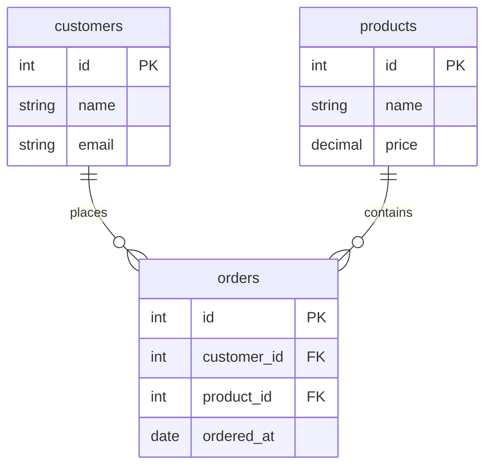
```mermaid
erDiagram
    customers {
        int id PK
        string name
        string email
    }
    products {
        int id PK
        string name
        decimal price
    }
    orders {
        int id PK
        int customer_id FK
        int product_id FK
        date ordered_at
    }
    customers ||--o{ orders : places
    products ||--o{ orders : contains
```

```sql
CREATE TABLE customers (
    id    INTEGER PRIMARY KEY,
    name  TEXT NOT NULL,
    email TEXT NOT NULL UNIQUE
);

CREATE TABLE products (
    id    INTEGER PRIMARY KEY,
    name  TEXT NOT NULL,
    price DECIMAL(10,2) NOT NULL
);

CREATE TABLE orders (
    id          INTEGER PRIMARY KEY,
    customer_id INTEGER NOT NULL REFERENCES customers(id),
    product_id  INTEGER NOT NULL REFERENCES products(id),
    ordered_at  TIMESTAMP DEFAULT CURRENT_TIMESTAMP
);
```

Now Ada's email is stored once. Orders reference customers and products by ID.

### Relationship types

| Type             | Example                                    | Implementation                          |
|------------------|--------------------------------------------|-----------------------------------------|
| **One-to-many**  | One user has many posts                    | FK on the "many" side (`posts.user_id`) |
| **Many-to-many** | Posts have many tags, tags have many posts | Junction table (`post_tags`)            |
| **One-to-one**   | One user has one profile                   | FK with UNIQUE constraint, or same PK   |

### Primary key strategies

| Strategy                 | Example        | Pros                           | Cons                        |
|--------------------------|----------------|--------------------------------|-----------------------------|
| Auto-increment `INTEGER` | `1, 2, 3, ...` | Simple, small, fast            | Predictable, gaps on delete |
| UUID                     | `a1b2c3d4-...` | Globally unique, no collisions | Larger, slower index        |
| ULID                     | `01ARZ3...`    | Sortable, unique               | Less common                 |

For most applications, auto-increment integers are fine. Use UUIDs when you need globally unique IDs (distributed
systems, public-facing IDs).

## Practical patterns

### Soft deletes

Instead of deleting rows, mark them as deleted:

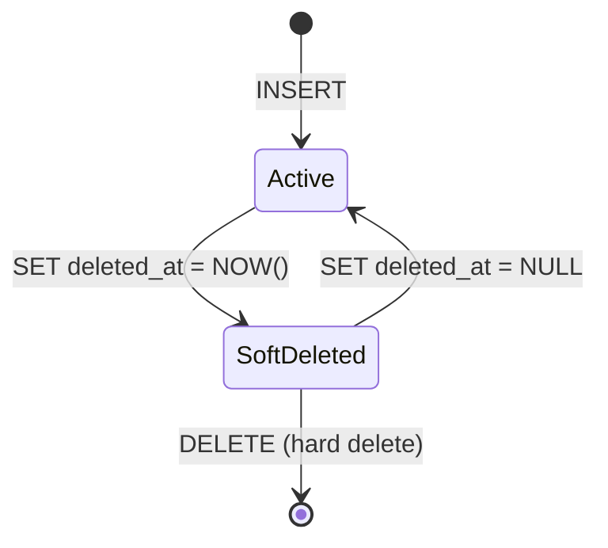
```mermaid
stateDiagram-v2
    [*] --> Active : INSERT
    Active --> SoftDeleted : SET deleted_at = NOW()
    SoftDeleted --> Active : SET deleted_at = NULL
    SoftDeleted --> [*] : DELETE (hard delete)
```

```sql
ALTER TABLE users ADD COLUMN deleted_at TIMESTAMP;

-- "Delete" a user
UPDATE users SET deleted_at = CURRENT_TIMESTAMP WHERE id = 3;

-- Query only active users
SELECT * FROM users WHERE deleted_at IS NULL;
```

### Timestamps

Always track when rows are created and updated:

```sql
CREATE TABLE articles (
    id         INTEGER PRIMARY KEY,
    title      TEXT NOT NULL,
    body       TEXT,
    created_at TIMESTAMP DEFAULT CURRENT_TIMESTAMP,
    updated_at TIMESTAMP DEFAULT CURRENT_TIMESTAMP
);
```

**Important:** `DEFAULT CURRENT_TIMESTAMP` only sets the value on `INSERT`. It does **not** auto-update when the row is
modified. Handling auto-update depends on the database:

```sql
-- MySQL: use ON UPDATE
CREATE TABLE articles (
    id         INTEGER PRIMARY KEY AUTO_INCREMENT,
    title      TEXT NOT NULL,
    body       TEXT,
    created_at TIMESTAMP DEFAULT CURRENT_TIMESTAMP,
    updated_at TIMESTAMP DEFAULT CURRENT_TIMESTAMP ON UPDATE CURRENT_TIMESTAMP
);

-- PostgreSQL: create a trigger function
CREATE OR REPLACE FUNCTION update_updated_at()
RETURNS TRIGGER AS $$
BEGIN
    NEW.updated_at = CURRENT_TIMESTAMP;
    RETURN NEW;
END;
$$ LANGUAGE plpgsql;

CREATE TRIGGER set_updated_at
    BEFORE UPDATE ON articles
    FOR EACH ROW
    EXECUTE FUNCTION update_updated_at();

-- SQLite: use a trigger
CREATE TRIGGER set_updated_at
    AFTER UPDATE ON articles
    FOR EACH ROW
BEGIN
    UPDATE articles SET updated_at = CURRENT_TIMESTAMP WHERE id = OLD.id;
END;
```

### Pagination

```sql
-- Offset-based (simple but slow for large offsets)
SELECT * FROM posts ORDER BY created_at DESC LIMIT 20 OFFSET 40;

-- Cursor-based (fast for large datasets)
SELECT * FROM posts
WHERE created_at < '2025-01-10 00:00:00'
ORDER BY created_at DESC
LIMIT 20;
```

### Full-text search (PostgreSQL)

```sql
-- Create a text search index
CREATE INDEX idx_posts_search ON posts USING GIN (to_tsvector('english', title || ' ' || body));

-- Search
SELECT title FROM posts
WHERE to_tsvector('english', title || ' ' || body) @@ to_tsquery('english', 'SQL & joins');
```

### Upsert (INSERT or UPDATE)

```sql
-- PostgreSQL
INSERT INTO users (email, name) VALUES ('ada@example.com', 'Ada L.')
ON CONFLICT (email) DO UPDATE SET name = EXCLUDED.name;

-- MySQL
INSERT INTO users (email, name) VALUES ('ada@example.com', 'Ada L.')
ON DUPLICATE KEY UPDATE name = VALUES(name);

-- SQLite (3.24+, true upsert using ON CONFLICT)
INSERT INTO users (email, name) VALUES ('ada@example.com', 'Ada L.')
ON CONFLICT (email) DO UPDATE SET name = EXCLUDED.name;

-- SQLite (older versions -- caution: deletes then re-inserts the row)
-- This resets the rowid, fires DELETE triggers, and cascades foreign keys
INSERT OR REPLACE INTO users (email, name) VALUES ('ada@example.com', 'Ada L.');
```

## NULL handling functions

`NULL` represents missing or unknown data. It is not the same as zero or an empty string. Two functions make working
with `NULL` much easier:

### `COALESCE` -- first non-NULL value

`COALESCE` returns the first argument that is not `NULL`. Use it to provide fallback values:

```sql
-- Show 0 instead of NULL for users without an age
SELECT name, COALESCE(age, 0) AS age FROM users;
```

Result (all users here have an age, so `COALESCE` has no effect -- but if any had `NULL`, it would show `0`):

| name              | age |
|-------------------|-----|
| Ada Lovelace      | 36  |
| Grace Hopper      | 85  |
| Alan Turing       | 41  |
| Linus Torvalds    | 54  |
| Margaret Hamilton | 88  |

```sql
-- Use a chain of fallbacks
SELECT COALESCE(nickname, name, email) AS display_name FROM users;
```

Result (assuming Ada has no `nickname` column set):

| display_name      |
|-------------------|
| Ada Lovelace      |
| Grace Hopper      |
| Alan Turing       |
| Linus Torvalds    |
| Margaret Hamilton |

### `NULLIF` -- conditional NULL

`NULLIF(a, b)` returns `NULL` if `a` equals `b`, otherwise returns `a`. Useful for avoiding division by zero or
treating sentinel values as unknown:

```sql
-- Avoid division by zero: returns NULL instead of an error
SELECT total / NULLIF(count, 0) AS average FROM stats;

-- Treat empty strings as NULL
SELECT NULLIF(email, '') AS email FROM users;
```

## String functions

```sql
SELECT
    UPPER('hello'),              -- HELLO
    LOWER('HELLO'),              -- hello
    LENGTH('hello'),             -- 5
    TRIM('  hello  '),           -- hello
    SUBSTRING('hello' FROM 2 FOR 3), -- ell (PostgreSQL)
    REPLACE('hello', 'l', 'r'), -- herro
    CONCAT('hello', ' ', 'world'); -- hello world
```

Result:

| upper | lower | length | trim  | substring | replace | concat      |
|-------|-------|--------|-------|-----------|---------|-------------|
| HELLO | hello | 5      | hello | ell       | herro   | hello world |

## Date functions

```sql
-- Current date/time
SELECT CURRENT_DATE, CURRENT_TIMESTAMP;
```

Result:

| current_date | current_timestamp       |
|--------------|-------------------------|
| 2025-01-15   | 2025-01-15 10:30:00+00  |

```sql
-- Extract parts (PostgreSQL)
SELECT EXTRACT(YEAR FROM created_at) AS year FROM posts;
SELECT EXTRACT(MONTH FROM created_at) AS month FROM posts;

-- Date arithmetic (PostgreSQL)
SELECT created_at + INTERVAL '7 days' AS next_week FROM posts;

-- Group by month
SELECT
    DATE_TRUNC('month', created_at) AS month,
    COUNT(*) AS post_count
FROM posts
GROUP BY DATE_TRUNC('month', created_at)
ORDER BY month;
```

Result of `GROUP BY month`:

| month      | post_count |
|------------|------------|
| 2025-01-01 | 5          |

## `CASE` expressions

Conditional logic inside queries:

```sql
SELECT
    name,
    age,
    CASE
        WHEN age >= 80 THEN 'Senior'
        WHEN age >= 50 THEN 'Experienced'
        WHEN age >= 30 THEN 'Mid-career'
        ELSE 'Junior'
    END AS category
FROM users;
```

Result:

| name              | age | category    |
|-------------------|-----|-------------|
| Ada Lovelace      | 36  | Mid-career  |
| Grace Hopper      | 85  | Senior      |
| Alan Turing       | 41  | Mid-career  |
| Linus Torvalds    | 54  | Experienced |
| Margaret Hamilton | 88  | Senior      |

### `CASE` in `UPDATE` -- conditional bulk updates

`CASE` is not limited to `SELECT`. Use it in `UPDATE` to set values based on conditions in a single statement:

```sql
-- Bulk categorize users based on age
UPDATE users
SET category = CASE
    WHEN age >= 80 THEN 'Senior'
    WHEN age >= 50 THEN 'Experienced'
    WHEN age >= 30 THEN 'Mid-career'
    ELSE 'Junior'
END;

-- Conditional price adjustment
UPDATE products
SET price = CASE
    WHEN stock = 0 THEN price * 0.5    -- clearance for out-of-stock
    WHEN stock < 10 THEN price * 1.1   -- premium for low stock
    ELSE price
END;
```

## `UNION` -- combining result sets

```sql
-- UNION removes duplicates
SELECT name FROM users WHERE age > 50
UNION
SELECT name FROM users WHERE active = TRUE;
```

Result (Grace, Linus, and Margaret appear in both queries but are listed only once):

| name              |
|-------------------|
| Ada Lovelace      |
| Alan Turing       |
| Grace Hopper      |
| Linus Torvalds    |
| Margaret Hamilton |

```sql
-- UNION ALL keeps duplicates (faster)
SELECT name FROM users WHERE age > 50
UNION ALL
SELECT name FROM users WHERE active = TRUE;
```

Result (duplicates preserved -- 8 rows instead of 5):

| name              |
|-------------------|
| Grace Hopper      |
| Linus Torvalds    |
| Margaret Hamilton |
| Ada Lovelace      |
| Grace Hopper      |
| Alan Turing       |
| Linus Torvalds    |
| Margaret Hamilton |

## String aggregation

A common need is to combine multiple values into a single comma-separated string. The function name varies by database:

```sql
-- PostgreSQL: STRING_AGG
SELECT
    u.name,
    STRING_AGG(t.name, ', ' ORDER BY t.name) AS tags
FROM users u
INNER JOIN posts p ON u.id = p.user_id
INNER JOIN post_tags pt ON p.id = pt.post_id
INNER JOIN tags t ON pt.tag_id = t.id
GROUP BY u.name;

-- MySQL / SQLite: GROUP_CONCAT
SELECT
    u.name,
    GROUP_CONCAT(t.name ORDER BY t.name SEPARATOR ', ') AS tags
FROM users u
INNER JOIN posts p ON u.id = p.user_id
INNER JOIN post_tags pt ON p.id = pt.post_id
INNER JOIN tags t ON pt.tag_id = t.id
GROUP BY u.name;
```

Example result:

| name           | tags          |
|----------------|---------------|
| Ada Lovelace   | database, sql |
| Linus Torvalds | kernel, linux |

## Security: SQL injection

**Never** build SQL queries by concatenating user input:

```text
-- DANGEROUS: SQL injection vulnerability
query = "SELECT * FROM users WHERE name = '" + userInput + "'"

-- If userInput is: ' OR '1'='1
-- The query becomes:
SELECT * FROM users WHERE name = '' OR '1'='1'
-- This returns ALL users
```

**Always use parameterized queries / prepared statements:**

```sql
-- Safe: parameterized query (syntax depends on your language/driver)
-- Java:    PreparedStatement: "SELECT * FROM users WHERE name = ?"
-- Python:  cursor.execute("SELECT * FROM users WHERE name = %s", (name,))
-- Node.js: db.query("SELECT * FROM users WHERE name = $1", [name])
```

## Quick reference

### Query template

```sql
SELECT columns
FROM table
JOIN other_table ON condition
WHERE filter
GROUP BY columns
HAVING group_filter
ORDER BY columns
LIMIT count OFFSET skip;
```

### CRUD operations

| Operation  | SQL                                          |
|------------|----------------------------------------------|
| **C**reate | `INSERT INTO table (cols) VALUES (vals)`     |
| **R**ead   | `SELECT cols FROM table WHERE condition`     |
| **U**pdate | `UPDATE table SET col = val WHERE condition` |
| **D**elete | `DELETE FROM table WHERE condition`          |

### Join cheat sheet

| Join              | Returns                                                |
|-------------------|--------------------------------------------------------|
| `INNER JOIN`      | Only matching rows from both tables                    |
| `LEFT JOIN`       | All left rows + matching right rows (NULL if no match) |
| `RIGHT JOIN`      | All right rows + matching left rows (NULL if no match) |
| `FULL OUTER JOIN` | All rows from both tables (NULL where no match)        |
| `CROSS JOIN`      | Every combination of rows                              |

## Summary

- SQL is the standard language for relational databases -- learn it once, use it everywhere.
- **Tables** store data in rows and columns; **keys** link tables together.
- `SELECT`, `INSERT`, `UPDATE`, `DELETE` are the four core operations.
- **Joins** combine data from multiple tables -- `INNER JOIN` for matches, `LEFT JOIN` to include unmatched rows.
- **Aggregate functions** (`COUNT`, `SUM`, `AVG`) summarize data; `GROUP BY` groups rows before aggregating.
- **CTEs** (`WITH`) break complex queries into readable named steps.
- **Window functions** (`ROW_NUMBER`, `RANK`) compute values across rows without collapsing groups.
- **Indexes** speed up reads but slow down writes -- index foreign keys and frequently queried columns.
- **Transactions** guarantee atomicity -- all changes commit or all roll back.
- **Normalization** reduces duplication by splitting data into related tables.
- **Always use parameterized queries** to prevent SQL injection.
