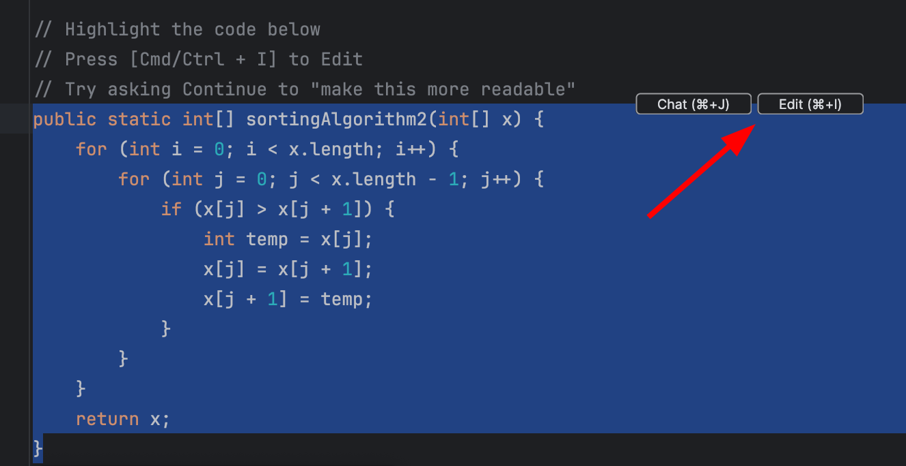
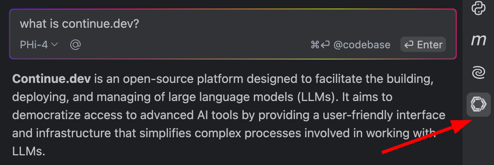

# Set up ollama and continue.dev for local, offline LLM use

## Ollama + Continue Dev

1. Install ollama
    - https://ollama.com/download
2. Install the continue.dev Plugin for JetBrains or VSCode
    - https://plugins.jetbrains.com/plugin/22707-continue
    - https://marketplace.visualstudio.com/items?itemName=Continue.continue

## Model Setup

1. Update continue.dev `config.json` -> [see here](#suggested-continuedev-config)
2. `ollama pull qwen2.5-coder`
    - Quick Tab Completion
    - https://ollama.com/library/qwen2.5-coder
3. `ollama pull nomic-embed-text`
    - Continue.dev Indexing and Codebase Search
4. `ollama pull phi4`
    - General Purpose state-of-the-art open model
    - https://ollama.com/library/phi4
5. `ollama serve`
    - Run ollama api locally
    - https://ollama.com/library/nomic-embed-text

## Usage

Use directly in your editor



or via the chat-sidebar tab



## Suggested continue.dev config

- Unix: `~/.continue/config.json`
- Windows: `%USERPROFILE%\.continue\config.json`

```json title="~/.continue/config.json"
{
    "models": [
        {
            "title": "PHi-4",
            "provider": "ollama",
            "model": "phi4",
            "systemMessage": "You are a helpful assistant supporting a software developer. Your tasks may involve explaining technical concepts, assisting with code, offering best practices, and solving programming-related issues across various languages and frameworks. Always provide clear, concise, and accurate answers. Always respond in English."
        }
    ],
    "tabAutocompleteModel": {
        "title": "Qwen2.5-Coder",
        "provider": "ollama",
        "model": "qwen2.5-coder"
    },
    "embeddingsProvider": {
        "title": "Nomic Embed Text",
        "provider": "ollama",
        "model": "nomic-embed-text"
    },
    "customCommands": [
        {
            "name": "test",
            "prompt": "{{{ input }}}\n\nWrite a comprehensive set of unit tests for the selected code. It should setup, run tests that check for correctness including important edge cases, and teardown. Ensure that the tests are complete and sophisticated. Give the tests just as chat output, don't edit any file.",
            "description": "Write unit tests for highlighted code"
        }
    ],
    "contextProviders": [
        {
            "name": "diff",
            "params": {}
        },
        {
            "name": "folder",
            "params": {}
        },
        {
            "name": "codebase",
            "params": {}
        },
        {
            "name": "file",
            "params": {}
        },
        {
            "name": "code",
            "params": {}
        },
        {
            "name": "currentFile",
            "params": {}
        },
        {
            "name": "terminal",
            "params": {}
        },
        {
            "name": "open",
            "params": {}
        },
        {
            "name": "web",
            "params": {}
        },
        {
            "name": "url",
            "params": {}
        },
        {
            "name": "repo-map",
            "params": {}
        },
        {
            "name": "os",
            "params": {}
        }
    ],
    "slashCommands": [
        {
            "name": "share",
            "description": "Export the current chat session to markdown"
        },
        {
            "name": "commit",
            "description": "Generate a git commit message"
        }
    ]
}
```
