# Mermaid Diagrams Guide

[Mermaid](https://mermaid.js.org/) is a JavaScript-based diagramming tool that renders diagrams from
plain-text definitions inside Markdown code blocks. Instead of switching to a visual editor, exporting an
image, and embedding it, you describe the diagram in text and it renders automatically.

This guide covers every commonly used diagram type with practical, copy-pasteable examples.

## Getting Started

In Docusaurus (and many other Markdown renderers like GitHub, GitLab, Notion), you create a Mermaid diagram
by using a fenced code block with the `mermaid` language identifier:

````markdown
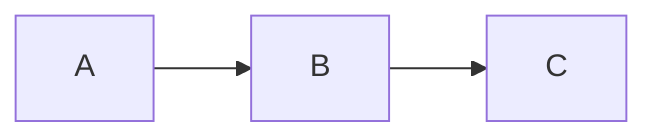
````

This renders as:


:::tip
Mermaid diagrams are **text-based and version-controlled**. They live alongside your documentation in Git,
making them easy to review, diff, and update. No external image files needed.
:::

---

## Flowcharts

Flowcharts are the most common diagram type. They show processes, decisions, and directional flows.

### Direction

The first keyword sets the layout direction:

| Keyword | Direction |
|---------|-----------|
| `graph TD` or `graph TB` | Top to bottom |
| `graph BT` | Bottom to top |
| `graph LR` | Left to right |
| `graph RL` | Right to left |

### Basic flowchart

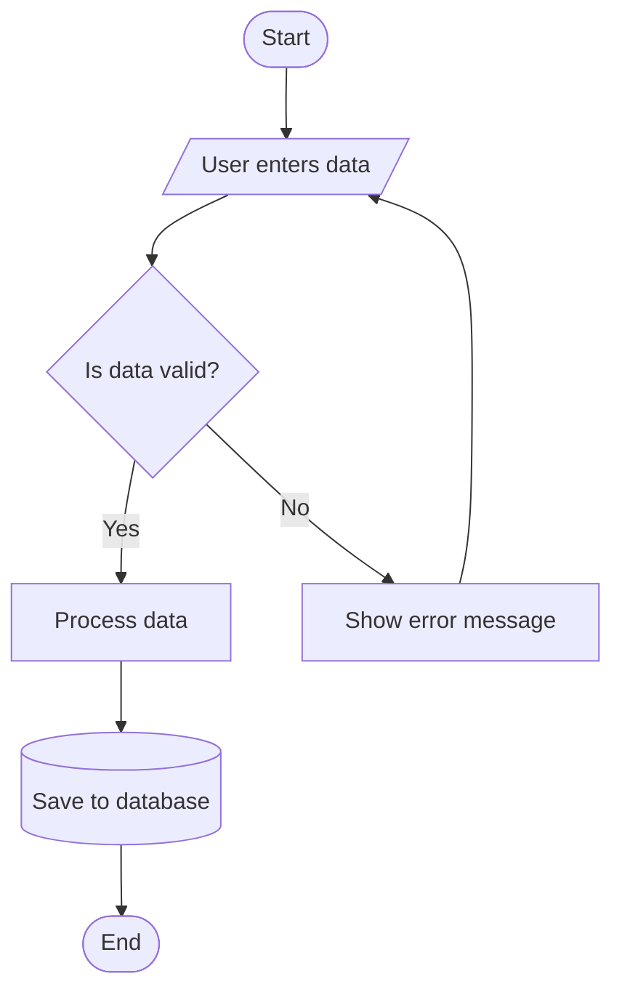

Source:

````markdown

````

### Node shapes

| Syntax | Shape | Use for |
|--------|-------|---------|
| `A[Text]` | Rectangle | Process / action |
| `A(Text)` | Rounded rectangle | General step |
| `A([Text])` | Stadium / pill | Start / end |
| `A{Text}` | Diamond | Decision |
| `A{Text}` | Diamond | Decision |
| `A[/Text/]` | Parallelogram | Input / output |
| `A[\Text\]` | Reverse parallelogram | Manual input |
| `A[(Text)]` | Cylinder | Database / storage |
| `A[[Text]]` | Subroutine | Predefined process |
| `A((Text))` | Circle | Connector / event |
| `A>Text]` | Asymmetric | Flag / signal |
| `A{{Text}}` | Hexagon | Preparation |

### All node shapes in one diagram

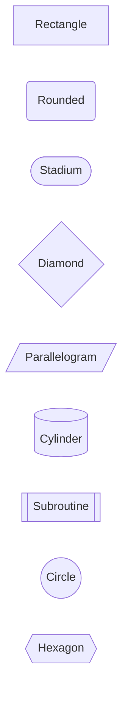

### Link types

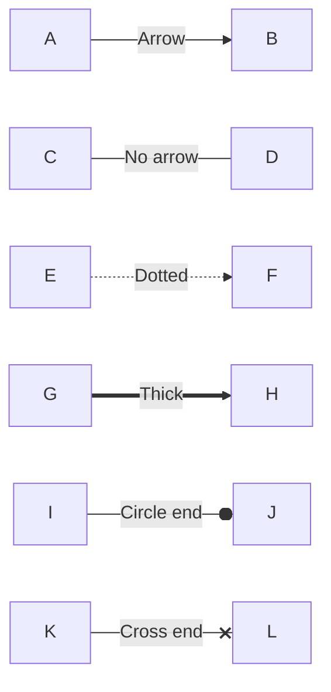

| Syntax | Style |
|--------|-------|
| `-->` | Arrow |
| `---` | Line (no arrow) |
| `-.->` | Dotted arrow |
| `==>` | Thick arrow |
| `--o` | Circle end |
| `--x` | Cross end |
| `-- text -->` or `-->|text|` | Label on link |

### Subgraphs

Group related nodes into named sections:

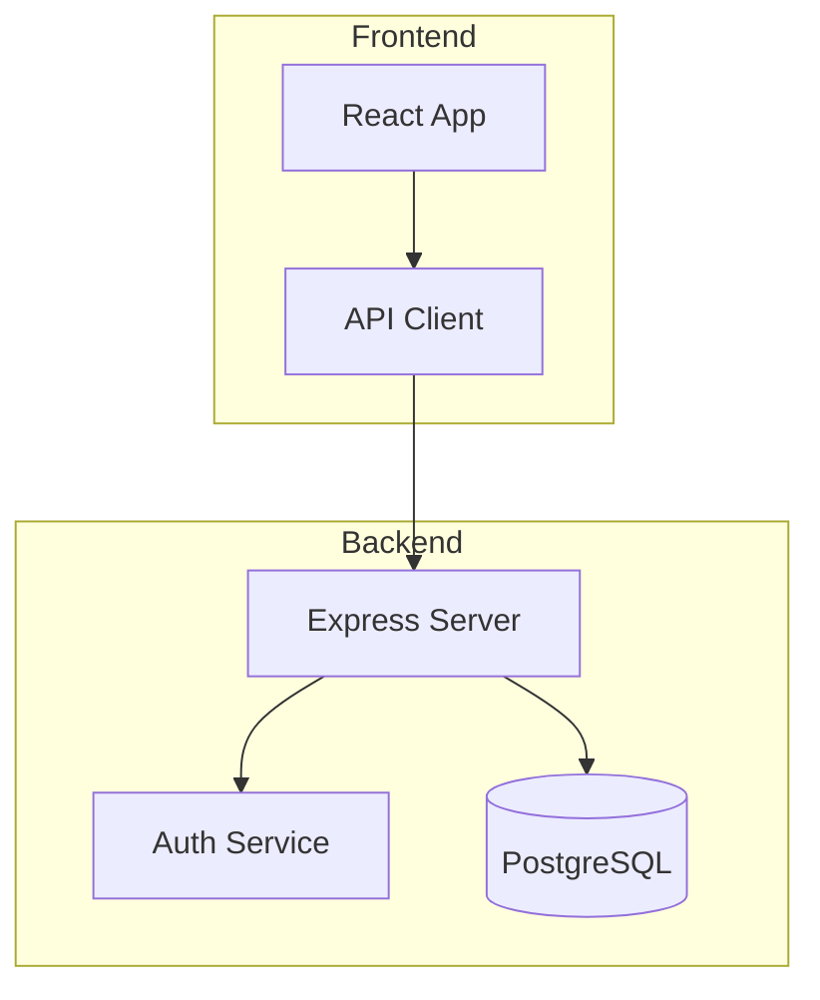

Source:

````markdown

````

### Practical example: CI/CD pipeline

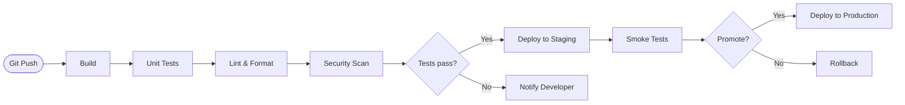

---

## Sequence Diagrams

Sequence diagrams show interactions between participants (systems, services, users) over time.

### Basic sequence

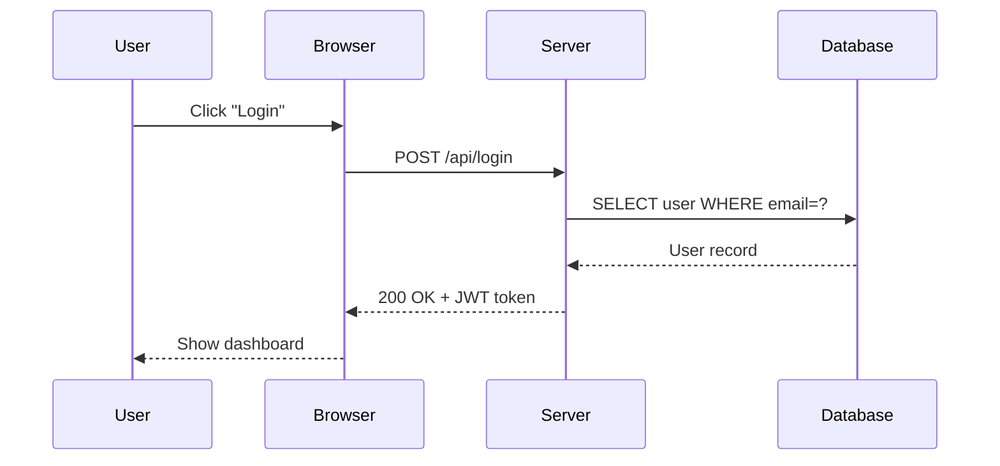

Source:

````markdown

````

### Arrow types

| Syntax | Style |
|--------|-------|
| `->>` | Solid arrow (synchronous) |
| `-->>` | Dashed arrow (response / async) |
| `-x` | Solid with cross (lost message) |
| `--x` | Dashed with cross |
| `-)` | Solid with open arrow (async) |
| `--)` | Dashed with open arrow |

### Notes, loops, and alternatives

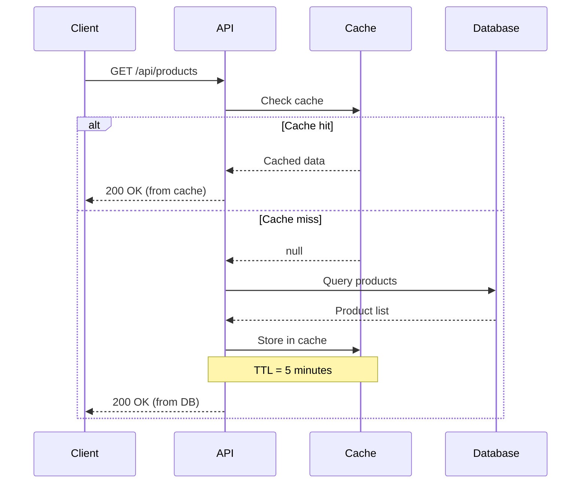

### Activation (lifelines)

Show when a participant is actively processing:

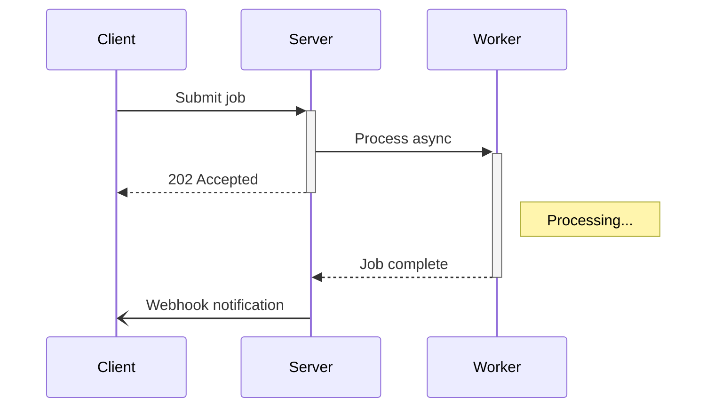

### Loops

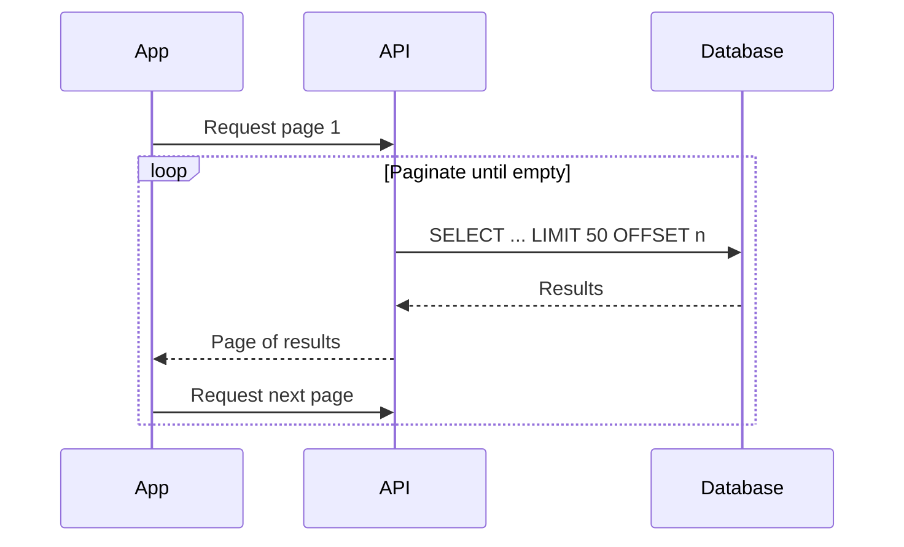

### Practical example: OAuth 2.0 flow

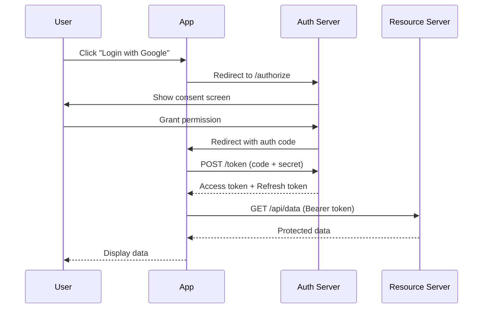

---

## Class Diagrams

Class diagrams show the structure of a system: classes, attributes, methods, and relationships.

### Basic class diagram

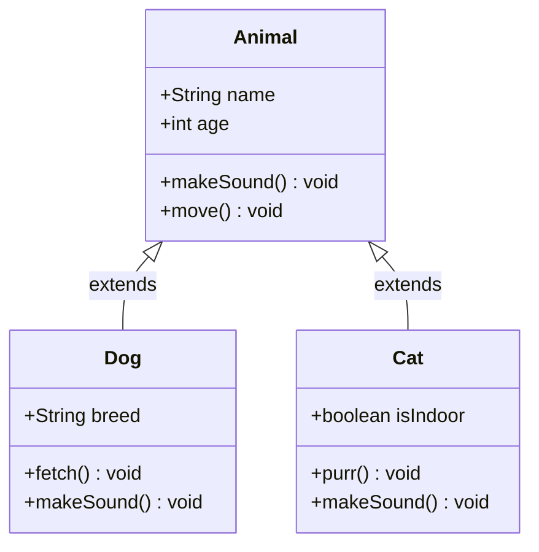

### Visibility modifiers

| Prefix | Meaning |
|--------|---------|
| `+` | Public |
| `-` | Private |
| `#` | Protected |
| `~` | Package/internal |

### Relationship types

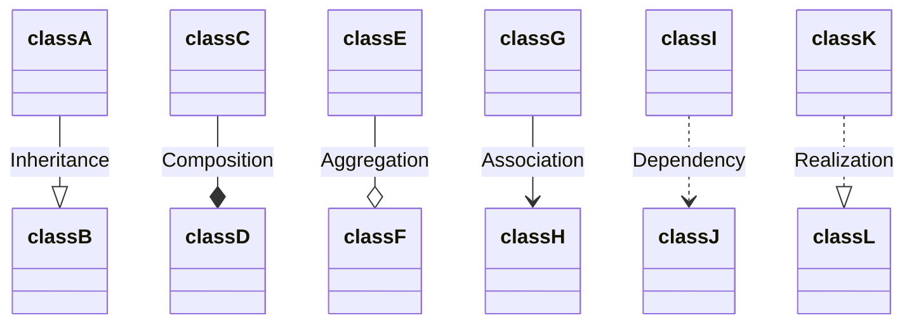

| Syntax | Relationship |
|--------|-------------|
| `<\|--` | Inheritance (extends) |
| `*--` | Composition (owns, lifecycle-bound) |
| `o--` | Aggregation (has, independent lifecycle) |
| `-->` | Association (uses) |
| `..>` | Dependency (depends on) |
| `..\|>` | Realization (implements) |

### Practical example: repository pattern

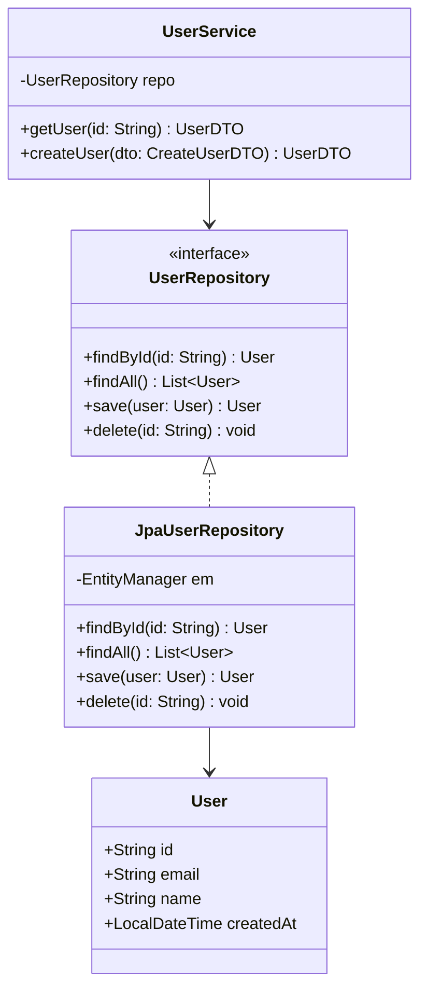

---

## State Diagrams

State diagrams show the possible states of a system and the transitions between them.

### Basic state diagram

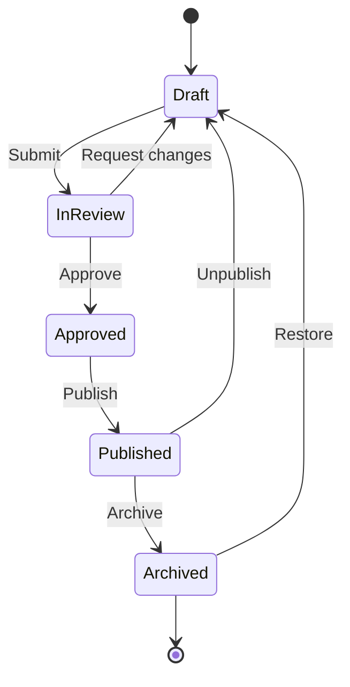

### Composite states

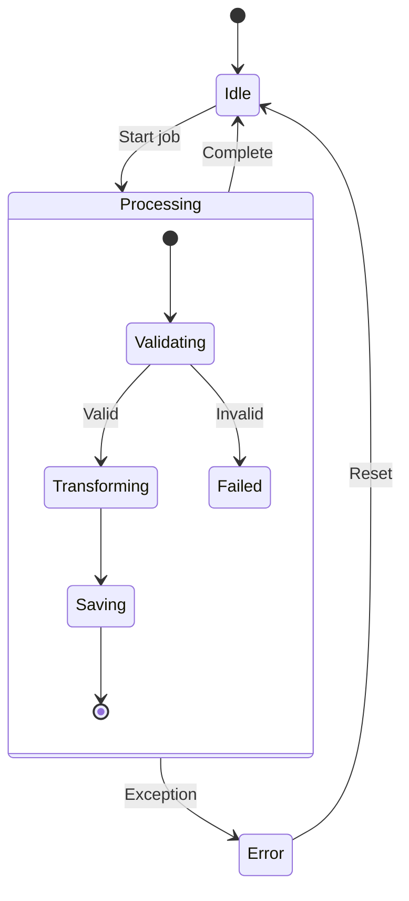

### Practical example: order lifecycle

```mermaid
stateDiagram-v2
    [*] --> Placed

    Placed --> PaymentPending : Awaiting payment
    PaymentPending --> Paid : Payment received
    PaymentPending --> Cancelled : Timeout / Cancel

    Paid --> Picking : Send to warehouse
    Picking --> Packed : Items packed
    Packed --> Shipped : Carrier collected
    Shipped --> Delivered : Delivery confirmed

    Delivered --> [*]
    Cancelled --> [*]

    Shipped --> ReturnRequested : Customer returns
    ReturnRequested --> Returned : Return received
    Returned --> Refunded : Refund issued
    Refunded --> [*]
```

---

## Entity Relationship Diagrams

ER diagrams model database schemas and the relationships between tables.

### Basic ER diagram

```mermaid
erDiagram
    USER ||--o{ ORDER : places
    ORDER ||--|{ ORDER_LINE : contains
    PRODUCT ||--o{ ORDER_LINE : "is in"
    USER {
        string id PK
        string email
        string name
        datetime created_at
    }
    ORDER {
        string id PK
        string user_id FK
        datetime order_date
        string status
        decimal total
    }
    ORDER_LINE {
        string id PK
        string order_id FK
        string product_id FK
        int quantity
        decimal unit_price
    }
    PRODUCT {
        string id PK
        string name
        string description
        decimal price
        int stock
    }
```

### Relationship cardinality

| Syntax | Meaning |
|--------|---------|
| `\|\|--\|\|` | One to one |
| `\|\|--o{` | One to many |
| `o{--o{` | Many to many |
| `\|\|--o\|` | One to zero or one |

The symbols read as:

| Symbol | Meaning |
|--------|---------|
| `\|\|` | Exactly one |
| `o\|` | Zero or one |
| `\|{` | One or more |
| `o{` | Zero or more |

---

## Gantt Charts

Gantt charts visualize project timelines, task durations, and dependencies.

```mermaid
gantt
    title Project Timeline
    dateFormat YYYY-MM-DD
    excludes weekends

    section Planning
        Requirements           :done,    req,  2025-01-06, 5d
        Architecture design    :done,    arch, after req,   3d
        Technical review       :done,    rev,  after arch,  2d

    section Development
        Backend API            :active,  api,  after rev,   10d
        Frontend UI            :active,  ui,   after rev,   12d
        Database schema        :         db,   after rev,   5d

    section Testing
        Integration tests      :         int,  after api,   5d
        UAT                    :         uat,  after ui,    5d

    section Deployment
        Staging deploy         :         stg,  after int,   2d
        Production deploy      :crit,    prod, after uat,   1d
```

### Task status markers

| Marker | Meaning |
|--------|---------|
| `done` | Completed task (filled) |
| `active` | Currently in progress (highlighted) |
| `crit` | Critical path (red) |
| *(none)* | Future task |

### Date formats

```text
2025-01-15           Specific date
after taskId         After another task completes
5d                   Duration in days
2025-01-15, 10d      Start date + duration
2025-01-15, 2025-01-25  Start and end dates
```

---

## Pie Charts

Simple proportional data visualization.

```mermaid
pie title Website Traffic Sources
    "Organic Search" : 45
    "Direct" : 25
    "Social Media" : 15
    "Referral" : 10
    "Email" : 5
```

Source:

````markdown
```mermaid
pie title Website Traffic Sources
    "Organic Search" : 45
    "Direct" : 25
    "Social Media" : 15
    "Referral" : 10
    "Email" : 5
```
````

---

## Gitgraph Diagrams

Visualize Git branching strategies and merge flows.

```mermaid
gitGraph
    commit id: "initial"
    commit id: "add-readme"

    branch develop
    checkout develop
    commit id: "dev-setup"
    commit id: "add-ci"

    branch feature/auth
    checkout feature/auth
    commit id: "auth-model"
    commit id: "auth-api"
    commit id: "auth-tests"

    checkout develop
    merge feature/auth id: "merge-auth"

    branch feature/dashboard
    checkout feature/dashboard
    commit id: "dashboard-ui"
    commit id: "dashboard-api"

    checkout develop
    merge feature/dashboard id: "merge-dashboard"

    checkout main
    merge develop id: "release-v1.0" tag: "v1.0.0"
```

---

## Mind Maps

Hierarchical brainstorming and concept mapping.

```mermaid
mindmap
    root((Web Application))
        Frontend
            React
            TypeScript
            CSS Modules
            Testing
                Jest
                Cypress
        Backend
            Node.js
            Express
            Authentication
                JWT
                OAuth
            Database
                PostgreSQL
                Redis Cache
        Infrastructure
            Docker
            CI/CD
                GitHub Actions
            Monitoring
                Grafana
                Prometheus
        Documentation
            API Docs
            User Guide
            Architecture
```

---

## Timeline Diagrams

Show events or milestones along a timeline.

```mermaid
timeline
    title Product Roadmap 2025
    section Q1
        January : Requirements gathering
                : Team onboarding
        February : Architecture design
                 : Prototype
        March : MVP development
              : Internal testing
    section Q2
        April : Beta release
              : User feedback
        May : Iteration
            : Performance tuning
        June : Public launch
             : Marketing campaign
    section Q3
        July : Feature expansion
        August : Mobile app
        September : Analytics dashboard
```

---

## Quadrant Charts

Position items on a 2D matrix (like priority/effort or impact/urgency).

```mermaid
quadrantChart
    title Feature Prioritization
    x-axis Low Effort --> High Effort
    y-axis Low Impact --> High Impact

    quadrant-1 Do First
    quadrant-2 Plan Carefully
    quadrant-3 Consider Dropping
    quadrant-4 Quick Wins

    Search feature: [0.8, 0.9]
    Dark mode: [0.2, 0.5]
    Export to PDF: [0.6, 0.7]
    Emoji picker: [0.3, 0.2]
    SSO login: [0.7, 0.8]
    Font options: [0.15, 0.15]
    Auto-save: [0.25, 0.85]
    API v2: [0.9, 0.6]
```

---

## User Journey Diagrams

Map out user experiences through a system, tracking satisfaction at each step.

```mermaid
journey
    title User Onboarding Experience
    section Discovery
        Visit landing page: 5: User
        Read features: 4: User
        Watch demo video: 5: User
    section Sign Up
        Click sign up: 5: User
        Fill in form: 3: User
        Email verification: 2: User
        Complete profile: 3: User
    section First Use
        See dashboard: 4: User
        Create first project: 4: User
        Invite team member: 3: User
        Complete tutorial: 5: User
```

The number (1--5) represents satisfaction: 1 = frustrated, 5 = delighted. This helps identify
pain points in the user experience.

---

## Tips and Best Practices

### Keep diagrams focused

A diagram that tries to show everything shows nothing. Each diagram should communicate **one idea**.
If your flowchart has more than 15-20 nodes, consider splitting it into multiple diagrams.

### Use meaningful node IDs

```text
# Hard to read
A --> B --> C --> D

# Self-documenting
Request --> Validate --> Process --> Respond
```

### Use aliases for long participant names

```mermaid
sequenceDiagram
    participant FE as Frontend App
    participant GW as API Gateway
    participant Auth as Auth Service
    participant DB as PostgreSQL

    FE->>GW: Request
    GW->>Auth: Validate token
    Auth-->>GW: Valid
    GW->>DB: Query
    DB-->>GW: Results
    GW-->>FE: Response
```

### Escape special characters

Node labels with special characters need double quotes:

```text
A["Step 1: Initialize"]
B["Process (main)"]
C["Total = $100"]
```

Edge labels with special characters also need quotes:

```text
A -->|"O(n) complexity"| B
```

### Avoid common mistakes

| Mistake | Problem | Fix |
|---------|---------|-----|
| Spaces in node IDs | Parsing error | Use `camelCase` or underscores |
| `end` as a node ID | Conflicts with `subgraph end` keyword | Use `endNode` or `processEnd` |
| Missing direction keyword | Diagram may not render | Always start with `graph TD`, `graph LR`, etc. |
| Very long labels | Diagram becomes unreadable | Use short labels + a legend or notes |
| Too many nodes | Visual clutter | Split into multiple diagrams |

### Diagram type selection guide

| You want to show... | Use |
|---------------------|-----|
| A process or decision flow | [Flowchart](#flowcharts) |
| Interactions between systems over time | [Sequence diagram](#sequence-diagrams) |
| Code structure and relationships | [Class diagram](#class-diagrams) |
| Object lifecycle and transitions | [State diagram](#state-diagrams) |
| Database schema | [ER diagram](#entity-relationship-diagrams) |
| Project schedule | [Gantt chart](#gantt-charts) |
| Proportional data | [Pie chart](#pie-charts) |
| Git branching strategy | [Gitgraph](#gitgraph-diagrams) |
| Brainstorming / concepts | [Mind map](#mind-maps) |
| Project milestones | [Timeline](#timeline-diagrams) |
| Priority matrix | [Quadrant chart](#quadrant-charts) |
| User experience mapping | [User journey](#user-journey-diagrams) |

---

## Mermaid in Docusaurus

This site uses `@docusaurus/theme-mermaid` to render Mermaid diagrams. The configuration in
`docusaurus.config.ts` enables it:

```javascript
module.exports = {
    markdown: {
        mermaid: true,
    },
    themes: ['@docusaurus/theme-mermaid'],
    themeConfig: {
        mermaid: {
            theme: { light: 'default', dark: 'dark' },
        },
    },
};
```

Diagrams automatically adapt to the site's light/dark theme. No additional configuration is needed
per diagram.

### Where Mermaid works

| Platform | Support |
|----------|---------|
| Docusaurus (with theme) | Full |
| GitHub Markdown | Full (built-in since 2022) |
| GitLab Markdown | Full |
| Notion | Partial (via code blocks) |
| VS Code | Via extensions (e.g. "Markdown Preview Mermaid Support") |
| Confluence | Via plugin |

### Live editor

Use the [Mermaid Live Editor](https://mermaid.live/) to prototype diagrams before adding them to your
documentation. It provides real-time rendering, syntax validation, and export to SVG/PNG.

## External Resources

- [Mermaid Official Documentation](https://mermaid.js.org/intro/)
- [Mermaid Live Editor](https://mermaid.live/)
- [Docusaurus Mermaid Plugin](https://docusaurus.io/docs/markdown-features/diagrams)
- [GitHub Mermaid Support](https://github.blog/2022-02-14-include-diagrams-markdown-files-mermaid/)
