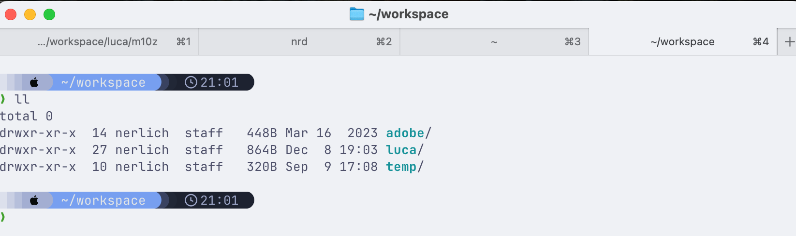
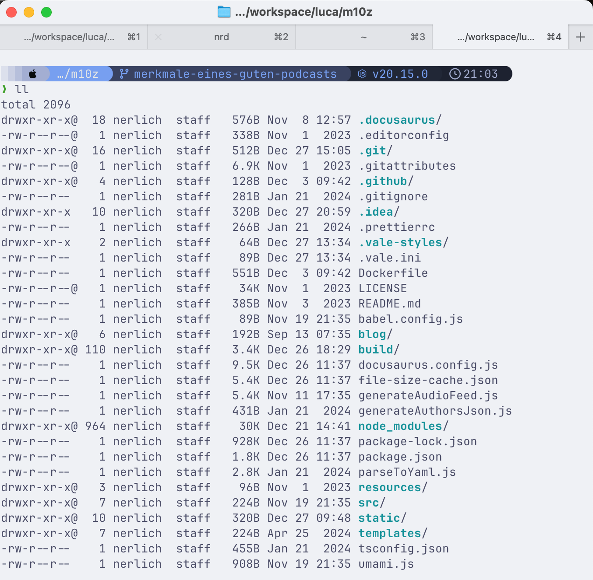

# My zsh Shell setup

The following steps setup my shell (zsh + oh-my-zsh).

1. Install `ghostty` terminal
   - https://ghostty.org/download
2. Install `zsh`
   - https://github.com/ohmyzsh/ohmyzsh/wiki/Installing-ZSH
3. Install `oh-my-zsh`
   - https://ohmyz.sh/#install
4. Install `starship.rs`
   - https://starship.rs
5. Setup starpship theme
   - https://starship.rs/presets/tokyo-night
   - `starship preset tokyo-night -o ~/.config/starship.toml`

Example terminal tab in my home directory

Example terminal tab in a folder with a node project

