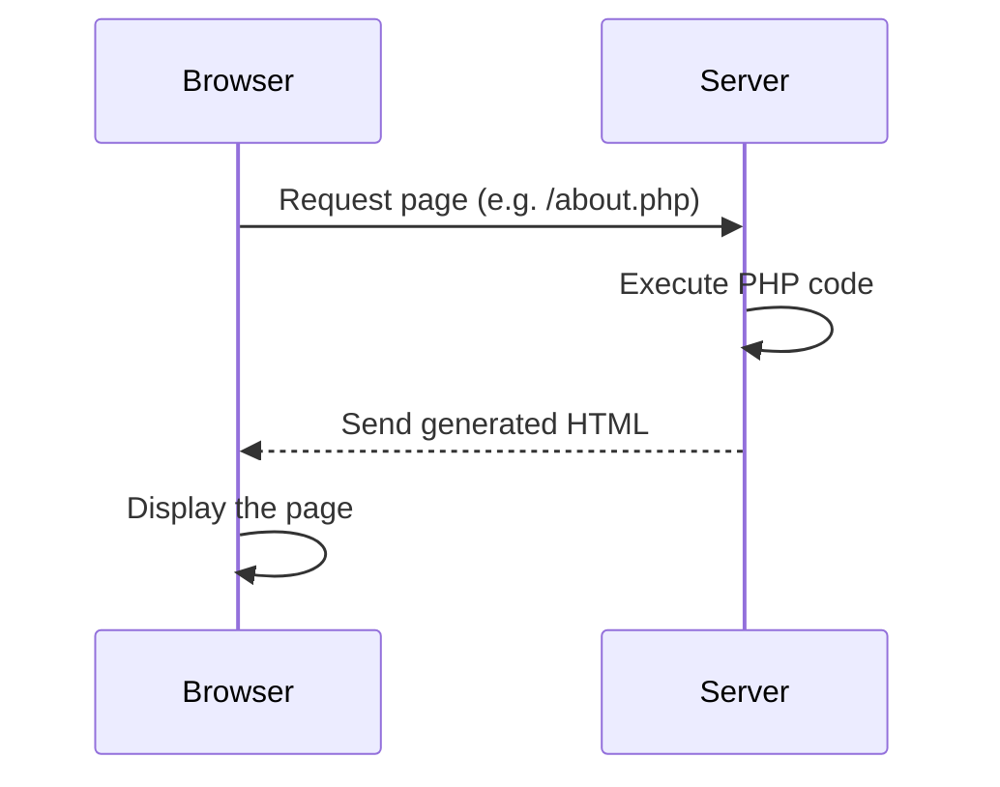
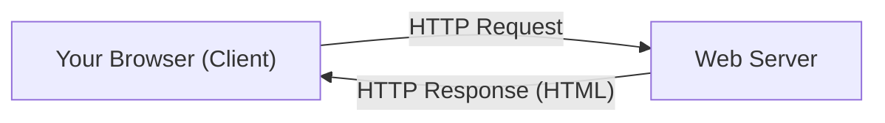
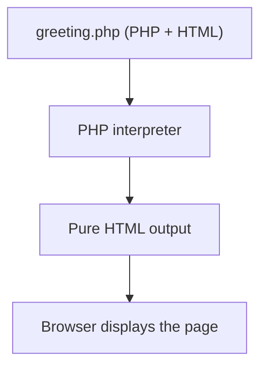
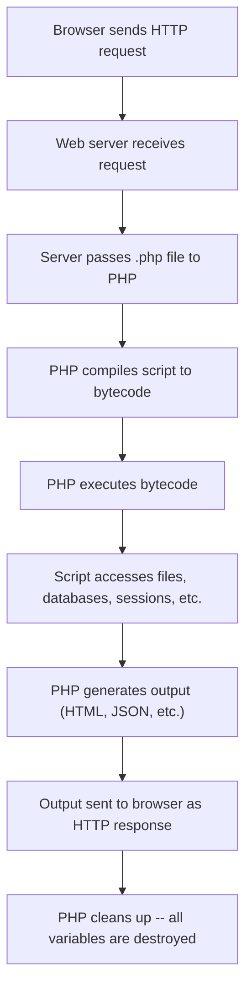

# Introduction & Setup

PHP is one of the most widely used programming languages on the web. It powers everything from small personal blogs to
massive platforms like WordPress, Wikipedia, and Facebook's early stack. This guide takes you from zero to building a
complete web application -- step by step, assuming no prior PHP experience.

## How this guide is structured

| Part                               | Chapters | What you will learn                                                          |
|------------------------------------|----------|------------------------------------------------------------------------------|
| **1 -- Language Basics**           | 1--6     | Install PHP, variables, types, operators, control flow, functions, arrays    |
| **2 -- Web Fundamentals**          | 7        | HTML forms, GET/POST, input validation, superglobals                         |
| **3 -- Object-Oriented PHP**       | 8--9     | Classes, inheritance, interfaces, traits, namespaces                         |
| **4 -- Practical Skills**          | 10--14   | Error handling, files, databases, sessions, Composer                         |
| **5 -- Modern PHP & Full Project** | 15--17   | PHP 8 features, building a web app, practice projects                        |

By the end you will understand how PHP works, how to build dynamic web pages, and how to structure a real application.

## What is PHP?

PHP stands for **PHP: Hypertext Preprocessor** (a recursive acronym). It is a **server-side** scripting language, which
means it runs on a server and produces output -- usually HTML -- that gets sent to the browser.

Here is the key idea: when you visit a website, your browser does not run PHP. The **server** runs PHP, generates HTML,
and sends that HTML to your browser.



This is different from JavaScript, which runs directly **in** the browser. PHP runs **before** the page reaches the
browser.

### Why learn PHP?

- **Huge ecosystem** -- PHP powers roughly 75% of all websites with a known server-side language (mostly through
  WordPress, but also Laravel, Symfony, Drupal, and many others)
- **Easy to start** -- you can write a PHP file, run one command, and see results in your browser
- **Mature and stable** -- PHP has been around since 1995 and has evolved significantly, especially with PHP 8
- **Great documentation** -- [php.net](https://www.php.net/manual/en/) has one of the best language references on the
  web
- **Jobs** -- there is strong demand for PHP developers, particularly in the Laravel and WordPress ecosystems

### A brief history

| Year | Version  | Milestone                                                          |
|------|----------|--------------------------------------------------------------------|
| 1995 | PHP 1    | Created by Rasmus Lerdorf as "Personal Home Page Tools"            |
| 2004 | PHP 5    | Introduced proper object-oriented programming                      |
| 2015 | PHP 7    | Massive performance improvements (2x faster), scalar type hints    |
| 2020 | PHP 8.0  | JIT compiler, union types, named arguments, match expression       |
| 2023 | PHP 8.3  | Typed class constants, `json_validate()`, `#[Override]` attribute  |
| 2024 | PHP 8.4  | Property hooks, asymmetric visibility, lazy objects                |

PHP 6 was planned but never released. The jump from 5 to 7 reflected a clean break with major performance gains.

## How the web works -- a quick primer

Before we install PHP, let's make sure you understand the basics of how the web works. If you already know this, skip
ahead to [Prerequisites](#prerequisites).

### Clients and servers

The web is a conversation between **clients** and **servers**:

- A **client** is usually your web browser (Chrome, Firefox, Safari). It sends **requests** -- "give me this page."
- A **server** is a computer running software that listens for those requests and sends back **responses** -- usually
  HTML, CSS, JavaScript, images, or JSON.



### Static vs dynamic websites

- A **static** website serves the same files to everyone. The server just hands over an HTML file as-is.
- A **dynamic** website generates pages on the fly. The server runs code (like PHP) to build the HTML before sending it.

PHP is how you make websites **dynamic**. For example, a PHP page can:

- Show different content depending on who is logged in
- Pull data from a database and display it
- Process a form submission and store the results

### What happens when you visit a PHP page

1. You type `http://example.com/profile.php` in your browser
2. Your browser sends an HTTP request to the server at `example.com`
3. The server sees the `.php` extension and passes the file to the PHP interpreter
4. PHP executes the code in `profile.php` -- maybe it queries a database, checks a session, etc.
5. PHP produces HTML output
6. The server sends that HTML back to your browser
7. Your browser renders the page -- it has no idea PHP was involved

The browser never sees your PHP code. It only sees the HTML that PHP produced.

## Prerequisites

Before we start, make sure you have:

- **A computer** running macOS, Linux, or Windows
- **A text editor** -- VS Code is recommended (free, great PHP support with extensions)
- **A terminal** -- Terminal on macOS, any terminal emulator on Linux, or Windows Terminal / PowerShell on Windows
- **Basic HTML knowledge** -- you should know what `<h1>`, `<p>`, `<form>`, and `<a>` tags do

You do **not** need:

- Prior programming experience (though it helps)
- A web server like Apache or Nginx (PHP has a built-in development server)
- A database (we add one in chapter 12)

## Installing PHP

### macOS

The easiest way is with [Homebrew](https://brew.sh/):

```bash
brew install php
```

Verify the installation:

```bash
php --version
```

You should see something like `PHP 8.3.x` or `PHP 8.4.x`.

> **Note:** macOS used to ship with PHP pre-installed, but Apple removed it in macOS Monterey (12.0). You need to
> install it yourself now.

### Linux (Ubuntu / Debian)

```bash
sudo apt update
sudo apt install php php-cli php-common
```

Verify:

```bash
php --version
```

For other distributions, use your package manager (`dnf` on Fedora, `pacman` on Arch, etc.).

### Windows

The simplest option is to download PHP from [windows.php.net](https://windows.php.net/download/):

1. Download the latest **VS16 x64 Thread Safe** zip
2. Extract it to `C:\php`
3. Add `C:\php` to your system PATH environment variable
4. Open a new terminal and run `php --version`

Alternatively, install [XAMPP](https://www.apachefriends.org/) which bundles PHP, Apache, and MySQL -- but for this
guide, standalone PHP is enough.

> **Tip:** On Windows, you can also use WSL (Windows Subsystem for Linux) and follow the Linux instructions. This is
> often easier for development.

## Your first PHP script

Create a new file called `hello.php` in any directory. Open it in your editor and type:

```php
<?php

echo 'Hello, World!';
```

Let's break this down:

- `<?php` -- this is the **opening tag**. It tells the server "everything after this is PHP code." Every PHP file starts
  with this tag.
- `echo` -- this is a PHP command that outputs text. Think of it as "print to the screen."
- `'Hello, World!'` -- this is a **string** (a piece of text). Single quotes wrap the text.
- `;` -- every PHP statement ends with a semicolon. This is not optional -- forgetting it is the most common beginner
  mistake.

### Running it from the terminal

Open your terminal, navigate to the directory where you saved `hello.php`, and run:

```bash
php hello.php
```

You should see:

```
Hello, World!
```

Congratulations -- you just ran your first PHP script.

### Running it in the browser

PHP's real power is generating web pages. PHP ships with a built-in development server. In your terminal, navigate to
the directory containing `hello.php` and run:

```bash
php -S localhost:8000
```

This starts a web server on port 8000. Now open your browser and go to:

```
http://localhost:8000/hello.php
```

You should see "Hello, World!" in your browser. The terminal will show a log line for each request.

> **Important:** The built-in server is for **development only**. Never use it in production. We cover proper deployment
> options in chapter 16.

Press `Ctrl+C` in the terminal to stop the server.

## Mixing PHP and HTML

One of PHP's strengths is that you can embed PHP directly inside HTML. Create a file called `greeting.php`:

```php
<!DOCTYPE html>
<html lang="en">
<head>
    <meta charset="UTF-8">
    <title>My First PHP Page</title>
</head>
<body>
    <h1>Welcome!</h1>
    <p>The current date is: <?php echo date('Y-m-d'); ?></p>
    <p>PHP version: <?php echo phpversion(); ?></p>
</body>
</html>
```

Start the built-in server again (`php -S localhost:8000`) and visit `http://localhost:8000/greeting.php`. You will see
an HTML page with today's date and your PHP version filled in dynamically.

Notice how PHP code lives inside `<?php ... ?>` tags. Everything outside those tags is treated as plain HTML and sent
to the browser as-is. The PHP parts are executed on the server and replaced with their output.



## PHP on the command line

PHP is not limited to web pages. You can use it as a general-purpose scripting language from the terminal. Create a file
called `info.php`:

```php
<?php

echo 'PHP version: ' . phpversion() . "\n";
echo 'Operating system: ' . PHP_OS . "\n";
echo 'Current directory: ' . getcwd() . "\n";
```

Run it:

```bash
php info.php
```

This is called **CLI mode** (Command Line Interface). It is useful for:

- Automation scripts
- Data processing
- Cron jobs
- Testing snippets quickly

Throughout this guide, we will use both CLI mode and the built-in web server.

## The PHP request lifecycle

Understanding how PHP processes a web request helps you reason about your code later:



The last step is important: **PHP starts fresh on every request.** Unlike Node.js or Java, PHP does not keep a
long-running process in memory. Each request is independent. Variables, objects, and connections are created, used, and
then destroyed. This "shared-nothing" architecture makes PHP simple to reason about but means you need sessions or
databases to persist data between requests (chapters 12--13).

## Setting up your project folder

For the rest of this guide, create a dedicated folder for your PHP learning projects:

```bash
mkdir php-guide
cd php-guide
```

Move your `hello.php` and `greeting.php` files into this folder. Whenever you see code examples in this guide, create
them inside this directory.

> **Tip:** Start the built-in server from this folder (`php -S localhost:8000`) and leave it running in a terminal tab
> while you work through the chapters. Every new `.php` file you create will be instantly accessible in your browser.

## Editor setup

If you use VS Code, install these extensions for a better PHP experience:

| Extension                          | What it does                                   |
|------------------------------------|------------------------------------------------|
| **PHP Intelephense**               | Autocompletion, go-to-definition, diagnostics  |
| **PHP Debug** (by Xdebug)         | Step-through debugging with Xdebug             |
| **EditorConfig for VS Code**       | Consistent formatting across editors            |

You do not need any of these to follow the guide, but they make writing PHP much more pleasant.

## Summary

- PHP is a server-side language -- it runs on the server and sends HTML to the browser
- The browser never sees your PHP code, only the output
- You installed PHP and verified it with `php --version`
- You wrote your first script with `echo` and ran it from the terminal
- You started PHP's built-in development server with `php -S localhost:8000`
- You can mix PHP and HTML in the same file using `<?php ... ?>` tags
- PHP starts fresh on every request -- nothing persists in memory between requests

Next up: [Variables & Data Types](./02-variables-and-types.md) -- declaring variables, working with strings and numbers,
understanding PHP's type system, and inspecting values with `var_dump()`.
