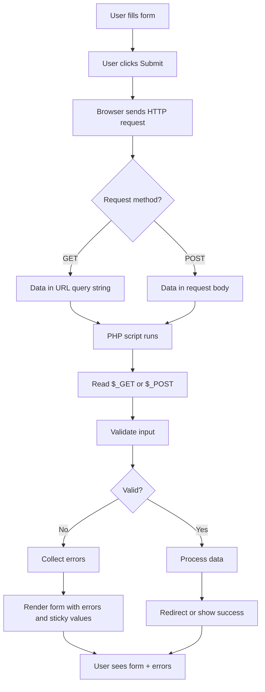

# Working with Forms & HTTP

Web applications are built on a simple exchange: the browser sends a request, and the server sends back a response. Forms are how users submit data to your PHP scripts. In this chapter you will learn how HTTP works, how to build HTML forms, how to read and validate user input with PHP superglobals, and how to build a complete contact form with proper error handling.

## How the Web Works

Before diving into forms, you need a clear picture of the request-response cycle.

### HTTP Request and Response

When you visit a URL or submit a form, your browser sends an **HTTP request** to the server. The server runs your PHP script, and the script sends back an **HTTP response** - usually HTML. The browser then renders that HTML.

Every HTTP request includes:

- **Method** - typically `GET` or `POST`
- **URL** - the resource being requested
- **Headers** - metadata (content type, cookies, etc.)
- **Body** (optional) - data sent with the request

The response includes a status code (e.g. 200 OK, 404 Not Found), headers, and a body (often HTML).

### GET vs POST

The two methods you will use most often are **GET** and **POST**.

| Method | Use case | Data location | Cached/bookmarked? |
|--------|----------|---------------|--------------------|
| **GET** | Fetching data, search, filters | In the URL query string | Yes |
| **POST** | Submitting data, creating/updating records | In the request body | No |

**GET** requests put data in the URL. Example: `https://example.com/search.php?query=php&page=1`. Use GET when:

- The request does not change server state (idempotent)
- You want the URL to be shareable or bookmarkable
- You are fetching or filtering data (search, pagination)

**POST** requests send data in the request body. The URL stays clean. Use POST when:

- You are submitting a form (login, registration, contact)
- The action changes server state
- You are sending sensitive data (passwords, credit cards)

> **Warning:** Never use GET for passwords or other sensitive data. GET parameters appear in browser history, server logs, and referrer headers.

## HTML Forms Recap

HTML forms collect user input and send it to the server. You need to know the basics before wiring them to PHP.

### The Form Tag

A form is defined with the `<form>` element. Two attributes matter most:

- **`action`** - the URL that receives the submitted data (often the same page)
- **`method`** - `get` or `post`

```html
<form action="process.php" method="post">
    <!-- form fields go here -->
</form>
```

If you omit `action`, the form submits to the current URL. If you omit `method`, it defaults to GET.

### Input Types

Common form controls you will use:

| Type | Element | Purpose |
|------|---------|---------|
| Text | `<input type="text">` | Single-line text |
| Email | `<input type="email">` | Email address (browser validation) |
| Password | `<input type="password">` | Masked input for passwords |
| Textarea | `<textarea>` | Multi-line text |
| Select | `<select>` with `<option>` | Dropdown list |
| Checkbox | `<input type="checkbox">` | On/off toggle |
| Radio | `<input type="radio">` | One of many options |
| Hidden | `<input type="hidden">` | Invisible data sent with form |
| Submit | `<input type="submit">` or `<button type="submit">` | Triggers form submission |

Every input that should be sent must have a **`name`** attribute. That name becomes the key in `$_GET` or `$_POST`.

```html
<form action="register.php" method="post">
    <label for="email">Email</label>
    <input type="email" id="email" name="email" required>

    <label for="password">Password</label>
    <input type="password" id="password" name="password" required>

    <button type="submit">Register</button>
</form>
```

> **Tip:** Use `<label for="id">` to associate labels with inputs. This improves accessibility and lets users click the label to focus the field.

## Superglobals

PHP provides **superglobals** - built-in arrays available in every scope. They hold request data and server information.

### $_GET

`$_GET` contains data from the URL query string. For `?name=Alice&age=30`, you get:

```php
<?php

// URL: page.php?name=Alice&age=30
$name = $_GET['name'] ?? '';  // 'Alice'
$age  = $_GET['age'] ?? '';   // '30'
```

Always use the null coalescing operator (`??`) to avoid undefined index notices when a parameter is missing.

### $_POST

`$_POST` contains data from the request body when the form uses `method="post"`. For a form with `name="email"` and `name="password"`:

```php
<?php

$email    = $_POST['email'] ?? '';
$password = $_POST['password'] ?? '';
```

### $_SERVER

`$_SERVER` holds server and request metadata. Useful keys include:

| Key | Description |
|-----|-------------|
| `REQUEST_METHOD` | `GET`, `POST`, etc. |
| `REQUEST_URI` | The requested path |
| `HTTP_HOST` | Host header |
| `SCRIPT_NAME` | Path to the current script |

You will often check `$_SERVER['REQUEST_METHOD']` to see if a form was submitted:

```php
<?php

if ($_SERVER['REQUEST_METHOD'] === 'POST') {
    // Handle form submission
}
```

### $_REQUEST

`$_REQUEST` merges `$_GET`, `$_POST`, and `$_COOKIE`. It is convenient but ambiguous - you cannot tell where a value came from. Prefer `$_GET` or `$_POST` explicitly for clarity and security.

> **Note:** The order of values in `$_REQUEST` depends on `request_order` in `php.ini`. Do not rely on it for sensitive data.

## Handling a GET Request

A common pattern is a search form that shows results on the same page. The form uses GET so the search query appears in the URL and can be bookmarked.

```php
<?php

$query = $_GET['query'] ?? '';
$results = [];

if ($query !== '') {
    // In a real app, you would search a database
    $results = ['Result 1 for ' . $query, 'Result 2 for ' . $query];
}
?>
<!DOCTYPE html>
<html>
<head>
    <title>Search</title>
</head>
<body>
    <form method="get" action="">
        <input type="text" name="query" value="<?php echo htmlspecialchars($query); ?>" placeholder="Search...">
        <button type="submit">Search</button>
    </form>

    <?php if ($query !== ''): ?>
        <h2>Results for "<?php echo htmlspecialchars($query); ?>"</h2>
        <ul>
            <?php foreach ($results as $result): ?>
                <li><?php echo htmlspecialchars($result); ?></li>
            <?php endforeach; ?>
        </ul>
    <?php endif; ?>
</body>
</html>
```

The form `action=""` submits to the current page. The `value` attribute keeps the query in the input after submission (a "sticky" form). You must escape output with `htmlspecialchars()` to prevent XSS.

## Handling a POST Request

For forms that create or update data, use POST. Check `$_SERVER['REQUEST_METHOD']` to distinguish between the initial page load and a form submission.

```php
<?php

$errors = [];
$email = '';
$password = '';

if ($_SERVER['REQUEST_METHOD'] === 'POST') {
    $email    = trim($_POST['email'] ?? '');
    $password = $_POST['password'] ?? '';

    if ($email === '') {
        $errors['email'] = 'Email is required.';
    } elseif (!filter_var($email, FILTER_VALIDATE_EMAIL)) {
        $errors['email'] = 'Please enter a valid email address.';
    }

    if (strlen($password) < 8) {
        $errors['password'] = 'Password must be at least 8 characters.';
    }

    if (empty($errors)) {
        // Save user, redirect, etc.
        header('Location: /welcome.php');
        exit;
    }
}
?>
<!DOCTYPE html>
<html>
<head>
    <title>Register</title>
</head>
<body>
    <h1>Register</h1>
    <form method="post" action="">
        <div>
            <label for="email">Email</label>
            <input type="email" id="email" name="email" value="<?php echo htmlspecialchars($email); ?>">
            <?php if (isset($errors['email'])): ?>
                <span class="error"><?php echo htmlspecialchars($errors['email']); ?></span>
            <?php endif; ?>
        </div>
        <div>
            <label for="password">Password</label>
            <input type="password" id="password" name="password">
            <?php if (isset($errors['password'])): ?>
                <span class="error"><?php echo htmlspecialchars($errors['password']); ?></span>
            <?php endif; ?>
        </div>
        <button type="submit">Register</button>
    </form>
</body>
</html>
```

On success, the script sends a redirect with `header('Location: ...')` and `exit`. This prevents the user from resubmitting the form by refreshing the page (the "Post/Redirect/Get" pattern).

## Input Validation

Never trust user input. Always validate on the server, even if you use HTML5 or JavaScript validation on the client.

### Required Fields

Check that required fields are not empty after trimming whitespace:

```php
<?php

$name = trim($_POST['name'] ?? '');

if ($name === '') {
    $errors['name'] = 'Name is required.';
}
```

### Validating Email

Use `filter_var()` with `FILTER_VALIDATE_EMAIL`:

```php
<?php

$email = trim($_POST['email'] ?? '');

if (!filter_var($email, FILTER_VALIDATE_EMAIL)) {
    $errors['email'] = 'Please enter a valid email address.';
}
```

### String Length

Use `strlen()` for byte length or `mb_strlen()` for character count (important for multibyte strings):

```php
<?php

$password = $_POST['password'] ?? '';

if (strlen($password) < 8) {
    $errors['password'] = 'Password must be at least 8 characters.';
}
```

### Sanitizing Output - Preventing XSS

When you output user-supplied data into HTML, escape it with `htmlspecialchars()` to prevent **Cross-Site Scripting (XSS)**:

```php
<?php

echo htmlspecialchars($userInput, ENT_QUOTES, 'UTF-8');
```

This converts `<`, `>`, `"`, `'`, and `&` to HTML entities so they are displayed as text, not executed as code.

> **Warning:** Always escape output. Never echo raw user input into HTML. XSS attacks can steal cookies, hijack sessions, or deface your site.

## filter_input() and filter_var()

PHP provides built-in filters for validation and sanitization. They centralize common checks and reduce boilerplate.

### filter_input()

`filter_input()` reads from `$_GET`, `$_POST`, or `$_COOKIE` and applies a filter in one call:

```php
<?php

$email = filter_input(INPUT_POST, 'email', FILTER_VALIDATE_EMAIL);

if ($email === false || $email === null) {
    $errors['email'] = 'Please enter a valid email address.';
}
```

### filter_var()

`filter_var()` works on any value:

```php
<?php

$email = trim($_POST['email'] ?? '');
$email = filter_var($email, FILTER_VALIDATE_EMAIL);

if ($email === false) {
    $errors['email'] = 'Invalid email.';
}
```

### Common Filters

| Filter | Purpose |
|--------|---------|
| `FILTER_VALIDATE_EMAIL` | Validates email format |
| `FILTER_VALIDATE_URL` | Validates URL format |
| `FILTER_VALIDATE_INT` | Validates integer |
| `FILTER_VALIDATE_BOOLEAN` | Validates boolean |
| `FILTER_SANITIZE_STRING` | Deprecated; avoid |
| `FILTER_SANITIZE_EMAIL` | Removes invalid email characters |
| `FILTER_SANITIZE_URL` | Removes invalid URL characters |
| `FILTER_SANITIZE_SPECIAL_CHARS` | Escapes for HTML (similar to htmlspecialchars) |

> **Note:** `FILTER_SANITIZE_STRING` is deprecated in PHP 8.1. Use `htmlspecialchars()` for HTML output and validate/sanitize with specific filters for your use case.

## Displaying Validation Errors

Users need clear feedback when validation fails. Show errors next to the relevant fields and keep the values they entered so they can correct mistakes without retyping everything.

### Errors Next to Fields

Store errors in an associative array keyed by field name:

```php
<?php

$errors = [];

if ($name === '') {
    $errors['name'] = 'Name is required.';
}
```

In the HTML, output the error for each field:

```html
<input type="text" name="name" value="<?php echo htmlspecialchars($name); ?>">
<?php if (isset($errors['name'])): ?>
    <span class="error"><?php echo htmlspecialchars($errors['name']); ?></span>
<?php endif; ?>
```

### Sticky Forms

Preserve submitted values in the `value` attribute (or for `<textarea>`, between the tags):

```html
<input type="text" name="name" value="<?php echo htmlspecialchars($name); ?>">
<textarea name="message"><?php echo htmlspecialchars($message); ?></textarea>
```

For checkboxes and radio buttons, compare the value and add `checked` if it matches:

```html
<input type="checkbox" name="newsletter" value="1" <?php echo ($newsletter ?? '') === '1' ? 'checked' : ''; ?>>
```

## Building a Complete Contact Form

Here is a full contact form with validation, error display, sticky values, and a success message:

```php
<?php

$errors = [];
$success = false;
$name = '';
$email = '';
$subject = '';
$message = '';

if ($_SERVER['REQUEST_METHOD'] === 'POST') {
    $name    = trim($_POST['name'] ?? '');
    $email   = trim($_POST['email'] ?? '');
    $subject = trim($_POST['subject'] ?? '');
    $message = trim($_POST['message'] ?? '');

    if ($name === '') {
        $errors['name'] = 'Name is required.';
    } elseif (strlen($name) > 100) {
        $errors['name'] = 'Name must be 100 characters or less.';
    }

    if ($email === '') {
        $errors['email'] = 'Email is required.';
    } elseif (!filter_var($email, FILTER_VALIDATE_EMAIL)) {
        $errors['email'] = 'Please enter a valid email address.';
    }

    if ($subject === '') {
        $errors['subject'] = 'Subject is required.';
    } elseif (strlen($subject) > 200) {
        $errors['subject'] = 'Subject must be 200 characters or less.';
    }

    if ($message === '') {
        $errors['message'] = 'Message is required.';
    } elseif (strlen($message) > 5000) {
        $errors['message'] = 'Message must be 5000 characters or less.';
    }

    if (empty($errors)) {
        // Send email, save to database, etc.
        $success = true;
        $name = $email = $subject = $message = '';
    }
}
?>
<!DOCTYPE html>
<html>
<head>
    <title>Contact Us</title>
</head>
<body>
    <h1>Contact Us</h1>

    <?php if ($success): ?>
        <p class="success">Thank you! Your message has been sent.</p>
    <?php else: ?>
        <form method="post" action="">
            <div>
                <label for="name">Name</label>
                <input type="text" id="name" name="name" value="<?php echo htmlspecialchars($name); ?>" maxlength="100">
                <?php if (isset($errors['name'])): ?>
                    <span class="error"><?php echo htmlspecialchars($errors['name']); ?></span>
                <?php endif; ?>
            </div>
            <div>
                <label for="email">Email</label>
                <input type="email" id="email" name="email" value="<?php echo htmlspecialchars($email); ?>">
                <?php if (isset($errors['email'])): ?>
                    <span class="error"><?php echo htmlspecialchars($errors['email']); ?></span>
                <?php endif; ?>
            </div>
            <div>
                <label for="subject">Subject</label>
                <input type="text" id="subject" name="subject" value="<?php echo htmlspecialchars($subject); ?>" maxlength="200">
                <?php if (isset($errors['subject'])): ?>
                    <span class="error"><?php echo htmlspecialchars($errors['subject']); ?></span>
                <?php endif; ?>
            </div>
            <div>
                <label for="message">Message</label>
                <textarea id="message" name="message" rows="5" maxlength="5000"><?php echo htmlspecialchars($message); ?></textarea>
                <?php if (isset($errors['message'])): ?>
                    <span class="error"><?php echo htmlspecialchars($errors['message']); ?></span>
                <?php endif; ?>
            </div>
            <button type="submit">Send Message</button>
        </form>
    <?php endif; ?>
</body>
</html>
```

The form validates all fields, shows errors inline, keeps values on failure, and displays a success message when submission succeeds. In a real application you would add the Post/Redirect/Get pattern after success to avoid resubmission on refresh.

## Form Submission Flow

The following diagram shows the flow from browser to server and back:



## Security Considerations

Forms are a major attack surface. Follow these principles:

### Never Trust User Input

Assume all input is malicious until validated. Validate type, format, length, and range. Reject invalid data; do not try to "fix" it in place.

### Always Validate Server-Side

Client-side validation (HTML5 `required`, `pattern`, or JavaScript) improves UX but can be bypassed. Always validate and sanitize on the server.

### Prevent XSS

Escape all user-supplied data when outputting to HTML with `htmlspecialchars($value, ENT_QUOTES, 'UTF-8')`.

### CSRF Basics

**Cross-Site Request Forgery (CSRF)** occurs when a malicious site tricks a user's browser into submitting a form to your site while the user is logged in. The request carries the user's cookies, so your server may treat it as legitimate.

Mitigation involves **CSRF tokens** - a random value stored in the session and included in the form. On submit, the server verifies the token matches. We will not implement tokens here, but you should use them for any form that changes state (login, registration, profile updates). Frameworks like Laravel and Symfony provide built-in CSRF protection.

> **Warning:** For production forms that modify data, implement CSRF protection. This chapter introduces the concept; you will use framework helpers or session-based tokens in real projects.

## Summary

- **HTTP** uses GET for fetching data (URL parameters) and POST for submitting data (request body). Use POST for forms that change state.
- **HTML forms** use `<form action="..." method="get|post">` and inputs with `name` attributes. Common types include text, email, password, textarea, select, checkbox, radio, and submit.
- **Superglobals** `$_GET`, `$_POST`, and `$_SERVER` provide request data. Use `$_GET` or `$_POST` explicitly; avoid `$_REQUEST` when the source matters.
- **Handle GET** for search and filters; handle POST for registration, login, and contact forms. Check `$_SERVER['REQUEST_METHOD']` to detect form submission.
- **Validate** required fields, email with `filter_var(..., FILTER_VALIDATE_EMAIL)`, and string length. Use `filter_input()` and `filter_var()` for built-in validation.
- **Escape output** with `htmlspecialchars()` to prevent XSS. Never echo raw user input into HTML.
- **Display errors** next to fields and keep submitted values (sticky forms) so users can correct mistakes easily.
- **Security**: Never trust input, always validate server-side, escape output, and plan for CSRF protection in production.

**Next up:** [Object-Oriented Programming Basics](./08-oop-basics.md) - classes, objects, properties, methods, constructors, and visibility modifiers.
