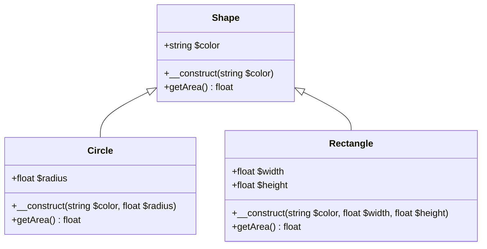

# OOP Advanced

In chapter 8 you learned the basics of classes, objects, properties, and methods. Now you take the next step - inheritance, abstract classes, interfaces, traits, and namespaces. These features let you build flexible, reusable systems that scale as your projects grow.

## Inheritance

**Inheritance** lets one class reuse the properties and methods of another. The child class **extends** the parent, gaining all its capabilities while adding or changing behavior as needed.

### The extends keyword

You declare inheritance with the `extends` keyword:

```php
<?php

class Animal {
    public string $name;

    public function __construct(string $name) {
        $this->name = $name;
    }

    public function speak(): string {
        return 'Some sound';
    }
}

class Dog extends Animal {
    public function speak(): string {
        return 'Woof!';
    }
}

$dog = new Dog('Rex');
echo $dog->name;        // Output: Rex (inherited)
echo $dog->speak();     // Output: Woof! (overridden)
```

The `Dog` class inherits `$name` and `__construct` from `Animal`, but overrides `speak()` with its own implementation.

### Overriding methods

When a child class defines a method with the same name as the parent, it **overrides** the parent's version. The child's method is called when you invoke it on a child instance.

You can still call the parent's implementation using the `parent::` keyword:

```php
<?php

class Animal {
    public function speak(): string {
        return 'Some sound';
    }
}

class Dog extends Animal {
    public function speak(): string {
        $base = parent::speak();
        return $base . ' But I say: Woof!';
    }
}

$dog = new Dog();
echo $dog->speak();  // Output: Some sound But I say: Woof!
```

> **Tip:** Use `parent::` when you want to extend the parent's behavior rather than replace it entirely - for example, calling `parent::__construct()` at the start of a child constructor to initialize inherited properties.

### When to use inheritance

Use inheritance when:

- You have a clear **is-a** relationship (a Dog *is an* Animal)
- Child classes share most behavior with the parent
- You want to model a hierarchy where subtypes specialize a base type

Avoid inheritance when:

- You only need to share a few utility methods - consider traits instead
- The relationship is **has-a** rather than **is-a** - use composition (an object containing another object)
- You are tempted to create deep hierarchies - shallow hierarchies are easier to maintain

## Inheritance hierarchy example

The following diagram shows a typical inheritance structure. A base `Shape` class defines common behavior; `Circle` and `Rectangle` extend it and add their own logic.



In code:

```php
<?php

class Shape {
    public string $color;

    public function __construct(string $color) {
        $this->color = $color;
    }

    public function getArea(): float {
        return 0.0;
    }
}

class Circle extends Shape {
    public float $radius;

    public function __construct(string $color, float $radius) {
        parent::__construct($color);
        $this->radius = $radius;
    }

    public function getArea(): float {
        return M_PI * $this->radius ** 2;
    }
}

class Rectangle extends Shape {
    public float $width;
    public float $height;

    public function __construct(string $color, float $width, float $height) {
        parent::__construct($color);
        $this->width = $width;
        $this->height = $height;
    }

    public function getArea(): float {
        return $this->width * $this->height;
    }
}
```

## Abstract classes

An **abstract class** cannot be instantiated directly. It exists to be extended. You use it when you want to define a template that subclasses must follow.

### Declaring abstract classes and methods

```php
<?php

abstract class Animal {
    public string $name;

    public function __construct(string $name) {
        $this->name = $name;
    }

    abstract public function speak(): string;
}

class Dog extends Animal {
    public function speak(): string {
        return 'Woof!';
    }
}

$dog = new Dog('Rex');  // OK
$animal = new Animal('X');  // Fatal error: Cannot instantiate abstract class
```

An abstract method has no body - it ends with a semicolon. Every non-abstract child class must implement all abstract methods.

### When to use abstract vs regular classes

| Use an abstract class when... | Use a regular class when... |
|-------------------------------|------------------------------|
| You want to force subclasses to implement specific methods | You can provide complete implementations |
| The base type should never be instantiated | You may create instances of the base type |
| You share both behavior and a contract | You only share behavior |
| You need a mix of concrete and abstract methods | All methods have implementations |

> **Note:** An abstract class can have both abstract and concrete methods. Concrete methods provide shared logic; abstract methods define what subclasses must implement.

## Interfaces

An **interface** defines a contract - a set of method signatures that implementing classes must provide. Unlike abstract classes, interfaces cannot contain property definitions or method bodies.

### Declaring and implementing interfaces

```php
<?php

interface Drawable {
    public function draw(): string;
}

class Circle implements Drawable {
    public function draw(): string {
        return 'Drawing a circle';
    }
}

class Square implements Drawable {
    public function draw(): string {
        return 'Drawing a square';
    }
}
```

A class **implements** an interface with the `implements` keyword. It must provide an implementation for every method declared in the interface.

### Multiple interfaces

A class can implement multiple interfaces, separated by commas:

```php
<?php

interface Drawable {
    public function draw(): string;
}

interface Resizable {
    public function resize(float $factor): void;
}

class Circle implements Drawable, Resizable {
    public function draw(): string {
        return 'Drawing a circle';
    }

    public function resize(float $factor): void {
        // Scale the circle
    }
}
```

### Interface vs abstract class

| Aspect | Interface | Abstract class |
|--------|-----------|----------------|
| Instantiation | Never | Never |
| Method bodies | Not allowed | Allowed (concrete methods) |
| Properties | Not allowed | Allowed |
| Multiple inheritance | Yes (a class can implement many interfaces) | No (a class extends only one class) |
| Purpose | Define a contract | Share code and define a contract |
| Use when | You need a pure contract | You need shared state and behavior |

> **Tip:** Prefer interfaces when you want to define *what* a class can do without caring *how* it does it. Use abstract classes when you have shared implementation to reuse.

## Traits

**Traits** solve a limitation of single inheritance: you cannot extend more than one class. Traits let you reuse code across unrelated classes without building a deep hierarchy.

### What traits solve

Imagine you want logging behavior in both `EmailService` and `FileProcessor`. They do not share a common base, so inheritance is awkward. A trait lets you inject the same methods into both classes.

### Declaring and using traits

```php
<?php

trait LoggableTrait {
    public function log(string $message): void {
        $timestamp = date('Y-m-d H:i:s');
        echo "[$timestamp] $message\n";
    }
}

class EmailService {
    use LoggableTrait;

    public function send(string $to, string $subject): void {
        $this->log("Sending email to $to");
        // Send email...
    }
}

class FileProcessor {
    use LoggableTrait;

    public function process(string $path): void {
        $this->log("Processing file: $path");
        // Process file...
    }
}
```

The `use` keyword inside the class pulls the trait's methods into that class. Both `EmailService` and `FileProcessor` now have a `log()` method.

### Method conflicts

If a trait and a class (or multiple traits) define the same method, PHP reports a fatal error unless you resolve the conflict explicitly:

```php
<?php

trait TraitA {
    public function greet(): string {
        return 'Hello from A';
    }
}

trait TraitB {
    public function greet(): string {
        return 'Hello from B';
    }
}

class MyClass {
    use TraitA, TraitB {
        TraitA::greet insteadof TraitB;  // Use TraitA's greet, ignore TraitB's
    }
}
```

You can also create an alias:

```php
<?php

class MyClass {
    use TraitA, TraitB {
        TraitA::greet insteadof TraitB;
        TraitB::greet as greetB;  // TraitB's greet available as greetB()
    }
}
```

## The final keyword

The `final` keyword prevents further extension or overriding.

### Final classes

A final class cannot be extended:

```php
<?php

final class StringUtils {
    public static function capitalize(string $s): string {
        return ucfirst(strtolower($s));
    }
}

class ExtendedStringUtils extends StringUtils {}  // Fatal error
```

### Final methods

A final method cannot be overridden in subclasses:

```php
<?php

class Animal {
    final public function breathe(): void {
        echo 'Breathing...';
    }
}

class Dog extends Animal {
    public function breathe(): void {}  // Fatal error: Cannot override final method
}
```

> **Note:** Use `final` when you want to lock down behavior - for example, to prevent accidental overrides of critical methods or to keep a utility class from being extended.

## Namespaces

**Namespaces** avoid name collisions when you use code from multiple libraries or organize a large codebase. Without namespaces, two classes named `User` from different packages would conflict.

### Why namespaces exist

In the past, developers used long prefixes like `MyCompany_User` or `Vendor_Module_User`. Namespaces provide a cleaner, standard way to group classes and avoid clashes.

### Declaring a namespace

```php
<?php

namespace App\Services;

class EmailService {
    public function send(string $to, string $body): void {
        // ...
    }
}
```

The full class name is `App\Services\EmailService`. The namespace declaration must be the first statement in the file (after the opening `<?php` tag). Only `declare` statements may appear before it.

### Using namespaces

To use a class from another namespace, you have three options:

**1. Fully qualified name:**

```php
<?php

$service = new \App\Services\EmailService();
```

**2. The use statement (import):**

```php
<?php

use App\Services\EmailService;

$service = new EmailService();
```

**3. Alias:**

```php
<?php

use App\Services\EmailService as Mailer;

$service = new Mailer();
```

> **Tip:** Place `use` statements at the top of the file, after the namespace declaration. Group them logically (e.g., framework imports first, then your own code).

## Organizing code with namespaces

A common convention is to align namespaces with directory structure. This is the idea behind **PSR-4** autoloading (covered in chapter 14).

| Namespace | Typical directory |
|-----------|--------------------|
| `App\Controllers` | `src/Controllers/` |
| `App\Services` | `src/Services/` |
| `App\Models` | `src/Models/` |
| `Vendor\Package\Sub` | `vendor/vendor/package/src/Sub/` |

For example, the class `App\Services\EmailService` would live in `src/Services/EmailService.php`. This makes it easy to find classes and lets autoloaders map namespaces to file paths automatically.

## Autoloading basics

**Autoloading** loads class files only when a class is first used. You no longer need a long list of `require` statements at the top of every file.

### spl_autoload_register()

PHP's `spl_autoload_register()` lets you register a function that is called whenever an undefined class is used:

```php
<?php

spl_autoload_register(function (string $class): void {
    $file = __DIR__ . '/src/' . str_replace('\\', '/', $class) . '.php';
    if (file_exists($file)) {
        require $file;
    }
});

use App\Services\EmailService;
$service = new EmailService();  // Autoloader loads App/Services/EmailService.php
```

The autoloader receives the fully qualified class name. It converts backslashes to forward slashes and looks for a matching file. This connects namespaces directly to the filesystem.

### Composer autoloading preview

In real projects you typically use **Composer** (chapter 14) for autoloading. Composer generates an optimized autoloader that follows PSR-4. You include it with:

```php
<?php

require __DIR__ . '/vendor/autoload.php';
```

After that, any class in your `composer.json` autoload configuration is loaded automatically when first referenced.

## Type hinting with interfaces and classes

You can type-hint parameters and return types with class names or interfaces. This makes your code more predictable and enables **dependency injection** - passing dependencies into a class instead of creating them inside it.

### Accepting objects by interface type

```php
<?php

interface NotifierInterface {
    public function notify(string $message): void;
}

class NotificationService {
    public function __construct(
        private NotifierInterface $notifier
    ) {}

    public function sendAlert(string $message): void {
        $this->notifier->notify($message);
    }
}
```

`NotificationService` does not care whether it receives an `EmailNotifier`, `SmsNotifier`, or any other implementation. It only requires something that implements `NotifierInterface`. You can swap implementations without changing `NotificationService` - that is the power of programming to interfaces.

> **Tip:** Type-hint against interfaces when you want flexibility. Type-hint against concrete classes only when you truly need that specific implementation.

## Practical example: notification system

Here is a complete example that ties together interfaces, multiple implementations, and a trait.

### The interface

```php
<?php

namespace App\Notifications;

interface NotifierInterface {
    public function notify(string $message): void;
}
```

### The trait

```php
<?php

namespace App\Notifications;

trait LoggableTrait {
    protected function log(string $message): void {
        $timestamp = date('Y-m-d H:i:s');
        $class = static::class;
        echo "[$timestamp] [$class] $message\n";
    }
}
```

### The service class

```php
<?php

namespace App\Notifications;

class NotificationService {
    public function __construct(
        private NotifierInterface $notifier
    ) {}

    public function sendAlert(string $message): void {
        $this->notifier->notify($message);
    }
}
```

### Implementations

```php
<?php

namespace App\Notifications;

class EmailNotifier implements NotifierInterface {
    use LoggableTrait;

    public function __construct(
        private string $recipient
    ) {}

    public function notify(string $message): void {
        $this->log("Sending email to {$this->recipient}: $message");
        // mail($this->recipient, 'Notification', $message);
    }
}

class SmsNotifier implements NotifierInterface {
    use LoggableTrait;

    public function __construct(
        private string $phoneNumber
    ) {}

    public function notify(string $message): void {
        $this->log("Sending SMS to {$this->phoneNumber}: $message");
        // Call SMS API...
    }
}
```

### Using the system

```php
<?php

use App\Notifications\EmailNotifier;
use App\Notifications\SmsNotifier;
use App\Notifications\NotificationService;

// Email notifications
$emailNotifier = new EmailNotifier('user@example.com');
$emailService = new NotificationService($emailNotifier);
$emailService->sendAlert('Your order has shipped!');

// SMS notifications -- same interface, different implementation
$smsNotifier = new SmsNotifier('+1234567890');
$smsService = new NotificationService($smsNotifier);
$smsService->sendAlert('Your verification code is 12345.');
```

Both notifiers implement `NotifierInterface`, so `NotificationService` works with either. The `LoggableTrait` adds logging to both without duplicating code. This pattern - interface plus implementations plus optional traits - is common in well-structured PHP applications.

## Summary

- **Inheritance** lets a class extend another with `extends`; use `parent::` to call the parent's methods.
- **Abstract classes** cannot be instantiated; they define abstract methods that subclasses must implement.
- **Interfaces** define a contract (method signatures only); a class can `implements` multiple interfaces.
- **Traits** provide code reuse without inheritance; use `use TraitName` inside a class.
- The **final** keyword prevents a class from being extended or a method from being overridden.
- **Namespaces** avoid name collisions; declare with `namespace` and import with `use`.
- **Autoloading** loads classes on demand; `spl_autoload_register()` connects namespaces to file paths.
- **Type hinting** with interfaces enables flexible, testable code via dependency injection.

## Next up

[Error Handling & Debugging](./10-error-handling.md) - exceptions, error levels, try/catch, custom exceptions, and debugging tools.
