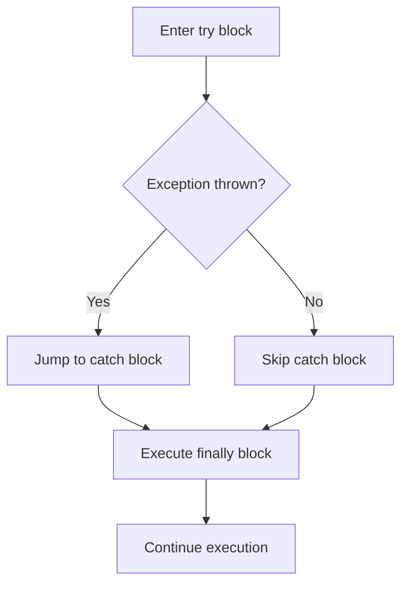

# Error Handling & Debugging

Every program encounters errors. The difference between frustration and productivity is knowing how to find, understand,
and handle them. This chapter covers PHP's error system, exceptions, and the tools you need to debug effectively.

## Types of errors

PHP errors fall into three broad categories:

| Category         | When it happens          | Example                                               |
|------------------|--------------------------|-------------------------------------------------------|
| **Syntax error** | Before execution         | Missing semicolon, unclosed bracket                   |
| **Runtime error**| During execution         | Calling an undefined function, dividing by zero       |
| **Logic error**  | Code runs but gives wrong results | Off-by-one in a loop, wrong condition in an if |

Syntax errors prevent PHP from running your script at all. Runtime errors crash during execution. Logic errors are the
hardest to find because PHP does not tell you about them - your code runs fine but produces the wrong output.

## Error levels

PHP classifies runtime errors by severity. Each level has a constant:

| Constant         | Level   | Description                                                    | Example                            |
|------------------|---------|----------------------------------------------------------------|------------------------------------|
| `E_ERROR`        | Fatal   | Unrecoverable error; script stops immediately                  | Calling an undefined function      |
| `E_WARNING`      | Warning | Non-fatal; script continues but something is wrong             | Including a file that doesn't exist|
| `E_NOTICE`       | Notice  | Minor issue; script continues                                  | Using an undefined variable        |
| `E_PARSE`        | Parse   | Syntax error; script cannot be compiled                        | Missing semicolon                  |
| `E_DEPRECATED`   | Deprecated | Feature will be removed in a future version                | Using a deprecated function        |
| `E_STRICT`       | Strict  | Suggestions for forward compatibility (removed in PHP 8)       | Non-static method called statically|

> **Tip:** In development, you want to see **all** errors. In production, you want to **log** them but never display
> them to users.

## Configuring error reporting

### In your script

```php
<?php

// Show all errors (recommended for development)
error_reporting(E_ALL);
ini_set('display_errors', '1');
```

### In php.ini

For development:

```
error_reporting = E_ALL
display_errors = On
log_errors = On
error_log = /tmp/php-errors.log
```

For production:

```
error_reporting = E_ALL
display_errors = Off
log_errors = On
error_log = /var/log/php/errors.log
```

> **Warning:** Never set `display_errors = On` in production. Error messages can reveal file paths, database
> credentials, and internal logic to attackers.

### Checking your configuration

```php
<?php

echo 'error_reporting: ' . error_reporting() . "\n";
echo 'display_errors: ' . ini_get('display_errors') . "\n";
echo 'log_errors: ' . ini_get('log_errors') . "\n";
echo 'error_log: ' . ini_get('error_log') . "\n";
```

## Exceptions

Exceptions are PHP's modern error handling mechanism. Instead of cryptic error messages, exceptions let you **throw** an
error and **catch** it in a controlled way.

### Throwing an exception

```php
<?php

function divide(float $a, float $b): float
{
    if ($b == 0) {
        throw new Exception('Division by zero is not allowed');
    }

    return $a / $b;
}
```

When PHP hits `throw`, it immediately stops executing the current function and looks for a `catch` block.

### try / catch / finally

```php
<?php

try {
    $result = divide(10, 0);
    echo "Result: $result";
} catch (Exception $e) {
    echo 'Error: ' . $e->getMessage();
} finally {
    echo "\nThis always runs, whether there was an error or not.";
}
```

How it works:

1. PHP executes the code inside `try`
2. If an exception is thrown, PHP jumps to the `catch` block
3. If no exception is thrown, the `catch` block is skipped
4. The `finally` block always runs - whether an exception occurred or not



### The Exception object

When you catch an exception, you get an object with useful methods:

| Method            | Returns                                    |
|-------------------|--------------------------------------------|
| `getMessage()`    | The error message string                   |
| `getCode()`       | The error code (integer)                   |
| `getFile()`       | The file where the exception was thrown     |
| `getLine()`       | The line number where it was thrown         |
| `getTrace()`      | Array of the call stack                    |
| `getTraceAsString()` | Call stack as a readable string         |
| `getPrevious()`   | The previous exception (if chained)        |

```php
<?php

try {
    throw new Exception('Something went wrong', 42);
} catch (Exception $e) {
    echo 'Message: ' . $e->getMessage() . "\n";
    echo 'Code: ' . $e->getCode() . "\n";
    echo 'File: ' . $e->getFile() . "\n";
    echo 'Line: ' . $e->getLine() . "\n";
    echo "Trace:\n" . $e->getTraceAsString() . "\n";
}
```

### Catching specific exception types

PHP has a hierarchy of built-in exception classes. You can catch different types separately:

```php
<?php

try {
    $data = json_decode('invalid json', true, 512, JSON_THROW_ON_ERROR);
} catch (JsonException $e) {
    echo 'JSON error: ' . $e->getMessage();
} catch (Exception $e) {
    echo 'Other error: ' . $e->getMessage();
}
```

> **Tip:** Always catch the most specific exception type first. PHP checks catch blocks from top to bottom and uses the
> first one that matches. If you put `Exception` first, it catches everything and the more specific blocks never run.

Common built-in exception classes:

| Class                  | When it's thrown                                |
|------------------------|-------------------------------------------------|
| `InvalidArgumentException` | A function received an invalid argument     |
| `RuntimeException`     | An error detected at runtime                    |
| `LogicException`       | An error in the program logic                   |
| `OverflowException`    | Adding to a full container                      |
| `UnderflowException`   | Removing from an empty container                |
| `DomainException`      | Value outside the valid domain                  |
| `RangeException`       | Value outside a valid range                     |
| `TypeError`            | Wrong type passed to a function (PHP 7+)        |
| `ValueError`           | Correct type but invalid value (PHP 8+)         |
| `JsonException`        | JSON encode/decode error (with JSON_THROW_ON_ERROR) |

## Custom exception classes

Create your own exception classes to represent specific error conditions in your application:

```php
<?php

class ValidationException extends RuntimeException
{
    private array $errors;

    public function __construct(array $errors, int $code = 0, ?\Throwable $previous = null)
    {
        $this->errors = $errors;
        $message = 'Validation failed: ' . implode(', ', $errors);
        parent::__construct($message, $code, $previous);
    }

    public function getErrors(): array
    {
        return $this->errors;
    }
}

class NotFoundException extends RuntimeException
{
    public function __construct(string $entity, int|string $id)
    {
        parent::__construct("$entity with ID $id not found");
    }
}
```

Using them:

```php
<?php

function findUser(int $id): array
{
    // Simulate a database lookup
    $users = [1 => 'Alice', 2 => 'Bob'];

    if (!isset($users[$id])) {
        throw new NotFoundException('User', $id);
    }

    return ['id' => $id, 'name' => $users[$id]];
}

try {
    $user = findUser(99);
} catch (NotFoundException $e) {
    echo $e->getMessage();  // "User with ID 99 not found"
}
```

## Converting errors to exceptions

Older PHP code and built-in functions often trigger errors rather than throwing exceptions. You can convert these to
exceptions using `set_error_handler()`:

```php
<?php

set_error_handler(function (int $severity, string $message, string $file, int $line): bool {
    throw new ErrorException($message, 0, $severity, $file, $line);
});

try {
    $result = 1 / 0;  // Triggers a DivisionByZeroError in PHP 8
} catch (ErrorException $e) {
    echo 'Caught: ' . $e->getMessage();
}

restore_error_handler();
```

> **Note:** In PHP 8, many errors that were previously warnings or notices are now proper exceptions (e.g.,
> `TypeError`, `ValueError`, `DivisionByZeroError`). You need `set_error_handler()` less often than in earlier versions.

## Debugging techniques

### var_dump and print_r

You already know `var_dump()` from chapter 2. Here are some patterns for effective debugging:

```php
<?php

$data = ['users' => [['name' => 'Alice', 'age' => 30], ['name' => 'Bob', 'age' => 25]]];

// var_dump shows types and values
var_dump($data);

// print_r is more readable for arrays
print_r($data);

// Wrap in <pre> tags for browser output
echo '<pre>';
print_r($data);
echo '</pre>';

// Dump and die -- stop execution immediately after dumping
var_dump($data);
die();  // or exit();
```

### Reading error logs

When `display_errors` is off, errors go to the log file. Check it with:

```bash
# Show the last 50 lines
tail -50 /tmp/php-errors.log

# Follow the log in real time
tail -f /tmp/php-errors.log
```

### Reading stack traces

A stack trace shows you the chain of function calls that led to an error:

```
Fatal error: Uncaught Exception: Division by zero in /app/math.php:5
Stack trace:
#0 /app/calculator.php(12): divide(10, 0)
#1 /app/index.php(8): calculate('divide', 10, 0)
#2 {main}
  thrown in /app/math.php on line 5
```

Read it from bottom to top:

1. `{main}` - the script started in `index.php`
2. `index.php` line 8 called `calculate()`
3. `calculator.php` line 12 called `divide()`
4. `math.php` line 5 threw the exception

## Xdebug

Xdebug is a PHP extension that adds step-through debugging, profiling, and better error output. It is the single most
useful development tool for PHP.

### Installing Xdebug

```bash
# macOS with Homebrew
pecl install xdebug

# Ubuntu/Debian
sudo apt install php-xdebug
```

Verify it is installed:

```bash
php -v
# Should show "with Xdebug v3.x.x"
```

### Configuring Xdebug for VS Code

Add to your `php.ini`:

```
[xdebug]
xdebug.mode = debug
xdebug.start_with_request = yes
xdebug.client_port = 9003
```

In VS Code, install the **PHP Debug** extension, then create a `.vscode/launch.json`:

```json
{
    "version": "0.2.0",
    "configurations": [
        {
            "name": "Listen for Xdebug",
            "type": "php",
            "request": "launch",
            "port": 9003
        }
    ]
}
```

Click the Run and Debug icon, select "Listen for Xdebug", and start your PHP server. Set breakpoints by clicking in
the gutter next to line numbers. When PHP hits a breakpoint, VS Code pauses execution and lets you:

- Inspect variable values
- Step through code line by line
- Step into and out of function calls
- Evaluate expressions in the debug console

> **Tip:** Xdebug is not required to follow this guide, but it transforms how you debug PHP. If you can install it,
> do so early.

## Common beginner mistakes

### Undefined variable

```
Warning: Undefined variable $naem in /app/index.php on line 5
```

Usually a typo. Check the variable name carefully.

### Call to a member function on null

```
Fatal error: Uncaught Error: Call to a member function getName() on null
```

You called a method on a variable that is `null` instead of an object. Check that the variable was properly initialized.

### Headers already sent

```
Warning: Cannot modify header information - headers already sent by (output started at /app/index.php:2)
```

You tried to set a header (or start a session, or set a cookie) after output was already sent to the browser. Even a
blank line or space before `<?php` counts as output. Make sure `session_start()`, `setcookie()`, and `header()` calls
come before any `echo` or HTML output.

### White screen of death

If you see a completely blank page, it usually means:

1. `display_errors` is off and a fatal error occurred
2. Check your error log
3. Temporarily add `ini_set('display_errors', '1')` at the top of your script

## Best practices

- **Development:** Show all errors (`E_ALL`, `display_errors = On`)
- **Production:** Log all errors, display none (`display_errors = Off`, `log_errors = On`)
- **Use exceptions** instead of `die()` or `exit()` for error handling
- **Catch specific** exception types - avoid catching `Exception` everywhere
- **Never suppress errors** with the `@` operator (`@file_get_contents()`) - it hides problems
- **Add context** to exceptions - include relevant data like IDs, filenames, or input values
- **Clean up resources** in `finally` blocks - close files, database connections, etc.
- **Log before re-throwing** if needed - `catch`, log, then `throw` to preserve the stack trace

## Summary

- PHP has three types of errors: syntax, runtime, and logic
- Error levels range from `E_NOTICE` (minor) to `E_ERROR` (fatal)
- Use `error_reporting(E_ALL)` in development; disable `display_errors` in production
- Exceptions (`try`/`catch`/`finally`) are the modern way to handle errors
- Create custom exception classes for domain-specific errors
- `set_error_handler()` converts legacy errors to exceptions
- `var_dump()` and `print_r()` are your basic debugging tools
- Stack traces read bottom-to-top - the deepest call is at the top
- Xdebug adds step-through debugging, making complex bugs much easier to find
- Never display error details to end users in production

Next up: [Working with Files](./11-working-with-files.md) - reading, writing, and uploading files, CSV handling, and
directory operations.
