# Working with Databases

Most web applications need to store data persistently. Files work for simple cases, but when you have structured data, relationships, and the need to query efficiently, a **relational database** is the right tool. In this chapter you will learn what a relational database is, how to connect to MySQL or MariaDB with PHP's PDO extension, how to perform CRUD operations safely with prepared statements, and how to build a simple task manager application.

## What Is a Relational Database?

A **relational database** organizes data into **tables** -- think of them as spreadsheets. Each table has **columns** (fields) and **rows** (records). Tables can reference each other through **relationships**, which keeps data organized and avoids duplication.

### Tables, Rows, and Columns

| Concept | Description |
|---------|-------------|
| **Table** | A collection of related data (e.g. `users`, `tasks`, `orders`) |
| **Row** | A single record in a table |
| **Column** | A named field that holds one type of data (e.g. `name`, `email`, `created_at`) |

### Primary Keys

Every table should have a **primary key** -- a column (or combination of columns) that uniquely identifies each row. Usually this is an auto-incrementing integer called `id`:

```sql
id | name   | email
---+--------+------------------
1  | Alice  | alice@example.com
2  | Bob    | bob@example.com
```

### Foreign Keys

A **foreign key** is a column that references the primary key of another table. It establishes a relationship. For example, a `tasks` table might have a `user_id` column that references `users.id`:

```sql
-- users table
id | name
---+------
1  | Alice
2  | Bob

-- tasks table (user_id references users.id)
id | user_id | title      | done
---+---------+------------+-----
1  | 1       | Buy milk   | 0
2  | 1       | Call mom   | 1
3  | 2       | Fix bug    | 0
```

This lets you query "all tasks for user Alice" by joining the tables. Foreign keys also enforce **referential integrity** -- you cannot insert a task with `user_id = 99` if no user with `id = 99` exists (when constraints are enabled).

## MySQL vs MariaDB vs SQLite

PHP can work with several database engines. Here is a quick comparison:

| Database | Type | Best for | Notes |
|----------|------|----------|-------|
| **MySQL** | Server | Production web apps | Widely used, owned by Oracle |
| **MariaDB** | Server | Production web apps | MySQL fork, drop-in replacement, community-driven |
| **SQLite** | File-based | Prototypes, small apps, embedded | Single file, no server, zero config |

For this guide we use **MySQL** or **MariaDB**. The PHP code is identical for both -- they speak the same protocol. SQLite is simpler to set up but behaves differently for connections and concurrency; we focus on the server-based approach you will use in most production environments.

> **Note:** MariaDB is a community fork of MySQL. If you have MariaDB installed, everything in this chapter works the same way.

## Installing MySQL or MariaDB

You need a running database server before you can connect from PHP.

### macOS (Homebrew)

```bash
# MySQL
brew install mysql
brew services start mysql

# Or MariaDB
brew install mariadb
brew services start mariadb
```

After installation, run the security script (MySQL) or set the root password. By default, the root user has no password -- you should set one for local development.

### Linux (Debian/Ubuntu)

```bash
sudo apt update
sudo apt install mysql-server
sudo systemctl start mysql
sudo mysql_secure_installation
```

For MariaDB:

```bash
sudo apt install mariadb-server
sudo systemctl start mariadb
```

### Windows

**XAMPP** bundles Apache, PHP, MySQL, and phpMyAdmin. Download from [apachefriends.org](https://www.apachefriends.org/), install, and start MySQL from the XAMPP Control Panel. This is the simplest option for getting started on Windows.

> **Tip:** After installation, verify the server is running with `mysql -u root -p` (or `mariadb -u root -p`). If you can connect, you are ready to use it from PHP.

## Connecting to a Database

PHP offers two main extensions for MySQL/MariaDB: **mysqli** and **PDO**. We use **PDO** (PHP Data Objects) because it:

- Supports multiple database drivers (MySQL, PostgreSQL, SQLite) with the same API
- Uses prepared statements by default, which protect against SQL injection
- Throws exceptions for errors when configured properly
- Is the recommended approach in modern PHP

### PDO and the DSN

To connect, you create a `PDO` instance with a **DSN** (Data Source Name) -- a string that describes the database type, host, database name, and options:

```php
<?php

$host = 'localhost';
$dbname = 'myapp';
$username = 'root';
$password = '';

$dsn = "mysql:host=$host;dbname=$dbname;charset=utf8mb4";

try {
    $pdo = new PDO($dsn, $username, $password);
} catch (PDOException $e) {
    die('Connection failed: ' . $e->getMessage());
}
```

The DSN format for MySQL is `mysql:host=HOST;dbname=DBNAME;charset=CHARSET`. Always include `charset=utf8mb4` so PHP and MySQL agree on character encoding (important for emoji and international text).

> **Warning:** Never hardcode credentials in source code for production. Use environment variables or a config file that is not committed to version control.

## Creating a Database and Table

Before you can run queries, you need a database and at least one table. You can create them via the `mysql` or `mariadb` CLI, or from PHP.

### CREATE DATABASE and USE

```sql
CREATE DATABASE myapp CHARACTER SET utf8mb4 COLLATE utf8mb4_unicode_ci;
USE myapp;
```

The `CHARACTER SET` and `COLLATE` ensure proper handling of Unicode text.

### CREATE TABLE

```sql
CREATE TABLE tasks (
    id INT AUTO_INCREMENT PRIMARY KEY,
    title VARCHAR(255) NOT NULL,
    description TEXT,
    done BOOLEAN DEFAULT FALSE,
    created_at DATETIME DEFAULT CURRENT_TIMESTAMP,
    updated_at DATETIME DEFAULT CURRENT_TIMESTAMP ON UPDATE CURRENT_TIMESTAMP
);
```

Common column types:

| Type | Use for |
|------|---------|
| `INT` | Whole numbers (IDs, counts) |
| `VARCHAR(n)` | Short text up to n characters |
| `TEXT` | Long text (descriptions, content) |
| `DATETIME` | Date and time |
| `BOOLEAN` | True/false (stored as 0/1 in MySQL) |
| `DECIMAL(m,d)` | Precise numbers (prices, amounts) |

`AUTO_INCREMENT` makes `id` increase automatically for each new row. `PRIMARY KEY` marks it as the unique identifier. `NOT NULL` means the column cannot be empty. `DEFAULT` provides a value when none is given.

From PHP, you can run these statements with `$pdo->exec()`:

```php
<?php

$pdo->exec("CREATE DATABASE IF NOT EXISTS myapp CHARACTER SET utf8mb4 COLLATE utf8mb4_unicode_ci");
$pdo->exec("USE myapp");
$pdo->exec("CREATE TABLE IF NOT EXISTS tasks (
    id INT AUTO_INCREMENT PRIMARY KEY,
    title VARCHAR(255) NOT NULL,
    description TEXT,
    done BOOLEAN DEFAULT FALSE,
    created_at DATETIME DEFAULT CURRENT_TIMESTAMP,
    updated_at DATETIME DEFAULT CURRENT_TIMESTAMP ON UPDATE CURRENT_TIMESTAMP
)");
```

> **Note:** For production, create the database and tables manually or via migrations. Using `exec()` for schema changes in application code is fine for learning and small projects.

## CRUD Operations with PDO

**CRUD** stands for Create, Read, Update, Delete -- the four basic operations on data. You will use these constantly.

### CREATE: INSERT

Use `prepare()` and `execute()` to insert data safely. Never concatenate user input into SQL.

```php
<?php

$stmt = $pdo->prepare('INSERT INTO tasks (title, description, done) VALUES (:title, :description, :done)');
$stmt->execute([
    ':title' => 'Learn PDO',
    ':description' => 'Study prepared statements and CRUD',
    ':done' => false,
]);
$newId = $pdo->lastInsertId();
echo "Created task with ID: $newId";
```

`prepare()` returns a `PDOStatement`. You pass an array of values to `execute()`, and PDO binds them safely. `lastInsertId()` returns the auto-generated ID of the inserted row.

### READ: SELECT

For a single row, use `fetch()`:

```php
<?php

$stmt = $pdo->prepare('SELECT * FROM tasks WHERE id = :id');
$stmt->execute([':id' => 1]);
$task = $stmt->fetch(PDO::FETCH_ASSOC);

if ($task) {
    echo $task['title'];
}
```

For multiple rows, use `fetchAll()`:

```php
<?php

$stmt = $pdo->query('SELECT * FROM tasks ORDER BY created_at DESC');
$tasks = $stmt->fetchAll(PDO::FETCH_ASSOC);

foreach ($tasks as $task) {
    echo $task['title'] . "\n";
}
```

When no user input is involved, `query()` is acceptable. For any value that comes from the user, use `prepare()` and `execute()`.

### Fetch Modes

`fetch()` and `fetchAll()` accept a fetch mode that controls the structure of the returned data:

| Mode | Result |
|------|--------|
| `PDO::FETCH_ASSOC` | Associative array: `['id' => 1, 'title' => '...']` |
| `PDO::FETCH_OBJ` | Object: `$task->title` |
| `PDO::FETCH_NUM` | Numeric array: `[0 => 1, 1 => '...']` |
| `PDO::FETCH_CLASS` | Instance of a class with properties set from columns |

```php
<?php

// Associative array (default for FETCH_ASSOC)
$task = $stmt->fetch(PDO::FETCH_ASSOC);
echo $task['title'];

// Object
$task = $stmt->fetch(PDO::FETCH_OBJ);
echo $task->title;
```

### UPDATE

```php
<?php

$stmt = $pdo->prepare('UPDATE tasks SET title = :title, done = :done WHERE id = :id');
$stmt->execute([
    ':title' => 'Updated title',
    ':done' => true,
    ':id' => 1,
]);
$affected = $stmt->rowCount();
```

Always include a `WHERE` clause. Without it, the update affects every row in the table.

### DELETE

```php
<?php

$stmt = $pdo->prepare('DELETE FROM tasks WHERE id = :id');
$stmt->execute([':id' => 1]);
$deleted = $stmt->rowCount();
```

Again, never omit `WHERE` unless you intend to delete all rows.

> **Warning:** `UPDATE` and `DELETE` without `WHERE` modify or remove every row. Double-check your queries before running them.

## Prepared Statements and SQL Injection

**SQL injection** is one of the most dangerous vulnerabilities in web applications. It occurs when an attacker inserts malicious SQL into your query by manipulating user input.

### The Vulnerable Pattern

```php
<?php

// NEVER DO THIS
$id = $_GET['id'];
$stmt = $pdo->query("SELECT * FROM tasks WHERE id = $id");
```

If the user sends `?id=1 OR 1=1`, the query becomes `SELECT * FROM tasks WHERE id = 1 OR 1=1`, which returns all rows. Worse, an attacker could craft input to drop tables or extract data.

### The Safe Pattern: Prepared Statements

With prepared statements, you send the SQL structure and the data separately. The database treats the user input as data only, never as executable SQL:

```php
<?php

$id = $_GET['id'];
$stmt = $pdo->prepare('SELECT * FROM tasks WHERE id = :id');
$stmt->execute([':id' => $id]);
```

Even if `$id` is `1 OR 1=1`, it is treated as a literal string. The query will look for a row where `id` equals that exact string, and find nothing.

### Named vs Positional Placeholders

PDO supports two placeholder styles:

**Named placeholders** (recommended for clarity):

```php
<?php

$stmt = $pdo->prepare('INSERT INTO tasks (title, done) VALUES (:title, :done)');
$stmt->execute([':title' => 'Task', ':done' => false]);
```

**Positional placeholders** (use `?`):

```php
<?php

$stmt = $pdo->prepare('INSERT INTO tasks (title, done) VALUES (?, ?)');
$stmt->execute(['Task', false]);
```

Named placeholders make the code easier to read and maintain when you have many parameters.

### Rule: Never Concatenate User Input

> **Warning:** Never concatenate or interpolate user input into SQL strings. Always use prepared statements with placeholders. This applies to `$_GET`, `$_POST`, `$_REQUEST`, cookies, and any data that originates outside your application.

## SQL Injection vs Prepared Statements

The following diagram shows the difference between a vulnerable flow and a safe flow:

```mermaid
flowchart TD
    subgraph Vulnerable["Vulnerable (SQL Injection)"]
        A1[User input: 1 OR 1=1] --> B1[Concatenated into SQL]
        B1 --> C1["SELECT * FROM tasks WHERE id = 1 OR 1=1"]
        C1 --> D1[Database executes full string]
        D1 --> E1[All rows returned - attacker wins]
    end

    subgraph Safe["Safe (Prepared Statements)"]
        A2[User input: 1 OR 1=1] --> B2[Bound as data parameter]
        B2 --> C2[Query structure: SELECT * FROM tasks WHERE id = ?]
        C2 --> D2[Database treats input as literal value]
        D2 --> E2[No matching row - attacker fails]
    end
```



With prepared statements, the database parses the query structure once and treats user input as data. The attacker cannot change the SQL structure.

## Error Handling

By default, PDO fails silently or uses warnings. For robust error handling, set the error mode to **exception**:

```php
<?php

$pdo = new PDO($dsn, $username, $password);
$pdo->setAttribute(PDO::ATTR_ERRMODE, PDO::ERRMODE_EXCEPTION);
```

Now any database error throws a `PDOException`. Wrap database operations in try/catch:

```php
<?php

try {
    $stmt = $pdo->prepare('INSERT INTO tasks (title) VALUES (:title)');
    $stmt->execute([':title' => $title]);
} catch (PDOException $e) {
    error_log('Database error: ' . $e->getMessage());
    throw new Exception('Something went wrong. Please try again.');
}
```

> **Tip:** Log the full error for debugging but show a generic message to users. Never expose database internals (table names, column names, SQL) in error messages.

### Error Modes

| Mode | Behavior |
|------|----------|
| `PDO::ERRMODE_SILENT` | Default; no exception, check return values |
| `PDO::ERRMODE_WARNING` | Emits PHP warnings |
| `PDO::ERRMODE_EXCEPTION` | Throws `PDOException` (recommended) |

## Transactions

A **transaction** groups multiple database operations into a single unit. Either all succeed, or all are rolled back. This is essential when you need consistency -- for example, transferring money between two accounts.

```php
<?php

try {
    $pdo->beginTransaction();

    $pdo->prepare('UPDATE accounts SET balance = balance - 100 WHERE id = 1')->execute();
    $pdo->prepare('UPDATE accounts SET balance = balance + 100 WHERE id = 2')->execute();

    $pdo->commit();
} catch (PDOException $e) {
    $pdo->rollBack();
    throw $e;
}
```

If `commit()` is never called (e.g. because an exception occurs), `rollBack()` undoes all changes since `beginTransaction()`.

### When to Use Transactions

Use transactions when:

- Multiple related inserts/updates must succeed or fail together
- You are moving data between tables (e.g. order + order items)
- You need to avoid partial updates (e.g. half a transfer completed)

For simple single-statement operations, transactions add no benefit.

## Practical Example: A Tasks CRUD Application

Here is a minimal task manager that uses everything you have learned. Create the table first (see the "Creating a Database and Table" section), then use this script.

```php
<?php

$host = 'localhost';
$dbname = 'myapp';
$username = 'root';
$password = '';
$dsn = "mysql:host=$host;dbname=$dbname;charset=utf8mb4";

try {
    $pdo = new PDO($dsn, $username, $password);
    $pdo->setAttribute(PDO::ATTR_ERRMODE, PDO::ERRMODE_EXCEPTION);
} catch (PDOException $e) {
    die('Connection failed: ' . $e->getMessage());
}

// Handle form actions
$message = '';
$error = '';

if ($_SERVER['REQUEST_METHOD'] === 'POST') {
    $action = $_POST['action'] ?? '';

    if ($action === 'create') {
        $title = trim($_POST['title'] ?? '');
        if ($title !== '') {
            $stmt = $pdo->prepare('INSERT INTO tasks (title, description) VALUES (:title, :description)');
            $stmt->execute([
                ':title' => $title,
                ':description' => trim($_POST['description'] ?? ''),
            ]);
            $message = 'Task created.';
        } else {
            $error = 'Title is required.';
        }
    } elseif ($action === 'toggle' && isset($_POST['id'])) {
        $stmt = $pdo->prepare('UPDATE tasks SET done = NOT done WHERE id = :id');
        $stmt->execute([':id' => (int) $_POST['id']]);
        $message = 'Task updated.';
    } elseif ($action === 'delete' && isset($_POST['id'])) {
        $stmt = $pdo->prepare('DELETE FROM tasks WHERE id = :id');
        $stmt->execute([':id' => (int) $_POST['id']]);
        $message = 'Task deleted.';
    }
}

// Fetch all tasks
$tasks = $pdo->query('SELECT * FROM tasks ORDER BY created_at DESC')->fetchAll(PDO::FETCH_ASSOC);
?>
<!DOCTYPE html>
<html>
<head>
    <title>Task Manager</title>
</head>
<body>
    <h1>Task Manager</h1>

    <?php if ($message): ?>
        <p><?php echo htmlspecialchars($message); ?></p>
    <?php endif; ?>
    <?php if ($error): ?>
        <p class="error"><?php echo htmlspecialchars($error); ?></p>
    <?php endif; ?>

    <h2>Add Task</h2>
    <form method="post" action="">
        <input type="hidden" name="action" value="create">
        <input type="text" name="title" placeholder="Task title" required>
        <textarea name="description" placeholder="Description (optional)" rows="2"></textarea>
        <button type="submit">Add</button>
    </form>

    <h2>Tasks</h2>
    <ul>
        <?php foreach ($tasks as $task): ?>
            <li>
                <form method="post" action="" style="display: inline;">
                    <input type="hidden" name="action" value="toggle">
                    <input type="hidden" name="id" value="<?php echo (int) $task['id']; ?>">
                    <input type="checkbox" <?php echo $task['done'] ? 'checked' : ''; ?> onchange="this.form.submit()">
                </form>
                <strong><?php echo htmlspecialchars($task['title']); ?></strong>
                <?php if ($task['description']): ?>
                    — <?php echo htmlspecialchars($task['description']); ?>
                <?php endif; ?>
                <form method="post" action="" style="display: inline;">
                    <input type="hidden" name="action" value="delete">
                    <input type="hidden" name="id" value="<?php echo (int) $task['id']; ?>">
                    <button type="submit">Delete</button>
                </form>
            </li>
        <?php endforeach; ?>
    </ul>
    <?php if (empty($tasks)): ?>
        <p>No tasks yet. Add one above.</p>
    <?php endif; ?>
</body>
</html>
```

This script:

1. Connects with PDO and sets exception mode
2. Handles POST for create, toggle (done), and delete
3. Uses prepared statements for all user input
4. Fetches all tasks and displays them
5. Escapes output with `htmlspecialchars()` to prevent XSS

You can extend it with an edit form, validation, or pagination. The core pattern -- connect, prepare, execute, fetch -- stays the same.

## Summary

- **Relational databases** store data in tables with rows and columns. Primary keys uniquely identify rows; foreign keys link tables.
- **MySQL and MariaDB** are server-based databases; SQLite is file-based. This guide uses MySQL/MariaDB.
- **PDO** is the preferred PHP extension for database access. It supports prepared statements, multiple drivers, and exceptions.
- **Connect** with a DSN string: `mysql:host=...;dbname=...;charset=utf8mb4`. Set `PDO::ATTR_ERRMODE` to `PDO::ERRMODE_EXCEPTION`.
- **Create tables** with `CREATE TABLE` and column types like `INT`, `VARCHAR`, `TEXT`, `DATETIME`, `BOOLEAN`.
- **CRUD**: Use `prepare()` and `execute()` for INSERT, SELECT, UPDATE, DELETE. Use `fetch()` for one row, `fetchAll()` for many. Use `FETCH_ASSOC` or `FETCH_OBJ` for readable results.
- **Prepared statements** prevent SQL injection. Never concatenate user input into SQL. Always use placeholders (`:name` or `?`).
- **Error handling**: Wrap database calls in try/catch. Log errors; show generic messages to users.
- **Transactions** group operations with `beginTransaction()`, `commit()`, and `rollBack()`. Use them when multiple related changes must succeed or fail together.

**Next up:** [Sessions & Cookies](./13-sessions-and-cookies.md) -- HTTP state management, cookies, sessions, building login/logout, and session security.
