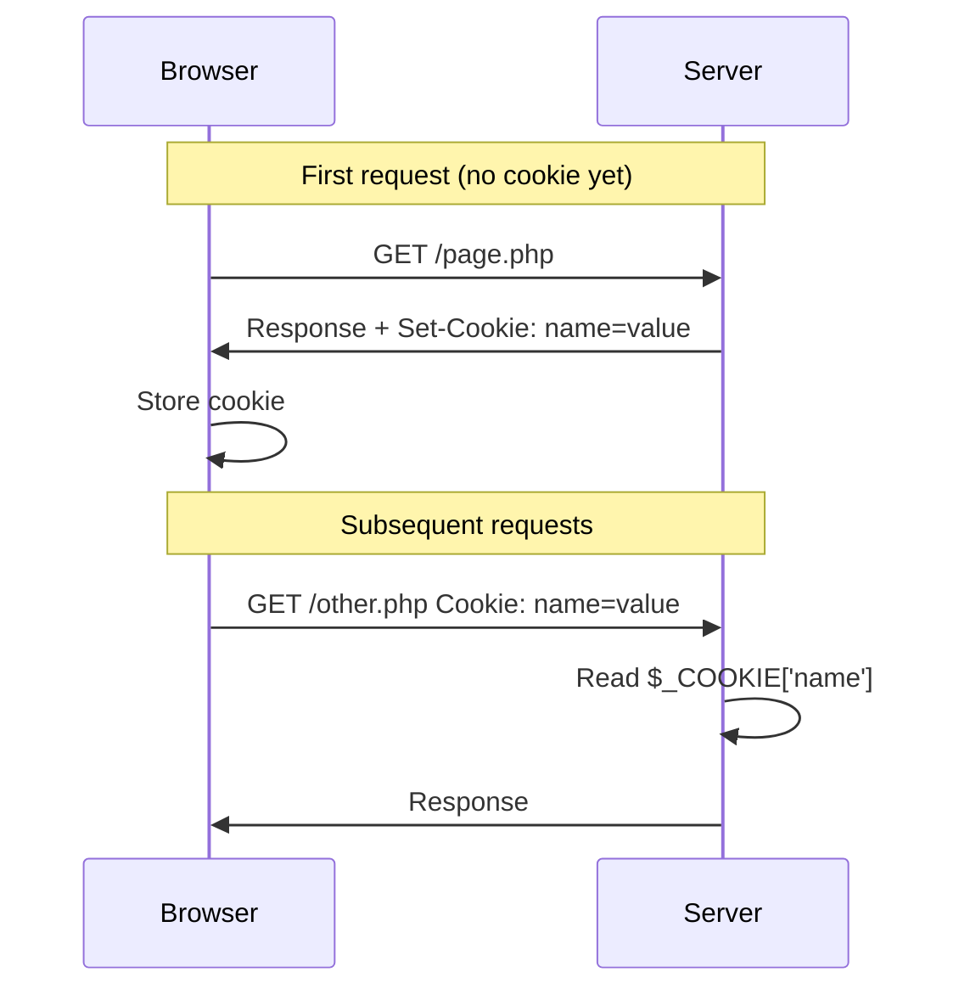
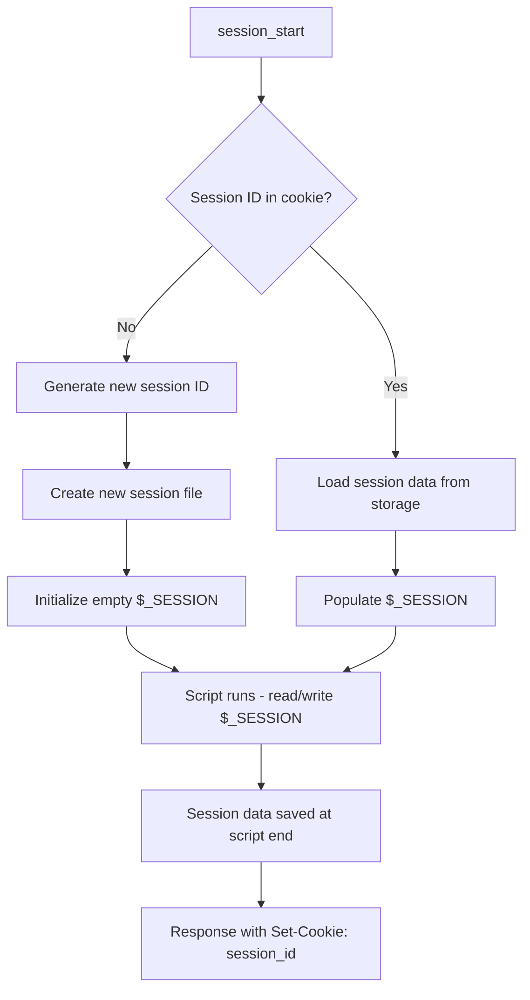

# Sessions & Cookies

Every HTTP request is independent. The server does not remember who you are from one request to the next. To build login systems, shopping carts, or personalized experiences, you need a way to persist state across requests. In this chapter you will learn how cookies and sessions work, how to use them in PHP, and how to build a secure login and logout flow.

## HTTP Is Stateless

Understanding statelessness is essential before working with cookies and sessions.

### What Stateless Means

**HTTP is stateless.** Each request stands alone. When your browser requests a page, the server processes it, sends a response, and then forgets everything. The next request is treated as if it came from a stranger. There is no built-in memory of previous requests.

This design keeps servers simple and scalable. It also means you must explicitly add mechanisms to remember users. Cookies and sessions are those mechanisms.

### Why the Server Forgets You

The server does not maintain a connection between requests. After sending the response, the connection closes. When you click a link or submit a form, a new connection is opened. The server has no way to know that this new request belongs to the same person who visited a moment ago -- unless you send identifying information with each request.

## Cookies

**Cookies** are small pieces of data the server asks the browser to store. The browser automatically sends them back with every request to that domain. They are the foundation for sessions and for storing preferences like language or theme.

### What Cookies Are

A cookie is a name-value pair plus metadata (expiry, path, domain). The server sends a `Set-Cookie` header in the response. The browser stores the cookie and includes it in the `Cookie` header of subsequent requests. Cookies are limited to about 4 KB each and are sent with every request, so avoid storing large amounts of data.

### setcookie()

PHP provides `setcookie()` to send a cookie to the browser. You must call it **before** any output (HTML, whitespace, or echo). Headers are sent before the body, and once output starts, headers cannot be modified.

```php
<?php

setcookie('user_preference', 'dark_mode', time() + 86400 * 30);
```

The first argument is the cookie name, the second is the value, and the third is the expiry time as a Unix timestamp. `time() + 86400 * 30` means the cookie expires in 30 days.

### Cookie Parameters

`setcookie()` accepts several parameters to control how the cookie behaves:

| Parameter | Purpose |
|-----------|---------|
| `name` | Cookie name (required) |
| `value` | Cookie value (empty string allowed) |
| `expires_or_options` | Expiry timestamp or array of options (PHP 7.3+) |
| `path` | Path on server where cookie is sent (default: `/`) |
| `domain` | Domain for which cookie is valid |
| `secure` | Send only over HTTPS when `true` |
| `httponly` | Inaccessible to JavaScript when `true` (helps prevent XSS theft) |
| `samesite` | `Strict`, `Lax`, or `None` (CSRF protection) |

Example with all common options:

```php
<?php

setcookie(
    'session_id',
    'abc123',
    [
        'expires'  => time() + 3600,
        'path'     => '/',
        'domain'   => '',
        'secure'   => true,
        'httponly' => true,
        'samesite' => 'Lax',
    ]
);
```

> **Tip:** For session cookies, set `httponly` to `true` so JavaScript cannot read them. This reduces the impact of XSS attacks. Set `secure` to `true` in production so cookies are only sent over HTTPS.

### $_COOKIE Superglobal

When the browser sends a cookie, PHP makes it available in the `$_COOKIE` superglobal. Keys are cookie names; values are the stored strings.

```php
<?php

$theme = $_COOKIE['user_preference'] ?? 'light_mode';
```

Always use the null coalescing operator (`??`) when reading cookies -- they may not exist if the user cleared them or never received them.

## Reading and Deleting Cookies

### Checking If a Cookie Exists

Use `isset()` or the null coalescing operator:

```php
<?php

if (isset($_COOKIE['user_preference'])) {
    $preference = $_COOKIE['user_preference'];
} else {
    $preference = 'default';
}
```

### Deleting a Cookie

To delete a cookie, set it again with an expiry in the past. The browser will remove it:

```php
<?php

setcookie('user_preference', '', time() - 3600, '/');
```

The value can be empty. The past expiry (`time() - 3600`) tells the browser to discard the cookie. You must use the same `path` (and `domain` if you set it) as when you created the cookie, or the browser may not delete it.

## How Cookies Work

The following diagram shows the cookie flow between browser and server:



The server sends `Set-Cookie` in the response. The browser stores it and automatically adds a `Cookie` header to future requests. The server reads the value from `$_COOKIE`.

## Sessions

**Sessions** solve a key limitation of cookies: you cannot safely store sensitive data (like user IDs or roles) in cookies, because the user can view and modify them. Sessions store data on the server and give the browser only a session ID in a cookie. The browser sends the ID back; the server looks up the associated data.

### What Sessions Are

A session is server-side storage keyed by a unique session ID. The session ID is stored in a cookie (or passed in the URL if cookies are disabled). When a request arrives, PHP reads the session ID, loads the corresponding data into `$_SESSION`, and lets you read and write it. The actual data never leaves the server.

### session_start() and $_SESSION

You must call `session_start()` before using `$_SESSION`. It creates a new session or resumes an existing one based on the session ID cookie. Call it at the top of every script that needs session data, and before any output.

```php
<?php

session_start();

// $_SESSION is now available
$_SESSION['user_id'] = 42;
$_SESSION['username'] = 'alice';
```

`$_SESSION` is a superglobal array. You can store strings, numbers, arrays, and objects (that are serializable). Data persists until the session expires or you destroy it.

## Setting and Reading Session Data

### Storing User Info

After a successful login, you typically store the user ID and perhaps the username:

```php
<?php

session_start();

// After validating credentials
$_SESSION['user_id'] = $user['id'];
$_SESSION['username'] = $user['username'];
$_SESSION['logged_in_at'] = time();
```

### Checking If Session Data Exists

Use `isset()` before reading:

```php
<?php

session_start();

if (isset($_SESSION['user_id'])) {
    echo 'Welcome back, ' . htmlspecialchars($_SESSION['username']);
} else {
    echo 'Please log in.';
}
```

> **Note:** Session data is stored in files (or another handler) on the server. The default location is controlled by `session.save_path` in `php.ini`. For high-traffic sites, consider Redis or Memcached as the session handler.

## Destroying Sessions

When a user logs out, you must destroy the session so the next request is treated as unauthenticated.

### session_destroy() and session_unset()

- **`session_unset()`** -- Clears all variables in `$_SESSION`. The session itself still exists.
- **`session_destroy()`** -- Deletes the session data on the server. The `$_SESSION` array is not automatically cleared in the current request.

For a proper logout, you typically clear `$_SESSION`, destroy the session, and remove the session cookie:

```php
<?php

session_start();

$_SESSION = [];
session_destroy();

if (ini_get('session.use_cookies')) {
    $params = session_get_cookie_params();
    setcookie(
        session_name(),
        '',
        time() - 42000,
        $params['path'],
        $params['domain'],
        $params['secure'],
        $params['httponly']
    );
}

header('Location: /login.php');
exit;
```

### Proper Logout Flow

1. Start the session (so you can access and clear it).
2. Clear `$_SESSION`.
3. Call `session_destroy()`.
4. Delete the session cookie (optional but recommended -- otherwise the browser may send a dead ID).
5. Redirect to the login page.

## Session Flow Diagram

The following diagram shows how sessions work from start to finish:



PHP generates a session ID when none exists, stores it in a cookie, and loads or creates session data. At the end of the script, session data is written back to storage.

## Flash Messages

A **flash message** is a one-time message shown after a redirect. Common uses: "Your profile was updated" or "Invalid password." You store the message in the session, redirect, display it on the next page, then remove it so it is not shown again.

### Storing a Flash Message

```php
<?php

session_start();

// After successful form submission
$_SESSION['flash_success'] = 'Your profile has been updated.';
header('Location: /profile.php');
exit;
```

### Displaying and Removing

On the page that displays the message:

```php
<?php

session_start();

if (isset($_SESSION['flash_success'])) {
    echo '<p class="success">' . htmlspecialchars($_SESSION['flash_success']) . '</p>';
    unset($_SESSION['flash_success']);
}
```

Always escape the message with `htmlspecialchars()` and use `unset()` to remove it after display. The same pattern works for `flash_error`, `flash_warning`, etc.

## Building a Login/Logout System

You can combine sessions with database queries (from chapter 12) to build a simple login system.

### Login Form

```php
<?php
// login.php

session_start();

if (isset($_SESSION['user_id'])) {
    header('Location: /dashboard.php');
    exit;
}

$error = '';

if ($_SERVER['REQUEST_METHOD'] === 'POST') {
    $email    = trim($_POST['email'] ?? '');
    $password = $_POST['password'] ?? '';

    if ($email === '' || $password === '') {
        $error = 'Please enter email and password.';
    } else {
        $pdo = new PDO('mysql:host=localhost;dbname=app', 'user', 'pass');
        $stmt = $pdo->prepare('SELECT id, username, password_hash FROM users WHERE email = ?');
        $stmt->execute([$email]);
        $user = $stmt->fetch(PDO::FETCH_ASSOC);

        if ($user && password_verify($password, $user['password_hash'])) {
            $_SESSION['user_id'] = $user['id'];
            $_SESSION['username'] = $user['username'];
            session_regenerate_id(true);
            header('Location: /dashboard.php');
            exit;
        } else {
            $error = 'Invalid email or password.';
        }
    }
}
?>
<!DOCTYPE html>
<html>
<head>
    <title>Login</title>
</head>
<body>
    <h1>Login</h1>
    <?php if ($error): ?>
        <p class="error"><?php echo htmlspecialchars($error); ?></p>
    <?php endif; ?>
    <form method="post" action="">
        <div>
            <label for="email">Email</label>
            <input type="email" id="email" name="email" value="<?php echo htmlspecialchars($_POST['email'] ?? ''); ?>">
        </div>
        <div>
            <label for="password">Password</label>
            <input type="password" id="password" name="password">
        </div>
        <button type="submit">Log In</button>
    </form>
</body>
</html>
```

### Protected Pages

Check for a valid session before showing protected content:

```php
<?php
// dashboard.php

session_start();

if (!isset($_SESSION['user_id'])) {
    header('Location: /login.php');
    exit;
}

echo 'Welcome, ' . htmlspecialchars($_SESSION['username']);
```

### Logout

```php
<?php
// logout.php

session_start();

$_SESSION = [];
session_destroy();

if (ini_get('session.use_cookies')) {
    $params = session_get_cookie_params();
    setcookie(session_name(), '', time() - 42000, $params['path'], $params['domain'], $params['secure'], $params['httponly']);
}

header('Location: /login.php');
exit;
```

> **Note:** The database and password verification logic assume you have a `users` table with `email`, `password_hash`, and related columns. Use `password_hash()` when registering and `password_verify()` when logging in. See chapter 12 for PDO usage.

## Session Security

Sessions are a common target for attackers. Follow these practices to reduce risk.

### Session Fixation

**Session fixation** occurs when an attacker forces a victim to use a known session ID. After the victim logs in, the attacker uses the same ID to hijack the session.

**Mitigation:** Call `session_regenerate_id(true)` after successful login. This creates a new session ID and invalidates the old one. The `true` argument deletes the old session file.

```php
<?php

// After successful login
session_regenerate_id(true);
$_SESSION['user_id'] = $user['id'];
```

### Session Hijacking

**Session hijacking** is when an attacker steals a valid session ID (e.g. via XSS or network sniffing) and uses it to impersonate the user.

**Mitigations:**

- Set the session cookie with `httponly` and `secure` so JavaScript cannot read it and it is only sent over HTTPS.
- Use HTTPS everywhere so the session ID is not sent in cleartext.
- Regenerate the session ID on login.
- Consider binding the session to the user's IP or User-Agent (with care -- these can change for legitimate users).

### Secure Cookie Settings

Configure sessions to use secure cookies. In `php.ini` or before `session_start()`:

```php
<?php

ini_set('session.cookie_httponly', 1);
ini_set('session.cookie_secure', 1);
ini_set('session.cookie_samesite', 'Lax');
```

Or use `session_set_cookie_params()`:

```php
<?php

session_set_cookie_params([
    'lifetime' => 0,
    'path'     => '/',
    'domain'   => '',
    'secure'   => true,
    'httponly' => true,
    'samesite' => 'Lax',
]);
session_start();
```

### Session Lifetime

By default, PHP sessions expire when the browser closes (session cookie with no expiry). You can set `session.gc_maxlifetime` to control how long idle sessions are kept. For sensitive applications, use a shorter lifetime (e.g. 30 minutes) and regenerate the ID periodically.

> **Warning:** Never store sensitive data in cookies. Store only the session ID. Keep user data, tokens, and permissions in `$_SESSION` on the server.

## Cookies vs Sessions

Use this table to choose between cookies and sessions:

| Aspect | Cookies | Sessions |
|--------|---------|----------|
| **Storage** | Browser (client) | Server |
| **Data size** | ~4 KB per cookie, limited total | Larger (server-dependent) |
| **User visibility** | User can view and edit | User cannot see or modify |
| **Security** | Less secure; client-controlled | More secure; server-controlled |
| **Use case** | Preferences, non-sensitive flags | Login state, cart, sensitive data |
| **Expiry** | Explicit (or session cookie) | Configurable (gc_maxlifetime) |
| **PHP API** | `setcookie()`, `$_COOKIE` | `session_start()`, `$_SESSION` |

Use cookies for non-sensitive preferences. Use sessions for authentication, shopping carts, and any data that must not be tampered with by the client.

## Summary

- **HTTP is stateless** -- the server does not remember you between requests. Cookies and sessions add state.
- **Cookies** are name-value pairs stored by the browser and sent with each request. Use `setcookie()` to set them and `$_COOKIE` to read them. Set `httponly` and `secure` for sensitive cookies.
- **Reading cookies** -- use `isset()` or `??`. **Deleting** -- set expiry to a past time with the same path/domain.
- **Sessions** store data on the server and use a session ID cookie. Call `session_start()` before using `$_SESSION`.
- **Setting and reading** -- assign to `$_SESSION` and read with `isset()` before access.
- **Destroying sessions** -- clear `$_SESSION`, call `session_destroy()`, and optionally delete the session cookie. Redirect after logout.
- **Flash messages** -- store in session, redirect, display once, then `unset()`.
- **Login/logout** -- validate credentials against the database, store user in `$_SESSION`, protect pages by checking `$_SESSION['user_id']`, and destroy the session on logout.
- **Session security** -- use `session_regenerate_id(true)` after login, set `httponly` and `secure` on the session cookie, and avoid storing sensitive data in cookies.
- **Cookies vs sessions** -- cookies for preferences; sessions for authentication and sensitive state.

**Next up:** [Composer & Packages](./14-composer-and-packages.md) -- dependency management, PSR-4 autoloading, and using third-party packages.
