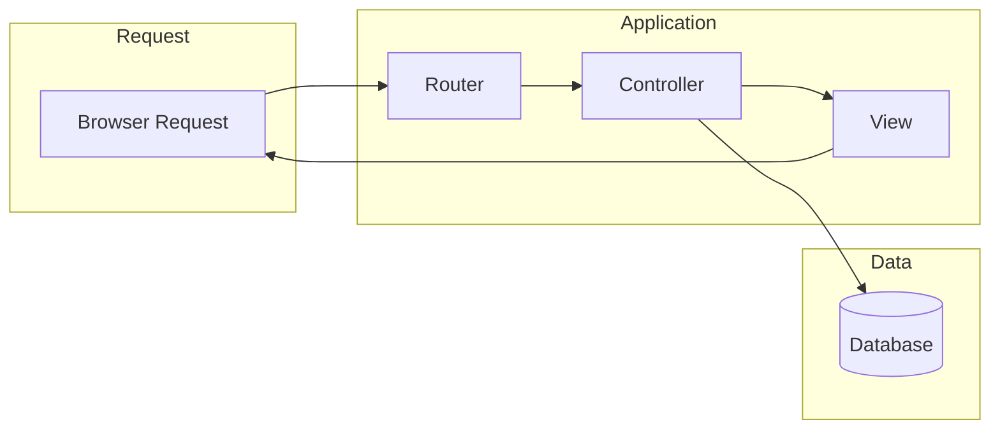

# Building a Web Application

You have learned variables, functions, OOP, forms, sessions, databases, and Composer. Now you will put it all together by building a complete **Notes** application. Users can register, log in, create notes, edit them, and delete them. This chapter walks you through the architecture, project structure, and implementation step by step.

## What We Are Building

The Notes app is a small but complete web application. It demonstrates:

- **User authentication** -- registration and login with password hashing and sessions
- **CRUD operations** -- create, read, update, and delete notes
- **Routing** -- mapping URLs to controller actions
- **Templates** -- reusable layout with header and footer
- **Database** -- MySQL/MariaDB with PDO and prepared statements

### Application Architecture

The app follows a simple MVC-like flow: the router receives the request, dispatches to a controller, and the controller interacts with the database and renders a view.



The router parses the URL and HTTP method, then calls the appropriate controller action. The controller fetches or saves data via the database layer and passes data to the view. The view renders HTML and sends it back to the browser.

## Project Structure

Create a directory called `notes-app` and set up the following structure:

```
notes-app/
├── public/
│   └── index.php          (front controller / entry point)
├── src/
│   ├── Controllers/
│   │   ├── AuthController.php
│   │   └── NoteController.php
│   ├── Models/
│   │   └── Database.php
│   ├── Router.php
│   └── helpers.php
├── templates/
│   ├── layout.php
│   ├── home.php
│   ├── login.php
│   ├── register.php
│   ├── notes/
│   │   ├── index.php
│   │   ├── create.php
│   │   └── edit.php
│   └── 404.php
├── composer.json
└── .env
```

The `public/` folder holds the single entry point. All requests go through `public/index.php`. The `src/` folder contains application logic. The `templates/` folder holds view files. Configuration and secrets go in `.env`.

> **Note:** The `.env` file should never be committed to version control. Add it to `.gitignore`.

## Setting Up Composer and Autoloading

Initialize Composer and configure PSR-4 autoloading so you can use classes without manual `require` statements.

### composer init

From the `notes-app` directory, run:

```bash
cd notes-app
composer init
```

Answer the prompts or press Enter to skip. When asked for dependencies, leave them empty for now.

### PSR-4 Autoload

Edit `composer.json` and add an `autoload` section:

```json
{
    "name": "app/notes",
    "description": "A simple Notes application",
    "require": {
        "php": ">=8.1"
    },
    "autoload": {
        "psr-4": {
            "App\\": "src/"
        }
    }
}
```

Then run:

```bash
composer dump-autoload
```

Any class in `src/` with namespace `App\` will be autoloaded. For example, `App\Controllers\AuthController` maps to `src/Controllers/AuthController.php`.

> **Tip:** After adding new classes, run `composer dump-autoload` again. Composer will regenerate the autoloader.

## The Front Controller Pattern

All HTTP requests are sent to a single entry point: `public/index.php`. This is the **front controller** pattern. The script bootstraps the application, loads the router, and dispatches the request.

Without a front controller, you would have one PHP file per page, leading to duplicated bootstrap code. With a front controller, every request goes through one file and the router decides which logic runs.

### Web Server Configuration

For the PHP built-in server, you can use the built-in router script. For Apache or Nginx, you need rewrite rules so all requests are forwarded to `index.php`.

**Apache** (`.htaccess` in `public/`):

```apache
RewriteEngine On
RewriteCond %{REQUEST_FILENAME} !-f
RewriteCond %{REQUEST_FILENAME} !-d
RewriteRule ^ index.php [QSA,L]
```

**Nginx** (inside the `server` block):

```nginx
location / {
    try_files $uri $uri/ /index.php?$query_string;
}
```

These rules send any request that does not match a real file or directory to `index.php`. The query string is preserved so the router can read it.

## Simple Router

The router maps URL paths and HTTP methods to controller actions. It parses the request URI, matches it against defined routes, and invokes the correct handler.

### Router Implementation

Create `src/Router.php`:

```php
<?php

namespace App;

class Router
{
    private array $routes = [];

    public function get(string $path, callable $handler): void
    {
        $this->routes[] = ['GET', $path, $handler];
    }

    public function post(string $path, callable $handler): void
    {
        $this->routes[] = ['POST', $path, $handler];
    }

    public function dispatch(): void
    {
        $method = $_SERVER['REQUEST_METHOD'];
        $uri = parse_url($_SERVER['REQUEST_URI'], PHP_URL_PATH);
        $uri = rtrim($uri, '/') ?: '/';

        foreach ($this->routes as $route) {
            [$routeMethod, $path, $handler] = $route;
            if ($method !== $routeMethod) {
                continue;
            }

            $pattern = preg_replace('/\{(\w+)\}/', '(?P<$1>[^/]+)', $path);
            $pattern = '#^' . $pattern . '$#';

            if (preg_match($pattern, $uri, $matches)) {
                $params = array_filter($matches, 'is_string', ARRAY_FILTER_USE_KEY);
                $handler(...array_values($params));
                return;
            }
        }

        http_response_code(404);
        require __DIR__ . '/../templates/404.php';
    }
}
```

Paths can include placeholders like `{id}`. The router matches method and path, extracts parameters, and calls the handler. If no route matches, it returns 404.

### Registering Routes

In `public/index.php`, you bootstrap the app and register routes:

```php
<?php

require __DIR__ . '/../vendor/autoload.php';

session_start();

$dotenv = parse_ini_file(__DIR__ . '/../.env');
foreach ($dotenv as $key => $value) {
    $_ENV[$key] = $value;
}

require __DIR__ . '/../src/helpers.php';

$router = new \App\Router();

$router->get('/', fn() => view('home'));
$router->get('/login', fn() => view('login'));
$router->post('/login', [\App\Controllers\AuthController::class, 'login']);
$router->get('/register', fn() => view('register'));
$router->post('/register', [\App\Controllers\AuthController::class, 'register']);
$router->post('/logout', [\App\Controllers\AuthController::class, 'logout']);

$router->get('/notes', [\App\Controllers\NoteController::class, 'index']);
$router->get('/notes/create', [\App\Controllers\NoteController::class, 'create']);
$router->post('/notes', [\App\Controllers\NoteController::class, 'store']);
$router->get('/notes/{id}/edit', [\App\Controllers\NoteController::class, 'edit']);
$router->post('/notes/{id}', [\App\Controllers\NoteController::class, 'update']);
$router->post('/notes/{id}/delete', [\App\Controllers\NoteController::class, 'delete']);

$router->dispatch();
```

The `view()` helper and controller classes are defined next. The router passes route parameters (e.g. `id`) as arguments to the controller methods.

## Database Setup

Create the database and tables, then implement a simple `Database` class to obtain PDO connections.

### Creating the Database

Run these SQL statements in MySQL or MariaDB:

```sql
CREATE DATABASE notes_app CHARACTER SET utf8mb4 COLLATE utf8mb4_unicode_ci;
USE notes_app;

CREATE TABLE users (
    id INT AUTO_INCREMENT PRIMARY KEY,
    email VARCHAR(255) NOT NULL UNIQUE,
    password VARCHAR(255) NOT NULL,
    created_at TIMESTAMP DEFAULT CURRENT_TIMESTAMP
);

CREATE TABLE notes (
    id INT AUTO_INCREMENT PRIMARY KEY,
    user_id INT NOT NULL,
    title VARCHAR(255) NOT NULL,
    body TEXT,
    created_at TIMESTAMP DEFAULT CURRENT_TIMESTAMP,
    updated_at TIMESTAMP DEFAULT CURRENT_TIMESTAMP ON UPDATE CURRENT_TIMESTAMP,
    FOREIGN KEY (user_id) REFERENCES users(id) ON DELETE CASCADE
);

CREATE INDEX idx_notes_user_id ON notes(user_id);
```

The `notes` table has a foreign key to `users` so each note belongs to one user.

### Database Class

Create `src/Models/Database.php`:

```php
<?php

namespace App\Models;

use PDO;

class Database
{
    private static ?PDO $pdo = null;

    public static function get(): PDO
    {
        if (self::$pdo === null) {
            $host = $_ENV['DB_HOST'] ?? 'localhost';
            $dbname = $_ENV['DB_NAME'] ?? 'notes_app';
            $user = $_ENV['DB_USER'] ?? 'root';
            $pass = $_ENV['DB_PASS'] ?? '';

            self::$pdo = new PDO(
                "mysql:host={$host};dbname={$dbname};charset=utf8mb4",
                $user,
                $pass,
                [
                    PDO::ATTR_ERRMODE => PDO::ERRMODE_EXCEPTION,
                    PDO::ATTR_DEFAULT_FETCH_MODE => PDO::FETCH_ASSOC,
                ]
            );
        }

        return self::$pdo;
    }
}
```

Credentials come from `.env`. Create a `.env` file in the project root:

```bash
DB_HOST=localhost
DB_NAME=notes_app
DB_USER=root
DB_PASS=your_password
```

> **Warning:** Never commit `.env` to version control. Use `.env.example` with placeholder values and copy it to `.env` for local setup.

## Templates and Layout

Views are plain PHP files that receive data via `extract()` and render HTML. A layout wraps each page with a common header and footer.

### Layout Template

Create `templates/layout.php`:

```php
<!DOCTYPE html>
<html lang="en">
<head>
    <meta charset="UTF-8">
    <meta name="viewport" content="width=device-width, initial-scale=1.0">
    <title><?= htmlspecialchars($title ?? 'Notes') ?></title>
    <link rel="stylesheet" href="/style.css">
</head>
<body>
    <header>
        <nav>
            <a href="/">Home</a>
            <?php if (isLoggedIn()): ?>
                <a href="/notes/">My Notes</a>
                <a href="/notes/create">New Note</a>
                <form action="/logout" method="post" style="display:inline">
                    <button type="submit">Logout</button>
                </form>
            <?php else: ?>
                <a href="/login">Login</a>
                <a href="/register">Register</a>
            <?php endif; ?>
        </nav>
    </header>
    <main>
        <?php if (!empty($_SESSION['flash'] ?? [])): ?>
            <?php foreach ($_SESSION['flash'] as $msg): ?>
                <div class="flash"><?= htmlspecialchars($msg) ?></div>
            <?php endforeach; ?>
            <?php unset($_SESSION['flash']); ?>
        <?php endif; ?>
        <?= $content ?? '' ?>
    </main>
    <footer>&copy; <?= date('Y') ?> Notes App</footer>
</body>
</html>
```

The layout checks `isLoggedIn()` to show different nav links, displays flash messages, and renders `$content` from the `view()` helper.

### View Helper

Create `src/helpers.php`:

```php
<?php

function view(string $name, array $data = []): void
{
    extract($data);
    ob_start();
    $viewPath = __DIR__ . '/../templates/' . $name . '.php';
    if (file_exists($viewPath)) {
        require $viewPath;
    }
    $content = ob_get_clean();
    require __DIR__ . '/../templates/layout.php';
}

function redirect(string $url, int $code = 302): void
{
    header("Location: {$url}", true, $code);
    exit;
}

function isLoggedIn(): bool
{
    return isset($_SESSION['user_id']);
}

function requireAuth(): void
{
    if (!isLoggedIn()) {
        $_SESSION['flash'] = ['Please log in to continue.'];
        redirect('/login');
    }
}

function flash(string $message): void
{
    $_SESSION['flash'] = $_SESSION['flash'] ?? [];
    $_SESSION['flash'][] = $message;
}
```

The `view()` function extracts data, includes the template, captures output into `$content`, then includes the layout. `requireAuth()` redirects unauthenticated users to the login page.

### Example View: Home

Create `templates/home.php`:

```php
<h1>Welcome to Notes</h1>
<p>Store and manage your notes. Create an account or log in to get started.</p>
```

The layout provides the wrapper.

## Authentication

Passwords are hashed with `password_hash()` and verified with `password_verify()`. Sessions store the logged-in user ID.

### AuthController

Create `src/Controllers/AuthController.php`:

```php
<?php

namespace App\Controllers;

use App\Models\Database;
use PDO;

class AuthController
{
    public static function register(): void
    {
        $email = trim($_POST['email'] ?? '');
        $password = $_POST['password'] ?? '';

        if (empty($email) || empty($password)) {
            flash('Email and password are required.');
            redirect('/register');
        }

        if (strlen($password) < 8) {
            flash('Password must be at least 8 characters.');
            redirect('/register');
        }

        $pdo = Database::get();
        $stmt = $pdo->prepare('SELECT id FROM users WHERE email = ?');
        $stmt->execute([$email]);
        if ($stmt->fetch()) {
            flash('Email already registered.');
            redirect('/register');
        }

        $hash = password_hash($password, PASSWORD_DEFAULT);
        $stmt = $pdo->prepare('INSERT INTO users (email, password) VALUES (?, ?)');
        $stmt->execute([$email, $hash]);

        $_SESSION['user_id'] = (int) $pdo->lastInsertId();
        flash('Account created. Welcome!');
        redirect('/notes');
    }

    public static function login(): void
    {
        $email = trim($_POST['email'] ?? '');
        $password = $_POST['password'] ?? '';

        if (empty($email) || empty($password)) {
            flash('Email and password are required.');
            redirect('/login');
        }

        $pdo = Database::get();
        $stmt = $pdo->prepare('SELECT id, password FROM users WHERE email = ?');
        $stmt->execute([$email]);
        $user = $stmt->fetch(PDO::FETCH_ASSOC);

        if (!$user || !password_verify($password, $user['password'])) {
            flash('Invalid email or password.');
            redirect('/login');
        }

        $_SESSION['user_id'] = (int) $user['id'];
        flash('Logged in successfully.');
        redirect('/notes');
    }

    public static function logout(): void
    {
        session_destroy();
        redirect('/');
    }
}
```

> **Note:** Call `session_start()` in `public/index.php` before any output.

### Login and Register Views

Create `templates/login.php`:

```html
<h1>Login</h1>
<form action="/login" method="post">
    <label>Email: <input type="email" name="email" required></label><br>
    <label>Password: <input type="password" name="password" required></label><br>
    <button type="submit">Login</button>
</form>
```

Create `templates/register.php`:

```html
<h1>Register</h1>
<form action="/register" method="post">
    <label>Email: <input type="email" name="email" required></label><br>
    <label>Password: <input type="password" name="password" required minlength="8"></label><br>
    <button type="submit">Create Account</button>
</form>
```

The router dispatches GET to show the form and POST to the controller.

## Notes CRUD

Every action requires authentication via `requireAuth()`.

### NoteController

Create `src/Controllers/NoteController.php`:

```php
<?php

namespace App\Controllers;

use App\Models\Database;
use PDO;

class NoteController
{
    public static function index(): void
    {
        requireAuth();
        $pdo = Database::get();
        $stmt = $pdo->prepare('SELECT * FROM notes WHERE user_id = ? ORDER BY updated_at DESC');
        $stmt->execute([$_SESSION['user_id']]);
        $notes = $stmt->fetchAll(PDO::FETCH_ASSOC);
        view('notes/index', ['notes' => $notes]);
    }

    public static function create(): void
    {
        requireAuth();
        view('notes/create');
    }

    public static function store(): void
    {
        requireAuth();
        $title = trim($_POST['title'] ?? '');
        $body = trim($_POST['body'] ?? '');

        if (empty($title)) {
            flash('Title is required.');
            redirect('/notes/create');
        }

        $pdo = Database::get();
        $stmt = $pdo->prepare('INSERT INTO notes (user_id, title, body) VALUES (?, ?, ?)');
        $stmt->execute([$_SESSION['user_id'], $title, $body]);
        flash('Note created.');
        redirect('/notes');
    }

    public static function edit(string $id): void
    {
        requireAuth();
        $note = self::findNote($id);
        if (!$note) {
            flash('Note not found.');
            redirect('/notes');
        }
        view('notes/edit', ['note' => $note]);
    }

    public static function update(string $id): void
    {
        requireAuth();
        $note = self::findNote($id);
        if (!$note) {
            flash('Note not found.');
            redirect('/notes');
        }

        $title = trim($_POST['title'] ?? '');
        $body = trim($_POST['body'] ?? '');

        if (empty($title)) {
            flash('Title is required.');
            redirect("/notes/{$id}/edit");
        }

        $pdo = Database::get();
        $stmt = $pdo->prepare('UPDATE notes SET title = ?, body = ? WHERE id = ? AND user_id = ?');
        $stmt->execute([$title, $body, $id, $_SESSION['user_id']]);
        flash('Note updated.');
        redirect('/notes');
    }

    public static function delete(string $id): void
    {
        requireAuth();
        $note = self::findNote($id);
        if (!$note) {
            flash('Note not found.');
            redirect('/notes');
        }

        $pdo = Database::get();
        $stmt = $pdo->prepare('DELETE FROM notes WHERE id = ? AND user_id = ?');
        $stmt->execute([$id, $_SESSION['user_id']]);
        flash('Note deleted.');
        redirect('/notes');
    }

    private static function findNote(string $id): ?array
    {
        $pdo = Database::get();
        $stmt = $pdo->prepare('SELECT * FROM notes WHERE id = ? AND user_id = ?');
        $stmt->execute([$id, $_SESSION['user_id']]);
        $result = $stmt->fetch(PDO::FETCH_ASSOC);
        return $result ?: null;
    }
}
```

Every query filters by `user_id`. The `findNote()` helper centralizes the ownership check.

### Note Views

Create `templates/notes/index.php`:

```php
<h1>My Notes</h1>
<a href="/notes/create">New Note</a>
<ul>
<?php foreach ($notes as $note): ?>
    <li>
        <a href="/notes/<?= $note['id'] ?>/edit"><?= htmlspecialchars($note['title']) ?></a>
        <form action="/notes/<?= $note['id'] ?>/delete" method="post" style="display:inline">
            <button type="submit" onclick="return confirm('Delete this note?')">Delete</button>
        </form>
    </li>
<?php endforeach; ?>
</ul>
```

Create `templates/notes/create.php`:

```html
<h1>New Note</h1>
<form action="/notes" method="post">
    <label>Title: <input type="text" name="title" required></label><br>
    <label>Body: <textarea name="body" rows="5"></textarea></label><br>
    <button type="submit">Create</button>
</form>
```

Create `templates/notes/edit.php`:

```html
<h1>Edit Note</h1>
<form action="/notes/<?= $note['id'] ?>" method="post">
    <label>Title: <input type="text" name="title" value="<?= htmlspecialchars($note['title']) ?>" required></label><br>
    <label>Body: <textarea name="body" rows="5"><?= htmlspecialchars($note['body']) ?></textarea></label><br>
    <button type="submit">Update</button>
</form>
<form action="/notes/<?= $note['id'] ?>/delete" method="post">
    <button type="submit" onclick="return confirm('Delete this note?')">Delete</button>
</form>
```

### 404 Page

Create `templates/404.php`:

```php
<!DOCTYPE html>
<html lang="en">
<head>
    <meta charset="UTF-8">
    <title>404 Not Found</title>
</head>
<body>
    <h1>404 - Page Not Found</h1>
    <p><a href="/">Go home</a></p>
</body>
</html>
```

The 404 page is included directly by the router.

## Running the App

Before running, ensure:

1. MySQL or MariaDB is running
2. The database and tables are created
3. `.env` has correct credentials
4. `session_start()` is called in `public/index.php` before any output

### Start the PHP Built-in Server

From the project root:

```bash
php -S localhost:8000 -t public
```

The `-t public` option sets the document root to `public/`. Requests to `http://localhost:8000` are handled by `public/index.php`.

> **Tip:** For Apache or Nginx, use the rewrite rules shown earlier.

### Test the Features

| Action | URL | Result |
|--------|-----|--------|
| Home | `GET /` | Welcome page |
| Register | `POST /register` | Creates account, redirects to notes |
| Login | `POST /login` | Logs in, redirects to notes |
| List notes | `GET /notes` | User's notes (requires login) |
| Create | `POST /notes` | Saves note |
| Edit | `GET /notes/1/edit` | Edit form |
| Update | `POST /notes/1` | Updates note |
| Delete | `POST /notes/1/delete` | Deletes note |
| Logout | `POST /logout` | Clears session |

Verify that you cannot access `/notes` when logged out.

## Where to Go From Here

You have built a working web application from scratch. As your projects grow, consider:

| Tool | Purpose |
|------|---------|
| **Laravel** / **Symfony** | Frameworks with routing, controllers, validation, and security built in |
| **Twig** / **Blade** | Templating engines with auto-escaping and template inheritance |
| **Eloquent** / **Doctrine** | ORMs that map rows to objects and handle relationships |

Next steps: add CSRF protection to forms, implement password reset, add pagination, and write tests. The concepts in this chapter -- routing, controllers, views, authentication, CRUD -- are the same in frameworks.

## Summary

- You built a complete Notes application with registration, login, and CRUD for notes
- The front controller (`public/index.php`) receives all requests; the router dispatches to controllers
- Composer PSR-4 autoloading maps `App\` namespace to `src/`
- The Database class provides a singleton PDO connection using `.env` credentials
- Templates use a layout with `extract()` and `include`; the `view()` helper renders pages
- Authentication uses `password_hash()` and `password_verify()`; sessions store `user_id`
- `requireAuth()` protects routes; notes are scoped to the logged-in user
- Run with `php -S localhost:8000 -t public`; use Apache/Nginx rewrite rules for production
- Frameworks (Laravel, Symfony), templating (Twig, Blade), and ORMs (Eloquent, Doctrine) extend these patterns

## Next up

[Practice Projects](./17-practice-projects.md) -- six project ideas from beginner to advanced to reinforce everything you learned.
