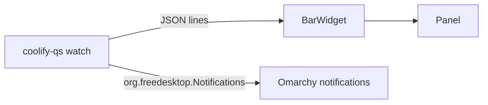

# Coolify QS

[GitHub Repository](https://github.com/LucaNerlich/coolify-qs) · [Omarchy marketplace](https://omarchyplugins.com/plugin.html?id=luca.coolify) · [Releases](https://github.com/LucaNerlich/coolify-qs/releases)

An [Omarchy](https://omarchy.org/) Quattro bar widget for [Coolify](https://coolify.io/) deployments. The bar shows which application is deploying right now (for example `⟳ website ⏳ 2`), and the panel lists current and recent deployments in one column per server -- with a desktop notification when a deployment finishes or fails.

## Why this exists

Coolify deployments are long-running things: pushes land, builds start, and minutes later they either finish or fail -- usually while you are in the editor and the browser tab is long closed. The bar is the one place that is always visible, so the widget keeps the whole deployment loop there: the running app's name while it builds, a queued count when builds pile up, and a toast the moment one settles.

## Architecture

- **Rust backend** (`coolify-qs` binary): polls each configured server's `GET /api/v1/applications`, then `GET /api/v1/deployments/applications/{uuid}` per application, aggregates the results, and streams one JSON snapshot per change. It also tracks deployment transitions across polls and sends FreeDesktop notifications (rendered by the Omarchy notification service) when a running or queued deployment finishes or fails. No shelling out -- HTTP is reqwest with rustls, notifications go over the session bus with zbus.
- **QML frontend** (`omarchy/`): a `bar-widget` plugin. `BarWidget.qml` runs `coolify-qs watch` once and updates from its JSON lines; `Panel.qml` renders the per-server columns. All API traffic stays in Rust; the QML is pure presentation.



## Requirements

- **Omarchy Quattro** (Quickshell-based shell)
- One or more self-hosted **Coolify** instances (v4.0.0-beta or later) with the API enabled and an API token with read access
- `~/.config/coolify-qs/config.json` -- see [Configuration](#configuration)

## Install

```bash
omarchy plugin add https://github.com/LucaNerlich/coolify-qs.git --enable
```

Update or remove like any marketplace plugin:

```bash
omarchy plugin update luca.coolify
omarchy plugin remove luca.coolify
```

The plugin bundles a statically linked x86_64 musl build of the backend (`omarchy/bin/coolify-qs`), byte-for-byte reproducible from the tracked Rust source (`make verify-bundle`, CI-gated). If the bundled binary cannot start, the widget falls back to a `coolify-qs` binary on `PATH` (`cargo install coolify-qs`).

## Configuration

Create an API token per Coolify instance (**Keys & Tokens → API tokens**), then copy the bundled example and fill it in:

```bash
mkdir -p ~/.config/coolify-qs
cp config.example.json ~/.config/coolify-qs/config.json
chmod 600 ~/.config/coolify-qs/config.json
```

```json
{
  "pollIntervalSeconds": 15,
  "pastPerApp": 5,
  "notifications": true,
  "servers": [
    {
      "name": "home",
      "url": "https://coolify.example.com",
      "token": "YOUR_API_TOKEN"
    }
  ]
}
```

| Key | Default | Description |
| --- | --- | --- |
| `pollIntervalSeconds` | 15 | Poll interval (clamped to 5–3600). |
| `pastPerApp` | 5 | Recent deployments fetched per application (1–100). |
| `notifications` | true | Desktop notification when a deployment finishes or fails. |
| `servers` | required | One entry per Coolify instance. |

The file is re-read on every poll, so servers can be added or edited without restarting the shell. Tokens never leave the process -- the watch stream contains no secrets.

## Usage

- **Bar**: the running application's name (`⟳ website`, up to two names plus an overflow count) and the queued count (`⏳ 2`), or a plain `🚀` when idle. Turns urgent (`🚀 !`) on config errors. Left- or right-click opens the panel.
- **Panel**: one column per server. Each application lists its current and recent deployments -- status glyph (`⟳` running, `⏳` queued, `✓` finished, `✗` failed, `⊘` cancelled), commit message, short commit sha, and relative time. Long messages wrap inside their column, apps without deployment history collapse into a muted count caption, and clicking a row opens the deployment in the Coolify UI.
- **Notifications**: when a running or queued deployment settles, a toast appears through the Omarchy notification service -- `✓ website deployed` on success, `✗ website deployment failed` (critical urgency) on failure, with the commit message and server in the body. The first poll only seeds state, so existing history never spams toasts.
- **Shell**: `omarchy-shell shell summon luca.coolify '{}'` opens the panel; `omarchy-shell shell hide luca.coolify` closes it.

## Settings

Widget settings live in `~/.config/omarchy/shell.json`:

```bash
omarchy bar set luca.coolify hideWhenIdle true
```

| Key | Default | Description |
| --- | --- | --- |
| `hideWhenIdle` | false | Hide the widget entirely when no deployment is running or queued. |

## CLI

```bash
coolify-qs status        # one status snapshot as a single JSON line
coolify-qs watch         # stream snapshots, one per change
coolify-qs open --url X  # open an http(s) URL in the browser
```

## API notes

The Coolify reference docs mis-describe the deployments response as a bare array of application objects (upstream issue [#5874](https://github.com/coollabsio/coolify/issues/5874)); the real endpoint returns a `{"count": n, "deployments": [...]}` envelope, deployment URLs are UI-relative paths, and the status enum hides extras like `cancelled-by-user`. The backend accepts both shapes, absolutizes the URLs, and maps every status -- with fixtures recorded from a live instance.

## Development and releases

Local checks:

```bash
cargo fmt --all -- --check
cargo clippy --all-targets -- -D warnings
cargo test --all-targets
node omarchy/model.test.mjs
omarchy plugin validate .
qmllint -I "$OMARCHY_PATH/shell" omarchy/BarWidget.qml omarchy/Panel.qml
```

`make bundle` rebuilds the statically linked backend into `omarchy/bin/`. `make verify-bundle` is the marketplace gate: non-stripped ELF, matching SHA-256, and a byte-identical musl rebuild (the ring TLS backend compiles C sources, so a musl C cross-compiler is needed -- `pacman -S musl` on Arch or the musl.cc toolchain on PATH).

Release checklist:

1. Bump `Cargo.toml`, `Cargo.lock`, `manifest.json`, and `CHANGELOG.md`.
2. Run `make bundle` then `make verify-bundle`.
3. Tag `vX.Y.Z` matching the crate version.
