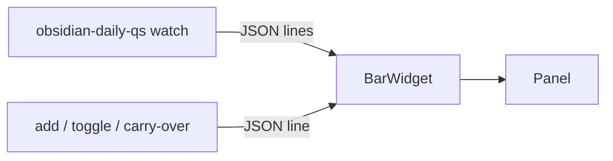

# Obsidian Daily QS

[GitHub Repository](https://github.com/LucaNerlich/obsidian-daily-qs) · [Omarchy marketplace](https://omarchyplugins.com/plugin.html?id=luca.obsidian-daily) · [Releases](https://github.com/LucaNerlich/obsidian-daily-qs/releases)

An [Omarchy](https://omarchy.org/) Quattro bar widget for today's [Obsidian](https://obsidian.md) daily note todos. The bar shows done/total (for example `☐ 2/5`), and left-click opens a panel to check items off, add new ones, search, and carry over leftovers from yesterday -- without leaving the desktop.


## Why this exists

Obsidian is where the day's tasks live, but checking a todo means switching to the editor, scrolling to the right heading, and editing markdown by hand. This widget moves the quick part of that loop -- check off, capture, review -- into the bar: one click opens the panel with focus already in the add field, so a thought is captured before it is gone. The note itself stays a plain markdown file, so nothing is locked into a plugin format.

## Architecture

- **Rust backend** (`obsidian-daily-qs` binary): resolves today's note from the vault's `.obsidian/daily-notes.json` (`folder`, `format`, optional `template`), parses markdown checkboxes, adds/toggles items, and streams JSON snapshots. Nested todos (tabs or two-space levels) are parsed into `depth` / `parentLine` and preserved by carry-over.
- **QML frontend** (`omarchy/`): a `bar-widget` plugin. `BarWidget.qml` runs `obsidian-daily-qs watch` once and updates from its JSON lines; `Panel.qml` shows the list, search, day navigation, and the add field. All note access stays in Rust; the QML is pure presentation and renders note-derived strings as `PlainText` only.



## Security

The backend enforces the vault boundary on every access: paths resolved from the daily-notes settings must stay inside the canonicalized vault root, `..` and null components are rejected, and note writes go through a temp file created with `O_EXCL` in the note's directory plus an atomic rename. Since 1.3.1 a symlinked daily-notes folder or note file that resolves outside the vault is refused, and a pre-created `*.tmp-obsidian-daily-qs` symlink can no longer redirect a write.

## Requirements

- **Omarchy Quattro** (Quickshell-based shell)
- An **Obsidian vault** with the Daily notes core plugin configured
- `OBSIDIAN_VAULT_ROOT` set to the absolute path of that vault for the graphical session (see below)

### Set the vault path

The backend reads `OBSIDIAN_VAULT_ROOT` from its process environment. The Omarchy shell runs as a child of Hyprland, so an `export` in `~/.bashrc` does not reach it. Set the variable for the graphical session instead:

**Option A -- Hyprland env** (per-session, applies without logging out):

```lua
-- ~/.config/hypr/hyprland.lua
hl.env("OBSIDIAN_VAULT_ROOT", "/home/you/Documents/notizen")
```

```bash
hyprctl reload && omarchy restart shell
```

**Option B -- systemd user environment** (applies at next login, also covers apps launched via `uwsm-app`):

```ini
# ~/.config/environment.d/obsidian-vault.conf
OBSIDIAN_VAULT_ROOT=/home/you/Documents/notizen
```

Setting both keeps the current session working until the next login. Use `pgrep -f 'obsidian-daily-qs watch'` and `/proc/<pid>/environ` to verify the backend sees the variable.

## Install

```bash
omarchy plugin add https://github.com/LucaNerlich/obsidian-daily-qs.git --enable
```

Update or remove like any marketplace plugin:

```bash
omarchy plugin update luca.obsidian-daily
omarchy plugin remove luca.obsidian-daily
```

The plugin bundles a statically linked x86_64 musl build of the backend (`omarchy/bin/obsidian-daily-qs`). If the bundled binary cannot start, the widget falls back to an `obsidian-daily-qs` binary on `PATH` (`cargo install --path .`).

## Usage

- **Bar**: shows done/total for today (`☐ 2/5`). Left-click opens the panel with focus in the add field.
- **Panel**:
    - List todos; click a row to toggle.
    - Nested todos render indented; the open-only filter keeps parents of open items visible.
    - Scrolls vertically with the mouse wheel, scrollbar, or Up/Down/j/k (when not typing in the add field).
    - Search: `/` focuses the search field (even from the empty add field); matches filter the list (ancestors stay visible) and combine with open-only. Esc clears and refocuses the add field, second Esc closes.
    - Add with Enter / `+`.
    - **Open only** / **All todos** toggles completed visibility (default from `openOnly` setting).
    - **◀ / ● / ▶** move to previous day, today, or next day.
    - **Carry over N** (when viewing today) copies yesterday's still-open todos (preserving nesting).
    - Open-in-Obsidian launches `obsidian://open?path=…` via `xdg-open`.
- **Shell**: `omarchy-shell shell summon luca.obsidian-daily '{}'` opens the panel; `omarchy-shell shell hide luca.obsidian-daily` closes it.

## Settings

Widget settings live in `~/.config/omarchy/shell.json`:

```bash
omarchy bar set luca.obsidian-daily openOnly true
```

| Key | Default | Description |
| --- | --- | --- |
| `openOnly` | false | Hide completed checkboxes when the panel opens. Can still be toggled in the panel. |

## CLI

```bash
export OBSIDIAN_VAULT_ROOT="/path/to/vault"
obsidian-daily-qs status                  # today's snapshot as one JSON line
obsidian-daily-qs status --date 2026-08-19
obsidian-daily-qs watch                   # stream snapshots, one per change
obsidian-daily-qs add --text "Ship plugin"
obsidian-daily-qs add --date 2026-08-19 --text "Backfill"
obsidian-daily-qs toggle --line 12
obsidian-daily-qs carry-over              # copy yesterday's open todos into today
obsidian-daily-qs open                    # open the viewed note in Obsidian
```

## Development and releases

Local checks:

```bash
cargo fmt --all -- --check
cargo clippy --all-targets -- -D warnings
cargo test --all-targets
node omarchy/model.test.mjs
omarchy plugin validate .
qmllint -I "$OMARCHY_PATH/shell" omarchy/BarWidget.qml omarchy/Panel.qml
```

`make bundle` rebuilds the statically linked backend into `omarchy/bin/`. `make verify-bundle` is the marketplace gate: non-stripped ELF, matching SHA-256, version alignment with `Cargo.toml` / `manifest.json`, and a byte-identical musl rebuild.

Release checklist:

1. Bump `Cargo.toml`, `Cargo.lock`, `manifest.json`, and `CHANGELOG.md`.
2. Run `make bundle` then `make verify-bundle` on Linux.
3. Open a PR; wait for the **marketplace bundle** CI job to be green.
4. Merge, then tag `vX.Y.Z` matching the crate version.
