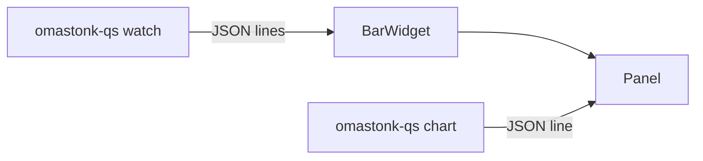

# Omastonk

[GitHub Repository](https://github.com/LucaNerlich/omastonk) · [Omarchy marketplace](https://omarchyplugins.com/plugin.html?id=luca.omastonk) · [Releases](https://github.com/LucaNerlich/omastonk/releases)

An [Omarchy](https://omarchy.org/) Quattro bar widget for a rotating market watchlist. The bar cycles through your symbols showing the current quote and daily direction (for example `NVDA 165.40 ▲`), and left-click opens a chart panel with one-day to five-year views per symbol.


## Why this exists

Checking on a handful of tickers means either opening a broker app or refreshing a browser tab -- both far away from the bar where the clock already lives. Omastonk keeps a small watchlist on the bar itself: every symbol gets a fresh quote roughly once a minute, the display rotates, and one click opens the full chart for whichever symbol is showing. The watchlist is plain inline settings in `shell.json`, so nothing is locked into a proprietary format.

## Architecture

- **Rust backend** (`omastonk-qs` binary): fetches Yahoo Finance quotes for the whole watchlist with staggered round-robin polling and streams JSON lines; also serves the panel's chart close-series one request at a time. Serde-typed parsing, per-symbol error states, and the poll scheduler are all covered by unit tests.
- **QML frontend** (`omarchy/`): a `bar-widget` plugin. `BarWidget.qml` runs `omastonk-qs watch` once and updates from its JSON lines; `Panel.qml` renders charts via `omastonk-qs chart` and owns the watchlist editor. All data collection stays in Rust; the QML is pure presentation.



## Requirements

- **Omarchy Quattro** (Quickshell-based shell)
- `curl` for HTTPS transport (ships with every Omarchy install)

## Install

```bash
omarchy plugin add https://github.com/LucaNerlich/omastonk.git --enable
```

Update or remove like any marketplace plugin:

```bash
omarchy plugin update luca.omastonk
omarchy plugin remove luca.omastonk
```

The plugin bundles a statically linked x86_64 musl build of the backend (`omarchy/bin/omastonk-qs`). The binary is committed without stripping so its symbol table maps to the Rust source. CI verifies it is a byte-for-byte reproducible build of the tracked source (`make verify-bundle`). If the bundled binary cannot start, the widget falls back to an `omastonk-qs` binary on `PATH` (`cargo install --path .`).

## Usage

- **Bar**: shows the rotating watchlist as `SYMBOL PRICE ▲/▼`. Each symbol refreshes about once a minute; requests are staggered so they never bunch up. The widget paints in the active color while the current symbol is down on the day.
- **Panel** (left-click):
    - Symbol tabs across the top; click one or press `Up`/`Down` (or `J`/`K`) to switch symbols.
    - Interval picker below the chart: 5Y, 1Y, YTD, 6M, 1M, 5D, 1D; click or press `Left`/`Right` (or `H`/`L`). `Escape` closes.
- **Editor** (right-click): add symbols in the field at the bottom (space-separated works too), rename rows inline, remove entries with `✕`, then Save -- which commits whatever is still typed in the add field.
- **Shell**: `omarchy-shell shell summon luca.omastonk '{}'` opens the panel; `omarchy-shell shell hide luca.omastonk` closes it.

## Settings

Widget settings live in `~/.config/omarchy/shell.json`:

```bash
omarchy bar set luca.omastonk rotateSeconds 10
```

| Key | Default | Description |
| --- | --- | --- |
| `symbols` | `[]` | Watchlist of market symbols to rotate through, e.g. `AAPL`, `SPY`, `BTC-USD`, `^GSPC`. A legacy single `symbol` string is migrated to this list on first save. |
| `activeSymbol` | first symbol | Symbol shown when the widget loads. |
| `rotateSeconds` | `5` | Seconds each symbol stays on the bar before rotating. `0` disables rotation. |

## CLI

```bash
omastonk-qs watch --symbols AAPL,SPY,NVDA --interval-secs 60   # stream quotes as JSON lines
omastonk-qs quote --symbols AAPL,SPY                           # one snapshot, one line, exit
omastonk-qs chart --symbol ^GSPC --range 1d --interval 5m      # one close-series line, exit
```

Example watch line:

```json
{"quotes":[{"state":"ok","symbol":"AAPL","price":311.3,"change":-5.53},{"state":"error","symbol":"SPY","message":"Could not resolve host"}]}
```

## Development and releases

Local checks:

```bash
cargo fmt --all -- --check
cargo clippy --all-targets -- -D warnings
cargo test --all-targets
node omarchy/model.test.mjs
omarchy plugin validate .
qmllint -I "$OMARCHY_PATH/shell" omarchy/BarWidget.qml omarchy/Panel.qml
```

`make bundle` rebuilds the statically linked backend into `omarchy/bin/`. `make verify-bundle` is the marketplace gate: non-stripped ELF, matching SHA-256, version alignment with `Cargo.toml` / `manifest.json`, `.srcid` fingerprint of Rust sources, and a byte-identical musl rebuild.

Any edit under `src/`, `Cargo.toml`, `Cargo.lock`, or `rust-toolchain.toml` changes the ELF -- including comments. Run `make bundle` in the same change as the Rust edit.

Release checklist:

1. Bump `Cargo.toml`, `Cargo.lock`, `manifest.json`, and `CHANGELOG.md`.
2. Run `make bundle` then `make verify-bundle`.
3. Tag `vX.Y.Z` -- CI re-runs verify and publishes the GitHub Release tarball only if it passes.
