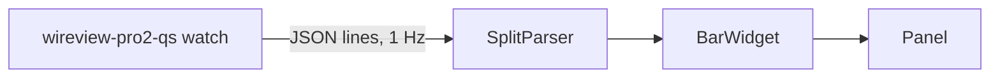

# WireView Pro 2 QS

[GitHub Repository](https://github.com/LucaNerlich/wireview-pro2-qs) · [Omarchy marketplace](https://omarchyplugins.com/plugin.html?id=luca.wireview-pro2) · [Releases](https://github.com/LucaNerlich/wireview-pro2-qs/releases)

An [Omarchy](https://omarchy.org/) Quattro bar widget that shows the live GPU power draw from the [Thermal Grizzly WireView Pro II](https://www.thermal-grizzly.com/en/wireview-pro-ii-gpu/s-tg-wv-p2) (for example `⚡ 57 W`), plus a details panel for app actions and optional per-pin sensor data.


## Why this exists

The WireView2 app (`wireview-linux`) publishes its power reading in the `Title` property of a StatusNotifierItem, but also writes the same text into the SNI `Status` property -- which the spec reserves for `Active` / `Passive` / `NeedsAttention`. Strict tray hosts reject the entire item:

```text
quickshell.dbus.properties: Nonconformant StatusNotifierItem Status: WireView Pro II - 43 W
quickshell.service.sni.item: Received invalid status update
```

So the app never shows up in the Omarchy tray, and with "start minimized" enabled the process runs with no visible window at all. This widget reads the item over DBus directly and takes the tray icon's place.

## Architecture

- **Rust backend** (`wireview-pro2-qs` binary): prefers the `wireview` hwmon chip (full per-pin data) when present, otherwise reads the app's SNI `Title` (watts) over the session bus with zbus. It also manages the app process (launch / focus / restart / quit, including Hyprland's lua dispatcher). Status JSON reports `appRunning` independently of the device reading, so the widget can show live watts from `wireviewd` without claiming the GUI is up.
- **QML frontend** (`omarchy/`): a `bar-widget` plugin. `BarWidget.qml` runs `wireview-pro2-qs watch` once and updates from its JSON lines; `Panel.qml` shows status and app actions. All data collection stays in Rust; the QML is pure presentation.



## Requirements

- **The WireView2 app** ([`wireview-linux`](https://github.com/emaspa/wireview-linux)) -- provides Open / Restart / Quit actions and the wattage-only fallback. Without it the widget shows `⚡ off` and Open has nothing to launch.
- **wireview-hwmon** (optional, recommended) -- enables the full per-pin, temperature, and fault panel.
- `hyprctl` (ships with Hyprland) for window focus.

## Install

```bash
omarchy plugin add https://github.com/LucaNerlich/wireview-pro2-qs.git --enable
```

Update or remove like any marketplace plugin:

```bash
omarchy plugin update luca.wireview-pro2
omarchy plugin remove luca.wireview-pro2
```

The plugin bundles a statically linked x86_64 musl build of the backend (`omarchy/bin/wireview-pro2-qs`). The binary is committed without stripping so its symbol table maps to the Rust source. CI verifies it is a byte-for-byte reproducible build of the tracked source (`make verify-bundle`). If the bundled binary cannot start, the widget falls back to a `wireview-pro2-qs` binary on `PATH`.

## Full sensor data (optional)

The bar always shows watts. For per-pin voltage, current, and power, fan duty, the four temperature channels, named fault status/log, current imbalance, and the PSU rating in the right-click panel, install the companion hwmon driver and daemon:

```bash
yay -S wireview-hwmon wireview-hwmon-dkms   # or: paru -S
sudo modprobe wireview_hwmon
sudo systemctl enable --now wireviewd
```

`wireviewd` reads the device over serial and exposes it as a `wireview` hwmon chip under `/sys/class/hwmon/`. The serial port is single-owner, so quit the WireView2 app before starting `wireviewd`, then relaunch it -- the app switches to reading through hwmon, and the widget reads the same chip alongside it.

The widget also works **without the GUI**: if only `wireviewd` is running, the bar still shows live watts, the panel App row reads "daemon only", and Open launches the app. When no chip is present it keeps the SNI-title fallback (watts only).

## Usage

- **Bar**: left-click opens the app window -- launches it when not running, focuses it when a window exists, and restarts it when the process runs windowless (the app has no SNI `Activate` method and an empty dbusmenu in v1.2.0.0). Right-click opens the details panel.
- **Panel**: current power draw and app state (running, daemon only, or not running), plus Open / Restart / Quit. Restart and Quit hide when the GUI is not running. With the hwmon chip present, the panel also shows per-pin voltage/current/watts, an imbalance caption, fan duty, temperatures, named fault status/log, and the PSU rating. A live fault paints the bar in the urgent color and sends a critical Omarchy notification (click it to open this panel). Enter opens the app, Tab moves to the neighboring bar panel, Esc closes.
- **Shell**: `omarchy-shell shell summon luca.wireview-pro2 '{}'` opens the panel; `omarchy-shell shell hide luca.wireview-pro2` closes it.

## Settings

Widget settings live in `~/.config/omarchy/shell.json`:

```bash
omarchy bar set luca.wireview-pro2 hideWhenOff true
```

| Key | Default | Description |
| --- | --- | --- |
| `hideWhenOff` | false | Hide the widget entirely when the WireView2 GUI is not running, even if `wireviewd` is still feeding the hwmon chip. |

## CLI

```bash
wireview-pro2-qs status    # one status report as a single JSON line
wireview-pro2-qs watch     # stream status lines, one per change (1 Hz)
wireview-pro2-qs open      # ensure the app runs and its window is visible
wireview-pro2-qs restart   # kill every instance and start a fresh one
wireview-pro2-qs quit      # kill every instance
```

Example status lines:

```json
{"state":"live","watts":43.2,"appRunning":true,"title":"WireView Pro II - 43.2 W"}
{"state":"live","watts":108.05,"appRunning":false,"sensors":{"voltageV":[12.0,12.1],"currentA":[1.5,1.6],"powerW":[18.0,19.36],"sumCurrentA":3.1,"sumPowerW":108.05,"tempInC":34.5,"tempOutC":null,"ext1C":null,"ext2C":null,"fanDuty":75,"faultStatus":0,"faultLog":0,"psuCapW":600}}
{"state":"na","appRunning":true,"title":"WireView Pro II"}
{"state":"off","appRunning":false}
```

## Development and releases

Local checks:

```bash
cargo fmt --all -- --check
cargo clippy --all-targets -- -D warnings
cargo test --all-targets
node omarchy/model.test.mjs
omarchy plugin validate .
qmllint -I "$OMARCHY_PATH/shell" omarchy/BarWidget.qml omarchy/Panel.qml
```

`make bundle` rebuilds the statically linked backend into `omarchy/bin/`. `make verify-bundle` is the marketplace gate: non-stripped ELF, matching SHA-256, version alignment with `Cargo.toml` / `manifest.json`, `.srcid` fingerprint of Rust sources, and a byte-identical musl rebuild.

Any edit under `src/`, `Cargo.toml`, `Cargo.lock`, or `rust-toolchain.toml` changes the ELF -- including comments. Run `make bundle` in the same change as the Rust edit.

Release checklist:

1. Bump `Cargo.toml`, `Cargo.lock`, `manifest.json`, and `CHANGELOG.md`.
2. Run `make bundle` then `make verify-bundle`.
3. Tag `vX.Y.Z` -- CI re-runs verify and publishes the GitHub Release tarball only if it passes.
