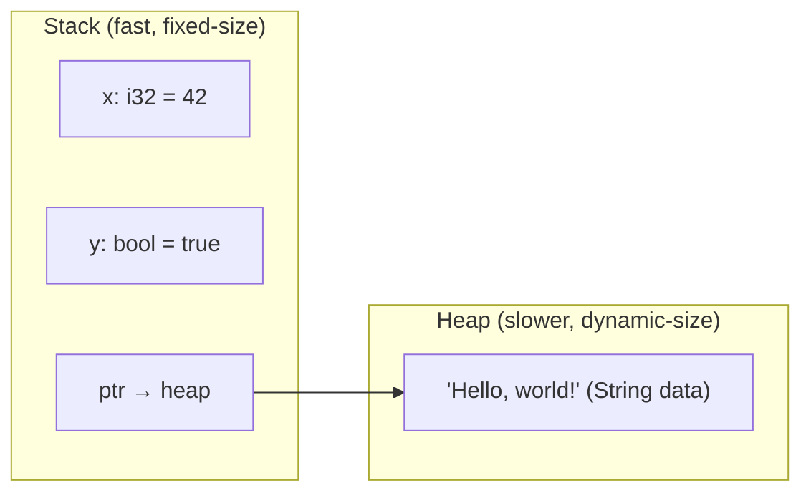
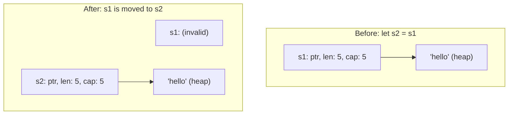
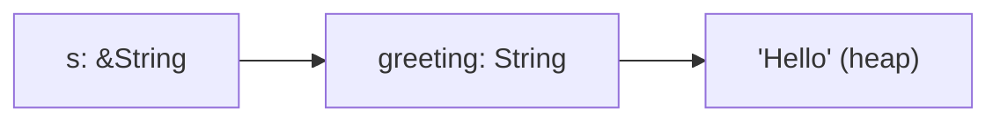
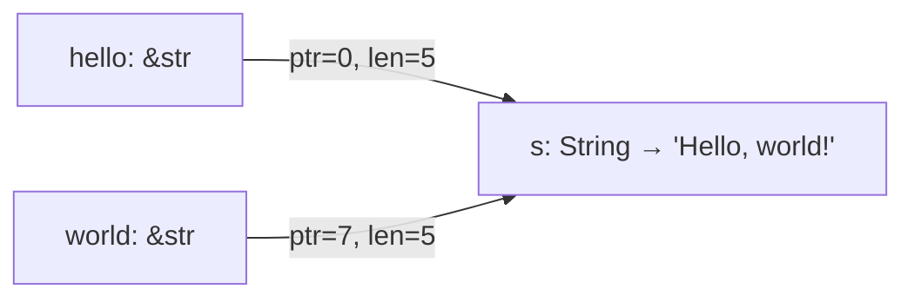

# Ownership & Borrowing

This is the most important chapter in this guide. Ownership is what makes Rust unique -- it is how Rust guarantees
memory safety without a garbage collector. Every Rust programmer needs to understand this system.

We will go slow. There are diagrams. There are examples of code that does not compile, followed by explanations of why.
If this is your first time learning ownership, read this chapter twice.

## Why ownership matters

In most languages, memory management works one of two ways:

| Approach                  | Languages              | Trade-off                                |
|---------------------------|------------------------|------------------------------------------|
| **Garbage collector**     | Java, Go, Python, JS   | Safe but has runtime overhead and pauses |
| **Manual management**     | C, C++                 | Fast but error-prone (use-after-free, double free, memory leaks) |

Rust takes a third approach: **ownership**. The compiler tracks who "owns" each piece of data and enforces strict rules
about how data is accessed. If your code violates these rules, it does not compile. There is no garbage collector and no
manual free/malloc.

The result: the safety of garbage-collected languages with the performance of manually managed ones.

## The stack and the heap

Before we dive into ownership, you need to understand where data lives in memory.



### The stack

- Stores data of a **known, fixed size** at compile time
- Very fast (push and pop)
- Examples: integers, booleans, floats, characters, fixed-size arrays, tuples of stack types
- Data is automatically cleaned up when it goes out of scope

### The heap

- Stores data of **unknown or dynamic size**
- Slower (requires allocation and pointer management)
- Examples: `String`, `Vec<T>`, `Box<T>`, anything that can grow
- You get a **pointer** (stored on the stack) that points to the data on the heap

> **Mental model:** Think of the stack as a pile of plates -- you can only add or remove from the top, and each plate
> has a fixed size. The heap is a warehouse -- you can store anything, but you need to keep track of where you put it.

## The three ownership rules

Memorize these. Everything else follows from them:

1. **Every value in Rust has exactly one owner** (a variable).
2. **There can only be one owner at a time.**
3. **When the owner goes out of scope, the value is dropped** (memory is freed).

Let's see each rule in action.

### Rule 1 & 3 -- one owner, dropped at end of scope

```rust
fn main() {
    let s = String::from("hello"); // s owns the String
    println!("{s}");
} // s goes out of scope -- Rust calls `drop` and frees the memory
```

`String::from("hello")` allocates a string on the heap. The variable `s` is its owner. When `s` goes out of scope at
the closing brace, Rust automatically frees the heap memory. No garbage collector needed, no manual free.

### Rule 2 -- one owner at a time (moves)

This is where it gets interesting. What happens when you assign one variable to another?

```rust
fn main() {
    let s1 = String::from("hello");
    let s2 = s1;

    println!("{s1}"); // Error!
}
```

```text
error[E0382]: borrow of moved value: `s1`
 --> src/main.rs:4:16
  |
2 |     let s1 = String::from("hello");
  |         -- move occurs because `s1` has type `String`, which does not implement the `Copy` trait
3 |     let s2 = s1;
  |              -- value moved here
4 |     println!("{s1}");
  |                ^^ value borrowed here after move
```

When you write `let s2 = s1;`, Rust does not copy the heap data. Instead, it **moves** ownership from `s1` to `s2`.
After the move, `s1` is no longer valid.

Here is what happens in memory:



Rust moves the pointer, length, and capacity from `s1` to `s2`, then invalidates `s1`. This prevents a **double free**
-- if both `s1` and `s2` were valid and both went out of scope, Rust would try to free the same memory twice.

> **Mental model:** Ownership is like handing someone a physical book. When you give the book to someone else, you no
> longer have it. You cannot read it or write in it until they give it back.

### Moves happen with function calls too

```rust
fn takes_ownership(s: String) {
    println!("{s}");
} // s is dropped here

fn main() {
    let greeting = String::from("hi");
    takes_ownership(greeting);

    // println!("{greeting}"); // Error: greeting was moved
}
```

Passing a `String` to a function moves it into the function's parameter. After the call, the original variable is
no longer valid.

### Returning ownership

A function can give ownership back by returning a value:

```rust
fn create_greeting(name: &str) -> String {
    format!("Hello, {name}!")
}

fn main() {
    let greeting = create_greeting("Alice");
    println!("{greeting}"); // greeting owns the String
}
```

## Copy types -- when moves do not happen

Not all types are moved. Simple, stack-only types implement the **`Copy` trait** and are copied instead of moved:

```rust
fn main() {
    let x = 5;
    let y = x; // x is COPIED, not moved

    println!("x = {x}, y = {y}"); // Both are valid!
}
```

Types that implement `Copy`:

| Type              | Copy? | Why                                |
|-------------------|-------|------------------------------------|
| `i32`, `u8`, etc. | Yes   | Fixed-size, stack-only             |
| `f64`, `f32`      | Yes   | Fixed-size, stack-only             |
| `bool`            | Yes   | One byte                           |
| `char`            | Yes   | Four bytes                         |
| `(i32, bool)`     | Yes   | Tuple of Copy types                |
| `[i32; 5]`        | Yes   | Array of Copy types                |
| `String`          | No    | Owns heap data                     |
| `Vec<T>`          | No    | Owns heap data                     |

The rule is simple: if a type is entirely on the stack and has no heap resources, it can be `Copy`. If it manages heap
memory, it cannot -- moving is the only option (unless you explicitly `Clone`).

## Clone -- explicit deep copies

When you need a real copy of heap data, use `.clone()`:

```rust
fn main() {
    let s1 = String::from("hello");
    let s2 = s1.clone(); // Deep copy -- both are valid

    println!("s1 = {s1}, s2 = {s2}");
}
```

`.clone()` allocates new heap memory and copies the data. It is explicit and potentially expensive -- Rust wants you to
know when you are doing a deep copy.

> **Tip:** Do not sprinkle `.clone()` everywhere to silence the compiler. It works, but you lose performance. Learn to
> use references instead (next section).

## References and borrowing

Moving ownership into every function and getting it back is awkward. References let you use a value **without taking
ownership** -- this is called **borrowing**.

### Immutable references (&)

```rust
fn calculate_length(s: &String) -> usize {
    s.len()
}

fn main() {
    let greeting = String::from("Hello");
    let length = calculate_length(&greeting);

    println!("'{greeting}' has {length} characters"); // greeting is still valid!
}
```

`&greeting` creates a **reference** to `greeting` without taking ownership. The function parameter `s: &String` accepts
a reference. When the function returns, only the reference goes out of scope -- the original `String` is untouched.



You can have **multiple immutable references** at the same time:

```rust
fn main() {
    let s = String::from("hello");

    let r1 = &s;
    let r2 = &s;
    let r3 = &s;

    println!("{r1}, {r2}, {r3}"); // All valid
}
```

This is safe because no one is modifying the data.

### Mutable references (&mut)

To modify borrowed data, you need a **mutable reference**:

```rust
fn add_exclamation(s: &mut String) {
    s.push('!');
}

fn main() {
    let mut greeting = String::from("Hello");
    add_exclamation(&mut greeting);

    println!("{greeting}"); // Hello!
}
```

Note three things:
1. The variable must be declared `mut`
2. The reference is created with `&mut`
3. The function parameter is `&mut String`

### The borrowing rules

Rust enforces two rules about references:

1. **You can have either ONE mutable reference OR any number of immutable references** (but not both at the same time).
2. **References must always be valid** (no dangling references).

#### Rule 1: no mixing mutable and immutable

```rust
fn main() {
    let mut s = String::from("hello");

    let r1 = &s;     // immutable borrow
    let r2 = &s;     // immutable borrow -- ok, multiple immutable borrows are fine
    let r3 = &mut s; // mutable borrow -- ERROR!

    println!("{r1}, {r2}, {r3}");
}
```

```text
error[E0502]: cannot borrow `s` as mutable because it is also borrowed as immutable
```

Why? If you have an immutable reference and someone else mutates the data through a mutable reference, the immutable
reference's view of the data changes unexpectedly. Rust prevents this class of bugs at compile time.

> **Important:** The scope of a reference lasts from where it is introduced to the last place it is used, not to the
> end of the enclosing block. This is called **Non-Lexical Lifetimes (NLL)**:

```rust
fn main() {
    let mut s = String::from("hello");

    let r1 = &s;
    let r2 = &s;
    println!("{r1}, {r2}");
    // r1 and r2 are no longer used after this point

    let r3 = &mut s; // This is fine! r1 and r2 are already done
    r3.push_str(", world");
    println!("{r3}");
}
```

#### Rule 2: no dangling references

```rust
fn dangle() -> &String {
    let s = String::from("hello");
    &s // Error: s is dropped when dangle() returns, so the reference would be invalid
}
```

```text
error[E0106]: missing lifetime specifier
```

The fix is to return the owned value, not a reference to it:

```rust
fn no_dangle() -> String {
    let s = String::from("hello");
    s // Move the String out -- ownership is transferred to the caller
}
```

## String vs &str

This is one of the most confusing topics for Rust beginners. Rust has two main string types:

| Type      | Ownership | Stored on | Mutable | Growable | Example                        |
|-----------|-----------|-----------|---------|----------|--------------------------------|
| `String`  | Owned     | Heap      | Yes     | Yes      | `String::from("hello")`       |
| `&str`    | Borrowed  | Anywhere  | No      | No       | `"hello"` (string literal)     |

### String

`String` is an **owned**, **heap-allocated**, **growable** string:

```rust
fn main() {
    let mut s = String::from("Hello");
    s.push_str(", world!"); // Grow the string
    println!("{s}");
}
```

### &str (string slice)

`&str` is a **reference** to a sequence of UTF-8 bytes. It does not own the data:

```rust
fn main() {
    let s: &str = "Hello, world!"; // String literal -- stored in the binary
    println!("{s}");
}
```

String literals (`"hello"`) are `&str` -- they are baked into the compiled binary and live for the entire duration of
the program.

### When to use which

| Situation                            | Use       |
|--------------------------------------|-----------|
| Function parameter (reading only)    | `&str`    |
| Storing a string in a struct         | `String`  |
| Building or modifying a string       | `String`  |
| String literal                       | `&str`    |
| Returning a newly created string     | `String`  |

The general rule: **accept `&str`, return `String`**. This is the most flexible pattern because both `String` and `&str`
can be passed where `&str` is expected:

```rust
fn greet(name: &str) -> String {
    format!("Hello, {name}!")
}

fn main() {
    // Pass a &str (string literal)
    let a = greet("Alice");

    // Pass a &String (auto-deref to &str)
    let name = String::from("Bob");
    let b = greet(&name);

    println!("{a}");
    println!("{b}");
}
```

When you pass `&name` (a `&String`), Rust automatically dereferences it to `&str`. This is called **deref coercion**.

## Slices

A **slice** is a reference to a contiguous portion of a collection. String slices (`&str`) are the most common, but you
can also slice arrays and vectors.

### String slices

```rust
fn main() {
    let s = String::from("Hello, world!");

    let hello = &s[0..5];   // "Hello"
    let world = &s[7..12];  // "world"

    println!("{hello} {world}");
}
```

`&s[0..5]` creates a `&str` that references bytes 0 through 4 (the range is exclusive on the end).



> **Warning:** String slicing works on **byte offsets**, not character offsets. For ASCII strings this is fine, but for
> multi-byte UTF-8 characters, slicing at the wrong byte offset will panic. Use `.chars()` when working with non-ASCII
> text.

### Array slices

```rust
fn sum(numbers: &[i32]) -> i32 {
    let mut total = 0;
    for n in numbers {
        total += n;
    }
    total
}

fn main() {
    let numbers = [1, 2, 3, 4, 5];

    println!("Sum of all: {}", sum(&numbers));
    println!("Sum of first three: {}", sum(&numbers[0..3]));
    println!("Sum of last two: {}", sum(&numbers[3..]));
}
```

`&[i32]` is a **slice** of `i32` values. It works with arrays, vectors, and sub-ranges of either.

## Common ownership patterns

Here are the patterns you will use most:

### Passing references to functions

```rust
fn print_length(s: &str) {
    println!("Length: {}", s.len());
}

fn main() {
    let name = String::from("Rustacean");
    print_length(&name); // Borrow, don't move
    println!("{name}");  // name is still valid
}
```

### Returning owned values from functions

```rust
fn build_greeting(name: &str) -> String {
    let mut greeting = String::from("Hello, ");
    greeting.push_str(name);
    greeting.push('!');
    greeting
}

fn main() {
    let greeting = build_greeting("world");
    println!("{greeting}");
}
```

### Temporary mutable borrow

```rust
fn main() {
    let mut numbers = vec![3, 1, 4, 1, 5];

    // Mutable borrow for sorting
    numbers.sort();

    // Immutable borrow for printing
    println!("{numbers:?}");
}
```

## Ownership cheat sheet

| Scenario                         | What happens          | Original still valid? |
|----------------------------------|-----------------------|-----------------------|
| `let y = x;` (x is Copy)        | Copy                  | Yes                   |
| `let y = x;` (x is not Copy)    | Move                  | No                    |
| `let y = x.clone();`            | Deep copy             | Yes                   |
| `let y = &x;`                   | Immutable borrow      | Yes                   |
| `let y = &mut x;`               | Mutable borrow        | Yes (but restricted)  |
| `fn foo(x: String)`             | Move into function    | No                    |
| `fn foo(x: &String)`            | Borrow into function  | Yes                   |
| `fn foo(x: &mut String)`        | Mutable borrow        | Yes (but restricted)  |

## Summary

- Every value has exactly **one owner**. When the owner goes out of scope, the value is dropped.
- Assigning a non-Copy value to another variable **moves** it -- the original is invalid.
- Simple stack types (`i32`, `bool`, `f64`, etc.) implement **Copy** and are copied, not moved.
- Use `.clone()` for explicit deep copies of heap data.
- **References** (`&T`) borrow without taking ownership.
- **Mutable references** (`&mut T`) allow modification but are exclusive -- only one at a time.
- You can have multiple `&T` **or** one `&mut T`, never both simultaneously.
- `String` is owned heap data; `&str` is a borrowed view into string data.
- **Slices** (`&[T]`, `&str`) reference a portion of a collection without owning it.

This was a lot. Do not worry if it does not all click immediately -- ownership becomes intuitive with practice. The
compiler will remind you of the rules every time you break them, and its error messages will guide you to the fix.

Next up: [Structs & Enums](./06-structs-and-enums.md) -- defining your own data types, adding methods, and introducing
`Option` and `Result`.
