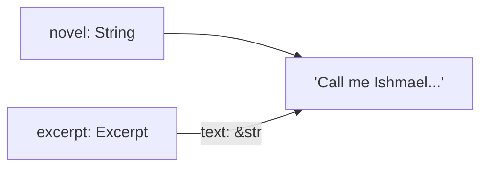

# Lifetimes

Lifetimes are Rust's way of ensuring that **references are always valid**. They tell the compiler how long a reference
should live. Most of the time, lifetimes are inferred and you never write them. But when they cannot be inferred, you
need to annotate them.

This chapter demystifies lifetimes step by step.

## Why lifetimes exist

Consider this broken code:

```rust
fn longest(a: &str, b: &str) -> &str {
    if a.len() >= b.len() { a } else { b }
}
```

```text
error[E0106]: missing lifetime specifier
 --> src/main.rs:1:38
  |
1 | fn longest(a: &str, b: &str) -> &str {
  |               ----     ----      ^ expected named lifetime parameter
  |
  = help: this function's return type contains a borrowed value,
          but the signature does not say whether it is borrowed from `a` or `b`
```

The compiler cannot figure out whether the returned reference comes from `a` or `b`. If it comes from `a` but `a` is
dropped while the caller still holds the reference, we get a dangling reference -- exactly what Rust prevents.

Lifetime annotations solve this by telling the compiler: "the returned reference lives as long as both inputs."

## Lifetime annotation syntax

Lifetime annotations start with a single quote and a lowercase name:

```rust
&'a str       // A reference with lifetime 'a
&'a mut str   // A mutable reference with lifetime 'a
```

The name itself does not matter -- `'a`, `'b`, `'input` are all valid. Convention uses `'a`, `'b`, `'c` for simple
cases.

## Lifetimes in function signatures

Here is the fix for the `longest` function:

```rust
fn longest<'a>(a: &'a str, b: &'a str) -> &'a str {
    if a.len() >= b.len() { a } else { b }
}

fn main() {
    let a = String::from("long string");
    let result;
    {
        let b = String::from("xyz");
        result = longest(&a, &b);
        println!("Longest: {result}");
    }
    // Cannot use result here -- b was dropped
}
```

What `<'a>` means:

1. Both `a` and `b` have **at least** lifetime `'a`
2. The returned reference also lives for `'a`
3. In practice, `'a` is the **shorter** of the two input lifetimes

The compiler uses this information to reject code where the returned reference would outlive the data it points to.

### When the lifetimes differ

Sometimes inputs have different lifetimes:

```rust
fn first_word<'a>(s: &'a str, _prefix: &str) -> &'a str {
    s.split_whitespace().next().unwrap_or("")
}

fn main() {
    let sentence = String::from("hello world");
    let word = first_word(&sentence, "ignored");
    println!("{word}");
}
```

Here, `_prefix` does not affect the returned reference, so it does not need the same lifetime. Only `s` and the return
type share `'a`.

## Lifetime elision rules

You have written many functions with references and never annotated lifetimes. That is because the compiler applies
three **elision rules** to infer them automatically:

### Rule 1 -- each reference parameter gets its own lifetime

```rust
fn foo(a: &str, b: &str)
// becomes
fn foo<'a, 'b>(a: &'a str, b: &'b str)
```

### Rule 2 -- if there is exactly one input lifetime, it is assigned to all output references

```rust
fn first_word(s: &str) -> &str
// becomes
fn first_word<'a>(s: &'a str) -> &'a str
```

### Rule 3 -- if one of the parameters is &self or &mut self, the lifetime of self is assigned to all output references

```rust
impl MyStruct {
    fn name(&self) -> &str
    // becomes
    fn name<'a>(&'a self) -> &'a str
}
```

If the compiler cannot determine all output lifetimes after applying these rules, it asks you to annotate explicitly.
That is why `longest(a: &str, b: &str) -> &str` fails -- rule 1 gives `a` and `b` different lifetimes, rule 2 does
not apply (two input lifetimes), and rule 3 does not apply (no `self`).

## Lifetimes in structs

A struct that holds a reference needs a lifetime annotation:

```rust
#[derive(Debug)]
struct Excerpt<'a> {
    text: &'a str,
}

impl<'a> Excerpt<'a> {
    fn new(text: &'a str) -> Self {
        Self { text }
    }

    fn first_sentence(&self) -> &str {
        self.text.split('.').next().unwrap_or(self.text)
    }
}

fn main() {
    let novel = String::from("Call me Ishmael. Some years ago...");
    let excerpt = Excerpt::new(&novel);
    println!("{:?}", excerpt);
    println!("First sentence: {}", excerpt.first_sentence());
}
```

`Excerpt<'a>` says: "this struct contains a reference, and the struct cannot outlive the data it references." The
compiler enforces this:

```rust
fn broken() -> Excerpt {
    let text = String::from("temporary");
    Excerpt::new(&text) // Error: text does not live long enough
}
```



The `Excerpt` borrows from `novel`. If `novel` is dropped while `excerpt` still exists, the reference becomes dangling.
The lifetime annotation prevents this.

> **Tip:** When a struct holds references, ask yourself: "what is this struct borrowing from, and will that data live
> long enough?" If ownership is simpler, use `String` instead of `&str`.

## The 'static lifetime

`'static` means "lives for the entire duration of the program":

```rust
let s: &'static str = "I live forever";
```

String literals are `'static` because they are embedded in the binary. Other common `'static` uses:

- Thread-spawned closures (they must own their data or reference `'static` data)
- Error messages: `&'static str`

> **Warning:** Do not slap `'static` on everything to make the compiler happy. If the compiler is asking for a
> lifetime, it usually means you need to think about how long your data lives. `'static` is rarely the right answer
> for non-literal data.

## Multiple lifetimes

Rarely, you need multiple lifetime parameters:

```rust
fn select<'a, 'b>(first: &'a str, second: &'b str, use_first: bool) -> &'a str
where
    'b: 'a,
{
    if use_first { first } else { second }
}
```

`'b: 'a` means "`'b` lives at least as long as `'a`". This is called a **lifetime bound**. In practice, you rarely
need multiple lifetimes -- one `'a` covers most cases.

## Common lifetime patterns

### Returning one of the inputs

```rust
fn shorter<'a>(a: &'a str, b: &'a str) -> &'a str {
    if a.len() <= b.len() { a } else { b }
}
```

### Struct borrowing from a field

```rust
struct Parser<'a> {
    input: &'a str,
    position: usize,
}

impl<'a> Parser<'a> {
    fn new(input: &'a str) -> Self {
        Self { input, position: 0 }
    }

    fn remaining(&self) -> &str {
        &self.input[self.position..]
    }
}
```

### Avoiding lifetimes -- own the data instead

Often the simplest fix for lifetime complexity is to own the data:

```rust
// Complex -- needs lifetimes
struct Config<'a> {
    host: &'a str,
    port: u16,
}

// Simpler -- owns the data
struct Config {
    host: String,
    port: u16,
}
```

Owning the data with `String` instead of borrowing with `&str` eliminates the lifetime parameter entirely. The
trade-off is a heap allocation, which is negligible in most cases.

## When to use lifetimes vs owned types

| Scenario                                   | Recommendation       |
|-------------------------------------------|----------------------|
| Struct stores config, user input, etc.    | Own with `String`    |
| Function takes a string for reading       | Borrow with `&str`   |
| Function returns part of its input        | Lifetime annotation  |
| Short-lived parsing/processing struct     | Lifetime annotation  |
| Long-lived struct stored in collections   | Own with `String`    |

## Summary

- Lifetimes ensure references are **always valid** -- no dangling pointers
- Lifetime annotations (`'a`) tell the compiler how long references live relative to each other
- Three **elision rules** infer lifetimes automatically in most functions
- You only need explicit annotations when the compiler cannot infer lifetimes (multiple input references, ambiguous
  return)
- Structs holding references need lifetime parameters
- `'static` means "lives for the entire program" -- used for string literals and thread-safe data
- When lifetimes get complex, consider **owning** the data instead of borrowing

Next up: [Iterators & Closures](./13-iterators-and-closures.md) -- closures, the `Fn` traits, the `Iterator` trait,
adaptors like `map` and `filter`, and the difference between `iter`, `into_iter`, and `iter_mut`.
