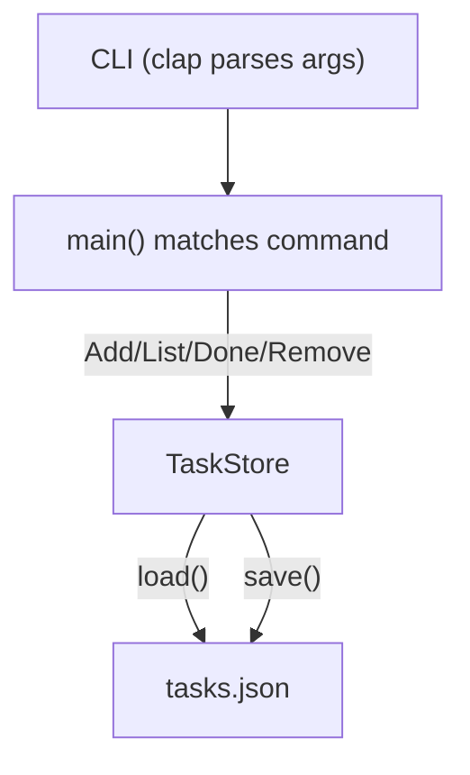

# Project: CLI Task Manager

Time to put everything together. In this chapter we build a **command-line task manager** that supports adding, listing,
completing, and deleting tasks. Tasks are stored as JSON in a local file.

This project uses concepts from every previous chapter: structs, enums, pattern matching, error handling, modules,
traits, iterators, and closures.

## What we are building

```text
$ task add "Buy groceries"
Added task #1: Buy groceries

$ task add "Write Rust guide"
Added task #2: Write Rust guide

$ task list
 #  Status  Description
 1  [ ]     Buy groceries
 2  [ ]     Write Rust guide

$ task done 1
Completed task #1: Buy groceries

$ task list
 #  Status  Description
 1  [x]     Buy groceries
 2  [ ]     Write Rust guide

$ task remove 1
Removed task #1: Buy groceries
```

## Project setup

Create a new project and add dependencies:

```bash
cargo new task-cli
cd task-cli
cargo add clap --features derive
cargo add serde --features derive
cargo add serde_json
cargo add thiserror
```

Your `Cargo.toml` dependencies section should look like:

```toml
[dependencies]
clap = { version = "4", features = ["derive"] }
serde = { version = "1", features = ["derive"] }
serde_json = "1"
thiserror = "2"
```

## Project structure

```text
task-cli/
├── Cargo.toml
└── src/
    ├── main.rs       # Entry point, CLI definition
    ├── task.rs        # Task struct and TaskStore
    └── error.rs       # Custom error type
```

## Step 1 -- Define the error type

`src/error.rs`:

```rust
use thiserror::Error;

#[derive(Debug, Error)]
pub enum TaskError {
    #[error("IO error: {0}")]
    Io(#[from] std::io::Error),

    #[error("JSON error: {0}")]
    Json(#[from] serde_json::Error),

    #[error("Task #{0} not found")]
    NotFound(usize),
}

pub type Result<T> = std::result::Result<T, TaskError>;
```

The `type Result<T>` alias means we can write `Result<Vec<Task>>` instead of `std::result::Result<Vec<Task>, TaskError>`
throughout the project.

## Step 2 -- Define the Task model and store

`src/task.rs`:

```rust
use serde::{Deserialize, Serialize};
use std::fs;
use std::path::{Path, PathBuf};

use crate::error::{Result, TaskError};

#[derive(Debug, Serialize, Deserialize)]
pub struct Task {
    pub id: usize,
    pub description: String,
    pub done: bool,
}

pub struct TaskStore {
    path: PathBuf,
}

impl TaskStore {
    pub fn new(path: &Path) -> Self {
        Self {
            path: path.to_path_buf(),
        }
    }

    pub fn load(&self) -> Result<Vec<Task>> {
        if !self.path.exists() {
            return Ok(Vec::new());
        }
        let data = fs::read_to_string(&self.path)?;
        if data.trim().is_empty() {
            return Ok(Vec::new());
        }
        let tasks: Vec<Task> = serde_json::from_str(&data)?;
        Ok(tasks)
    }

    fn save(&self, tasks: &[Task]) -> Result<()> {
        let data = serde_json::to_string_pretty(tasks)?;
        fs::write(&self.path, data)?;
        Ok(())
    }

    fn next_id(&self, tasks: &[Task]) -> usize {
        tasks.iter().map(|t| t.id).max().unwrap_or(0) + 1
    }

    pub fn add(&self, description: String) -> Result<Task> {
        let mut tasks = self.load()?;
        let id = self.next_id(&tasks);
        let task = Task {
            id,
            description,
            done: false,
        };
        tasks.push(Task {
            id: task.id,
            description: task.description.clone(),
            done: task.done,
        });
        self.save(&tasks)?;
        Ok(Task {
            id,
            description: task.description,
            done: false,
        })
    }

    pub fn complete(&self, id: usize) -> Result<Task> {
        let mut tasks = self.load()?;
        let task = tasks
            .iter_mut()
            .find(|t| t.id == id)
            .ok_or(TaskError::NotFound(id))?;
        task.done = true;
        let result = Task {
            id: task.id,
            description: task.description.clone(),
            done: task.done,
        };
        self.save(&tasks)?;
        Ok(result)
    }

    pub fn remove(&self, id: usize) -> Result<Task> {
        let mut tasks = self.load()?;
        let pos = tasks
            .iter()
            .position(|t| t.id == id)
            .ok_or(TaskError::NotFound(id))?;
        let removed = tasks.remove(pos);
        self.save(&tasks)?;
        Ok(removed)
    }
}
```

Key patterns used:

- `serde::Serialize` and `Deserialize` for JSON conversion
- `?` operator for error propagation
- Iterator methods: `.map()`, `.max()`, `.find()`, `.position()`
- `ok_or()` to convert `Option` to `Result`

## Step 3 -- Define the CLI with clap

`src/main.rs`:

```rust
mod error;
mod task;

use clap::{Parser, Subcommand};
use std::path::PathBuf;
use task::TaskStore;

#[derive(Parser)]
#[command(name = "task", about = "A simple CLI task manager")]
struct Cli {
    /// Path to the task file
    #[arg(long, default_value = "tasks.json")]
    file: PathBuf,

    #[command(subcommand)]
    command: Command,
}

#[derive(Subcommand)]
enum Command {
    /// Add a new task
    Add {
        /// Task description
        description: String,
    },
    /// List all tasks
    List,
    /// Mark a task as done
    Done {
        /// Task ID
        id: usize,
    },
    /// Remove a task
    Remove {
        /// Task ID
        id: usize,
    },
}

fn main() {
    let cli = Cli::parse();
    let store = TaskStore::new(&cli.file);

    let result = match cli.command {
        Command::Add { description } => {
            store.add(description).map(|task| {
                println!("Added task #{}: {}", task.id, task.description);
            })
        }
        Command::List => store.load().map(|tasks| {
            if tasks.is_empty() {
                println!("No tasks.");
                return;
            }
            println!("{:>3}  {:<8} Description", "#", "Status");
            for task in &tasks {
                let status = if task.done { "[x]" } else { "[ ]" };
                println!("{:>3}  {:<8} {}", task.id, status, task.description);
            }
        }),
        Command::Done { id } => {
            store.complete(id).map(|task| {
                println!("Completed task #{}: {}", task.id, task.description);
            })
        }
        Command::Remove { id } => {
            store.remove(id).map(|task| {
                println!("Removed task #{}: {}", task.id, task.description);
            })
        }
    };

    if let Err(e) = result {
        eprintln!("Error: {e}");
        std::process::exit(1);
    }
}
```

## How it works



1. **clap** parses command-line arguments into the `Cli` struct
2. **main** matches the subcommand and calls the appropriate `TaskStore` method
3. **TaskStore** reads from and writes to a JSON file
4. Errors propagate via `Result` and are printed to stderr

## Building and running

```bash
cargo build

# Or run directly
cargo run -- add "Buy groceries"
cargo run -- add "Write Rust guide"
cargo run -- list
cargo run -- done 1
cargo run -- list
cargo run -- remove 1
```

The `--` separates cargo arguments from your program's arguments.

For a release build:

```bash
cargo build --release
./target/release/task-cli add "First task"
```

## What this project demonstrates

| Concept                | Where it appears                              |
|-----------------------|-----------------------------------------------|
| Structs               | `Task`, `TaskStore`, `Cli`                    |
| Enums                 | `Command`, `TaskError`                        |
| Pattern matching      | `match cli.command`, `ok_or()`                |
| Error handling        | `thiserror`, `?` operator, `Result<T>`        |
| Modules               | `mod error`, `mod task`                       |
| Traits (derive)       | `Serialize`, `Deserialize`, `Parser`, `Debug` |
| Iterators             | `.find()`, `.position()`, `.map()`, `.max()`  |
| Closures              | Inside `.map()`, `.find()`, `.ok_or()`        |
| File I/O              | `fs::read_to_string`, `fs::write`             |
| External crates       | `clap`, `serde`, `serde_json`, `thiserror`    |

## Possible extensions

Once the basics work, try adding:

- **Priority levels** -- `High`, `Medium`, `Low` as an enum field
- **Due dates** -- add a `due: Option<String>` field and filter by date
- **Search** -- `task search "groceries"` to filter by description
- **Tags** -- `task add "Buy groceries" --tag shopping`
- **Multiple lists** -- support different task files

## Summary

You have built a real command-line application that:

- Parses arguments with `clap`
- Serializes data with `serde` and `serde_json`
- Stores tasks in a JSON file
- Handles errors with `thiserror` and the `?` operator
- Uses a clean module structure

This is the kind of tool Rust excels at -- fast, reliable, single-binary deployment with no runtime dependencies.

Next up: [Testing](./15-testing.md) -- unit tests, integration tests, doc tests, and `cargo test`.
