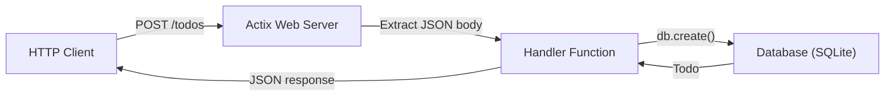

# REST API with Actix Web

In this chapter we build a REST API for a simple todo application using **Actix Web**, one of Rust's most popular and
performant web frameworks. We will handle JSON requests, store data in SQLite, and add middleware for logging and CORS.

## Why Actix Web?

| Feature          | Details                                                |
|-----------------|--------------------------------------------------------|
| Performance     | Consistently one of the fastest web frameworks (any language) |
| Async           | Built on tokio, fully async                            |
| Type safety     | Extractors turn HTTP requests into typed Rust structs  |
| Middleware      | Composable middleware stack                            |
| Mature          | Production-ready, used by many companies               |

Other popular options include **Axum** (tower-based, from the tokio team) and **Rocket** (ergonomic, macro-heavy). The
concepts transfer between frameworks.

## Project setup

```bash
cargo new todo-api
cd todo-api
cargo add actix-web
cargo add actix-cors
cargo add serde --features derive
cargo add serde_json
cargo add rusqlite --features bundled
cargo add tokio --features full
cargo add thiserror
```

`Cargo.toml` dependencies:

```toml
[dependencies]
actix-web = "4"
actix-cors = "0.7"
serde = { version = "1", features = ["derive"] }
serde_json = "1"
rusqlite = { version = "0.32", features = ["bundled"] }
tokio = { version = "1", features = ["full"] }
thiserror = "2"
```

> **Note:** `rusqlite` with the `bundled` feature compiles SQLite from source, so you do not need to install SQLite
> separately.

## Project structure

```text
todo-api/
├── Cargo.toml
└── src/
    ├── main.rs       # Server setup, routes
    ├── db.rs          # Database operations
    ├── models.rs      # Request/response types
    └── error.rs       # Error handling
```

## Step 1 - Error type

`src/error.rs`:

```rust
use actix_web::{HttpResponse, ResponseError};
use std::fmt;

#[derive(Debug)]
pub enum ApiError {
    NotFound(String),
    Internal(String),
}

impl fmt::Display for ApiError {
    fn fmt(&self, f: &mut fmt::Formatter<'_>) -> fmt::Result {
        match self {
            ApiError::NotFound(msg) => write!(f, "Not found: {msg}"),
            ApiError::Internal(msg) => write!(f, "Internal error: {msg}"),
        }
    }
}

impl ResponseError for ApiError {
    fn error_response(&self) -> HttpResponse {
        match self {
            ApiError::NotFound(msg) => {
                HttpResponse::NotFound().json(serde_json::json!({ "error": msg }))
            }
            ApiError::Internal(msg) => {
                HttpResponse::InternalServerError().json(serde_json::json!({ "error": msg }))
            }
        }
    }
}

impl From<rusqlite::Error> for ApiError {
    fn from(err: rusqlite::Error) -> Self {
        ApiError::Internal(err.to_string())
    }
}
```

Implementing `ResponseError` for `ApiError` lets Actix automatically convert errors into HTTP responses.

## Step 2 - Models

`src/models.rs`:

```rust
use serde::{Deserialize, Serialize};

#[derive(Debug, Serialize, Deserialize)]
pub struct Todo {
    pub id: i64,
    pub title: String,
    pub completed: bool,
}

#[derive(Debug, Deserialize)]
pub struct CreateTodo {
    pub title: String,
}

#[derive(Debug, Deserialize)]
pub struct UpdateTodo {
    pub title: Option<String>,
    pub completed: Option<bool>,
}
```

`CreateTodo` and `UpdateTodo` represent the request body. `Todo` is the response.

## Step 3 - Database layer

`src/db.rs`:

```rust
use rusqlite::{params, Connection};
use std::sync::Mutex;

use crate::error::ApiError;
use crate::models::{CreateTodo, Todo, UpdateTodo};

pub struct Database {
    conn: Mutex<Connection>,
}

impl Database {
    pub fn new(path: &str) -> Result<Self, ApiError> {
        let conn = Connection::open(path).map_err(ApiError::from)?;
        conn.execute(
            "CREATE TABLE IF NOT EXISTS todos (
                id INTEGER PRIMARY KEY AUTOINCREMENT,
                title TEXT NOT NULL,
                completed BOOLEAN NOT NULL DEFAULT 0
            )",
            [],
        )
        .map_err(ApiError::from)?;
        Ok(Self {
            conn: Mutex::new(conn),
        })
    }

    pub fn get_all(&self) -> Result<Vec<Todo>, ApiError> {
        let conn = self.conn.lock().unwrap();
        let mut stmt = conn
            .prepare("SELECT id, title, completed FROM todos ORDER BY id")
            .map_err(ApiError::from)?;
        let todos = stmt
            .query_map([], |row| {
                Ok(Todo {
                    id: row.get(0)?,
                    title: row.get(1)?,
                    completed: row.get(2)?,
                })
            })
            .map_err(ApiError::from)?
            .filter_map(|r| r.ok())
            .collect();
        Ok(todos)
    }

    pub fn get_by_id(&self, id: i64) -> Result<Todo, ApiError> {
        let conn = self.conn.lock().unwrap();
        conn.query_row(
            "SELECT id, title, completed FROM todos WHERE id = ?1",
            params![id],
            |row| {
                Ok(Todo {
                    id: row.get(0)?,
                    title: row.get(1)?,
                    completed: row.get(2)?,
                })
            },
        )
        .map_err(|_| ApiError::NotFound(format!("Todo {id} not found")))
    }

    pub fn create(&self, input: &CreateTodo) -> Result<Todo, ApiError> {
        let conn = self.conn.lock().unwrap();
        conn.execute(
            "INSERT INTO todos (title, completed) VALUES (?1, 0)",
            params![input.title],
        )
        .map_err(ApiError::from)?;
        let id = conn.last_insert_rowid();
        Ok(Todo {
            id,
            title: input.title.clone(),
            completed: false,
        })
    }

    pub fn update(&self, id: i64, input: &UpdateTodo) -> Result<Todo, ApiError> {
        self.get_by_id(id)?;
        let conn = self.conn.lock().unwrap();
        if let Some(title) = &input.title {
            conn.execute("UPDATE todos SET title = ?1 WHERE id = ?2", params![title, id])
                .map_err(ApiError::from)?;
        }
        if let Some(completed) = input.completed {
            conn.execute(
                "UPDATE todos SET completed = ?1 WHERE id = ?2",
                params![completed, id],
            )
            .map_err(ApiError::from)?;
        }
        drop(conn);
        self.get_by_id(id)
    }

    pub fn delete(&self, id: i64) -> Result<(), ApiError> {
        self.get_by_id(id)?;
        let conn = self.conn.lock().unwrap();
        conn.execute("DELETE FROM todos WHERE id = ?1", params![id])
            .map_err(ApiError::from)?;
        Ok(())
    }
}
```

The `Database` struct wraps a `Mutex<Connection>` for thread-safe access. Each method locks the connection, executes
a query, and returns typed results.

## Step 4 - Handlers and server

`src/main.rs`:

```rust
mod db;
mod error;
mod models;

use actix_cors::Cors;
use actix_web::middleware::Logger;
use actix_web::web::{self, Data, Json, Path};
use actix_web::{App, HttpResponse, HttpServer};

use db::Database;
use error::ApiError;
use models::{CreateTodo, UpdateTodo};

async fn get_todos(db: Data<Database>) -> Result<HttpResponse, ApiError> {
    let todos = db.get_all()?;
    Ok(HttpResponse::Ok().json(todos))
}

async fn get_todo(db: Data<Database>, path: Path<i64>) -> Result<HttpResponse, ApiError> {
    let todo = db.get_by_id(path.into_inner())?;
    Ok(HttpResponse::Ok().json(todo))
}

async fn create_todo(
    db: Data<Database>,
    body: Json<CreateTodo>,
) -> Result<HttpResponse, ApiError> {
    let todo = db.create(&body)?;
    Ok(HttpResponse::Created().json(todo))
}

async fn update_todo(
    db: Data<Database>,
    path: Path<i64>,
    body: Json<UpdateTodo>,
) -> Result<HttpResponse, ApiError> {
    let todo = db.update(path.into_inner(), &body)?;
    Ok(HttpResponse::Ok().json(todo))
}

async fn delete_todo(db: Data<Database>, path: Path<i64>) -> Result<HttpResponse, ApiError> {
    db.delete(path.into_inner())?;
    Ok(HttpResponse::NoContent().finish())
}

#[actix_web::main]
async fn main() -> std::io::Result<()> {
    env_logger::init_from_env(env_logger::Env::default().default_filter_or("info"));

    let db = Database::new("todos.db").expect("Failed to initialize database");
    let db_data = Data::new(db);

    println!("Starting server at http://127.0.0.1:8080");

    HttpServer::new(move || {
        let cors = Cors::default()
            .allow_any_origin()
            .allow_any_method()
            .allow_any_header();

        App::new()
            .wrap(Logger::default())
            .wrap(cors)
            .app_data(db_data.clone())
            .route("/todos", web::get().to(get_todos))
            .route("/todos/{id}", web::get().to(get_todo))
            .route("/todos", web::post().to(create_todo))
            .route("/todos/{id}", web::put().to(update_todo))
            .route("/todos/{id}", web::delete().to(delete_todo))
    })
    .bind("127.0.0.1:8080")?
    .run()
    .await
}
```

> **Note:** Add `env_logger` as a dependency (`cargo add env_logger`) for the `Logger` middleware to work.

## How it all fits together



The request flow:

1. Client sends an HTTP request
2. Actix routes it to the matching handler
3. **Extractors** (`Json<T>`, `Path<T>`, `Data<T>`) parse the request into typed Rust values
4. The handler calls the database layer
5. The result is serialized to JSON and returned

## Testing the API

Start the server:

```bash
cargo run
```

Test with curl:

```bash
# Create a todo
curl -X POST http://localhost:8080/todos \
  -H "Content-Type: application/json" \
  -d '{"title": "Learn Rust"}'

# List all todos
curl http://localhost:8080/todos

# Get a specific todo
curl http://localhost:8080/todos/1

# Update a todo
curl -X PUT http://localhost:8080/todos/1 \
  -H "Content-Type: application/json" \
  -d '{"completed": true}'

# Delete a todo
curl -X DELETE http://localhost:8080/todos/1
```

## The API endpoints

| Method   | Path           | Body                | Description        |
|----------|---------------|---------------------|--------------------|
| `GET`    | `/todos`      | -                  | List all todos     |
| `GET`    | `/todos/{id}` | -                  | Get one todo       |
| `POST`   | `/todos`      | `{ "title": "..." }` | Create a todo    |
| `PUT`    | `/todos/{id}` | `{ "title": "...", "completed": true }` | Update a todo |
| `DELETE` | `/todos/{id}` | -                  | Delete a todo      |

## Key Actix Web concepts

### Extractors

Extractors are types in handler parameters that Actix populates from the request:

| Extractor        | Extracts from         | Example                    |
|-----------------|-----------------------|----------------------------|
| `Json<T>`       | Request body (JSON)   | `body: Json<CreateTodo>`   |
| `Path<T>`       | URL path parameters   | `path: Path<i64>`          |
| `Query<T>`      | URL query string      | `query: Query<Filters>`    |
| `Data<T>`       | Application state     | `db: Data<Database>`       |

### Application state

`Data<T>` shares state across all handlers. It is wrapped in `Arc` internally, so it is thread-safe.

### Middleware

Middleware wraps handlers to add cross-cutting concerns:

- `Logger` - logs every request
- `Cors` - handles Cross-Origin Resource Sharing headers
- Custom middleware for authentication, rate limiting, etc.

## Summary

- **Actix Web** is a fast, async web framework for Rust
- **Handlers** are async functions that receive extractors and return responses
- **Extractors** (`Json`, `Path`, `Data`) parse requests into typed values
- **`Data<T>`** shares application state (like a database connection) across handlers
- **`ResponseError`** converts custom errors into HTTP responses
- **rusqlite** provides a simple SQLite interface with parameterized queries
- CORS and logging are added via middleware

Next up: [Deploy to a VPS with nginx](./18-deploy-vps-nginx.md) - building for release, creating a systemd service,
setting up nginx as a reverse proxy, HTTPS, Docker, and CI/CD.
