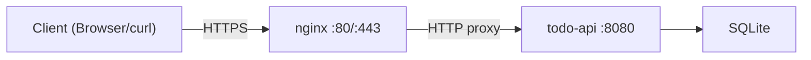

# Deploy to a VPS with nginx

Your API works locally. Now let's deploy it to a Virtual Private Server (VPS) with nginx as a reverse proxy and HTTPS.
We will also cover Docker and CI/CD with GitHub Actions.

## Building for release

During development, `cargo build` produces an unoptimized debug binary. For production, use the release profile:

```bash
cargo build --release
```

The binary is at `target/release/todo-api`.

| Profile   | Location               | Optimized | Debug symbols | Compile time |
|-----------|------------------------|-----------|---------------|-------------|
| `debug`   | `target/debug/`       | No        | Yes           | Fast        |
| `release` | `target/release/`     | Yes       | No            | Slower      |

The release binary is typically 5-10x smaller and significantly faster than the debug build.

> **Tip:** You can further reduce binary size by adding to `Cargo.toml`:
>
> ```toml
> [profile.release]
> strip = true    # Strip debug symbols
> lto = true      # Link-time optimization
> codegen-units = 1 # Better optimization (slower compile)
> ```

## Deploying to a VPS

This section assumes a fresh Ubuntu/Debian VPS with SSH access.

### Step 1 - Build on the server (simplest approach)

SSH into your server and install Rust:

```bash
ssh user@your-server

# Install Rust
curl --proto '=https' --tlsv1.2 -sSf https://sh.rustup.rs | sh
source $HOME/.cargo/env

# Install build dependencies
sudo apt update
sudo apt install -y build-essential pkg-config libssl-dev
```

Clone your project and build:

```bash
git clone https://github.com/you/todo-api.git
cd todo-api
cargo build --release
```

### Step 2 - Cross-compilation (build locally, deploy binary)

Alternatively, build on your local machine for the server's architecture:

```bash
# Add the Linux target (from macOS or another Linux)
rustup target add x86_64-unknown-linux-gnu

# Cross-compile
cargo build --release --target x86_64-unknown-linux-gnu
```

Then copy the binary to your server:

```bash
scp target/x86_64-unknown-linux-gnu/release/todo-api user@your-server:~/
```

> **Note:** Cross-compilation may require a cross-linker. The `cross` tool handles this automatically:
>
> ```bash
> cargo install cross
> cross build -release -target x86_64-unknown-linux-gnu
> ```

## Setting up a systemd service

Create a systemd service so your API starts automatically and restarts on failure.

### Step 1 - Create a dedicated user

```bash
sudo useradd -r -s /bin/false todoapi
sudo mkdir -p /opt/todoapi
sudo cp ~/todo-api /opt/todoapi/
sudo chown -R todoapi:todoapi /opt/todoapi
```

### Step 2 - Create the service file

`/etc/systemd/system/todoapi.service`:

```text
[Unit]
Description=Todo API (Rust/Actix)
After=network.target

[Service]
Type=simple
User=todoapi
Group=todoapi
WorkingDirectory=/opt/todoapi
ExecStart=/opt/todoapi/todo-api
Restart=always
RestartSec=5
Environment=RUST_LOG=info

[Install]
WantedBy=multi-user.target
```

### Step 3 - Enable and start

```bash
sudo systemctl daemon-reload
sudo systemctl enable todoapi
sudo systemctl start todoapi
sudo systemctl status todoapi
```

Useful commands:

| Command                          | What it does              |
|---------------------------------|---------------------------|
| `sudo systemctl status todoapi` | Check if it is running    |
| `sudo journalctl -u todoapi -f` | Follow logs in real-time  |
| `sudo systemctl restart todoapi` | Restart the service      |
| `sudo systemctl stop todoapi`   | Stop the service          |

## nginx as a reverse proxy

nginx sits in front of your Rust application, handling TLS termination, static files, and load balancing.

### Install nginx

```bash
sudo apt install -y nginx
```

### Configure the site

Create `/etc/nginx/sites-available/todoapi`:

```nginx
server {
    listen 80;
    server_name api.yourdomain.com;

    location / {
        proxy_pass http://127.0.0.1:8080;
        proxy_set_header Host $host;
        proxy_set_header X-Real-IP $remote_addr;
        proxy_set_header X-Forwarded-For $proxy_add_x_forwarded_for;
        proxy_set_header X-Forwarded-Proto $scheme;
    }
}
```

Enable the site:

```bash
sudo ln -s /etc/nginx/sites-available/todoapi /etc/nginx/sites-enabled/
sudo nginx -t          # Test configuration
sudo systemctl reload nginx
```

Your API is now accessible at `http://api.yourdomain.com`.



## HTTPS with Let's Encrypt

Use Certbot to get a free TLS certificate:

```bash
sudo apt install -y certbot python3-certbot-nginx
sudo certbot --nginx -d api.yourdomain.com
```

Certbot automatically:
- Obtains a certificate from Let's Encrypt
- Configures nginx for HTTPS
- Sets up automatic renewal

Verify auto-renewal:

```bash
sudo certbot renew --dry-run
```

## Environment variables

Use environment variables for configuration instead of hardcoding values:

```rust
use std::env;

let host = env::var("HOST").unwrap_or_else(|_| "127.0.0.1".to_string());
let port = env::var("PORT").unwrap_or_else(|_| "8080".to_string());
let db_path = env::var("DATABASE_PATH").unwrap_or_else(|_| "todos.db".to_string());
```

Set them in the systemd service file:

```text
[Service]
Environment=HOST=127.0.0.1
Environment=PORT=8080
Environment=DATABASE_PATH=/opt/todoapi/data/todos.db
Environment=RUST_LOG=info
```

## Docker deployment

Docker packages your application with all its dependencies into a container.

### Multi-stage Dockerfile

```dockerfile
# Stage 1: Build
FROM rust:1.84-slim AS builder

WORKDIR /app
COPY Cargo.toml Cargo.lock ./
COPY src/ src/

RUN cargo build --release

# Stage 2: Runtime
FROM debian:bookworm-slim

RUN apt-get update && apt-get install -y --no-install-recommends \
    ca-certificates \
    && rm -rf /var/lib/apt/lists/*

COPY --from=builder /app/target/release/todo-api /usr/local/bin/

EXPOSE 8080

CMD ["todo-api"]
```

The multi-stage build keeps the final image small - only the binary and minimal runtime dependencies are included, not
the entire Rust toolchain.

### Build and run

```bash
docker build -t todo-api .
docker run -p 8080:8080 -v todo-data:/data -e DATABASE_PATH=/data/todos.db todo-api
```

### Docker Compose

```yaml
services:
  api:
    build: .
    ports:
      - "8080:8080"
    environment:
      - DATABASE_PATH=/data/todos.db
      - RUST_LOG=info
    volumes:
      - todo-data:/data
    restart: unless-stopped

volumes:
  todo-data:
```

```bash
docker compose up -d
```

## CI/CD with GitHub Actions

Automate testing and deployment with GitHub Actions.

### Test on every push

`.github/workflows/ci.yml`:

```yaml
name: CI

on:
  push:
    branches: [main]
  pull_request:
    branches: [main]

jobs:
  test:
    runs-on: ubuntu-latest
    steps:
      - uses: actions/checkout@v4
      - uses: dtolnay/rust-toolchain@stable
      - uses: Swatinem/rust-cache@v2
      - run: cargo fmt --check
      - run: cargo clippy -- -D warnings
      - run: cargo test
```

### Build and push Docker image

```yaml
  build:
    needs: test
    runs-on: ubuntu-latest
    if: github.ref == 'refs/heads/main'
    steps:
      - uses: actions/checkout@v4
      - uses: docker/login-action@v3
        with:
          registry: ghcr.io
          username: ${{ github.actor }}
          password: ${{ secrets.GITHUB_TOKEN }}
      - uses: docker/build-push-action@v5
        with:
          push: true
          tags: ghcr.io/${{ github.repository }}:latest
```

## Deployment checklist

Before going live, verify:

- [ ] Release binary (`cargo build --release`)
- [ ] Environment variables for all configuration
- [ ] systemd service with automatic restart
- [ ] nginx reverse proxy with proper headers
- [ ] HTTPS via Let's Encrypt
- [ ] Firewall: only ports 22, 80, 443 open
- [ ] Log rotation configured
- [ ] Monitoring in place (health check endpoint)
- [ ] Database backups scheduled

## Summary

- `cargo build --release` produces an optimized production binary
- **systemd** manages the process lifecycle (start, stop, restart, auto-start)
- **nginx** acts as a reverse proxy, handling TLS and forwarding to your app
- **Let's Encrypt** provides free HTTPS certificates via Certbot
- Use **environment variables** for configuration - never hardcode secrets
- **Docker multi-stage builds** produce small, portable images
- **GitHub Actions** automates testing, linting, and deployment

Congratulations - you have gone from `fn main()` to a deployed, production-ready REST API.

Next up: [Practice Projects](./19-practice-projects.md) - eight project ideas from beginner to advanced to solidify
everything you have learned.

### Recommended external resources

- [The Rust Programming Language](https://doc.rust-lang.org/book/) - the official book for deeper coverage
- [Rust by Example](https://doc.rust-lang.org/rust-by-example/) - learn by reading annotated examples
- [Async Book](https://rust-lang.github.io/async-book/) - full async/await guide
- [Rustlings](https://github.com/rust-lang/rustlings) - small exercises to practice Rust
