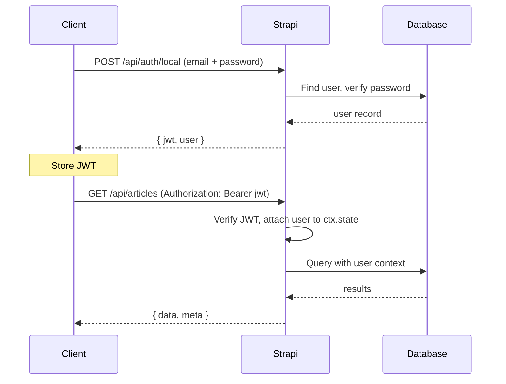

# Authentication and Permissions

Strapi ships with a full authentication system out of the box via the **Users & Permissions** plugin. Understanding how
to configure and extend it is critical for any production application.

## Authentication flow


```mermaid
sequenceDiagram
    participant Client
    participant Strapi
    participant Database

    Client->>Strapi: POST /api/auth/local (email + password)
    Strapi->>Database: Find user, verify password
    Database-->>Strapi: user record
    Strapi-->>Client: { jwt, user }
    Note over Client: Store JWT

    Client->>Strapi: GET /api/articles (Authorization: Bearer jwt)
    Strapi->>Strapi: Verify JWT, attach user to ctx.state
    Strapi->>Database: Query with user context
    Database-->>Strapi: results
    Strapi-->>Client: { data, meta }
```

---

## User registration and login

### Register a new user

```js
const response = await fetch('/api/auth/local/register', {
  method: 'POST',
  headers: { 'Content-Type': 'application/json' },
  body: JSON.stringify({
    username: 'johndoe',
    email: 'john@example.com',
    password: '<your-password>',
  }),
});

const { jwt, user } = await response.json();
// Store jwt for subsequent requests
```

### Login

```js
const response = await fetch('/api/auth/local', {
  method: 'POST',
  headers: { 'Content-Type': 'application/json' },
  body: JSON.stringify({
    identifier: 'john@example.com', // email or username
    password: '<your-password>',
  }),
});

const { jwt, user } = await response.json();
```

### Using the JWT

```js
const articles = await fetch('/api/articles', {
  headers: {
    Authorization: `Bearer ${jwt}`,
  },
});
```

---

## Role-based access control (RBAC)

Strapi comes with two default roles for API users:

| Role              | Default behaviour                                    |
|-------------------|------------------------------------------------------|
| **Public**        | Unauthenticated requests. No content permissions by default. |
| **Authenticated** | Logged-in users. Grant only the content permissions they need. |

You can create additional roles (e.g., Editor, Moderator, Premium) in the admin panel under **Settings > Users &
Permissions > Roles**.

### Checking roles in code

```js
// In a policy or controller
const user = ctx.state.user;

if (!user) {
  return ctx.unauthorized('You must be logged in');
}

// user.role is populated by the Users & Permissions authentication layer
if (user.role?.type !== 'editor') {
  return ctx.forbidden('Only editors can perform this action');
}
```

### Role-based policy

```js
// src/policies/has-role.js
module.exports = (policyContext, config, { strapi }) => {
  const user = policyContext.state.user;

  if (!user) {
    return false;
  }

  const allowedRoles = config.roles || [];

  if (!allowedRoles.includes(user.role?.type)) {
    return false;
  }

  return true;
};
```

```js
// Usage in route config
const { createCoreRouter } = require('@strapi/strapi').factories;

module.exports = createCoreRouter('api::article.article', {
  config: {
    create: {
      policies: [
        {
          name: 'global::has-role',
          config: { roles: ['editor', 'admin'] },
        },
      ],
    },
  },
});
```

---

## API tokens (machine-to-machine)

For server-to-server communication, use API tokens instead of user JWTs. Create them in **Settings > API Tokens**.

| Token type      | Use case                                     |
|-----------------|----------------------------------------------|
| **Read-only**   | Trusted build jobs or servers fetching published content |
| **Full access** | CI/CD pipelines, automated imports           |
| **Custom**      | Fine-grained per-content-type permissions    |

```bash
# Using an API token
curl -H "Authorization: Bearer <api-token>" \
  http://localhost:1337/api/articles
```

### Transfer tokens

Transfer tokens are a separate concept, used by the `strapi transfer` CLI command to move data between Strapi instances.
Do not confuse them with API tokens.

---

## Custom registration flow

Override the default registration to add fields, send welcome emails, or restrict sign-ups:

```js
// src/extensions/users-permissions/strapi-server.js
module.exports = (plugin) => {
  const originalRegister = plugin.controllers.auth.register;

  plugin.controllers.auth.register = async (ctx) => {
    const { email } = ctx.request.body;

    // Restrict registration to company domain
    if (!email || !email.endsWith('@mycompany.com')) {
      return ctx.badRequest('Registration is limited to company email addresses');
    }

    // Call the original register
    const response = await originalRegister(ctx);

    // After successful registration, send welcome email
    const user = ctx.body?.user || ctx.response.body?.user;
    if (user) {
      await strapi.plugin('email').service('email').send({
        to: user.email,
        subject: 'Welcome!',
        html: `<h1>Welcome, ${user.username}!</h1><p>Your account has been created.</p>`,
      });
    }

    return response;
  };

  return plugin;
};
```

If registration accepts custom User fields, also list those fields under
`config.register.allowedFields` in `config/plugins.js`; otherwise Strapi rejects them.

---

## OAuth / third-party providers

Strapi supports OAuth providers (Google, GitHub, Facebook, etc.) through the Users & Permissions plugin.

### Configuration

Configure built-in providers in **Settings > Users & Permissions > Providers** and set the absolute backend URL in
`config/server.js`. The provider callback URL is `https://your-strapi-domain.com/api/connect/:provider/callback`;
the frontend redirect URL is configured in the provider settings.

### Frontend redirect flow

```js
// 1. Redirect user to Strapi's provider endpoint
window.location.href = 'http://localhost:1337/api/connect/google';

// 2. After OAuth, Strapi redirects back with an access_token param
// 3. Exchange for a Strapi JWT:
const params = new URLSearchParams(window.location.search);
const accessToken = params.get('access_token');

const response = await fetch(
  `http://localhost:1337/api/auth/google/callback?access_token=${accessToken}`
);
const { jwt, user } = await response.json();
```

If your project uses refresh-token session mode instead of legacy long-lived JWTs, see
[Refresh-token session mode](#refresh-token-session-mode).

---

## Refresh-token session mode

Strapi 5's Users & Permissions plugin can run in two JWT management modes:

| Mode | What it issues | When to use it |
|------|----------------|----------------|
| `legacy-support` | A single JWT returned by login and used until it expires. | Existing projects, simple mobile integrations, and migrations where clients already store JWTs. This is the package-level compatibility default in the plugin code. |
| `refresh` | A short-lived access JWT plus a refresh token bound to a server-side session. | New browser-facing applications and any project that wants logout, refresh-token rotation, session listing, and shorter-lived access tokens. |

Current projects scaffolded by `create-strapi@latest` explicitly opt in to `jwtManagement: 'refresh'` and set
`sessions.httpOnly: true`. Do not assume an upgraded project changed modes automatically; check `config/plugins.js` or
`config/plugins.ts`.

### Plugin configuration

Configure Users & Permissions in `config/plugins.js`. Session lifespans are expressed in **seconds**. Set values
explicitly instead of relying on package defaults, especially when migrating an older project.

```js
// config/plugins.js
module.exports = ({ env }) => ({
  'users-permissions': {
    config: {
      jwtManagement: env('UP_JWT_MANAGEMENT', 'refresh'),
      sessions: {
        // Access JWT lifetime. Keep this short because refresh mode can renew it.
        accessTokenLifespan: env.int('UP_ACCESS_TOKEN_LIFESPAN', 15 * 60),

        // Absolute and idle lifetimes for refresh-token rotation.
        maxRefreshTokenLifespan: env.int('UP_MAX_REFRESH_TOKEN_LIFESPAN', 30 * 24 * 60 * 60),
        idleRefreshTokenLifespan: env.int('UP_IDLE_REFRESH_TOKEN_LIFESPAN', 7 * 24 * 60 * 60),

        // Absolute and idle lifetimes for the session record itself.
        maxSessionLifespan: env.int('UP_MAX_SESSION_LIFESPAN', 30 * 24 * 60 * 60),
        idleSessionLifespan: env.int('UP_IDLE_SESSION_LIFESPAN', 7 * 24 * 60 * 60),

        // true stores the refresh token in an HTTP-only cookie instead of JSON.
        httpOnly: env.bool('UP_REFRESH_TOKEN_HTTP_ONLY', true),
      },
    },
  },
});
```

What the settings mean:

| Setting | Unit | Purpose |
|---------|------|---------|
| `accessTokenLifespan` | seconds | Lifetime of the access JWT returned to the client. |
| `maxRefreshTokenLifespan` | seconds | Absolute lifetime of a refresh token, even if it keeps being used. |
| `idleRefreshTokenLifespan` | seconds | Refresh token expires if it is not used within this window. |
| `maxSessionLifespan` | seconds | Absolute lifetime of the server-side session. |
| `idleSessionLifespan` | seconds | Session expires if the user is inactive for this window. |
| `httpOnly` | boolean | `true` sets the refresh token as an HTTP-only cookie; `false` returns it in JSON for non-browser clients. |

### Login response shape

The login endpoint stays the same:

```http
POST /api/auth/local
Content-Type: application/json
```

```json
{
  "identifier": "john@example.com",
  "password": "<your-password>"
}
```

With `jwtManagement: 'refresh'`, the response still includes the access JWT and user:

```json
{
  "jwt": "<short-lived-access-token>",
  "user": {
    "id": 1,
    "username": "johndoe",
    "email": "john@example.com",
    "provider": "local",
    "confirmed": true,
    "blocked": false
  }
}
```

If `sessions.httpOnly` is `true`, the refresh token is sent in a `Set-Cookie` header and is not readable by frontend
JavaScript. If `sessions.httpOnly` is `false`, Strapi returns the refresh token in the JSON response so native mobile
apps or non-browser clients can store it in their secure storage.

### Session endpoints

Refresh mode adds session endpoints under the same `/api/auth` prefix. They require refresh mode; they are not part of
legacy JWT mode.

| Endpoint | Method | Body | Result |
|----------|--------|------|--------|
| `/api/auth/refresh` | `POST` | No body when `httpOnly: true`; otherwise send `{ "refreshToken": "<token>" }`. | Rotates the refresh token and returns a new `jwt`. |
| `/api/auth/logout` | `POST` | No body when `httpOnly: true`; otherwise send `{ "refreshToken": "<token>" }`. | Revokes the current refresh-token session and clears the cookie when applicable. |
| `/api/auth/sessions` | `GET` | None. Send the current access JWT. | Lists the current user's active sessions so the UI can show and revoke devices. |

Use an Authorization header for protected content requests as usual:

```js
const response = await fetch('/api/articles', {
  headers: {
    Authorization: `Bearer ${accessToken}`,
  },
});
```

### Browser flow with HTTP-only cookies

A browser SPA should keep the access JWT in memory and let the browser hold the refresh token cookie. Cross-origin
frontends must use `credentials: 'include'` on login, refresh, and logout requests, and Strapi CORS must allow
credentials for the frontend origin.

```js
let accessToken;

export async function login(identifier, password) {
  const response = await fetch('https://cms.example.com/api/auth/local', {
    method: 'POST',
    credentials: 'include',
    headers: { 'Content-Type': 'application/json' },
    body: JSON.stringify({ identifier, password }),
  });

  if (!response.ok) {
    throw new Error('Login failed');
  }

  const data = await response.json();
  accessToken = data.jwt;
  return data.user;
}

async function refreshAccessToken() {
  const response = await fetch('https://cms.example.com/api/auth/refresh', {
    method: 'POST',
    credentials: 'include',
  });

  if (!response.ok) {
    accessToken = undefined;
    throw new Error('Session expired');
  }

  const data = await response.json();
  accessToken = data.jwt;
  return accessToken;
}

export async function apiFetch(path, options = {}) {
  const response = await fetch(`https://cms.example.com${path}`, {
    ...options,
    headers: {
      ...options.headers,
      Authorization: `Bearer ${accessToken}`,
    },
  });

  if (response.status !== 401) {
    return response;
  }

  const nextToken = await refreshAccessToken();

  return fetch(`https://cms.example.com${path}`, {
    ...options,
    headers: {
      ...options.headers,
      Authorization: `Bearer ${nextToken}`,
    },
  });
}

export async function logout() {
  await fetch('https://cms.example.com/api/auth/logout', {
    method: 'POST',
    credentials: 'include',
  });
  accessToken = undefined;
}
```

Common pitfalls for browser clients:

| Pitfall | Fix |
|---------|-----|
| Refresh request does not send the cookie | Add `credentials: 'include'` and configure `strapi::cors` with the exact frontend origin and credentials support. |
| Frontend tries to read the refresh token | Keep `httpOnly: true`; only the browser should send the cookie. Store the access JWT in memory. |
| Cookie disappears on browser close | Set explicit session lifespans and verify cookie attributes in the generated `Set-Cookie` header for your Strapi version. |

### Mobile and non-browser clients

Native mobile apps, CLIs, and server-to-server clients usually cannot rely on a browser-managed HTTP-only cookie. For
those clients either:

- keep `httpOnly: true` and let the client HTTP stack persist cookies securely, or
- set `sessions.httpOnly: false` and store the returned `refreshToken` in platform secure storage such as Keychain,
    Keystore, or a server-side secret store.

Do not store refresh tokens in web `localStorage`. If a SPA cannot use HTTP-only cookies, prefer a backend-for-frontend
that stores the refresh token server-side and issues its own secure browser session.

### Migrating from legacy mode

1. **Inventory clients**: find every app that calls `/api/auth/local` and stores the long-lived JWT.
2. **Shorten old JWT lifetime first**: in `legacy-support`, reduce `jwt.expiresIn` to limit the transition window.
3. **Update clients**: store access tokens in memory, add a 401 retry that calls `/api/auth/refresh`, and use
    `credentials: 'include'` for browser requests.
4. **Enable refresh mode in a non-production environment**: add `jwtManagement: 'refresh'` and explicit `sessions`
    lifespans.
5. **Migrate browser storage**: stop reading JWTs from `localStorage`; remove stale tokens on the next release.
6. **Roll out carefully**: existing legacy JWTs remain valid until their configured expiration. Treat the cutover as a
    session reset if you need immediate revocation.

Keep `legacy-support` only for clients that cannot be updated yet. For new frontends, prefer refresh mode with
HTTP-only refresh cookies and short-lived access JWTs.

---

## Securing the admin panel

The admin panel has its own separate auth system. Key security settings:

```js
// config/admin.js
module.exports = ({ env }) => ({
  auth: {
    secret: env('ADMIN_JWT_SECRET'),
  },
  secrets: {
    encryptionKey: env('ENCRYPTION_KEY'),
  },
  apiToken: {
    salt: env('API_TOKEN_SALT'),
  },
  transfer: {
    token: {
      salt: env('TRANSFER_TOKEN_SALT'),
    },
  },
  // Rate limiting for admin login
  rateLimit: {
    enabled: true,
    interval: { min: 5 },
    max: 5,
  },
});
```

---

## Hardening permissions checklist

| Action                                   | Why                                                                    |
|------------------------------------------|------------------------------------------------------------------------|
| Review the **Public** role permissions   | By default, nothing is exposed. Only enable what anonymous users need. |
| Use `find` and `findOne` only for public | Never expose `create`, `update`, `delete` to the Public role           |
| Set strong JWT secrets                   | Use long, random secrets via environment variables                     |
| Rotate API tokens                        | Treat API tokens like passwords. Rotate regularly.                     |
| Enable rate limiting                     | Prevent brute-force attacks on `/api/auth/local`                       |
| Validate email before login              | Enable email confirmation in Users & Permissions settings              |
| Restrict registration                    | If your app doesn't need public sign-up, disable it                    |
| Use HTTPS                                | Never send JWTs over unencrypted connections                           |

---

## Common pitfalls

| Pitfall                           | Problem                         | Fix                                              |
|-----------------------------------|---------------------------------|--------------------------------------------------|
| Storing JWT in `localStorage`     | Vulnerable to XSS attacks       | Use `httpOnly` cookies or secure session storage |
| Public role exposes `create`      | Anyone can create content       | Audit Public role permissions                    |
| No email confirmation             | Fake accounts flood the system  | Enable email confirmation                        |
| Hardcoded JWT secret              | Same secret across environments | Use env vars: `env('JWT_SECRET')`                |
| Forgetting `ctx.state.user` check | Controller assumes user exists  | Always guard with `if (!ctx.state.user)`         |

---

## See also

- [Middleware and Policies](./middleware-and-policies.md) - implementing access control middleware
- [Custom Controllers and Services](./custom-controllers-services.md) - using auth context in controllers
- [Configuration and Deployment](./configuration-and-deployment.md) - env-based secrets management
