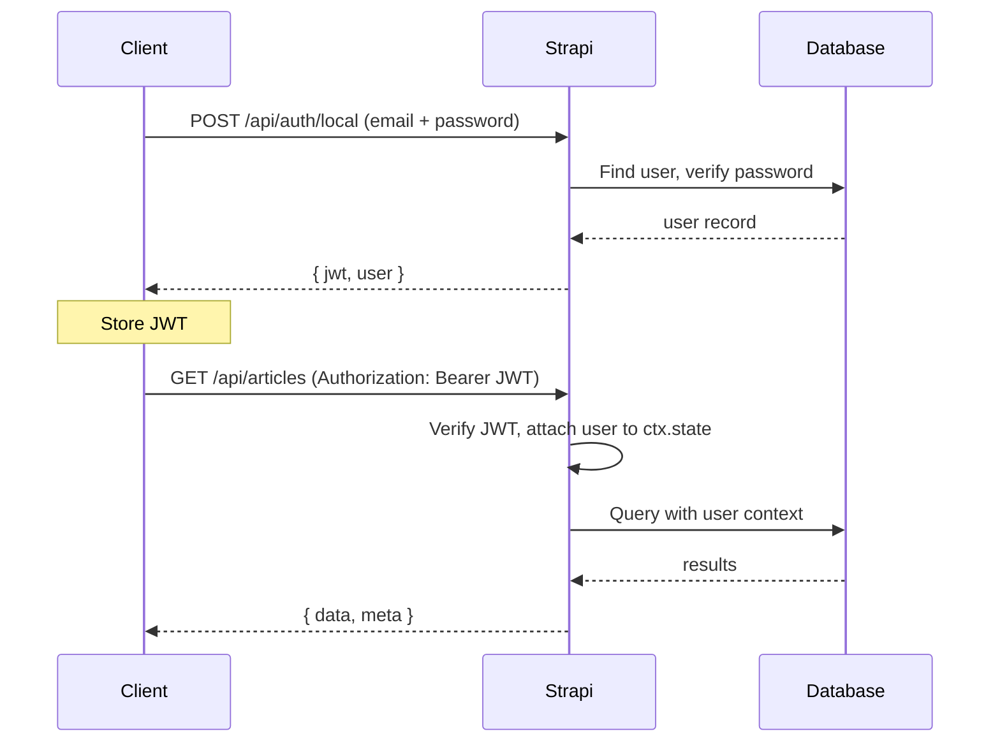

# Authentication and Permissions

Strapi ships with a full authentication system out of the box via the **Users & Permissions** plugin. Understanding how to configure and extend it is critical for any production application.

## Authentication flow



---

## User registration and login

### Register a new user

```js
const response = await fetch('/api/auth/local/register', {
  method: 'POST',
  headers: { 'Content-Type': 'application/json' },
  body: JSON.stringify({
    username: 'johndoe',
    email: 'john@example.com',
    password: 'SecureP@ss123',
  }),
});

const { jwt, user } = await response.json();
// Store jwt for subsequent requests
```

### Login

```js
const response = await fetch('/api/auth/local', {
  method: 'POST',
  headers: { 'Content-Type': 'application/json' },
  body: JSON.stringify({
    identifier: 'john@example.com', // email or username
    password: 'SecureP@ss123',
  }),
});

const { jwt, user } = await response.json();
```

### Using the JWT

```js
const articles = await fetch('/api/articles', {
  headers: {
    Authorization: `Bearer ${jwt}`,
  },
});
```

---

## Role-based access control (RBAC)

Strapi comes with two default roles for API users:

| Role | Default behaviour |
|------|-------------------|
| **Public** | Unauthenticated requests. No permissions by default. |
| **Authenticated** | Logged-in users. Basic read permissions by default. |

You can create additional roles (e.g., Editor, Moderator, Premium) in the admin panel under **Settings > Users & Permissions > Roles**.

### Checking roles in code

```js
// In a policy or controller
const user = ctx.state.user;

if (!user) {
  return ctx.unauthorized('You must be logged in');
}

// user.role is populated automatically
if (user.role.type !== 'editor') {
  return ctx.forbidden('Only editors can perform this action');
}
```

### Role-based policy

```js
// src/policies/has-role.js
module.exports = (policyContext, config, { strapi }) => {
  const user = policyContext.state.user;

  if (!user) {
    return false;
  }

  const allowedRoles = config.roles || [];

  if (!allowedRoles.includes(user.role.type)) {
    return false;
  }

  return true;
};
```

```js
// Usage in route config
module.exports = createCoreRouter('api::article.article', {
  config: {
    create: {
      policies: [
        {
          name: 'global::has-role',
          config: { roles: ['editor', 'admin'] },
        },
      ],
    },
  },
});
```

---

## API tokens (machine-to-machine)

For server-to-server communication, use API tokens instead of user JWTs. Create them in **Settings > API Tokens**.

| Token type | Use case |
|------------|----------|
| **Read-only** | External frontend fetching published content |
| **Full access** | CI/CD pipelines, automated imports |
| **Custom** | Fine-grained per-content-type permissions |

```bash
# Using an API token
curl -H "Authorization: Bearer YOUR_API_TOKEN" \
  http://localhost:1337/api/articles
```

### Transfer tokens

Transfer tokens are a separate concept, used by the `strapi transfer` CLI command to move data between Strapi instances. Do not confuse them with API tokens.

---

## Custom registration flow

Override the default registration to add fields, send welcome emails, or restrict sign-ups:

```js
// src/extensions/users-permissions/controllers/auth.js
module.exports = (plugin) => {
  const originalRegister = plugin.controllers.auth.register;

  plugin.controllers.auth.register = async (ctx) => {
    const { email } = ctx.request.body;

    // Restrict registration to company domain
    if (!email.endsWith('@mycompany.com')) {
      return ctx.badRequest('Registration is limited to company email addresses');
    }

    // Call the original register
    await originalRegister(ctx);

    // After successful registration, send welcome email
    const user = ctx.response.body.user;
    if (user) {
      await strapi.plugins['email'].services.email.send({
        to: user.email,
        subject: 'Welcome!',
        html: `<h1>Welcome, ${user.username}!</h1><p>Your account has been created.</p>`,
      });
    }
  };

  return plugin;
};
```

---

## OAuth / third-party providers

Strapi supports OAuth providers (Google, GitHub, Facebook, etc.) through the Users & Permissions plugin.

### Configuration

```js
// config/plugins.js
module.exports = ({ env }) => ({
  'users-permissions': {
    config: {
      providers: {
        google: {
          enabled: true,
          key: env('GOOGLE_CLIENT_ID'),
          secret: env('GOOGLE_CLIENT_SECRET'),
          callbackURL: '/api/connect/google/callback',
          scope: ['email', 'profile'],
        },
        github: {
          enabled: true,
          key: env('GITHUB_CLIENT_ID'),
          secret: env('GITHUB_CLIENT_SECRET'),
          callbackURL: '/api/connect/github/callback',
          scope: ['user:email'],
        },
      },
    },
  },
});
```

### Frontend redirect flow

```js
// 1. Redirect user to Strapi's provider endpoint
window.location.href = 'http://localhost:1337/api/connect/google';

// 2. After OAuth, Strapi redirects back with an access_token param
// 3. Exchange for a Strapi JWT:
const params = new URLSearchParams(window.location.search);
const accessToken = params.get('access_token');

const response = await fetch(
  `http://localhost:1337/api/auth/google/callback?access_token=${accessToken}`
);
const { jwt, user } = await response.json();
```

---

## Securing the admin panel

The admin panel has its own separate auth system. Key security settings:

```js
// config/admin.js
module.exports = ({ env }) => ({
  auth: {
    secret: env('ADMIN_JWT_SECRET'),
  },
  apiToken: {
    salt: env('API_TOKEN_SALT'),
  },
  transfer: {
    token: {
      salt: env('TRANSFER_TOKEN_SALT'),
    },
  },
  // Rate limiting for admin login
  rateLimit: {
    enabled: true,
    interval: { min: 5 },
    max: 5,
  },
});
```

---

## Hardening permissions checklist

| Action | Why |
|--------|-----|
| Review the **Public** role permissions | By default, nothing is exposed. Only enable what anonymous users need. |
| Use `find` and `findOne` only for public | Never expose `create`, `update`, `delete` to the Public role |
| Set strong JWT secrets | Use long, random secrets via environment variables |
| Rotate API tokens | Treat API tokens like passwords. Rotate regularly. |
| Enable rate limiting | Prevent brute-force attacks on `/api/auth/local` |
| Validate email before login | Enable email confirmation in Users & Permissions settings |
| Restrict registration | If your app doesn't need public sign-up, disable it |
| Use HTTPS | Never send JWTs over unencrypted connections |

---

## Common pitfalls

| Pitfall | Problem | Fix |
|---------|---------|-----|
| Storing JWT in `localStorage` | Vulnerable to XSS attacks | Use `httpOnly` cookies or secure session storage |
| Public role exposes `create` | Anyone can create content | Audit Public role permissions |
| No email confirmation | Fake accounts flood the system | Enable email confirmation |
| Hardcoded JWT secret | Same secret across environments | Use env vars: `env('JWT_SECRET')` |
| Forgetting `ctx.state.user` check | Controller assumes user exists | Always guard with `if (!ctx.state.user)` |

---

## See also

- [Middleware and Policies](./middleware-and-policies.md) -- implementing access control middleware
- [Custom Controllers and Services](./custom-controllers-services.md) -- using auth context in controllers
- [Configuration and Deployment](./configuration-and-deployment.md) -- env-based secrets management
