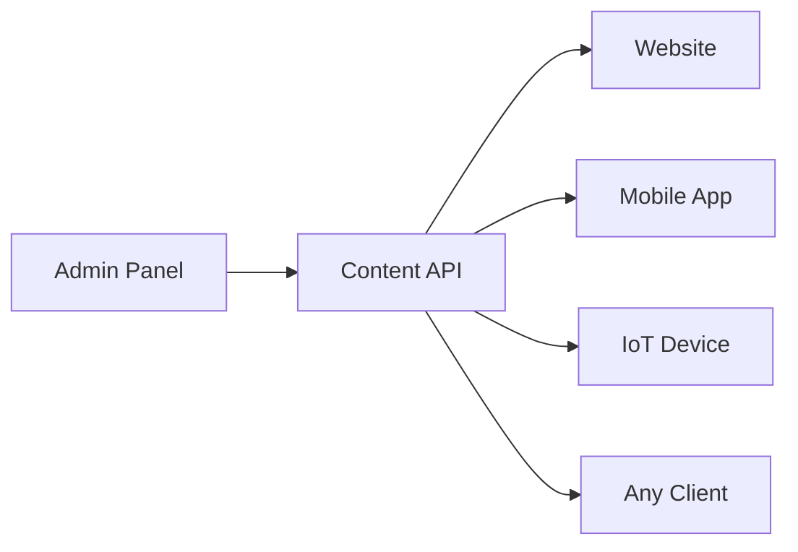
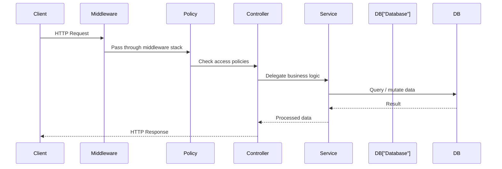

# Introduction & Setup

Strapi is an open-source **headless CMS** built on Node.js. This guide takes you from a fresh install to a fully configured, production-deployed Strapi 5 instance -- step by step.

We assume you already know JavaScript and Node.js basics. If not, work through the [JavaScript Beginners Guide](/javascript/beginners-guide/introduction) first.

## How this guide is structured

| Part | Chapters | What you will learn |
|------|----------|---------------------|
| **1 -- Getting Started** | 1--3 | Install Strapi, model content types, define relations |
| **2 -- Working with Data** | 4--6 | Admin panel, REST API, authentication & permissions |
| **3 -- Customizing the Backend** | 7--9 | Controllers, services, routes, policies, middleware, lifecycle hooks, webhooks |
| **4 -- Production Features** | 10--11 | File uploads, media providers, TypeScript integration |
| **5 -- Deploy** | 12 | Environment config, PostgreSQL, nginx, HTTPS, security hardening |

By the end you will have a blog CMS with authors, posts, categories, and tags -- fully customized and running in production.

## What is a headless CMS?

A **traditional CMS** (like WordPress) bundles content management and content display into one system. The admin panel and the website are tightly coupled.

A **headless CMS** separates these concerns:



The CMS manages content and exposes it through an API. **Any** frontend can consume that API -- a website, a mobile app, a CLI tool, anything that speaks HTTP.

Benefits of going headless:

- **Frontend freedom** -- use any framework (React, Vue, Svelte, vanilla JS) or even multiple frontends
- **Better performance** -- static site generators or CDNs can serve the frontend; the CMS only handles content
- **API-first** -- the same content feeds your website, mobile app, and any future channel
- **Developer experience** -- frontend and backend teams work independently

## Why Strapi?

Strapi is one of the most popular headless CMS options. Here is why:

| Feature | Details |
|---------|---------|
| **Open source** | MIT-licensed, self-hosted, no vendor lock-in |
| **Node.js** | Built on Koa -- if you know JavaScript, you can customize everything |
| **Admin panel** | Beautiful, auto-generated UI for content editors |
| **REST & GraphQL** | Both APIs generated automatically from your content types |
| **Plugin system** | Extend functionality with community or custom plugins |
| **TypeScript** | First-class TypeScript support in Strapi 5 |
| **Database agnostic** | SQLite (dev), PostgreSQL, MySQL, MariaDB (production) |
| **Self-hosted** | Full control over your data and infrastructure |

## Prerequisites

Before we start, make sure you have:

- **Node.js 18 or later** -- check with `node --version`
- **npm, yarn, or pnpm** -- any package manager works
- **A code editor** -- VS Code recommended
- **A terminal** -- you will live here

If you need to install Node.js, see the [JavaScript guide's setup chapter](/javascript/beginners-guide/introduction).

## Create a new Strapi project

Open your terminal and run:

```bash
npx create-strapi@latest my-blog
```

The CLI will ask you a few questions:

| Question | Recommended answer |
|----------|-------------------|
| Use TypeScript? | **No** (we will add it in chapter 11) |
| Install dependencies? | **Yes** |
| Initialize git? | **Yes** |
| Use example template? | **No** (we will build from scratch) |
| Database | **SQLite** (perfect for development) |

Once the installation finishes, start the development server:

```bash
cd my-blog
npm run develop
```

Strapi starts on `http://localhost:1337`. On first launch it opens the admin registration page.

## Register your admin account

The first time Strapi starts, it asks you to create an admin account. This is **not** an API user -- it is the super-admin for the admin panel.

Fill in:

- **First name** and **Last name**
- **Email** -- this is your login
- **Password** -- at least 8 characters

Click **Let's start** and you are in the admin panel.

> **Important:** This admin account is stored in the database. There is no default password. If you lose access, you can reset it via the CLI: `npm run strapi admin:reset-user-password`.

## Project structure

After creation, your project looks like this:

```
my-blog/
├── config/             # Server, database, admin, plugin configuration
│   ├── admin.ts        # Admin panel settings
│   ├── database.ts     # Database connection
│   ├── middlewares.ts   # Global middleware stack
│   ├── plugins.ts      # Plugin configuration
│   └── server.ts       # Host, port, app keys
├── database/           # SQLite file (in development)
├── public/             # Static files served by Strapi
│   └── uploads/        # Uploaded media (local provider)
├── src/
│   ├── admin/          # Admin panel customization
│   │   └── app.example.tsx
│   ├── api/            # Your content types live here
│   │   └── (empty for now)
│   ├── components/     # Reusable components (shared field groups)
│   ├── middlewares/     # Custom middleware
│   └── policies/       # Custom policies
├── .env                # Environment variables (APP_KEYS, API_TOKEN_SALT, etc.)
├── package.json
└── tsconfig.json       # Even JS projects have this for editor support
```

The directories you will work with most:

| Directory | Purpose |
|-----------|---------|
| `src/api/` | Content type schemas, controllers, services, routes |
| `src/components/` | Reusable component schemas |
| `config/` | Application configuration |
| `public/uploads/` | Uploaded files (local provider) |

## The admin panel

The admin panel is your content management interface. Let's explore the key sections:

### Content Manager

This is where you create, edit, and publish content. It is empty right now because we have not created any content types yet -- that comes in the next chapter.

### Content-Type Builder

This visual tool lets you define your data model: collection types, single types, and components. We will use it extensively in chapters 2 and 3.

### Settings

The settings area contains:

- **Roles & Permissions** -- control who can access what (chapter 6)
- **API Tokens** -- create tokens for programmatic access (chapter 6)
- **Webhooks** -- trigger external services on content changes (chapter 9)
- **Media Library** -- configure upload providers (chapter 10)
- **Internationalization** -- set up locales for multi-language content

### Marketplace

Browse and install community plugins to extend Strapi's functionality. We will touch on plugin development concepts in chapter 9.

## How Strapi works under the hood

Understanding the request flow helps when we start customizing:



Every request flows through:

1. **Middleware** -- request/response transformation (CORS, body parsing, logging)
2. **Policies** -- access control checks (is the user authenticated? is this their data?)
3. **Controllers** -- handle the request and call services
4. **Services** -- contain business logic and talk to the database via the Document Service

You do not need to understand all of this yet. We will build on each layer as the guide progresses.

## The Document Service

Strapi 5 introduces the **Document Service** as the primary way to interact with your data programmatically. Instead of querying the database directly, you use the Document Service API:

```javascript
// Find all published blog posts
const posts = await strapi.documents("api::post.post").findMany({
  status: "published",
  populate: ["author", "category"],
});

// Create a new post
const newPost = await strapi.documents("api::post.post").create({
  data: {
    title: "My First Post",
    content: "Hello, Strapi!",
  },
});
```

The Document Service handles:

- **Draft / Published status** -- every document can exist as a draft and a published version simultaneously
- **Localization** -- query by locale when i18n is enabled
- **Relations** -- populate related content in a single query
- **Validation** -- enforces your schema rules automatically

We will use it extensively starting in chapter 7.

## Development workflow

Here is the typical workflow when developing with Strapi:

1. **Define content types** -- use the Content-Type Builder in the admin panel or edit schema files directly
2. **Restart the server** -- Strapi regenerates APIs, types, and database tables on restart (the dev server auto-restarts when schemas change)
3. **Add content** -- create entries in the Content Manager
4. **Consume the API** -- fetch content via REST or GraphQL from any client
5. **Customize** -- add controllers, services, middleware, and policies as needed

> **Tip:** During development, Strapi watches for file changes and restarts automatically. If you change a content type schema via the admin panel, the server restarts on its own.

## Useful CLI commands

| Command | What it does |
|---------|-------------|
| `npm run develop` | Start the dev server (with auto-reload) |
| `npm run start` | Start in production mode (no auto-reload) |
| `npm run build` | Build the admin panel for production |
| `npm run strapi generate` | Scaffold content types, controllers, services, etc. |
| `npm run strapi routes:list` | Show all registered routes |
| `npm run strapi admin:reset-user-password` | Reset an admin user's password |

## Summary

You now have a running Strapi 5 instance with:

- A fresh project with SQLite for development
- An admin account for the admin panel
- An understanding of the project structure
- A mental model of how requests flow through Strapi

The admin panel is empty because we have not defined any content types yet. That changes in the next chapter.

Next up: [Content Modeling](./02-content-modeling.md) -- defining collection types, single types, fields, components, and dynamic zones to structure your blog's data.
