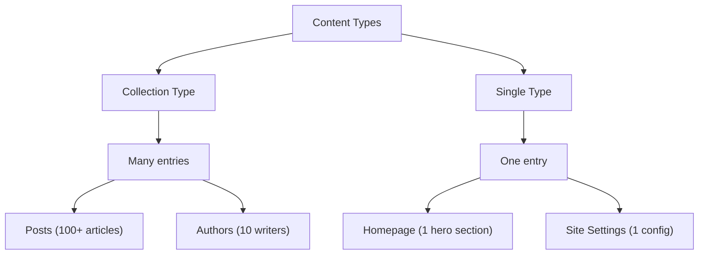

# Content Modeling

Content modeling is the most important decision you make in a CMS project. A good model makes everything else easier --
a bad one haunts you forever. In this chapter we create the content types for our blog.

## Collection types vs single types

Strapi has two kinds of content types:

| Type                | Description                    | Examples                            |
|---------------------|--------------------------------|-------------------------------------|
| **Collection type** | Many entries of the same shape | Posts, Authors, Categories          |
| **Single type**     | Exactly one entry              | Homepage, Site Settings, About Page |

Think of a collection type as a database table with many rows. A single type is a table with exactly one row.



## Creating your first collection type -- Post

Let's create the core of our blog: a **Post** collection type.

### Via the admin panel

1. Open the admin panel at `http://localhost:1337/admin`
2. Go to **Content-Type Builder** in the sidebar
3. Click **Create new collection type**
4. Enter the display name: **Post**
5. Strapi auto-generates the API ID: `post` (and the UID `api::post.post`)
6. Click **Continue**

Now add fields one by one:

| Field name      | Type               | Configuration                 |
|-----------------|--------------------|-------------------------------|
| `title`         | Text (Short text)  | Required                      |
| `slug`          | UID                | Attached to `title`, required |
| `content`       | Rich text (Blocks) | --                            |
| `excerpt`       | Text (Long text)   | Max 300 characters            |
| `publishedDate` | Date               | Date only                     |
| `featured`      | Boolean            | Default: `false`              |

Click **Save** after adding all fields. Strapi restarts the server and generates the schema, API routes, controller, and
service automatically.

### What Strapi generated

After saving, look at your project's file system:

```
src/api/post/
├── content-types/
│   └── post/
│       └── schema.json       # The schema definition
├── controllers/
│   └── post.ts               # Default CRUD controller
├── routes/
│   └── post.ts               # Default REST routes
└── services/
    └── post.ts               # Default service
```

The schema file is the source of truth:

```json
{
  "kind": "collectionType",
  "collectionName": "posts",
  "info": {
    "singularName": "post",
    "pluralName": "posts",
    "displayName": "Post",
    "description": ""
  },
  "options": {
    "draftAndPublish": true
  },
  "attributes": {
    "title": {
      "type": "string",
      "required": true
    },
    "slug": {
      "type": "uid",
      "targetField": "title",
      "required": true
    },
    "content": {
      "type": "blocks"
    },
    "excerpt": {
      "type": "text",
      "maxLength": 300
    },
    "publishedDate": {
      "type": "date"
    },
    "featured": {
      "type": "boolean",
      "default": false
    }
  }
}
```

> **Tip:** You can edit this JSON file directly instead of using the admin panel. The admin panel is more convenient for
> exploration; editing JSON is faster once you know the schema format.

## Field types reference

Strapi offers many field types. Here are the most common ones:

### Text fields

| Type                                  | JSON type            | Use case                       |
|---------------------------------------|----------------------|--------------------------------|
| **Short text** (`string`)             | `"type": "string"`   | Titles, names, labels          |
| **Long text** (`text`)                | `"type": "text"`     | Descriptions, excerpts         |
| **Rich text (Blocks)** (`blocks`)     | `"type": "blocks"`   | Article bodies with formatting |
| **Rich text (Markdown)** (`richtext`) | `"type": "richtext"` | Markdown content               |

### Number fields

| Type            | JSON type              | Use case           |
|-----------------|------------------------|--------------------|
| **Integer**     | `"type": "integer"`    | Counts, quantities |
| **Big integer** | `"type": "biginteger"` | Large IDs          |
| **Decimal**     | `"type": "decimal"`    | Prices             |
| **Float**       | `"type": "float"`      | Calculated values  |

### Other fields

| Type            | JSON type               | Use case                        |
|-----------------|-------------------------|---------------------------------|
| **Boolean**     | `"type": "boolean"`     | Flags, toggles                  |
| **Date**        | `"type": "date"`        | Dates without time              |
| **DateTime**    | `"type": "datetime"`    | Timestamps                      |
| **Email**       | `"type": "email"`       | Email addresses (validated)     |
| **Enumeration** | `"type": "enumeration"` | Fixed set of options            |
| **JSON**        | `"type": "json"`        | Arbitrary JSON data             |
| **Media**       | `"type": "media"`       | Images, files, videos           |
| **Password**    | `"type": "password"`    | Hashed, never returned in API   |
| **UID**         | `"type": "uid"`         | URL-friendly unique identifiers |

### Field options

Most fields support these common options:

```json
{
  "title": {
    "type": "string",
    "required": true,
    "unique": true,
    "minLength": 3,
    "maxLength": 255,
    "default": "Untitled",
    "private": false,
    "configurable": true
  }
}
```

| Option                    | Effect                                             |
|---------------------------|----------------------------------------------------|
| `required`                | Field must have a value                            |
| `unique`                  | No two entries can have the same value             |
| `minLength` / `maxLength` | String length constraints                          |
| `min` / `max`             | Number range constraints                           |
| `default`                 | Default value for new entries                      |
| `private`                 | Field is excluded from API responses               |
| `configurable`            | Whether the field can be edited in the admin panel |

## Creating a single type -- Site Settings

Not everything is a collection. A blog typically has one set of global settings.

1. In the Content-Type Builder, click **Create new single type**
2. Name it **Site Settings**
3. Add fields:

| Field name     | Type              | Configuration                 |
|----------------|-------------------|-------------------------------|
| `siteName`     | Text (Short text) | Required, default: "My Blog"  |
| `tagline`      | Text (Short text) | --                            |
| `postsPerPage` | Number (Integer)  | Default: 10, min: 1, max: 100 |
| `footerText`   | Text (Long text)  | --                            |

4. Click **Save**

The generated schema lives in `src/api/site-setting/content-types/site-setting/schema.json` and has
`"kind": "singleType"` instead of `"collectionType"`.

## Components -- reusable field groups

Components let you define a group of fields once and reuse it across multiple content types.

### Creating a component

Let's create an **SEO** component that any content type can use:

1. In the Content-Type Builder, when adding a field to a content type, choose **Component**
2. Click **Create a new component**
3. Category: **shared** (or create your own)
4. Name: **SEO**
5. Add fields:

| Field name        | Type              | Configuration      |
|-------------------|-------------------|--------------------|
| `metaTitle`       | Text (Short text) | Max 60 characters  |
| `metaDescription` | Text (Long text)  | Max 160 characters |
| `canonicalUrl`    | Text (Short text) | --                 |
| `noIndex`         | Boolean           | Default: `false`   |

6. Save the component

The component schema is stored in:

```
src/components/shared/seo.json
```

```json
{
  "collectionName": "components_shared_seos",
  "info": {
    "displayName": "SEO",
    "icon": "search"
  },
  "attributes": {
    "metaTitle": {
      "type": "string",
      "maxLength": 60
    },
    "metaDescription": {
      "type": "text",
      "maxLength": 160
    },
    "canonicalUrl": {
      "type": "string"
    },
    "noIndex": {
      "type": "boolean",
      "default": false
    }
  }
}
```

### Adding the component to a content type

Now go back to the **Post** content type and add a new field:

1. Choose **Component**
2. Select **Use an existing component**
3. Pick **SEO** from the **shared** category
4. Field name: `seo`
5. Choose **Single component** (not repeatable)

Every post now has an SEO section.

### Repeatable components

Some components make sense as lists. Create a **Social Link** component:

| Field name | Type                                                     |
|------------|----------------------------------------------------------|
| `platform` | Enumeration (`twitter`, `github`, `linkedin`, `website`) |
| `url`      | Text (Short text)                                        |

When adding it to Site Settings, choose **Repeatable component**. This lets you add multiple social links as an ordered
list.

## Dynamic zones -- flexible content blocks

Dynamic zones are the most powerful modeling feature. They let content editors choose from a set of components to build
flexible page layouts.

### When to use dynamic zones

- **Page builders** -- editors compose pages from blocks (hero, text, image gallery, CTA)
- **Flexible layouts** -- different posts can have different content structures
- **Landing pages** -- marketing teams need freedom without developer intervention

### Creating a dynamic zone

Let's add a dynamic zone to a new **Page** single type (or collection type) so editors can build pages from blocks:

1. Create components for each block type:

| Component        | Category | Fields                                                             |
|------------------|----------|--------------------------------------------------------------------|
| **Hero**         | `blocks` | `heading` (string), `subheading` (text), `backgroundImage` (media) |
| **RichContent**  | `blocks` | `body` (blocks/rich text)                                          |
| **ImageGallery** | `blocks` | `images` (media, multiple), `columns` (integer, default 3)         |
| **CallToAction** | `blocks` | `title` (string), `buttonText` (string), `buttonUrl` (string)      |

2. Add a **Dynamic zone** field to your content type
3. Name it `blocks`
4. Select which components are allowed in the zone

Content editors can now add, remove, and reorder blocks freely. The API returns the blocks as an array with
`__component` identifiers:

```json
{
  "blocks": [
    {
      "__component": "blocks.hero",
      "heading": "Welcome to My Blog",
      "subheading": "Thoughts on code and coffee"
    },
    {
      "__component": "blocks.rich-content",
      "body": "..."
    },
    {
      "__component": "blocks.call-to-action",
      "title": "Subscribe",
      "buttonText": "Sign Up",
      "buttonUrl": "/subscribe"
    }
  ]
}
```

## Components vs relations vs dynamic zones

Choosing the right modeling primitive is crucial:

| Feature                 | Component                          | Relation                           | Dynamic Zone           |
|-------------------------|------------------------------------|------------------------------------|------------------------|
| **Reuse across types**  | Yes                                | Yes                                | Yes                    |
| **Own identity**        | No (embedded)                      | Yes (separate entry)               | No (embedded)          |
| **Query independently** | No                                 | Yes                                | No                     |
| **Ordered list**        | Yes (repeatable)                   | Manual                             | Yes                    |
| **Mixed types**         | No                                 | No                                 | Yes                    |
| **Use when**            | Structured sub-data (SEO, address) | Shared entities (author, category) | Flexible page building |

Rules of thumb:

- If the data **belongs to** the parent and has no meaning on its own -- use a **component**
- If the data **exists independently** and is shared across entries -- use a **relation** (next chapter)
- If editors need to **compose flexible layouts** from multiple block types -- use a **dynamic zone**

> For advanced modeling patterns, see the [Content Modeling Patterns](/strapi/content-modeling-patterns) reference.

## Enumeration fields

Enumerations define a fixed set of allowed values. They are great for statuses, categories, or any field with a known
set of options:

```json
{
  "status": {
    "type": "enumeration",
    "enum": ["draft", "review", "published", "archived"],
    "default": "draft",
    "required": true
  }
}
```

In the admin panel, this renders as a dropdown.

## Schema editing -- admin panel vs JSON

You have two ways to define content types:

| Method                                 | Best for                                                    |
|----------------------------------------|-------------------------------------------------------------|
| **Admin panel** (Content-Type Builder) | Exploration, quick prototyping, visual feedback             |
| **JSON schema files**                  | Version control, reproducible setups, CI/CD, team workflows |

Both produce the same result. The admin panel writes JSON files; editing JSON files updates the admin panel on next
restart.

> **Important:** In production, the Content-Type Builder is disabled by default. All schema changes should be made in
> development and deployed via version control.

## What we built so far

At this point your project has:

- **Post** (collection type) -- title, slug, content, excerpt, publishedDate, featured, seo
- **Site Settings** (single type) -- siteName, tagline, postsPerPage, footerText
- **SEO** (component) -- metaTitle, metaDescription, canonicalUrl, noIndex
- **Social Link** (component) -- platform, url

The content types are defined but unrelated. A blog post does not yet know who wrote it or what category it belongs to.
That is what relations are for.

## Summary

You learned:

- The difference between **collection types** and **single types**
- All the **field types** Strapi offers and their common options
- How to create **components** for reusable field groups
- How **dynamic zones** enable flexible page building
- When to choose components vs relations vs dynamic zones
- That you can model via the admin panel or by editing JSON schema files directly

Next up: [Relations](./03-relations.md) -- connecting your content types with one-to-one, one-to-many, and many-to-many
relations to build a proper blog data model.
