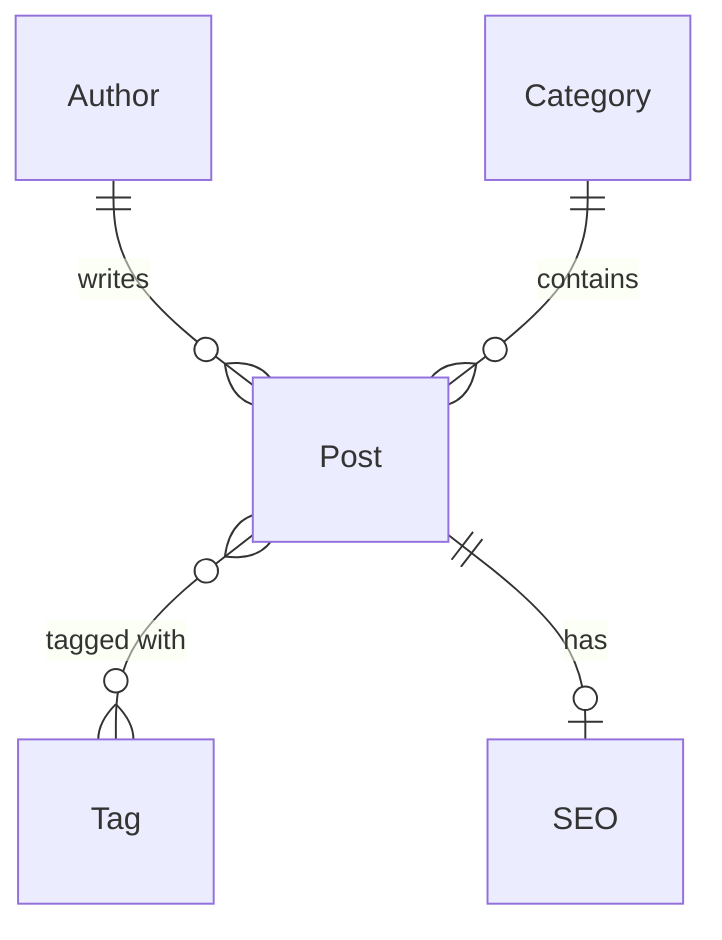
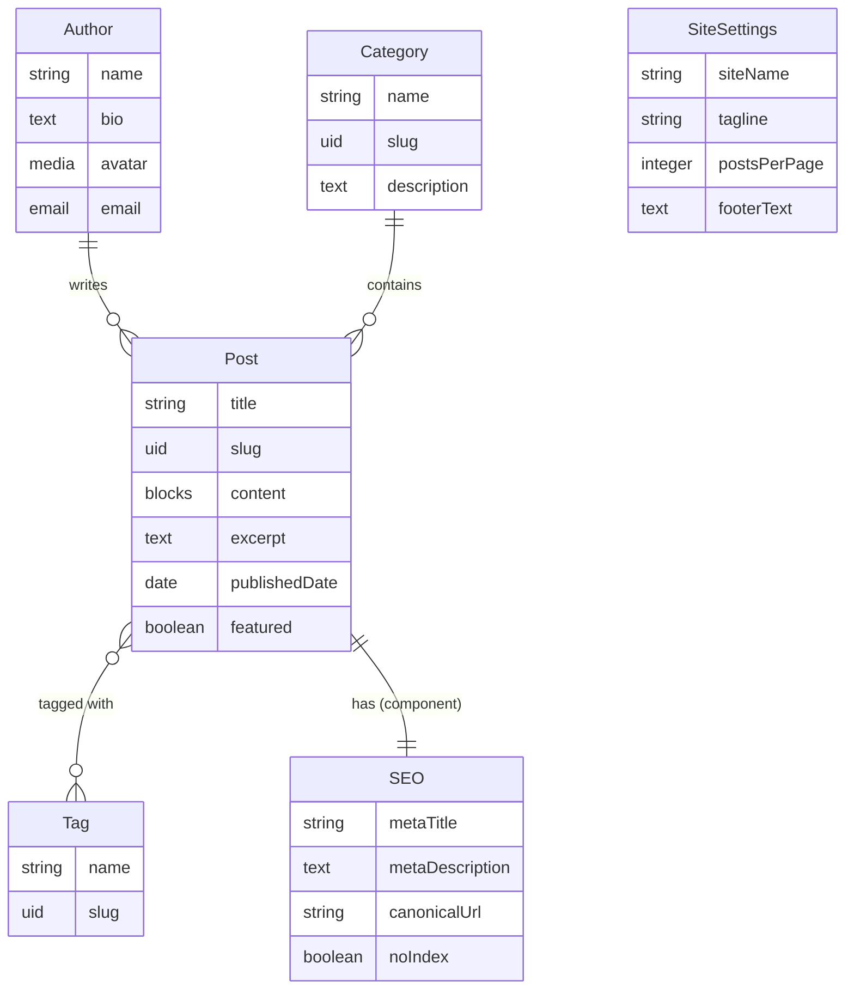

# Relations

A blog post has an author. A post belongs to a category. A post can have many tags, and a tag can appear on many posts.
These are **relations** -- links between content types.

In this chapter we create four content types and connect them to build a complete blog data model.

## Relation types

Strapi supports four relation types:

| Relation         | Description                                | Example               |
|------------------|--------------------------------------------|-----------------------|
| **One-to-one**   | Each A has exactly one B, and vice versa   | User -- Profile       |
| **One-to-many**  | One A has many Bs, each B belongs to one A | Author -- Posts       |
| **Many-to-many** | Many As can relate to many Bs              | Posts -- Tags         |
| **Many-way**     | One-sided many, no inverse                 | Post -- Related Posts |



## Create the Author collection type

1. Open the Content-Type Builder
2. Create a new collection type: **Author**
3. Add fields:

| Field name | Type                 | Configuration    |
|------------|----------------------|------------------|
| `name`     | Text (Short text)    | Required         |
| `bio`      | Text (Long text)     | --               |
| `avatar`   | Media (Single media) | Images only      |
| `email`    | Email                | Required, unique |

4. Click **Save**

## Create the Category collection type

1. Create a new collection type: **Category**
2. Add fields:

| Field name    | Type              | Configuration                |
|---------------|-------------------|------------------------------|
| `name`        | Text (Short text) | Required, unique             |
| `slug`        | UID               | Attached to `name`, required |
| `description` | Text (Long text)  | --                           |

3. Click **Save**

## Create the Tag collection type

1. Create a new collection type: **Tag**
2. Add fields:

| Field name | Type              | Configuration                |
|------------|-------------------|------------------------------|
| `name`     | Text (Short text) | Required, unique             |
| `slug`     | UID               | Attached to `name`, required |

3. Click **Save**

## Adding relations to Post

Now let's connect everything. Go back to the **Post** content type and add relation fields.

### Post belongs to Author (many-to-one)

1. Add a new field to Post, choose **Relation**
2. On the left: **Post**, on the right: **Author**
3. Select the relation type: **Many-to-one** (many posts belong to one author)
4. Field name on Post side: `author`
5. Field name on Author side: `posts` (the inverse -- an author has many posts)
6. Click **Finish**

### Post belongs to Category (many-to-one)

1. Add another relation field to Post
2. **Post** (many) to **Category** (one)
3. Field name on Post: `category`
4. Field name on Category: `posts`

### Post has many Tags (many-to-many)

1. Add another relation field to Post
2. **Post** to **Tag** -- select **Many-to-many**
3. Field name on Post: `tags`
4. Field name on Tag: `posts`

Click **Save**. Strapi restarts and your data model is complete.

## The complete blog data model



## How relations work in the schema

After adding relations, the Post schema has new attributes:

```json
{
  "attributes": {
    "title": { "type": "string", "required": true },
    "slug": { "type": "uid", "targetField": "title", "required": true },
    "content": { "type": "blocks" },
    "excerpt": { "type": "text", "maxLength": 300 },
    "publishedDate": { "type": "date" },
    "featured": { "type": "boolean", "default": false },
    "seo": { "type": "component", "component": "shared.seo" },
    "author": {
      "type": "relation",
      "relation": "manyToOne",
      "target": "api::author.author",
      "inversedBy": "posts"
    },
    "category": {
      "type": "relation",
      "relation": "manyToOne",
      "target": "api::category.category",
      "inversedBy": "posts"
    },
    "tags": {
      "type": "relation",
      "relation": "manyToMany",
      "target": "api::tag.tag",
      "inversedBy": "posts"
    }
  }
}
```

Key properties:

| Property     | Meaning                                                                    |
|--------------|----------------------------------------------------------------------------|
| `relation`   | The relation type (`manyToOne`, `oneToMany`, `manyToMany`, `oneToOne`)     |
| `target`     | The UID of the related content type (`api::author.author`)                 |
| `inversedBy` | The field name on the other side of the relation                           |
| `mappedBy`   | Used on the inverse side to point back (Strapi manages this automatically) |

## Owning side vs inverse side

Every relation has an **owning side** and an **inverse side**:

- The **owning side** stores the foreign key in the database
- The **inverse side** is a virtual field calculated from the owning side

In a many-to-one relation (Post belongs to Author):

- **Post** is the owning side (`author` field stores the foreign key)
- **Author** is the inverse side (`posts` field is calculated)

For many-to-many relations, Strapi creates a **join table** automatically.

> **Tip:** You usually do not need to worry about this distinction. Strapi handles it for you. It matters when you are
> debugging database queries or optimizing performance.

## One-to-one relations

One-to-one relations are less common but useful. For example, if each author has a **Profile** with extended details:

1. Create a **Profile** collection type with fields like `twitter`, `github`, `website`
2. Add a one-to-one relation between Author and Profile
3. Each author can have at most one profile, and each profile belongs to one author

The schema looks like:

```json
{
  "profile": {
    "type": "relation",
    "relation": "oneToOne",
    "target": "api::profile.profile",
    "inversedBy": "author"
  }
}
```

## Self-referencing relations

A content type can relate to itself. For example, a Post can have **related posts**:

1. Add a relation field to Post
2. On both sides, select **Post**
3. Choose **Many-to-many** (or many-way if you only need one direction)
4. Field name: `relatedPosts`

This creates a join table linking posts to other posts.

## Polymorphic relations

Strapi also supports **polymorphic relations** where a field can relate to multiple content types. For example, a *
*Comment** might belong to either a Post or a Page:

```json
{
  "related": {
    "type": "relation",
    "relation": "morphToOne",
    "morphColumn": {
      "idColumn": { "name": "related_id", "type": "integer" },
      "typeColumn": { "name": "related_type", "type": "string" }
    }
  }
}
```

Polymorphic relations are advanced -- we mention them here for completeness. For most blog use cases, standard relations
are sufficient.

## Relation best practices

### Keep it flat

Avoid deeply nested relations. Each level of nesting adds a database JOIN and slows down queries.

```
Good:  Post → Author (1 level)
Avoid: Post → Author → Company → Country → Region (4 levels)
```

### Use components for embedded data

If data always belongs to its parent and has no meaning on its own, use a component instead of a relation:

- **SEO metadata** -- always part of a post, never queried independently → **component**
- **Author** -- shared across posts, queried on its own (author page) → **relation**

### Name fields clearly

Use descriptive names that make the relationship obvious:

```
Good:   post.author, post.category, post.tags
Avoid:  post.relation1, post.ref, post.data
```

### Plan for population

By default, the REST API does **not** return related data. You must explicitly **populate** relations when querying. We
will cover this in detail in [chapter 5 (REST API)](./05-rest-api.md).

> For more advanced relation patterns, see the [Relations and Population](/strapi/relations-and-population) reference.

## Summary

You learned:

- The four relation types: one-to-one, one-to-many, many-to-many, and many-way
- How to create and connect content types in the admin panel
- What the relation schema looks like in JSON
- The difference between owning and inverse sides
- Self-referencing and polymorphic relations
- Best practices for modeling relations

Our blog data model is now complete with Authors, Posts, Categories, and Tags all properly connected. In the next
chapter we will learn how to manage content through the admin panel.

Next up: [Managing Content](./04-managing-content.md) -- creating entries, drafts & publishing, the media library, and
bulk operations in the admin panel.
