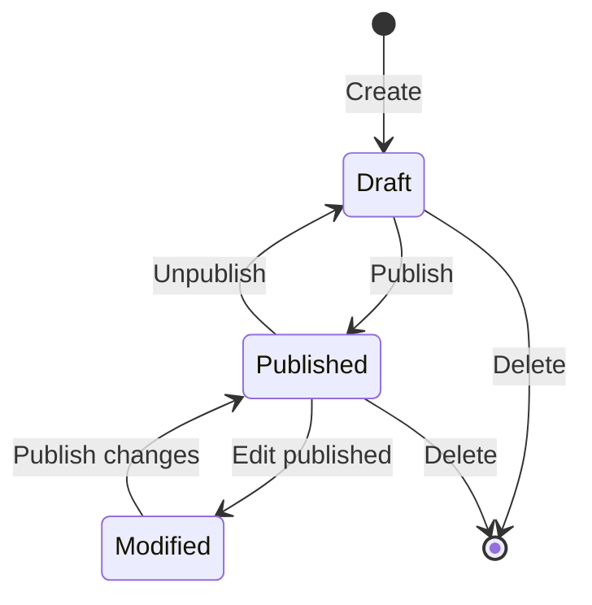

# Managing Content

The admin panel is where content editors spend their time. In this chapter we will create some actual content for our blog, learn the draft/publish workflow, and explore the media library.

## Creating entries

### Create an Author

1. Go to **Content Manager** in the sidebar
2. Click **Author** in the collection types list
3. Click **Create new entry**
4. Fill in the fields:
   - **name:** Ada Lovelace
   - **bio:** Pioneer of computing, wrote the first algorithm.
   - **email:** ada@example.com
   - **avatar:** Upload an image (or skip for now)
5. Click **Save** (this creates a draft)
6. Click **Publish** to make it available via the API

Create a second author:

- **name:** Alan Turing
- **bio:** Father of theoretical computer science and artificial intelligence.
- **email:** alan@example.com

### Create Categories

Create a few categories:

| name | slug | description |
|------|------|-------------|
| JavaScript | javascript | Posts about JavaScript and the web platform |
| Strapi | strapi | Posts about Strapi CMS |
| General | general | Everything else |

### Create Tags

Create some tags:

| name | slug |
|------|------|
| tutorial | tutorial |
| beginner | beginner |
| api | api |
| cms | cms |

### Create a Post

Now create your first blog post:

1. Go to **Post** in the Content Manager
2. Click **Create new entry**
3. Fill in:
   - **title:** Getting Started with Strapi
   - **slug:** auto-generated from title (`getting-started-with-strapi`)
   - **content:** Write some content using the rich text editor
   - **excerpt:** A quick introduction to building APIs with Strapi.
   - **publishedDate:** today's date
   - **featured:** true
4. In the **Relations** section on the right:
   - **author:** Select "Ada Lovelace"
   - **category:** Select "Strapi"
   - **tags:** Select "tutorial", "beginner", "cms"
5. Expand the **SEO** component:
   - **metaTitle:** Getting Started with Strapi
   - **metaDescription:** Learn how to set up and configure Strapi 5 for your blog.
6. Click **Save**, then **Publish**

Create a few more posts to have data to work with in later chapters.

## Draft and publish workflow

Strapi 5 has a built-in draft/publish system. Every document exists in two states simultaneously:



### How it works

| State | API visibility | Admin visibility |
|-------|---------------|-----------------|
| **Draft** | Not returned by default | Shown with "Draft" badge |
| **Published** | Returned in API responses | Shown with "Published" badge |
| **Modified** | Published version served; draft has unsaved changes | Shown with "Modified" badge |

Key points:

- **Creating** an entry starts it as a draft
- **Publishing** makes the current version available via the API
- **Editing** a published entry creates a new draft version -- the published version remains live until you publish again
- **Unpublishing** removes the entry from the API but keeps it in the database as a draft
- **Deleting** removes both draft and published versions permanently

### Querying by status

By default, the REST API returns only **published** documents:

```bash
# Returns only published posts
curl http://localhost:1337/api/posts
```

To include drafts (requires authentication):

```bash
# Returns draft documents
curl "http://localhost:1337/api/posts?status=draft" \
  -H "Authorization: Bearer YOUR_TOKEN"
```

We will explore API queries in detail in [chapter 5](./05-rest-api.md).

## The Media Library

The media library manages all uploaded files -- images, videos, documents, and more.

### Uploading files

You can upload files in two ways:

1. **Via the Media Library** -- go to Media Library in the sidebar and click **Upload assets**
2. **Via a content entry** -- click the media field when editing an entry and upload directly

### Organizing media

The media library supports **folders** for organization:

- Create folders by clicking **Add new folder**
- Drag files between folders
- Use the search bar to find files quickly

### File details

Click any file to see its details:

- **Preview** -- image/video preview
- **Alternative text** -- important for accessibility (set this for all images)
- **Caption** -- optional description
- **File info** -- size, dimensions, format, URL
- **Crops and formats** -- Strapi auto-generates responsive formats (thumbnail, small, medium, large)

### Responsive image formats

By default, Strapi creates multiple sizes for uploaded images:

| Format | Max width |
|--------|-----------|
| `thumbnail` | 156px |
| `small` | 500px |
| `medium` | 750px |
| `large` | 1000px |

The original file is always preserved. You can configure these sizes in `config/plugins.ts`:

```javascript
// config/plugins.ts
module.exports = ({ env }) => ({
  upload: {
    config: {
      breakpoints: {
        xlarge: 1920,
        large: 1000,
        medium: 750,
        small: 500,
        xsmall: 64,
      },
    },
  },
});
```

We will cover advanced upload configuration (S3, Cloudinary) in [chapter 10](./10-media-and-file-uploads.md).

## Editing entries

### Inline editing

Click any entry in the list view to open the editor. Fields are editable inline -- just click and type.

### The right sidebar

The right sidebar shows:

- **Relations** -- manage linked entries (author, category, tags)
- **Internationalization** -- switch between locales (if i18n is enabled)
- **Information** -- created/updated timestamps, created by

### Rich text editor

The **Blocks** editor (Strapi 5's default rich text field) supports:

- Headings (H1--H6)
- Bold, italic, underline, strikethrough, code
- Ordered and unordered lists
- Block quotes
- Code blocks
- Images (inline from the media library)
- Links

The editor stores content as a structured JSON format, not HTML. This makes it frontend-agnostic -- you render the blocks however you want on the client.

## Bulk operations

The Content Manager supports bulk operations on collection types:

1. In the list view, check the boxes next to entries
2. A toolbar appears at the top with actions:
   - **Publish** -- publish all selected drafts
   - **Unpublish** -- unpublish all selected entries
   - **Delete** -- delete all selected entries

This is useful when you need to manage many entries at once -- for example, publishing a batch of posts or cleaning up test data.

## Filtering and sorting in the admin panel

The list view supports filtering and sorting:

### Filtering

Click **Filters** and add conditions:

- `title contains "strapi"` -- find posts with "strapi" in the title
- `featured is true` -- find only featured posts
- `author is Ada Lovelace` -- find posts by a specific author

You can combine multiple filters.

### Sorting

Click any column header to sort by that field. Click again to reverse the sort order.

### Configuring the list view

You can customize which fields appear in the list view:

1. Go to the Content Manager
2. Click the **gear icon** in the top right of the list view
3. Add, remove, or reorder columns
4. Set the default sort field and order

This configuration is per-content-type and per-user.

## Content Manager settings

### Entry-level settings

Each content type has configurable views:

- **List view** -- which fields show as columns, default sort
- **Edit view** -- field layout, which fields appear, field ordering

To configure the edit view:

1. Go to **Content-Type Builder**
2. Select a content type
3. Click **Configure the view**
4. Drag fields to reorder them
5. Choose layout (1 column, 2 columns)

### Field-level settings

In the edit view configuration, each field has settings:

- **Label** -- custom display name
- **Description** -- helper text shown below the field
- **Placeholder** -- placeholder text for input fields
- **Editable** -- whether the field can be edited (useful for computed fields)
- **Size** -- column width (4, 6, 8, or 12 out of 12)

## Single type editing

Single types work slightly differently:

1. Go to **Content Manager** and find your single type (e.g., Site Settings)
2. There is no list view -- you go directly to the edit view
3. Fill in the fields and click **Save** / **Publish**
4. There is only ever one entry -- you edit the same document every time

Fill in your Site Settings now:

- **siteName:** My Strapi Blog
- **tagline:** Built with Strapi 5
- **postsPerPage:** 10
- **footerText:** Made with care.

## Summary

You learned:

- How to create entries for all your content types (authors, categories, tags, posts)
- The **draft/publish workflow** and how documents transition between states
- How the **media library** works -- uploading, organizing, responsive formats
- **Bulk operations** for managing multiple entries at once
- **Filtering and sorting** in the Content Manager
- Configuring **list and edit views** for a better editing experience
- How **single types** differ from collection types in the admin panel

Your blog now has real content. In the next chapter we will learn how to access it programmatically via the REST API.

Next up: [REST API](./05-rest-api.md) -- understanding Strapi's auto-generated REST endpoints, filtering, sorting, pagination, population, and testing with curl.
