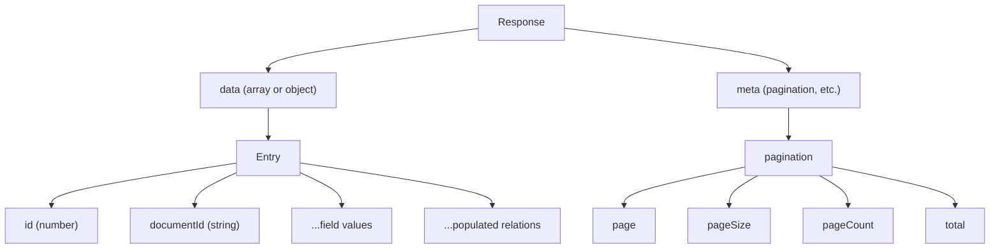

# REST API

Every content type in Strapi automatically gets a full REST API. No code required -- Strapi generates endpoints for CRUD
operations, filtering, sorting, pagination, and more.

In this chapter we will explore every aspect of the REST API using curl. Make sure your Strapi server is running (
`npm run develop`) and you have some published content from the previous chapter.

## Auto-generated endpoints

For each **collection type**, Strapi creates these endpoints:

| Method   | Endpoint                 | Action         |
|----------|--------------------------|----------------|
| `GET`    | `/api/posts`             | Find all posts |
| `GET`    | `/api/posts/:documentId` | Find one post  |
| `POST`   | `/api/posts`             | Create a post  |
| `PUT`    | `/api/posts/:documentId` | Update a post  |
| `DELETE` | `/api/posts/:documentId` | Delete a post  |

For **single types**, the endpoints are simpler (no ID needed):

| Method   | Endpoint            | Action                 |
|----------|---------------------|------------------------|
| `GET`    | `/api/site-setting` | Get the single type    |
| `PUT`    | `/api/site-setting` | Update the single type |
| `DELETE` | `/api/site-setting` | Delete the single type |

> **Note:** By default, all endpoints require authentication. We will set up public access for read endpoints shortly.
> For now, we will use the admin panel to enable public access to the **find** and **findOne** actions.

## Enabling public access

Before we can query the API, we need to allow public access:

1. Go to **Settings** > **Roles** (under Users & Permissions)
2. Click the **Public** role
3. Under **Post**, check **find** and **findOne**
4. Do the same for **Author**, **Category**, **Tag**, and **Site Settings**
5. Click **Save**

Now unauthenticated requests can read (but not create, update, or delete) your content.

## Your first API call

```bash
curl http://localhost:1337/api/posts
```

Response:

```json
{
  "data": [
    {
      "id": 1,
      "documentId": "abc123def456",
      "title": "Getting Started with Strapi",
      "slug": "getting-started-with-strapi",
      "content": [...],
      "excerpt": "A quick introduction to building APIs with Strapi.",
      "publishedDate": "2025-01-15",
      "featured": true,
      "createdAt": "2025-01-15T10:00:00.000Z",
      "updatedAt": "2025-01-15T10:00:00.000Z",
      "publishedAt": "2025-01-15T10:00:00.000Z"
    }
  ],
  "meta": {
    "pagination": {
      "page": 1,
      "pageSize": 25,
      "pageCount": 1,
      "total": 1
    }
  }
}
```

The response has two top-level keys:

| Key    | Contents                                          |
|--------|---------------------------------------------------|
| `data` | Array of entries (or a single object for findOne) |
| `meta` | Pagination info                                   |

Notice that **relations are not included** by default. The `author`, `category`, and `tags` fields are missing. You need
to explicitly **populate** them.

## Population

Population is how you include related data in the response.

### Populate one relation

```bash
curl "http://localhost:1337/api/posts?populate=author"
```

Now each post includes the full author object:

```json
{
  "data": [
    {
      "id": 1,
      "documentId": "abc123def456",
      "title": "Getting Started with Strapi",
      "author": {
        "id": 1,
        "documentId": "xyz789",
        "name": "Ada Lovelace",
        "bio": "Pioneer of computing...",
        "email": "ada@example.com"
      }
    }
  ]
}
```

### Populate multiple relations

```bash
curl "http://localhost:1337/api/posts?populate[0]=author&populate[1]=category&populate[2]=tags"
```

Or use the wildcard to populate all first-level relations:

```bash
curl "http://localhost:1337/api/posts?populate=*"
```

### Deep population

To populate nested relations (e.g., the author's avatar media), use dot notation or nested syntax:

```bash
# Populate author and their avatar
curl "http://localhost:1337/api/posts?populate[author][populate]=avatar"
```

### Selective population

You can choose which fields to return from a populated relation:

```bash
# Only return the author's name
curl "http://localhost:1337/api/posts?populate[author][fields][0]=name"
```

### Component population

Components (like our SEO component) also need population:

```bash
curl "http://localhost:1337/api/posts?populate=seo"
```

Dynamic zones need explicit population of each component type:

```bash
curl "http://localhost:1337/api/pages?populate[blocks][populate]=*"
```

> For advanced population patterns and performance considerations, see
> the [Relations and Population](/strapi/relations-and-population) reference.

## Filtering

The `filters` query parameter lets you narrow down results.

### Basic filtering

```bash
# Posts where featured is true
curl "http://localhost:1337/api/posts?filters[featured][$eq]=true"

# Posts with a specific title
curl "http://localhost:1337/api/posts?filters[title][$eq]=Getting%20Started%20with%20Strapi"
```

### Filter operators

| Operator      | Description                 | Example                                       |
|---------------|-----------------------------|-----------------------------------------------|
| `$eq`         | Equal                       | `filters[featured][$eq]=true`                 |
| `$ne`         | Not equal                   | `filters[featured][$ne]=true`                 |
| `$lt`         | Less than                   | `filters[id][$lt]=5`                          |
| `$lte`        | Less than or equal          | `filters[id][$lte]=5`                         |
| `$gt`         | Greater than                | `filters[id][$gt]=2`                          |
| `$gte`        | Greater than or equal       | `filters[id][$gte]=2`                         |
| `$in`         | In array                    | `filters[id][$in][0]=1&filters[id][$in][1]=3` |
| `$notIn`      | Not in array                | `filters[id][$notIn][0]=1`                    |
| `$contains`   | Contains (case-sensitive)   | `filters[title][$contains]=Strapi`            |
| `$containsi`  | Contains (case-insensitive) | `filters[title][$containsi]=strapi`           |
| `$startsWith` | Starts with                 | `filters[title][$startsWith]=Getting`         |
| `$endsWith`   | Ends with                   | `filters[slug][$endsWith]=strapi`             |
| `$null`       | Is null                     | `filters[excerpt][$null]=true`                |
| `$notNull`    | Is not null                 | `filters[excerpt][$notNull]=true`             |

### Filtering on relations

You can filter based on related data:

```bash
# Posts by a specific author
curl "http://localhost:1337/api/posts?filters[author][name][$eq]=Ada%20Lovelace"

# Posts in the JavaScript category
curl "http://localhost:1337/api/posts?filters[category][slug][$eq]=javascript"

# Posts tagged with "tutorial"
curl "http://localhost:1337/api/posts?filters[tags][slug][$in][0]=tutorial"
```

### Combining filters (AND)

Multiple filters are combined with AND logic:

```bash
# Featured posts in the Strapi category
curl "http://localhost:1337/api/posts?filters[featured][$eq]=true&filters[category][slug][$eq]=strapi"
```

### OR filters

Use the `$or` operator for OR logic:

```bash
# Posts that are featured OR in the JavaScript category
curl "http://localhost:1337/api/posts?filters[$or][0][featured][$eq]=true&filters[$or][1][category][slug][$eq]=javascript"
```

### NOT filters

Negate conditions with `$not`:

```bash
# Posts that are NOT featured
curl "http://localhost:1337/api/posts?filters[featured][$not][$eq]=true"
```

## Sorting

### Sort by one field

```bash
# Sort by title ascending (default)
curl "http://localhost:1337/api/posts?sort=title"

# Sort by publishedDate descending
curl "http://localhost:1337/api/posts?sort=publishedDate:desc"
```

### Sort by multiple fields

```bash
# Sort by featured (desc), then publishedDate (desc)
curl "http://localhost:1337/api/posts?sort[0]=featured:desc&sort[1]=publishedDate:desc"
```

## Pagination

Strapi supports two pagination styles:

### Page-based pagination (default)

```bash
# Page 1 with 10 items per page
curl "http://localhost:1337/api/posts?pagination[page]=1&pagination[pageSize]=10"

# Page 2
curl "http://localhost:1337/api/posts?pagination[page]=2&pagination[pageSize]=10"
```

The response includes pagination metadata:

```json
{
  "meta": {
    "pagination": {
      "page": 1,
      "pageSize": 10,
      "pageCount": 5,
      "total": 42
    }
  }
}
```

### Offset-based pagination

```bash
# Skip 10, take 10
curl "http://localhost:1337/api/posts?pagination[start]=10&pagination[limit]=10"
```

### Pagination limits

The default maximum `pageSize` is **100**. You can increase this in `config/api.ts`:

```javascript
// config/api.ts
module.exports = {
  rest: {
    defaultLimit: 25,
    maxLimit: 250,
  },
};
```

## Field selection

Reduce payload size by selecting only the fields you need:

```bash
# Only return title and slug
curl "http://localhost:1337/api/posts?fields[0]=title&fields[1]=slug"
```

Response:

```json
{
  "data": [
    {
      "id": 1,
      "documentId": "abc123def456",
      "title": "Getting Started with Strapi",
      "slug": "getting-started-with-strapi"
    }
  ]
}
```

The `id` and `documentId` fields are always included.

## Creating entries via the API

To create, update, or delete entries you need authentication (covered in the next chapter). Here is a preview using an
API token:

```bash
curl -X POST http://localhost:1337/api/posts \
  -H "Content-Type: application/json" \
  -H "Authorization: Bearer YOUR_API_TOKEN" \
  -d '{
    "data": {
      "title": "My API Post",
      "slug": "my-api-post",
      "excerpt": "Created via the REST API",
      "featured": false,
      "author": 1,
      "category": 1,
      "tags": [1, 2]
    }
  }'
```

Key points:

- The body must be wrapped in a `data` object
- Relations are set by ID (the numeric `id`, not `documentId`)
- The entry is created as a **draft** by default
- To publish immediately, add `"status": "published"` to the request

## Updating entries

```bash
curl -X PUT http://localhost:1337/api/posts/abc123def456 \
  -H "Content-Type: application/json" \
  -H "Authorization: Bearer YOUR_API_TOKEN" \
  -d '{
    "data": {
      "title": "Updated Title"
    }
  }'
```

- Use the `documentId` in the URL (not the numeric `id`)
- Only send the fields you want to change -- other fields are preserved
- Updating a published entry creates a draft with the changes

## Deleting entries

```bash
curl -X DELETE http://localhost:1337/api/posts/abc123def456 \
  -H "Authorization: Bearer YOUR_API_TOKEN"
```

This permanently deletes both the draft and published versions.

## Putting it all together

A real-world query to build a blog listing page:

```bash
curl "http://localhost:1337/api/posts?\
filters[category][slug][\$eq]=javascript&\
populate[author][fields][0]=name&\
populate[author][populate]=avatar&\
populate[category][fields][0]=name&\
populate[tags][fields][0]=name&\
fields[0]=title&\
fields[1]=slug&\
fields[2]=excerpt&\
fields[3]=publishedDate&\
fields[4]=featured&\
sort=publishedDate:desc&\
pagination[pageSize]=10"
```

This single request:

1. Filters to JavaScript posts only
2. Populates the author (name and avatar), category (name), and tags (name)
3. Selects only the fields needed for a listing card
4. Sorts by newest first
5. Paginates to 10 per page

## API response format

All responses follow a consistent structure:



### Error responses

Strapi returns structured errors:

```json
{
  "data": null,
  "error": {
    "status": 404,
    "name": "NotFoundError",
    "message": "Not Found",
    "details": {}
  }
}
```

Common status codes:

| Code  | Meaning                                 |
|-------|-----------------------------------------|
| `200` | Success                                 |
| `201` | Created                                 |
| `400` | Bad request (validation error)          |
| `401` | Unauthorized (missing or invalid token) |
| `403` | Forbidden (insufficient permissions)    |
| `404` | Not found                               |
| `500` | Internal server error                   |

## Summary

You learned:

- How Strapi auto-generates **REST endpoints** for every content type
- **Population** -- how to include related data in responses (single, multiple, deep, selective)
- **Filtering** -- all operators, relation filters, AND/OR/NOT logic
- **Sorting** -- single and multi-field sorting
- **Pagination** -- page-based and offset-based
- **Field selection** -- reducing payload size
- **CRUD operations** via the API (create, read, update, delete)
- The consistent **response format** and error handling

The API is powerful but currently wide open for reads. In the next chapter we will lock it down with authentication and
role-based permissions.

Next up: [Authentication & Permissions](./06-authentication-and-permissions.md) -- JWT auth, user registration, roles,
API tokens, and controlling who can access what.
