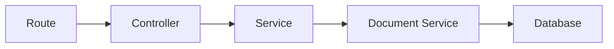

# Custom Controllers & Services

Strapi's auto-generated CRUD is great for basic operations, but real applications need custom logic. In this chapter we will extend the default controllers, create custom actions, and organize business logic into services.

## Architecture overview



| Layer | Responsibility |
|-------|---------------|
| **Route** | Maps URLs to controller actions |
| **Controller** | Handles HTTP request/response |
| **Service** | Contains business logic |
| **Document Service** | Low-level data access (provided by Strapi) |

The rule: **controllers should be thin, services should be fat**. Controllers parse input and format output. Services contain the actual logic.

## Default controllers

When you create a content type, Strapi generates a controller like this:

```javascript
// src/api/post/controllers/post.js
const { createCoreController } = require("@strapi/strapi").factories;

module.exports = createCoreController("api::post.post");
```

This one line gives you all five CRUD actions: `find`, `findOne`, `create`, `update`, `delete`. The `createCoreController` factory creates them automatically.

## Extending a core controller

You can extend the core controller by passing a function that receives the parent controller:

```javascript
// src/api/post/controllers/post.js
const { createCoreController } = require("@strapi/strapi").factories;

module.exports = createCoreController("api::post.post", ({ strapi }) => ({
  // Override the find action
  async find(ctx) {
    // Add custom logic before the default behavior
    console.log("Someone is fetching posts!");

    // Call the default find action
    const response = await super.find(ctx);

    // Add custom logic after
    // For example, add a timestamp to the response
    response.meta.fetchedAt = new Date().toISOString();

    return response;
  },
}));
```

### Common extension patterns

#### Restrict results to published posts only

```javascript
module.exports = createCoreController("api::post.post", ({ strapi }) => ({
  async find(ctx) {
    // Force published-only for public requests
    ctx.query = {
      ...ctx.query,
      filters: {
        ...ctx.query.filters,
        publishedAt: { $notNull: true },
      },
    };

    return await super.find(ctx);
  },
}));
```

#### Add default population

```javascript
module.exports = createCoreController("api::post.post", ({ strapi }) => ({
  async findOne(ctx) {
    // Always populate author and category
    ctx.query = {
      ...ctx.query,
      populate: {
        author: { fields: ["name"] },
        category: { fields: ["name", "slug"] },
        tags: { fields: ["name", "slug"] },
        seo: true,
      },
    };

    return await super.findOne(ctx);
  },
}));
```

#### Transform the response

```javascript
module.exports = createCoreController("api::post.post", ({ strapi }) => ({
  async find(ctx) {
    const response = await super.find(ctx);

    // Add a computed field to each post
    response.data = response.data.map((post) => ({
      ...post,
      readingTime: Math.ceil(
        (JSON.stringify(post.content) || "").split(/\s+/).length / 200
      ),
    }));

    return response;
  },
}));
```

## Creating custom actions

You can add entirely new actions to a controller:

```javascript
// src/api/post/controllers/post.js
const { createCoreController } = require("@strapi/strapi").factories;

module.exports = createCoreController("api::post.post", ({ strapi }) => ({
  // Custom action: find featured posts
  async findFeatured(ctx) {
    const posts = await strapi.documents("api::post.post").findMany({
      filters: { featured: true },
      status: "published",
      populate: {
        author: { fields: ["name"] },
        category: { fields: ["name", "slug"] },
      },
      sort: { publishedDate: "desc" },
      limit: 5,
    });

    return { data: posts };
  },

  // Custom action: find posts by slug
  async findBySlug(ctx) {
    const { slug } = ctx.params;

    const posts = await strapi.documents("api::post.post").findMany({
      filters: { slug },
      status: "published",
      populate: {
        author: { fields: ["name"] },
        category: { fields: ["name", "slug"] },
        tags: { fields: ["name", "slug"] },
        seo: true,
      },
      limit: 1,
    });

    if (posts.length === 0) {
      return ctx.notFound("Post not found");
    }

    return { data: posts[0] };
  },
}));
```

Custom actions need custom routes to be accessible -- we will add those in the next chapter.

## Default services

Like controllers, services are generated automatically:

```javascript
// src/api/post/services/post.js
const { createCoreService } = require("@strapi/strapi").factories;

module.exports = createCoreService("api::post.post");
```

The core service provides: `find`, `findOne`, `create`, `update`, `delete`.

## Extending services

Move business logic out of controllers and into services:

```javascript
// src/api/post/services/post.js
const { createCoreService } = require("@strapi/strapi").factories;

module.exports = createCoreService("api::post.post", ({ strapi }) => ({
  // Find the most popular posts (by a hypothetical viewCount field)
  async findPopular(limit = 5) {
    return await strapi.documents("api::post.post").findMany({
      status: "published",
      sort: { viewCount: "desc" },
      limit,
      populate: {
        author: { fields: ["name"] },
        category: { fields: ["name"] },
      },
    });
  },

  // Find related posts by category and tags
  async findRelated(postId, limit = 3) {
    const post = await strapi.documents("api::post.post").findOne({
      documentId: postId,
      populate: ["category", "tags"],
    });

    if (!post) return [];

    const tagIds = post.tags?.map((t) => t.id) || [];

    return await strapi.documents("api::post.post").findMany({
      filters: {
        documentId: { $ne: postId },
        $or: [
          { category: { id: post.category?.id } },
          { tags: { id: { $in: tagIds } } },
        ],
      },
      status: "published",
      limit,
      populate: {
        author: { fields: ["name"] },
        category: { fields: ["name"] },
      },
    });
  },
}));
```

### Using custom services from controllers

```javascript
// src/api/post/controllers/post.js
const { createCoreController } = require("@strapi/strapi").factories;

module.exports = createCoreController("api::post.post", ({ strapi }) => ({
  async findPopular(ctx) {
    const limit = ctx.query.limit || 5;
    const posts = await strapi
      .service("api::post.post")
      .findPopular(Number(limit));

    return { data: posts };
  },

  async findRelated(ctx) {
    const { id } = ctx.params;
    const posts = await strapi
      .service("api::post.post")
      .findRelated(id);

    return { data: posts };
  },
}));
```

## The Document Service

The Document Service is Strapi 5's primary data access API. Use it in services (and sometimes controllers) to interact with your content:

### Core methods

```javascript
const docs = strapi.documents("api::post.post");

// Find many
const posts = await docs.findMany({
  filters: { featured: true },
  status: "published",
  sort: { createdAt: "desc" },
  limit: 10,
  offset: 0,
  populate: { author: true },
});

// Find one by documentId
const post = await docs.findOne({
  documentId: "abc123",
  populate: { author: true, tags: true },
});

// Create
const newPost = await docs.create({
  data: {
    title: "New Post",
    slug: "new-post",
    content: [],
  },
});

// Update
const updated = await docs.update({
  documentId: "abc123",
  data: {
    title: "Updated Title",
  },
});

// Delete
await docs.delete({
  documentId: "abc123",
});

// Publish
await docs.publish({
  documentId: "abc123",
});

// Unpublish
await docs.unpublish({
  documentId: "abc123",
});

// Count
const count = await docs.count({
  filters: { featured: true },
  status: "published",
});
```

### Document Service vs core service

| Feature | Document Service | Core Service |
|---------|-----------------|--------------|
| **Access** | `strapi.documents("api::post.post")` | `strapi.service("api::post.post")` |
| **Purpose** | Raw data access | Business logic + data access |
| **Sanitization** | No (raw data) | Yes (respects permissions) |
| **Use from** | Services | Controllers |

Use the **core service** when you need sanitized, permission-aware responses. Use the **Document Service** when you need raw data access in your custom service logic.

## Output sanitization

When returning data from custom controllers, you should sanitize the output to respect field-level privacy settings and relation permissions:

```javascript
module.exports = createCoreController("api::post.post", ({ strapi }) => ({
  async findFeatured(ctx) {
    const posts = await strapi.documents("api::post.post").findMany({
      filters: { featured: true },
      status: "published",
    });

    // Sanitize output to respect content-type settings
    const sanitizedPosts = await this.sanitizeOutput(posts, ctx);

    return { data: sanitizedPosts };
  },
}));
```

The `this.sanitizeOutput()` method:

- Removes fields marked as `private` in the schema
- Removes fields the user's role does not have permission to read
- Strips internal Strapi fields

Always sanitize when returning data from custom actions.

## Practical example -- complete Post controller

Here is a full example combining everything:

```javascript
// src/api/post/controllers/post.js
const { createCoreController } = require("@strapi/strapi").factories;

module.exports = createCoreController("api::post.post", ({ strapi }) => ({
  // Override find to always populate essential relations
  async find(ctx) {
    ctx.query = {
      ...ctx.query,
      populate: ctx.query.populate || {
        author: { fields: ["name"] },
        category: { fields: ["name", "slug"] },
        tags: { fields: ["name", "slug"] },
      },
    };

    return await super.find(ctx);
  },

  // Override findOne to include SEO and related posts
  async findOne(ctx) {
    ctx.query = {
      ...ctx.query,
      populate: {
        author: { fields: ["name"], populate: { avatar: true } },
        category: { fields: ["name", "slug"] },
        tags: { fields: ["name", "slug"] },
        seo: true,
      },
    };

    const response = await super.findOne(ctx);

    // Add related posts
    if (response.data) {
      const related = await strapi
        .service("api::post.post")
        .findRelated(response.data.documentId);
      response.data.relatedPosts = related;
    }

    return response;
  },

  // Custom action: featured posts
  async findFeatured(ctx) {
    const posts = await strapi
      .service("api::post.post")
      .findPopular(5);
    const sanitized = await this.sanitizeOutput(posts, ctx);
    return { data: sanitized };
  },

  // Custom action: find by slug
  async findBySlug(ctx) {
    const { slug } = ctx.params;

    const posts = await strapi.documents("api::post.post").findMany({
      filters: { slug },
      status: "published",
      populate: {
        author: { fields: ["name"], populate: { avatar: true } },
        category: { fields: ["name", "slug"] },
        tags: { fields: ["name", "slug"] },
        seo: true,
      },
      limit: 1,
    });

    if (posts.length === 0) {
      return ctx.notFound("Post not found");
    }

    const sanitized = await this.sanitizeOutput(posts[0], ctx);
    return { data: sanitized };
  },
}));
```

> For more advanced controller and service patterns, see the [Custom Controllers and Services](/strapi/custom-controllers-services) reference.

## Summary

You learned:

- Strapi's **architecture**: routes --> controllers --> services --> Document Service --> database
- How to **extend core controllers** to customize default CRUD behavior
- How to create **custom controller actions** for new endpoints
- How to **extend services** with business logic
- The **Document Service API** for raw data access
- **Output sanitization** to respect privacy and permissions
- The principle of **thin controllers, fat services**

The custom actions we created (featured posts, find by slug, related posts) are not accessible yet -- they need routes. That is what the next chapter covers.

Next up: [Routes, Policies & Middleware](./08-routes-policies-middleware.md) -- mapping custom URLs to controller actions, access control policies, and request/response middleware.
