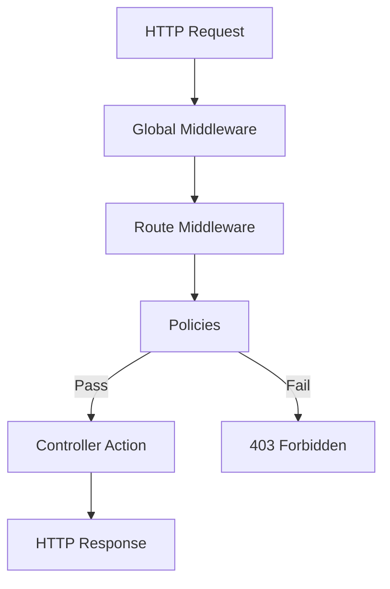

# Routes, Policies & Middleware

In the previous chapter we created custom controller actions, but they are unreachable without routes. In this chapter
we will map URLs to those actions, add access control with policies, and intercept requests with middleware.

## The request lifecycle

Every request in Strapi flows through a specific pipeline:



1. **Global middleware** -- runs on every request (CORS, body parser, security headers)
2. **Route middleware** -- runs on specific routes
3. **Policies** -- access control checks (pass or fail)
4. **Controller** -- handles the request and returns a response

## Default routes

Strapi auto-generates routes for every content type:

```javascript
// src/api/post/routes/post.js
const { createCoreRouter } = require("@strapi/strapi").factories;

module.exports = createCoreRouter("api::post.post");
```

This creates the standard REST routes:

| Method   | Path             | Action  | Handler        |
|----------|------------------|---------|----------------|
| `GET`    | `/api/posts`     | find    | `post.find`    |
| `GET`    | `/api/posts/:id` | findOne | `post.findOne` |
| `POST`   | `/api/posts`     | create  | `post.create`  |
| `PUT`    | `/api/posts/:id` | update  | `post.update`  |
| `DELETE` | `/api/posts/:id` | delete  | `post.delete`  |

## Configuring core routes

You can customize the core routes without replacing them:

```javascript
// src/api/post/routes/post.js
const { createCoreRouter } = require("@strapi/strapi").factories;

module.exports = createCoreRouter("api::post.post", {
  config: {
    find: {
      // Attach middleware to the find route
      middlewares: ["api::post.log-request"],
    },
    create: {
      // Attach policies to the create route
      policies: ["is-authenticated"],
    },
    update: {
      policies: ["is-authenticated", "api::post.is-owner"],
    },
    delete: {
      policies: ["is-authenticated", "api::post.is-owner"],
    },
  },
});
```

## Custom routes

Custom controller actions (like `findFeatured` and `findBySlug` from chapter 7) need custom routes. Create a new route
file:

```javascript
// src/api/post/routes/custom-post.js
module.exports = {
  routes: [
    {
      method: "GET",
      path: "/api/posts/featured",
      handler: "api::post.post.findFeatured",
      config: {
        auth: false, // Public access
      },
    },
    {
      method: "GET",
      path: "/api/posts/by-slug/:slug",
      handler: "api::post.post.findBySlug",
      config: {
        auth: false,
      },
    },
    {
      method: "GET",
      path: "/api/posts/:id/related",
      handler: "api::post.post.findRelated",
      config: {
        auth: false,
      },
    },
  ],
};
```

> **Important:** Custom route files must be placed in the `routes/` directory of your content type API. The filename can
> be anything except `post.js` (which is reserved for the core router). A common convention is `custom-post.js` or
`01-custom-post.js`.

### Route order matters

Strapi matches routes in order. Custom routes are loaded **before** core routes if the filename sorts before the core
route file. To ensure custom routes match first, prefix with a number:

```
src/api/post/routes/
├── 01-custom-post.js    # Custom routes (matched first)
└── post.js              # Core routes (matched second)
```

This matters when paths overlap. For example, `/api/posts/featured` could match the core `findOne` route (
`/api/posts/:id`) if core routes are checked first. Putting custom routes first prevents this.

### Route configuration

Each route accepts a `config` object:

```javascript
{
  method: "GET",
  path: "/api/posts/featured",
  handler: "api::post.post.findFeatured",
  config: {
    auth: false,               // Public (no auth required)
    policies: ["is-admin"],    // Policy checks
    middlewares: ["log-request"], // Middleware chain
    tag: {                     // Admin panel integration
      plugin: "content-manager",
      actionType: "find",
    },
  },
}
```

| Option        | Default | Description                                 |
|---------------|---------|---------------------------------------------|
| `auth`        | `true`  | Require authentication (`false` for public) |
| `policies`    | `[]`    | Array of policy names to apply              |
| `middlewares` | `[]`    | Array of middleware names to apply          |
| `tag`         | --      | Links to admin panel permissions            |

### URL parameters

Use `:param` syntax for dynamic URL segments:

```javascript
{
  method: "GET",
  path: "/api/posts/by-slug/:slug",
  handler: "api::post.post.findBySlug",
}
```

Access in the controller:

```javascript
async findBySlug(ctx) {
  const { slug } = ctx.params; // "my-first-post"
  // ...
}
```

## Policies

Policies are **access control checks** that run before the controller. They either pass (allow the request) or fail (
return 403 Forbidden).

### Built-in policies

Strapi provides global policies you can reference by name:

| Policy                        | Description                   |
|-------------------------------|-------------------------------|
| `admin::isAuthenticatedAdmin` | Requires admin authentication |

For API users, authentication is handled by the `auth` config on routes, not a separate policy. You write custom
policies for finer-grained control.

### Creating a custom policy

Let's create an **is-owner** policy that ensures users can only update or delete their own posts:

```javascript
// src/api/post/policies/is-owner.js
module.exports = async (policyContext, config, { strapi }) => {
  const user = policyContext.state.user;

  // No user = not authenticated
  if (!user) {
    return false;
  }

  const { id } = policyContext.params;

  // Fetch the post with its author
  const post = await strapi.documents("api::post.post").findOne({
    documentId: id,
    populate: { author: { fields: ["id"] } },
  });

  if (!post) {
    return false;
  }

  // Check if the authenticated user is the author
  if (post.author?.id !== user.id) {
    return false;
  }

  return true;
};
```

### Attaching policies to routes

Reference the policy in your route configuration:

```javascript
// In core routes
module.exports = createCoreRouter("api::post.post", {
  config: {
    update: {
      policies: ["api::post.is-owner"],
    },
    delete: {
      policies: ["api::post.is-owner"],
    },
  },
});

// In custom routes
{
  method: "PUT",
  path: "/api/posts/:id",
  handler: "api::post.post.update",
  config: {
    policies: ["api::post.is-owner"],
  },
}
```

### Global policies

Policies shared across content types go in `src/policies/`:

```javascript
// src/policies/is-authenticated.js
module.exports = (policyContext, config, { strapi }) => {
  if (policyContext.state.user) {
    return true;
  }

  return false;
};
```

Reference global policies without the `api::` prefix:

```javascript
config: {
  policies: ["global::is-authenticated"],
}
```

### Policy configuration

Policies can accept configuration:

```javascript
// src/policies/rate-limit.js
module.exports = (policyContext, config, { strapi }) => {
  const maxRequests = config.max || 100;
  const windowMs = config.window || 60000;

  // Rate limiting logic here...
  return true;
};
```

Use with configuration in routes:

```javascript
config: {
  policies: [
    {
      name: "global::rate-limit",
      config: { max: 50, window: 60000 },
    },
  ],
}
```

## Middleware

Middleware intercepts requests and responses. Unlike policies (which are binary pass/fail), middleware can transform the
request, add headers, log data, or modify the response.

### Creating route middleware

```javascript
// src/api/post/middlewares/log-request.js
module.exports = (config, { strapi }) => {
  return async (ctx, next) => {
    const start = Date.now();

    strapi.log.info(
      `[POST API] ${ctx.method} ${ctx.url} - Start`
    );

    // Call the next middleware / controller
    await next();

    const duration = Date.now() - start;
    strapi.log.info(
      `[POST API] ${ctx.method} ${ctx.url} - ${ctx.status} (${duration}ms)`
    );
  };
};
```

### Attaching route middleware

Reference middleware in route configuration:

```javascript
// Core routes
module.exports = createCoreRouter("api::post.post", {
  config: {
    find: {
      middlewares: ["api::post.log-request"],
    },
  },
});

// Custom routes
{
  method: "GET",
  path: "/api/posts/featured",
  handler: "api::post.post.findFeatured",
  config: {
    middlewares: ["api::post.log-request"],
  },
}
```

### Global middleware

Global middleware runs on every request. It is configured in `config/middlewares.ts`:

```javascript
// config/middlewares.ts
module.exports = [
  "strapi::logger",
  "strapi::errors",
  "strapi::security",
  "strapi::cors",
  "strapi::poweredBy",
  "strapi::query",
  "strapi::body",
  "strapi::session",
  "strapi::favicon",
  "strapi::public",
];
```

This is the default middleware stack. Each entry runs in order. You can:

- **Reorder** entries to change execution priority
- **Remove** entries you do not need
- **Add** custom global middleware

### Custom global middleware

Create a global middleware:

```javascript
// src/middlewares/request-timer.js
module.exports = (config, { strapi }) => {
  return async (ctx, next) => {
    const start = Date.now();
    await next();
    const duration = Date.now() - start;
    ctx.set("X-Response-Time", `${duration}ms`);
  };
};
```

Add it to the middleware stack:

```javascript
// config/middlewares.ts
module.exports = [
  "strapi::logger",
  "strapi::errors",
  "strapi::security",
  "strapi::cors",
  "strapi::poweredBy",
  "strapi::query",
  "strapi::body",
  "global::request-timer", // Custom middleware
  "strapi::session",
  "strapi::favicon",
  "strapi::public",
];
```

### Configuring built-in middleware

You can customize built-in middleware by passing configuration:

```javascript
// config/middlewares.ts
module.exports = [
  "strapi::logger",
  "strapi::errors",
  {
    name: "strapi::security",
    config: {
      contentSecurityPolicy: {
        useDefaults: true,
        directives: {
          "img-src": ["'self'", "data:", "blob:", "https://your-cdn.com"],
        },
      },
    },
  },
  {
    name: "strapi::cors",
    config: {
      origin: ["http://localhost:3000", "https://yourdomain.com"],
      methods: ["GET", "POST", "PUT", "DELETE"],
      headers: ["Content-Type", "Authorization"],
    },
  },
  "strapi::poweredBy",
  "strapi::query",
  "strapi::body",
  "strapi::session",
  "strapi::favicon",
  "strapi::public",
];
```

## Practical example -- rate limiting middleware

A simple in-memory rate limiter:

```javascript
// src/middlewares/rate-limit.js
const requestCounts = new Map();

module.exports = (config, { strapi }) => {
  const maxRequests = config.max || 100;
  const windowMs = config.window || 60 * 1000;

  return async (ctx, next) => {
    const ip = ctx.ip;
    const now = Date.now();
    const key = `${ip}`;

    if (!requestCounts.has(key)) {
      requestCounts.set(key, { count: 1, resetAt: now + windowMs });
    } else {
      const record = requestCounts.get(key);
      if (now > record.resetAt) {
        record.count = 1;
        record.resetAt = now + windowMs;
      } else {
        record.count++;
      }

      if (record.count > maxRequests) {
        ctx.status = 429;
        ctx.body = {
          error: {
            status: 429,
            name: "TooManyRequestsError",
            message: "Rate limit exceeded. Try again later.",
          },
        };
        return;
      }
    }

    await next();
  };
};
```

Add to the middleware stack:

```javascript
// config/middlewares.ts
module.exports = [
  "strapi::logger",
  "strapi::errors",
  {
    name: "global::rate-limit",
    config: { max: 100, window: 60000 },
  },
  "strapi::security",
  // ... rest of middleware
];
```

## Testing your custom routes

After creating custom routes, restart the server and test:

```bash
# List all registered routes
npm run strapi routes:list

# Test the featured posts endpoint
curl http://localhost:1337/api/posts/featured

# Test the find-by-slug endpoint
curl http://localhost:1337/api/posts/by-slug/getting-started-with-strapi

# Test the related posts endpoint
curl http://localhost:1337/api/posts/abc123def456/related
```

> **Tip:** Run `npm run strapi routes:list` whenever you change routes. It shows all registered routes, their methods,
> and handlers -- useful for debugging route conflicts.

> For more advanced patterns, see the [Custom Routes and Endpoints](/strapi/custom-routes-and-endpoints)
> and [Middleware and Policies](/strapi/middleware-and-policies) references.

## Summary

You learned:

- Strapi's **request lifecycle**: middleware --> policies --> controller
- How to **configure core routes** with policies and middleware
- How to create **custom routes** for new endpoints
- Why **route order matters** and how to control it
- How to write **policies** for access control (is-owner, is-authenticated)
- How to write **route middleware** and **global middleware**
- How to **configure built-in middleware** (CORS, security, etc.)
- A practical **rate limiting** example

Your blog API now has custom endpoints for featured posts and slug-based lookups, access control to ensure users can
only edit their own posts, and request logging middleware. The next chapter covers event-driven patterns.

Next up: [Lifecycle Hooks & Webhooks](./09-lifecycle-hooks-and-webhooks.md) -- reacting to content events with Document
Service middleware and notifying external services with webhooks.
