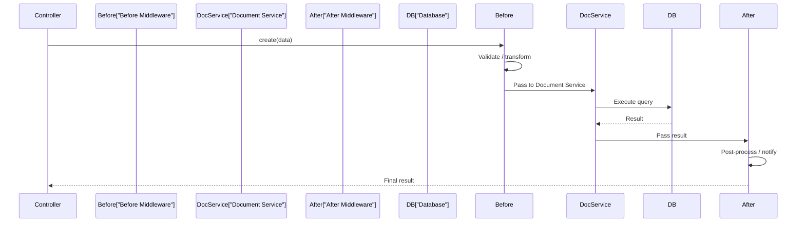

# Lifecycle Hooks & Webhooks

Sometimes you need to react to content changes: validate data before saving, send a notification when a post is
published, or sync content with an external service. Strapi provides two mechanisms for this: **Document Service
middleware** (lifecycle hooks) and **webhooks**.

## Document Service middleware

In Strapi 5, lifecycle hooks are implemented as **Document Service middleware**. They intercept calls on the Document
Service -- the layer that handles all content operations.



### Available events

| Event             | When it runs                          |
|-------------------|---------------------------------------|
| `beforeCreate`    | Before a new document is created      |
| `afterCreate`     | After a new document is created       |
| `beforeUpdate`    | Before a document is updated          |
| `afterUpdate`     | After a document is updated           |
| `beforeDelete`    | Before a document is deleted          |
| `afterDelete`     | After a document is deleted           |
| `beforeFindOne`   | Before a single document is fetched   |
| `afterFindOne`    | After a single document is fetched    |
| `beforeFindMany`  | Before multiple documents are fetched |
| `afterFindMany`   | After multiple documents are fetched  |
| `beforeCount`     | Before a count query                  |
| `afterCount`      | After a count query                   |
| `beforePublish`   | Before a document is published        |
| `afterPublish`    | After a document is published         |
| `beforeUnpublish` | Before a document is unpublished      |
| `afterUnpublish`  | After a document is unpublished       |

### Registering middleware

Document Service middleware is registered in the `register` lifecycle function of your Strapi app:

```javascript
// src/index.js
module.exports = {
  register({ strapi }) {
    strapi.documents.use(async (context, next) => {
      // This runs for ALL content types, ALL actions
      // Use context.uid and context.action to filter

      return await next();
    });
  },

  bootstrap({ strapi }) {
    // Runs after all plugins are registered
  },
};
```

The `context` object contains:

| Property                    | Description                                               |
|-----------------------------|-----------------------------------------------------------|
| `context.uid`               | Content type UID (e.g., `"api::post.post"`)               |
| `context.action`            | The action being performed (e.g., `"create"`, `"update"`) |
| `context.params`            | The parameters passed to the Document Service method      |
| `context.params.data`       | The data being written (for create/update)                |
| `context.params.documentId` | The document ID (for findOne/update/delete)               |

### Example -- validate post titles

Ensure all post titles are at least 5 characters:

```javascript
// src/index.js
module.exports = {
  register({ strapi }) {
    strapi.documents.use(async (context, next) => {
      if (
        context.uid === "api::post.post" &&
        (context.action === "create" || context.action === "update")
      ) {
        const title = context.params.data?.title;
        if (title && title.length < 5) {
          throw new Error("Post title must be at least 5 characters long");
        }
      }

      return await next();
    });
  },
};
```

### Example -- auto-generate slug

Automatically generate a slug from the title if one is not provided:

```javascript
// src/index.js
function slugify(text) {
  return text
    .toLowerCase()
    .replace(/[^a-z0-9]+/g, "-")
    .replace(/(^-|-$)/g, "");
}

module.exports = {
  register({ strapi }) {
    strapi.documents.use(async (context, next) => {
      if (
        context.uid === "api::post.post" &&
        (context.action === "create" || context.action === "update")
      ) {
        const data = context.params.data;
        if (data?.title && !data.slug) {
          data.slug = slugify(data.title);
        }
      }

      return await next();
    });
  },
};
```

### Example -- log content changes

Track all changes to content:

```javascript
// src/index.js
module.exports = {
  register({ strapi }) {
    strapi.documents.use(async (context, next) => {
      const result = await next();

      // Only log write operations
      if (["create", "update", "delete", "publish", "unpublish"].includes(context.action)) {
        strapi.log.info(
          `[Content Change] ${context.action} on ${context.uid}` +
          (context.params.documentId ? ` (${context.params.documentId})` : "")
        );
      }

      return result;
    });
  },
};
```

### Example -- send notification after publish

```javascript
// src/index.js
module.exports = {
  register({ strapi }) {
    strapi.documents.use(async (context, next) => {
      const result = await next();

      if (
        context.uid === "api::post.post" &&
        context.action === "publish"
      ) {
        // Fetch the full post data
        const post = await strapi.documents("api::post.post").findOne({
          documentId: context.params.documentId,
          populate: { author: { fields: ["name", "email"] } },
        });

        if (post) {
          strapi.log.info(
            `Post published: "${post.title}" by ${post.author?.name}`
          );

          // Send notification (email, Slack, etc.)
          // await sendSlackNotification(post);
        }
      }

      return result;
    });
  },
};
```

### Ordering middleware

Middleware runs in the order it is registered. If you need multiple hooks, register them in the order you want:

```javascript
module.exports = {
  register({ strapi }) {
    // Runs first: validation
    strapi.documents.use(async (context, next) => {
      // Validate...
      return await next();
    });

    // Runs second: transformation
    strapi.documents.use(async (context, next) => {
      // Transform...
      return await next();
    });

    // Runs third: logging
    strapi.documents.use(async (context, next) => {
      const result = await next();
      // Log...
      return result;
    });
  },
};
```

### Content-type specific middleware

For cleaner code, create separate functions for each content type:

```javascript
// src/index.js
const postMiddleware = require("./middlewares/post-lifecycle");
const authorMiddleware = require("./middlewares/author-lifecycle");

module.exports = {
  register({ strapi }) {
    strapi.documents.use(postMiddleware);
    strapi.documents.use(authorMiddleware);
  },
};
```

```javascript
// src/middlewares/post-lifecycle.js
module.exports = async (context, next) => {
  if (context.uid !== "api::post.post") {
    return await next();
  }

  // Pre-processing
  if (context.action === "create" || context.action === "update") {
    // Validation, transformation, etc.
  }

  const result = await next();

  // Post-processing
  if (context.action === "publish") {
    // Notifications, cache invalidation, etc.
  }

  return result;
};
```

## Webhooks

Webhooks are HTTP callbacks that notify external services when content changes. Unlike lifecycle hooks (which run custom
code inside Strapi), webhooks send an HTTP request to a URL you specify.

### Configuring webhooks in the admin panel

1. Go to **Settings** > **Webhooks**
2. Click **Create new webhook**
3. Configure:

| Field       | Description                                                                      |
|-------------|----------------------------------------------------------------------------------|
| **Name**    | Descriptive name (e.g., "Rebuild frontend")                                      |
| **URL**     | The endpoint to call (e.g., `https://api.vercel.com/v1/integrations/deploy/...`) |
| **Headers** | Custom headers (e.g., authorization tokens)                                      |
| **Events**  | Which events trigger the webhook                                                 |

4. Select events:

| Event category | Events                                                                             |
|----------------|------------------------------------------------------------------------------------|
| **Entry**      | `entry.create`, `entry.update`, `entry.delete`, `entry.publish`, `entry.unpublish` |
| **Media**      | `media.create`, `media.update`, `media.delete`                                     |

5. Click **Save**

### Webhook payload

When an event triggers, Strapi sends a POST request with this payload:

```json
{
  "event": "entry.publish",
  "createdAt": "2025-01-15T10:00:00.000Z",
  "model": "post",
  "uid": "api::post.post",
  "entry": {
    "id": 1,
    "documentId": "abc123",
    "title": "Getting Started with Strapi",
    "slug": "getting-started-with-strapi",
    "createdAt": "2025-01-15T10:00:00.000Z",
    "updatedAt": "2025-01-15T10:00:00.000Z"
  }
}
```

### Common webhook use cases

| Use case                 | Webhook target                    |
|--------------------------|-----------------------------------|
| **Rebuild static site**  | Vercel, Netlify deploy hooks      |
| **Invalidate CDN cache** | Cloudflare, Fastly purge API      |
| **Sync search index**    | Algolia, Meilisearch indexing API |
| **Send notifications**   | Slack, Discord, email service     |
| **Sync to external DB**  | Your own API endpoint             |

### Example -- trigger a Vercel rebuild

1. In Vercel, create a Deploy Hook (Project Settings > Git > Deploy Hooks)
2. Copy the hook URL
3. In Strapi, create a webhook with:
    - **URL:** `https://api.vercel.com/v1/integrations/deploy/prj_xxx/yyy`
    - **Events:** `entry.publish`, `entry.unpublish`, `entry.delete`

Now every time you publish, unpublish, or delete a post, Vercel rebuilds your frontend.

### Example -- Slack notification

```
Webhook URL: https://hooks.slack.com/services/T00000/B00000/XXXXX
Events: entry.publish

Headers:
  Content-Type: application/json
```

To format the Slack message, you would need a middleware service (like a serverless function) between Strapi and Slack
that transforms the webhook payload into Slack's message format.

## Programmatic webhooks

You can also trigger webhook-like behavior programmatically using lifecycle hooks:

```javascript
// src/middlewares/post-lifecycle.js
const https = require("https");

function notifySlack(message) {
  const webhookUrl = process.env.SLACK_WEBHOOK_URL;
  if (!webhookUrl) return;

  const url = new URL(webhookUrl);

  const data = JSON.stringify({ text: message });

  const options = {
    hostname: url.hostname,
    path: url.pathname,
    method: "POST",
    headers: {
      "Content-Type": "application/json",
      "Content-Length": data.length,
    },
  };

  const req = https.request(options);
  req.write(data);
  req.end();
}

module.exports = async (context, next) => {
  if (context.uid !== "api::post.post") {
    return await next();
  }

  const result = await next();

  if (context.action === "publish") {
    const post = await strapi.documents("api::post.post").findOne({
      documentId: context.params.documentId,
    });

    if (post) {
      notifySlack(`New post published: "${post.title}"`);
    }
  }

  return result;
};
```

> **Tip:** For production, use a proper HTTP client (like `node-fetch` or `axios`) instead of the built-in `https`
> module.

## Lifecycle hooks vs webhooks

| Feature           | Lifecycle hooks                                   | Webhooks                          |
|-------------------|---------------------------------------------------|-----------------------------------|
| **Runs**          | Inside Strapi (synchronous)                       | External HTTP call (asynchronous) |
| **Configuration** | Code in `src/index.js`                            | Admin panel or `config/`          |
| **Use for**       | Validation, transformation, internal side effects | External service notification     |
| **Can block**     | Yes (throw error to prevent action)               | No (fire and forget)              |
| **Access to**     | Full Strapi API, context, data                    | Webhook payload only              |

Use lifecycle hooks when you need to:

- **Validate** data before saving
- **Transform** data (auto-generate slug, sanitize HTML)
- **Block** invalid operations
- **Run internal logic** (update counters, create related entries)

Use webhooks when you need to:

- **Notify external services** (Slack, email, search engines)
- **Trigger rebuilds** (static site generators)
- **Sync data** with external systems
- **Decouple** Strapi from external services

> For advanced lifecycle and webhook patterns, see the [Lifecycle Hooks](/strapi/lifecycle-hooks)
> and [Webhooks and Integrations](/strapi/webhooks-and-integrations) references.

## Summary

You learned:

- **Document Service middleware** -- the Strapi 5 approach to lifecycle hooks
- All available **events** (before/after create, update, delete, publish, etc.)
- Practical examples: validation, slug generation, logging, notifications
- How to **organize** middleware across content types
- **Webhooks** -- configuring HTTP callbacks in the admin panel
- Common webhook use cases (rebuild, CDN purge, Slack, search sync)
- When to use **lifecycle hooks vs webhooks**

Your blog now reacts to content changes: validating titles, auto-generating slugs, and optionally notifying external
services. The next chapter covers file uploads and media management.

Next up: [Media & File Uploads](./10-media-and-file-uploads.md) -- upload providers, S3 and Cloudinary integration,
image optimization, responsive formats, and upload validation.
