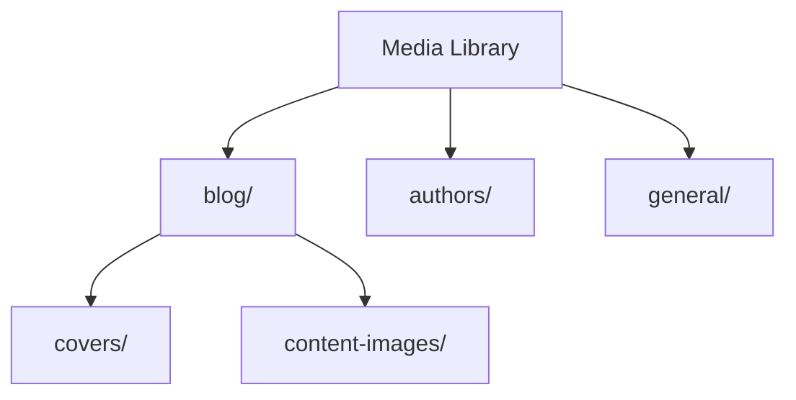

# Media & File Uploads

Every blog needs images. Strapi's Upload plugin handles file uploads, image processing, and storage. By default, files
are stored locally in `public/uploads/`. For production, you will want a cloud provider like S3 or Cloudinary.

## How uploads work


When a file is uploaded:

1. The Upload plugin receives the file
2. If it is an image, Strapi generates **responsive formats** (thumbnail, small, medium, large)
3. The file and all formats are sent to the **storage provider**
4. Metadata (URL, size, dimensions, format) is stored in the database

## The local provider

By default, Strapi uses the local file system:

- Files are stored in `public/uploads/`
- They are served at `http://localhost:1337/uploads/filename.jpg`
- No configuration needed for development

This works perfectly for development but has limitations in production:

- Files are stored on the server's disk (not persistent on ephemeral hosting)
- No CDN -- files are served by Strapi itself
- No advanced image optimization

## Uploading via the API

### Single file upload

```bash
curl -X POST http://localhost:1337/api/upload \
  -H "Authorization: Bearer YOUR_TOKEN" \
  -F "files=@/path/to/image.jpg"
```

Response:

```json
[
  {
    "id": 1,
    "documentId": "file123",
    "name": "image.jpg",
    "alternativeText": null,
    "caption": null,
    "width": 1920,
    "height": 1080,
    "formats": {
      "thumbnail": {
        "url": "/uploads/thumbnail_image_abc123.jpg",
        "width": 245,
        "height": 138
      },
      "small": {
        "url": "/uploads/small_image_abc123.jpg",
        "width": 500,
        "height": 281
      },
      "medium": {
        "url": "/uploads/medium_image_abc123.jpg",
        "width": 750,
        "height": 422
      },
      "large": {
        "url": "/uploads/large_image_abc123.jpg",
        "width": 1000,
        "height": 563
      }
    },
    "url": "/uploads/image_abc123.jpg",
    "size": 245.32,
    "mime": "image/jpeg"
  }
]
```

### Upload and attach to an entry

Upload a file and link it to a content type field in one request:

```bash
curl -X POST http://localhost:1337/api/upload \
  -H "Authorization: Bearer YOUR_TOKEN" \
  -F "files=@/path/to/avatar.jpg" \
  -F "ref=api::author.author" \
  -F "refId=abc123" \
  -F "field=avatar"
```

| Parameter | Description                    |
|-----------|--------------------------------|
| `files`   | The file(s) to upload          |
| `ref`     | Content type UID               |
| `refId`   | Document ID of the entry       |
| `field`   | Field name on the content type |

### Upload multiple files

```bash
curl -X POST http://localhost:1337/api/upload \
  -H "Authorization: Bearer YOUR_TOKEN" \
  -F "files=@/path/to/image1.jpg" \
  -F "files=@/path/to/image2.jpg" \
  -F "files=@/path/to/image3.jpg"
```

## Upload configuration

### Responsive image formats

Configure which formats Strapi generates:

```javascript
// config/plugins.js
module.exports = ({ env }) => ({
  upload: {
    config: {
      breakpoints: {
        xlarge: 1920,
        large: 1000,
        medium: 750,
        small: 500,
        xsmall: 64,
      },
    },
  },
});
```

### File size limits

Set maximum file sizes:

```javascript
// config/plugins.js
module.exports = ({ env }) => ({
  upload: {
    config: {
      sizeLimit: 10 * 1024 * 1024, // 10 MB
    },
  },
});
```

Also configure the body parser to accept large uploads:

```javascript
// config/middlewares.js
module.exports = [
  // ... other middleware
  {
    name: "strapi::body",
    config: {
      formLimit: "256mb",
      jsonLimit: "256mb",
      textLimit: "256mb",
      formidable: {
        maxFileSize: 10 * 1024 * 1024, // 10 MB
      },
    },
  },
  // ... other middleware
];
```

## AWS S3 provider

For production, S3 (or S3-compatible storage) is the most common choice.

### Install the provider

```bash
npm install @strapi/provider-upload-aws-s3
```

### Configure the provider

```javascript
// config/plugins.js
module.exports = ({ env }) => ({
  upload: {
    config: {
      provider: "aws-s3",
      providerOptions: {
        baseUrl: env("CDN_URL"), // Optional: CloudFront URL
        s3Options: {
          credentials: {
            accessKeyId: env("AWS_ACCESS_KEY_ID"),
            secretAccessKey: env("AWS_ACCESS_SECRET"),
          },
          region: env("AWS_REGION"),
          params: {
            Bucket: env("AWS_BUCKET"),
            ACL: env("AWS_ACL", "public-read"),
          },
        },
      },
      actionOptions: {
        upload: {},
        uploadStream: {},
        delete: {},
      },
    },
  },
});
```

### Environment variables

```bash
# .env
AWS_ACCESS_KEY_ID=your-access-key
AWS_ACCESS_SECRET=your-secret-key
AWS_REGION=eu-central-1
AWS_BUCKET=my-strapi-uploads
CDN_URL=https://d123456.cloudfront.net
```

### Security middleware update

When using an external provider, update the security middleware to allow images from your S3/CDN domain:

```javascript
// config/middlewares.js
module.exports = [
  // ... other middleware
  {
    name: "strapi::security",
    config: {
      contentSecurityPolicy: {
        useDefaults: true,
        directives: {
          "connect-src": ["'self'", "https:"],
          "img-src": [
            "'self'",
            "data:",
            "blob:",
            "https://my-strapi-uploads.s3.eu-central-1.amazonaws.com",
            "https://d123456.cloudfront.net",
          ],
          "media-src": [
            "'self'",
            "data:",
            "blob:",
            "https://my-strapi-uploads.s3.eu-central-1.amazonaws.com",
            "https://d123456.cloudfront.net",
          ],
        },
      },
    },
  },
  // ... other middleware
];
```

## Cloudinary provider

Cloudinary is a popular alternative that includes built-in image transformations and a CDN.

### Install the provider

```bash
npm install @strapi/provider-upload-cloudinary
```

### Configure the provider

```javascript
// config/plugins.js
module.exports = ({ env }) => ({
  upload: {
    config: {
      provider: "cloudinary",
      providerOptions: {
        cloud_name: env("CLOUDINARY_NAME"),
        api_key: env("CLOUDINARY_KEY"),
        api_secret: env("CLOUDINARY_SECRET"),
      },
      actionOptions: {
        upload: {},
        uploadStream: {},
        delete: {},
      },
    },
  },
});
```

### Environment variables

```bash
# .env
CLOUDINARY_NAME=your-cloud-name
CLOUDINARY_KEY=your-api-key
CLOUDINARY_SECRET=your-api-secret
```

## Upload validation with lifecycle hooks

You can validate uploads using Document Service middleware:

```javascript
// src/index.js
module.exports = {
  register({ strapi }) {
    strapi.documents.use(async (context, next) => {
      if (
        context.uid === "plugin::upload.file" &&
        context.action === "create"
      ) {
        const file = context.params.data;

        // Reject files larger than 5 MB
        if (file.size > 5 * 1024 * 1024) {
          throw new Error("File too large. Maximum size is 5 MB.");
        }

        // Only allow specific MIME types
        const allowedTypes = [
          "image/jpeg",
          "image/png",
          "image/webp",
          "image/gif",
          "application/pdf",
        ];

        if (!allowedTypes.includes(file.mime)) {
          throw new Error(
            `File type ${file.mime} is not allowed. Allowed: ${allowedTypes.join(", ")}`
          );
        }
      }

      return await next();
    });
  },
};
```

## Media in API responses

When you query content with media fields, the media data is included in the response (when populated):

```bash
curl "http://localhost:1337/api/posts?populate=author.avatar"
```

Response includes the full media object with all formats:

```json
{
  "data": [
    {
      "title": "My Post",
      "author": {
        "name": "Ada Lovelace",
        "avatar": {
          "url": "/uploads/avatar_abc123.jpg",
          "formats": {
            "thumbnail": {
              "url": "/uploads/thumbnail_avatar_abc123.jpg",
              "width": 156,
              "height": 156
            }
          },
          "width": 500,
          "height": 500,
          "alternativeText": "Ada Lovelace portrait"
        }
      }
    }
  ]
}
```

### Using responsive images on the frontend

The formats object lets you implement responsive images:

```html

```

## Media folders

The media library supports folders for organization:



Folders are managed through the admin panel. They do not affect the file URL -- they are purely organizational.

## Managing media via the API

### List all files

```bash
curl http://localhost:1337/api/upload/files \
  -H "Authorization: Bearer YOUR_TOKEN"
```

### Get a specific file

```bash
curl http://localhost:1337/api/upload/files/1 \
  -H "Authorization: Bearer YOUR_TOKEN"
```

### Update file metadata

```bash
curl -X PUT http://localhost:1337/api/upload/files/1 \
  -H "Content-Type: application/json" \
  -H "Authorization: Bearer YOUR_TOKEN" \
  -d '{
    "alternativeText": "A beautiful landscape",
    "caption": "Photo taken in 2025"
  }'
```

### Delete a file

```bash
curl -X DELETE http://localhost:1337/api/upload/files/1 \
  -H "Authorization: Bearer YOUR_TOKEN"
```

## Best practices

### Always set alternative text

Alternative text is critical for accessibility and SEO. Make it a habit to set `alternativeText` for every image:

```bash
curl -X POST http://localhost:1337/api/upload \
  -H "Authorization: Bearer YOUR_TOKEN" \
  -F "files=@/path/to/hero.jpg" \
  -F "fileInfo={\"alternativeText\": \"Blog hero image showing code on a screen\"}"
```

### Optimize images before upload

While Strapi generates responsive formats, it does not optimize the original. For best performance:

- Use modern formats (WebP, AVIF) when possible
- Compress images before uploading
- Remove metadata (EXIF data) if not needed

### Use a CDN in production

Whether you use S3 + CloudFront, Cloudinary, or another provider, always serve media through a CDN in production:

- Reduces load on your Strapi server
- Faster delivery worldwide
- Caching at the edge

### Set proper CORS headers

If your frontend is on a different domain, ensure CORS is configured to allow media requests:

```javascript
// config/middlewares.js
{
  name: "strapi::cors",
  config: {
    origin: ["https://yourdomain.com"],
  },
}
```

> For more advanced upload patterns, see the [File Uploads and Media](/strapi/file-uploads-and-media) reference.

## Summary

You learned:

- How the **Upload plugin** processes files and generates responsive formats
- The **local provider** for development
- **S3** and **Cloudinary** providers for production
- **Upload configuration** -- size limits, responsive breakpoints
- **Upload validation** with lifecycle hooks
- How media appears in **API responses** and how to use responsive images
- **Managing media** via the API and admin panel
- **Best practices** -- alt text, optimization, CDN, CORS

Your blog can now handle images for post covers, author avatars, and inline content. The next chapter adds TypeScript to
the project for better developer experience.

Next up: [TypeScript Integration](./11-typescript-integration.md) -- converting your project to TypeScript, generating
types from content schemas, and typing controllers and services.
