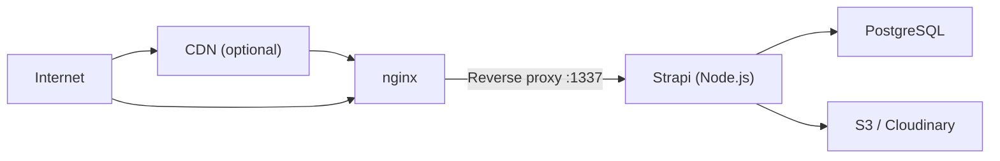

# Configuration & Deployment

Our blog CMS is feature-complete. Now let's deploy it to a production server. We will configure environment-based
settings, switch to PostgreSQL, set up a process manager, put nginx in front, enable HTTPS, and harden security.

## Deployment architecture



The components:

| Layer               | Role                                                |
|---------------------|-----------------------------------------------------|
| **nginx**           | Reverse proxy, SSL termination, static file caching |
| **Strapi**          | Application server (Node.js)                        |
| **PostgreSQL**      | Production database                                 |
| **S3 / Cloudinary** | Media storage (chapter 10)                          |
| **CDN** (optional)  | Cache and deliver static assets globally            |

## Environment-based configuration

Strapi supports environment-specific configuration files. Instead of one `config/database.ts`, you can have:

```
config/
├── database.ts           # Default (development)
└── env/
    └── production/
        └── database.ts   # Production overrides
```

Strapi loads the default config first, then merges environment-specific overrides based on the `NODE_ENV` variable.

### Environment variables

All sensitive values go in `.env` (development) and environment variables on the server (production):

```bash
# .env (development -- NEVER commit this file)
HOST=0.0.0.0
PORT=1337
APP_KEYS=key1,key2,key3,key4
API_TOKEN_SALT=your-api-token-salt
ADMIN_JWT_SECRET=your-admin-jwt-secret
TRANSFER_TOKEN_SALT=your-transfer-token-salt
JWT_SECRET=your-jwt-secret
DATABASE_FILENAME=.tmp/data.db
```

> **Security:** Generate all secrets with a cryptographic random generator. Never use default values in production.
> Never commit `.env` to version control.

### Production database -- PostgreSQL

SQLite is great for development but not suitable for production. Switch to PostgreSQL:

```bash
# Install the PostgreSQL client
npm install pg
```

Create the production database config:

```typescript
// config/env/production/database.ts
export default ({ env }) => ({
  connection: {
    client: "postgres",
    connection: {
      host: env("DATABASE_HOST", "127.0.0.1"),
      port: parseInt(env("DATABASE_PORT", "5432"), 10),
      database: env("DATABASE_NAME", "strapi"),
      user: env("DATABASE_USERNAME", "strapi"),
      password: env("DATABASE_PASSWORD", ""),
      ssl: env.bool("DATABASE_SSL", false) && {
        rejectUnauthorized: env.bool(
          "DATABASE_SSL_REJECT_UNAUTHORIZED",
          true
        ),
      },
    },
    pool: {
      min: 2,
      max: 10,
    },
  },
});
```

### Production server config

```typescript
// config/env/production/server.ts
export default ({ env }) => ({
  host: env("HOST", "0.0.0.0"),
  port: parseInt(env("PORT", "1337"), 10),
  url: env("PUBLIC_URL", "https://cms.yourdomain.com"),
  app: {
    keys: env("APP_KEYS", "").split(","),
  },
});
```

The `url` setting is critical -- it tells Strapi its public URL, which is used for generating absolute URLs in API
responses and the admin panel.

### Production admin config

```typescript
// config/env/production/admin.ts
export default ({ env }) => ({
  auth: {
    secret: env("ADMIN_JWT_SECRET"),
  },
  apiToken: {
    salt: env("API_TOKEN_SALT"),
  },
  transfer: {
    token: {
      salt: env("TRANSFER_TOKEN_SALT"),
    },
  },
});
```

## Preparing the server

We will use an Ubuntu VPS. If you followed the JavaScript or Java deployment chapters, you already have a server set up.
The same server can host Strapi.

### Install prerequisites

```bash
# Update packages
sudo apt update && sudo apt upgrade -y

# Install Node.js 20 (LTS)
curl -fsSL https://deb.nodesource.com/setup_20.x | sudo -E bash -
sudo apt install -y nodejs

# Verify
node --version   # v20.x.x
npm --version    # 10.x.x

# Install PostgreSQL
sudo apt install -y postgresql postgresql-contrib

# Install nginx
sudo apt install -y nginx

# Install PM2 globally
sudo npm install -g pm2
```

### Set up PostgreSQL

```bash
# Switch to the postgres user
sudo -u postgres psql

# Create a database and user
CREATE USER strapi WITH PASSWORD 'your-strong-password-here';
CREATE DATABASE strapi_blog OWNER strapi;
GRANT ALL PRIVILEGES ON DATABASE strapi_blog TO strapi;
\q
```

> **Security:** Use a strong, random password. The example above is a placeholder.

### Create a system user

Run Strapi as a dedicated non-root user:

```bash
sudo adduser --system --group --shell /bin/bash strapi
sudo mkdir -p /var/www/strapi
sudo chown strapi:strapi /var/www/strapi
```

## Deploying the application

### Transfer files to the server

From your local machine, use `rsync` to transfer the project:

```bash
rsync -avz --exclude node_modules --exclude .tmp --exclude .cache \
  --exclude dist --exclude .env \
  ./ your-user@your-server:/var/www/strapi/
```

### Install dependencies on the server

```bash
# SSH into the server
ssh your-user@your-server

# Switch to the strapi directory
cd /var/www/strapi

# Install production dependencies
NODE_ENV=production npm install

# Build the admin panel
NODE_ENV=production npm run build
```

### Set up environment variables

Create the production `.env` on the server:

```bash
sudo -u strapi nano /var/www/strapi/.env
```

```bash
# /var/www/strapi/.env
HOST=0.0.0.0
PORT=1337
NODE_ENV=production
PUBLIC_URL=https://cms.yourdomain.com

# Generate these with: openssl rand -base64 32
APP_KEYS=key1,key2,key3,key4
API_TOKEN_SALT=random-salt-here
ADMIN_JWT_SECRET=random-secret-here
TRANSFER_TOKEN_SALT=random-salt-here
JWT_SECRET=random-secret-here

# PostgreSQL
DATABASE_HOST=127.0.0.1
DATABASE_PORT=5432
DATABASE_NAME=strapi_blog
DATABASE_USERNAME=strapi
DATABASE_PASSWORD=your-strong-password-here
DATABASE_SSL=false
```

Generate random secrets:

```bash
openssl rand -base64 32  # Run this 5 times for each secret
```

### Test the production build

```bash
cd /var/www/strapi
NODE_ENV=production npm run start
```

Strapi should start on port 1337. Press `Ctrl+C` to stop it once you confirm it works.

## Process management with PM2

PM2 keeps Strapi running, restarts it on crash, and manages logs.

### Create an ecosystem file

```javascript
// /var/www/strapi/ecosystem.config.js
module.exports = {
  apps: [
    {
      name: "strapi",
      cwd: "/var/www/strapi",
      script: "npm",
      args: "run start",
      env: {
        NODE_ENV: "production",
      },
      instances: 1,
      autorestart: true,
      watch: false,
      max_memory_restart: "1G",
      error_file: "/var/log/strapi/error.log",
      out_file: "/var/log/strapi/out.log",
    },
  ],
};
```

### Create the log directory

```bash
sudo mkdir -p /var/log/strapi
sudo chown strapi:strapi /var/log/strapi
```

### Start with PM2

```bash
cd /var/www/strapi
pm2 start ecosystem.config.js

# Save the process list so PM2 restarts on reboot
pm2 save

# Set PM2 to start on boot
pm2 startup systemd
# Follow the command it outputs (run as root)
```

### PM2 commands

| Command              | Description                    |
|----------------------|--------------------------------|
| `pm2 list`           | Show running processes         |
| `pm2 logs strapi`    | View live logs                 |
| `pm2 restart strapi` | Restart the app                |
| `pm2 stop strapi`    | Stop the app                   |
| `pm2 delete strapi`  | Remove from PM2                |
| `pm2 monit`          | Real-time monitoring dashboard |

## Alternative -- systemd

If you prefer systemd over PM2:

```ini
# /etc/systemd/system/strapi.service
[Unit]
Description=Strapi CMS
After=network.target postgresql.service

[Service]
Type=simple
User=strapi
Group=strapi
WorkingDirectory=/var/www/strapi
ExecStart=/usr/bin/node node_modules/.bin/strapi start
Restart=on-failure
RestartSec=10
Environment=NODE_ENV=production
EnvironmentFile=/var/www/strapi/.env
StandardOutput=journal
StandardError=journal

[Install]
WantedBy=multi-user.target
```

```bash
# Enable and start
sudo systemctl daemon-reload
sudo systemctl enable strapi
sudo systemctl start strapi

# Check status
sudo systemctl status strapi

# View logs
sudo journalctl -u strapi -f
```

## nginx reverse proxy

nginx sits in front of Strapi, handling SSL, compression, and caching.

### Create the nginx configuration

```nginx
# /etc/nginx/sites-available/strapi
server {
    listen 80;
    server_name cms.yourdomain.com;

    # Redirect HTTP to HTTPS
    return 301 https://$server_name$request_uri;
}

server {
    listen 443 ssl http2;
    server_name cms.yourdomain.com;

    # SSL certificates (added by Certbot)
    ssl_certificate /etc/letsencrypt/live/cms.yourdomain.com/fullchain.pem;
    ssl_certificate_key /etc/letsencrypt/live/cms.yourdomain.com/privkey.pem;
    include /etc/letsencrypt/options-ssl-nginx.conf;
    ssl_dhparam /etc/letsencrypt/ssl-dhparams.pem;

    # Proxy to Strapi
    location / {
        proxy_pass http://127.0.0.1:1337;
        proxy_http_version 1.1;
        proxy_set_header Host $host;
        proxy_set_header X-Real-IP $remote_addr;
        proxy_set_header X-Forwarded-For $proxy_add_x_forwarded_for;
        proxy_set_header X-Forwarded-Proto $scheme;
        proxy_set_header Upgrade $http_upgrade;
        proxy_set_header Connection "upgrade";

        # Increase timeouts for large uploads
        proxy_read_timeout 300s;
        proxy_send_timeout 300s;
        client_max_body_size 50m;
    }

    # Cache static assets
    location /uploads/ {
        proxy_pass http://127.0.0.1:1337;
        proxy_cache_valid 200 1d;
        add_header Cache-Control "public, max-age=86400";
    }

    # Cache admin panel assets
    location /_next/ {
        proxy_pass http://127.0.0.1:1337;
        proxy_cache_valid 200 7d;
        add_header Cache-Control "public, max-age=604800";
    }
}
```

### Enable the site

```bash
sudo ln -s /etc/nginx/sites-available/strapi /etc/nginx/sites-enabled/

# Test the configuration
sudo nginx -t

# Reload nginx
sudo systemctl reload nginx
```

## HTTPS with Let's Encrypt

### Install Certbot

```bash
sudo apt install -y certbot python3-certbot-nginx
```

### Obtain a certificate

First, create a basic nginx config without SSL (just the `listen 80` block with `server_name`), then run Certbot:

```bash
sudo certbot --nginx -d cms.yourdomain.com
```

Certbot:

1. Verifies you own the domain
2. Obtains a certificate
3. Modifies the nginx config to enable SSL
4. Sets up automatic renewal

### Verify auto-renewal

```bash
sudo certbot renew --dry-run
```

Certbot sets up a systemd timer that renews certificates automatically before they expire.

## Security hardening

### Firewall

```bash
sudo ufw allow 22/tcp     # SSH
sudo ufw allow 80/tcp     # HTTP (redirects to HTTPS)
sudo ufw allow 443/tcp    # HTTPS
sudo ufw enable
```

Do **not** open port 1337 -- nginx proxies traffic to Strapi, so Strapi only needs to be accessible from localhost.

### Strapi security configuration

```typescript
// config/env/production/middlewares.ts
export default [
  "strapi::logger",
  "strapi::errors",
  {
    name: "strapi::security",
    config: {
      contentSecurityPolicy: {
        useDefaults: true,
        directives: {
          "connect-src": ["'self'", "https:"],
          "img-src": [
            "'self'",
            "data:",
            "blob:",
            // Add your CDN/S3 domain
          ],
          "media-src": [
            "'self'",
            "data:",
            "blob:",
            // Add your CDN/S3 domain
          ],
          upgradeInsecureRequests: null,
        },
      },
    },
  },
  {
    name: "strapi::cors",
    config: {
      origin: [
        "https://yourdomain.com",
        "https://www.yourdomain.com",
      ],
      methods: ["GET", "POST", "PUT", "DELETE"],
      headers: ["Content-Type", "Authorization"],
    },
  },
  "strapi::poweredBy",
  "strapi::query",
  "strapi::body",
  "strapi::session",
  "strapi::favicon",
  "strapi::public",
];
```

### Restrict admin panel access

In production, you may want to restrict admin panel access to specific IPs:

```nginx
# In the nginx config
location /admin {
    # Only allow specific IPs
    allow 203.0.113.10;  # Your office IP
    deny all;

    proxy_pass http://127.0.0.1:1337;
    proxy_http_version 1.1;
    proxy_set_header Host $host;
    proxy_set_header X-Real-IP $remote_addr;
    proxy_set_header X-Forwarded-For $proxy_add_x_forwarded_for;
    proxy_set_header X-Forwarded-Proto $scheme;
}
```

### Disable unnecessary features

In production, the Content-Type Builder is disabled by default (you cannot change schemas). Verify this is the case.

Also consider disabling GraphQL if you only use REST:

```typescript
// config/env/production/plugins.ts
export default {
  graphql: {
    enabled: false,
  },
};
```

### SSH hardening

```bash
# Disable password authentication (use SSH keys only)
sudo nano /etc/ssh/sshd_config
# Set: PasswordAuthentication no
# Set: PermitRootLogin no

sudo systemctl restart sshd
```

### Fail2Ban

```bash
sudo apt install -y fail2ban
sudo systemctl enable fail2ban
sudo systemctl start fail2ban
```

### Automatic security updates

```bash
sudo apt install -y unattended-upgrades
sudo dpkg-reconfigure -plow unattended-upgrades
```

## Deployment checklist

Before going live, verify:

| Check                                                      | Status |
|------------------------------------------------------------|--------|
| PostgreSQL configured and accessible                       |        |
| All environment variables set (secrets are unique, random) |        |
| `.env` is not in version control                           |        |
| Admin panel built (`npm run build`)                        |        |
| PM2 or systemd starts on boot                              |        |
| nginx reverse proxy configured                             |        |
| HTTPS enabled with valid certificate                       |        |
| Firewall allows only ports 22, 80, 443                     |        |
| CORS configured for your frontend domain(s)                |        |
| Content Security Policy set                                |        |
| SSH hardened (key-only, no root login)                     |        |
| Fail2Ban installed                                         |        |
| Automatic updates enabled                                  |        |
| Backups configured (database + uploads)                    |        |

## Database backups

Set up automated PostgreSQL backups:

```bash
# Create a backup script
sudo nano /opt/backup-strapi.sh
```

```bash
#!/bin/bash
BACKUP_DIR="/var/backups/strapi"
DATE=$(date +%Y%m%d_%H%M%S)
RETENTION_DAYS=30

mkdir -p "$BACKUP_DIR"

# Dump the database
pg_dump -U strapi strapi_blog | gzip > "$BACKUP_DIR/db_$DATE.sql.gz"

# Remove old backups
find "$BACKUP_DIR" -name "db_*.sql.gz" -mtime +$RETENTION_DAYS -delete

echo "Backup completed: db_$DATE.sql.gz"
```

```bash
sudo chmod +x /opt/backup-strapi.sh

# Add to crontab (daily at 2 AM)
sudo crontab -e
# Add: 0 2 * * * /opt/backup-strapi.sh
```

## Updating Strapi

To deploy updates:

```bash
# On your local machine
rsync -avz --exclude node_modules --exclude .tmp --exclude .cache \
  --exclude dist --exclude .env \
  ./ your-user@your-server:/var/www/strapi/

# On the server
cd /var/www/strapi
npm install
NODE_ENV=production npm run build
pm2 restart strapi
```

For zero-downtime deployments, consider using a blue-green deployment strategy or Docker containers.

> For more advanced deployment patterns, see the [Configuration and Deployment](/strapi/configuration-and-deployment)
> reference.

## Summary

You learned:

- **Environment-based configuration** -- separate settings for development and production
- Switching to **PostgreSQL** for production
- **Deploying to a VPS** -- transferring files, installing dependencies, building
- **PM2** and **systemd** for process management
- **nginx** as a reverse proxy with caching
- **HTTPS** with Let's Encrypt and automatic renewal
- **Security hardening** -- firewall, CORS, CSP, SSH, Fail2Ban, automatic updates
- **Database backups** and update procedures

Congratulations -- your Strapi 5 blog CMS is now running in production! You have gone from a blank project to a fully
configured, secured, and deployed content management system.

## Where to go from here

Now that you have completed the beginners guide, explore the reference docs for deeper topics:

- [Content Modeling Patterns](/strapi/content-modeling-patterns) -- advanced schema design
- [GraphQL Customization](/strapi/graphql-customization) -- if you need GraphQL
- [Plugin Development](/strapi/plugin-development) -- build your own plugins
- [i18n and Multi-Locale](/strapi/i18n-multi-locale) -- internationalization
- [Performance and Caching](/strapi/performance-and-caching) -- Redis, query optimization
- [Admin Panel Customization](/strapi/admin-panel-customization) -- branding, custom fields
- [Data Import, Export, and Migration](/strapi/data-import-export-migration) -- content migration strategies
- [Scheduled Publishing](/strapi/scheduled-publishing) -- editorial workflows
- [Testing Strapi Applications](/strapi/testing-strapi-applications) -- unit and integration tests
