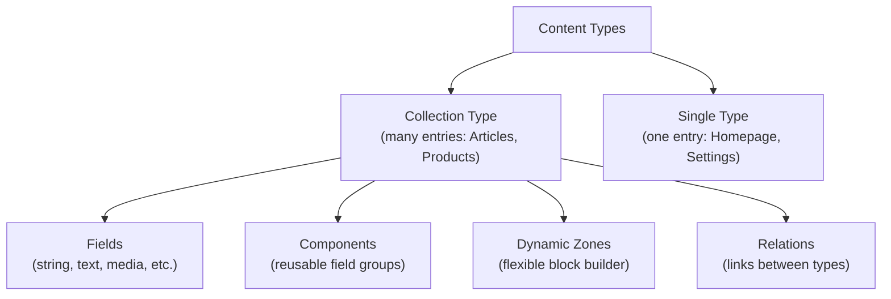

# Content Modeling Patterns

Bad content modeling decisions are the hardest thing to fix later. This page covers the trade-offs between Strapi's
modeling primitives and patterns that scale.

## Content modeling overview



---

## Collection types vs single types

| Use                    | Collection Type                           | Single Type                                   |
|------------------------|-------------------------------------------|-----------------------------------------------|
| **Entries**            | Many (articles, products, users)          | Exactly one (homepage, site settings, footer) |
| **API**                | `/api/articles`, `/api/articles/:id`      | `/api/homepage`                               |
| **Create new entries** | Yes, unlimited                            | No, only update the single entry              |
| **Use when**           | You have multiple items of the same shape | There is only ever one instance               |

### Common single types

```
Site Settings      -- logo, site title, social links, analytics ID
Homepage           -- hero, featured articles, CTA blocks
Footer             -- columns, links, copyright text
Navigation         -- menu items (as a repeatable component)
Global SEO         -- default meta tags, OG image fallback
```

### When NOT to use a single type

If you ever think "what if we need a second one?", use a collection type. Converting a single type to a collection type
later is painful.

---

## Components

Components are reusable groups of fields that can be embedded in any content type. They do **not** have their own API
endpoint -- they only exist as part of a parent document.

### When to use components

- **Repeated field groups**: SEO metadata (title, description, ogImage) used across multiple types
- **Structured sub-objects**: Address (street, city, zip, country) embedded in Company and Author
- **Repeatable items**: A list of FAQ entries (question + answer) inside a Page

### Defining a component

```json
// src/components/shared/seo.json
{
  "collectionName": "components_shared_seos",
  "info": {
    "displayName": "SEO",
    "icon": "search",
    "description": "Search engine optimization metadata"
  },
  "attributes": {
    "metaTitle": {
      "type": "string",
      "maxLength": 60
    },
    "metaDescription": {
      "type": "text",
      "maxLength": 160
    },
    "ogImage": {
      "type": "media",
      "multiple": false,
      "allowedTypes": ["images"]
    },
    "canonicalURL": {
      "type": "string"
    },
    "noIndex": {
      "type": "boolean",
      "default": false
    }
  }
}
```

### Using in a content type

```json
{
  "attributes": {
    "seo": {
      "type": "component",
      "component": "shared.seo"
    },
    "faqs": {
      "type": "component",
      "component": "shared.faq",
      "repeatable": true
    }
  }
}
```

### Component categories

Organize components into categories for clarity:

```
src/components/
├── shared/          # Cross-cutting: SEO, breadcrumbs, social links
│   ├── seo.json
│   ├── social-link.json
│   └── breadcrumb.json
├── blocks/          # Page builder blocks
│   ├── hero.json
│   ├── text-with-image.json
│   ├── gallery.json
│   ├── cta.json
│   └── testimonial.json
├── layout/          # Structural: header, footer, navigation
│   ├── menu-item.json
│   └── footer-column.json
└── form/            # Form-related
    ├── text-input.json
    ├── select-option.json
    └── form-field.json
```

---

## Dynamic zones

Dynamic zones let editors choose from a set of components in any order -- the classic "page builder" pattern.

### Defining a dynamic zone

```json
{
  "attributes": {
    "blocks": {
      "type": "dynamiczone",
      "components": [
        "blocks.hero",
        "blocks.text-with-image",
        "blocks.gallery",
        "blocks.cta",
        "blocks.testimonial",
        "blocks.video-embed",
        "blocks.accordion"
      ]
    }
  }
}
```

### Querying dynamic zones

```js
const page = await strapi.documents('api::page.page').findOne(documentId, {
  populate: {
    blocks: {
      on: {
        'blocks.hero': { populate: ['backgroundImage', 'cta'] },
        'blocks.text-with-image': { populate: ['image'] },
        'blocks.gallery': { populate: ['images'] },
        'blocks.cta': true,
        'blocks.testimonial': { populate: ['avatar'] },
        'blocks.video-embed': true,
        'blocks.accordion': true,
      },
    },
  },
});
```

### Frontend rendering pattern

```tsx
// React component for rendering dynamic zones
function DynamicZone({ blocks }) {
  const componentMap = {
    'blocks.hero': HeroBlock,
    'blocks.text-with-image': TextWithImageBlock,
    'blocks.gallery': GalleryBlock,
    'blocks.cta': CtaBlock,
    'blocks.testimonial': TestimonialBlock,
    'blocks.video-embed': VideoEmbedBlock,
    'blocks.accordion': AccordionBlock,
  };

  return (
    <div>
      {blocks?.map((block, index) => {
        const Component = componentMap[block.__component];
        if (!Component) {
          console.warn(`Unknown block type: ${block.__component}`);
          return null;
        }
        return <Component key={`${block.__component}-${index}`} {...block} />;
      })}
    </div>
  );
}
```

---

## Components vs relations: decision guide

| Factor                      | Component                        | Relation                            |
|-----------------------------|----------------------------------|-------------------------------------|
| **Own API endpoint**        | No                               | Yes                                 |
| **Reusable across entries** | Embedded (duplicated per entry)  | Referenced (single source of truth) |
| **Editable independently**  | No, only via parent              | Yes, has its own edit page          |
| **Performance**             | Fetched with parent (no join)    | Requires `populate` (join query)    |
| **Use for**                 | SEO metadata, address, FAQ items | Authors, Categories, Tags           |

### When to use a component

- The data only makes sense in the context of its parent
- Each entry has its own copy (e.g., each page has its own SEO fields)
- You don't need to query the data independently

### When to use a relation

- The data is shared across multiple entries (one Author, many Articles)
- You need to query it independently (list all Categories)
- You need referential integrity (changing the Author name updates everywhere)

### Anti-pattern: component when you need a relation

```
❌ Article has a "author" component with name, bio, avatar
   → Changing the author's bio means updating every article

✅ Article has a relation to Author collection type
   → Change the bio once, it's reflected everywhere
```

### Anti-pattern: relation when you need a component

```
❌ Article has a relation to "SEO" collection type
   → Creates orphaned SEO entries, confusing admin UI, unnecessary joins

✅ Article has an "SEO" component embedded
   → SEO data lives with the article, no orphans, faster queries
```

---

## Modeling patterns

### Pattern: polymorphic content (dynamic zone)

A page that can contain any combination of blocks:

```
Page
├── title (string)
├── slug (string)
├── seo (component: shared.seo)
└── blocks (dynamic zone)
    ├── blocks.hero
    ├── blocks.rich-text
    ├── blocks.image-grid
    └── blocks.call-to-action
```

### Pattern: taxonomy with tags

```
Article
├── title
├── content
├── category (relation: manyToOne → Category)
└── tags (relation: manyToMany → Tag)

Category (collection type)
├── name
├── slug
└── articles (relation: oneToMany → Article)

Tag (collection type)
├── name
├── slug
└── articles (relation: manyToMany → Article)
```

### Pattern: settings hierarchy

```
SiteSettings (single type)
├── siteName
├── logo (media)
├── defaultLocale
├── socialLinks (repeatable component: shared.social-link)
├── navigation (repeatable component: layout.menu-item)
└── footer (component: layout.footer)
```

### Pattern: product with variants

```
Product (collection type)
├── name
├── description
├── basePrice
├── images (media, multiple)
├── category (relation → Category)
├── variants (repeatable component: product.variant)
│   ├── size
│   ├── color
│   ├── sku
│   ├── priceModifier
│   └── stock
└── specifications (repeatable component: product.spec)
    ├── key
    └── value
```

### Pattern: nested navigation

```
NavigationItem (component: layout.nav-item)
├── label (string)
├── url (string)
├── target (enum: _self, _blank)
├── icon (media)
└── children (repeatable component: layout.nav-item)  ← self-referencing
```

> Strapi allows components to reference themselves for tree-like structures, but limit the nesting depth to avoid
> performance issues.

---

## Naming conventions

| Convention                     | Example                     | Rationale                                   |
|--------------------------------|-----------------------------|---------------------------------------------|
| Singular collection names      | `article`, not `articles`   | Strapi auto-pluralizes for API endpoints    |
| Kebab-case for slugs           | `blog-post`, not `blogPost` | Consistent URL-friendly identifiers         |
| Category prefix for components | `shared.seo`, `blocks.hero` | Groups related components in the admin      |
| Descriptive field names        | `publishedDate`, not `date` | Unambiguous when used alongside other dates |
| Boolean prefix                 | `isActive`, `hasFeatured`   | Clear intent                                |

---

## Schema evolution tips

| Situation                            | Approach                                                    |
|--------------------------------------|-------------------------------------------------------------|
| Adding a new field                   | Non-breaking. Add with a sensible default.                  |
| Renaming a field                     | Breaking. Create new field, migrate data, remove old field. |
| Changing a component to a relation   | Breaking. Requires a data migration script.                 |
| Adding a new block to a dynamic zone | Non-breaking. Just add the component UID to the array.      |
| Removing a block from a dynamic zone | Breaking if existing entries use it. Migrate first.         |

---

## Common pitfalls

| Pitfall                                 | Problem                                   | Fix                                                             |
|-----------------------------------------|-------------------------------------------|-----------------------------------------------------------------|
| Too many relations on one type          | Slow queries, complex population          | Limit to 5-7 relations max; denormalize if needed               |
| Deep component nesting                  | Hard to query, hard to populate           | Keep nesting to 2-3 levels max                                  |
| Using JSON fields instead of components | No admin UI, no validation, no population | Use components for structured data                              |
| One giant "Page" type for everything    | Bloated schema, confusing editor UX       | Create separate types: `LandingPage`, `BlogPost`, `ProductPage` |
| Not planning for i18n                   | Retrofit is painful                       | Decide localization per field upfront                           |

---

## See also

- [Relations and Population](relations-and-population.md) -- querying and populating relations efficiently
- [i18n and Multi-Locale Content](i18n-multi-locale.md) -- localization affects modeling decisions
- [Custom Controllers and Services](custom-controllers-services.md) -- consuming your content model in code
