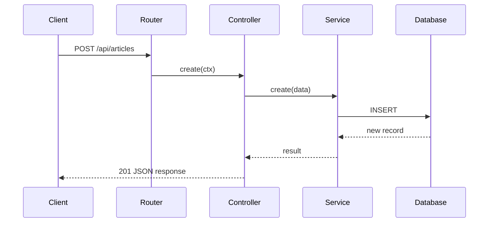

# Custom Controllers and Services

Controllers handle incoming requests and return responses. Services encapsulate reusable business logic. Strapi generates default CRUD controllers for every content type, but real projects almost always need to customise them.

## How controllers and services relate



**Rule of thumb**: controllers parse and validate requests, services contain business logic. Keep controllers thin.

---

## Extending a core controller

The `createCoreController` factory gives you the default CRUD actions. Override individual methods while keeping the rest:

```js
// src/api/article/controllers/article.js
const { createCoreController } = require('@strapi/strapi').factories;

module.exports = createCoreController('api::article.article', ({ strapi }) => ({

  // Wrap the default find -- add custom logic before/after
  async find(ctx) {
    // Force a default locale filter
    ctx.query = { ...ctx.query, locale: ctx.query.locale || 'en' };

    const { data, meta } = await super.find(ctx);

    // Add a custom timestamp to the meta
    meta.fetchedAt = new Date().toISOString();

    return { data, meta };
  },

  // Override create with custom validation
  async create(ctx) {
    const { title } = ctx.request.body.data;

    if (!title || title.length < 5) {
      return ctx.badRequest('Title must be at least 5 characters');
    }

    // Delegate to the default create
    const response = await super.create(ctx);
    return response;
  },
}));
```

### TypeScript version

```ts
// src/api/article/controllers/article.ts
import { factories } from '@strapi/strapi';

export default factories.createCoreController('api::article.article', ({ strapi }) => ({
  async find(ctx) {
    ctx.query = { ...ctx.query, locale: ctx.query.locale || 'en' };
    const { data, meta } = await super.find(ctx);
    return { data, meta };
  },
}));
```

---

## Creating a custom action

Add an entirely new endpoint (not part of the default CRUD):

```js
// src/api/article/controllers/article.js
const { createCoreController } = require('@strapi/strapi').factories;

module.exports = createCoreController('api::article.article', ({ strapi }) => ({

  // Custom action: GET /api/articles/featured
  async findFeatured(ctx) {
    const articles = await strapi.documents('api::article.article').findMany({
      filters: { featured: true },
      status: 'published',
      populate: ['cover', 'author'],
    });

    const sanitized = await this.sanitizeOutput(articles, ctx);
    return this.transformResponse(sanitized);
  },

  // Custom action: POST /api/articles/:id/like
  async like(ctx) {
    const { id } = ctx.params;
    const article = await strapi.documents('api::article.article').findOne(id);

    if (!article) {
      return ctx.notFound('Article not found');
    }

    const updated = await strapi.documents('api::article.article').update(id, {
      data: { likes: (article.likes || 0) + 1 },
    });

    return this.transformResponse(updated);
  },
}));
```

You also need a custom route for each new action -- see the [Custom Routes](custom-routes-and-endpoints.md) page.

---

## Custom services

Services are where heavy business logic belongs. Strapi auto-generates one per content type, but you can extend or create new ones.

### Extending a core service

```js
// src/api/article/services/article.js
const { createCoreService } = require('@strapi/strapi').factories;

module.exports = createCoreService('api::article.article', ({ strapi }) => ({

  // Override find to add a computed field
  async find(...args) {
    const { results, pagination } = await super.find(...args);

    // Add reading time estimate
    results.forEach(article => {
      if (article.content) {
        const words = article.content.split(/\s+/).length;
        article.readingTime = Math.ceil(words / 200);
      }
    });

    return { results, pagination };
  },
}));
```

### Creating a standalone service

```js
// src/api/notification/services/notification.js
module.exports = ({ strapi }) => ({

  async sendPushNotification({ userId, title, body }) {
    const user = await strapi.documents('plugin::users-permissions.user').findOne(userId, {
      populate: ['pushTokens'],
    });

    if (!user?.pushTokens?.length) {
      strapi.log.warn(`No push tokens for user ${userId}`);
      return;
    }

    for (const token of user.pushTokens) {
      await fetch('https://push-api.example.com/send', {
        method: 'POST',
        headers: { 'Content-Type': 'application/json' },
        body: JSON.stringify({ token: token.value, title, body }),
      });
    }

    strapi.log.info(`Push notification sent to user ${userId}`);
  },

  async notifyAdmins(message) {
    const admins = await strapi.query('admin::user').findMany({
      where: { isActive: true },
    });

    for (const admin of admins) {
      await strapi.plugins['email'].services.email.send({
        to: admin.email,
        subject: 'Admin Notification',
        html: `<p>${message}</p>`,
      });
    }
  },
});
```

### Using a service from a controller

```js
// In any controller
async create(ctx) {
  const response = await super.create(ctx);

  // Call the notification service
  await strapi.service('api::notification.notification').sendPushNotification({
    userId: ctx.state.user.id,
    title: 'Article Published',
    body: `Your article "${response.data.attributes.title}" is live!`,
  });

  return response;
},
```

---

## Sanitizing output

Always sanitize responses to prevent leaking private fields or bypassing access rules:

```js
async find(ctx) {
  // Validates that query params are allowed for the current user
  await this.validateQuery(ctx);

  // Removes query params the user shouldn't access
  const sanitizedQuery = await this.sanitizeQuery(ctx);

  const { results, pagination } = await strapi
    .service('api::article.article')
    .find(sanitizedQuery);

  // Removes fields the user shouldn't see (e.g., private fields, createdBy)
  const sanitizedResults = await this.sanitizeOutput(results, ctx);

  return this.transformResponse(sanitizedResults, { pagination });
}
```

---

## Common pitfalls

| Pitfall | Problem | Fix |
|---------|---------|-----|
| Business logic in controller | Hard to reuse, test, or compose | Move logic to a service |
| Missing `sanitizeOutput` | Leaks private fields (emails, internal IDs) | Always sanitize before returning |
| Forgetting `super.create(ctx)` | Loses built-in validation and lifecycle hooks | Call `super` when extending, not replacing |
| Not calling `transformResponse` | API response format differs from standard Strapi output | Use `this.transformResponse()` for consistent structure |
| Hardcoded content-type UIDs | Breaks on rename | Define UIDs as constants |

---

## See also

- [Custom Routes and Endpoints](custom-routes-and-endpoints.md) -- exposing custom actions via routes
- [Middleware and Policies](middleware-and-policies.md) -- request-level logic before controllers
- [Lifecycle Hooks](lifecycle-hooks.md) -- running logic before/after database operations
- [Relations and Population](relations-and-population.md) -- populating related data in services
