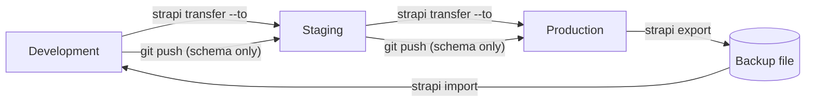

# Data Import, Export, and Migration

Moving data between Strapi environments - dev to staging, staging to production, exporting for backups - is a
recurring need. This page covers Strapi's built-in tools, custom import/export scripts, database migrations, and content
seeding.

## Strapi transfer (built-in)

Strapi 5 includes `strapi transfer` for moving data directly between two running instances. Use it when source and
destination run compatible project code, content-type schemas, plugins, and Strapi versions.

### Setup

The remote instance needs a transfer token: the **destination** needs one for a push, and the **source** needs one for a
pull.

1. In the admin panel: **Settings > Transfer Tokens > Create new Transfer Token**
2. Choose scope: **Push** (receive data) or **Full Access**
3. Copy the token

Transfer token hashes use the `TRANSFER_TOKEN_SALT` value from `config/admin.*`; keep that environment variable stable
for each environment so existing transfer tokens remain valid.

### Push data to another instance

```bash
# Transfer from local to remote
npx strapi transfer --to https://staging.example.com/admin \
  --to-token YOUR_TRANSFER_TOKEN
```

### Pull data from another instance

```bash
# Pull from remote to local
npx strapi transfer --from https://production.example.com/admin \
  --from-token YOUR_TRANSFER_TOKEN
```

> **Destructive operation:** `strapi transfer` replaces the destination data groups being transferred. Back up the
> destination first and use `--force` only in scripted workflows where you already have a backup.

### Options

```bash
# Only transfer specific content
npx strapi transfer --to https://staging.example.com/admin \
  --to-token TOKEN \
  --only content    # Only content entries; schemas are still checked

# Exclude specific data
npx strapi transfer --to https://staging.example.com/admin \
  --to-token TOKEN \
  --exclude files   # Don't transfer media files

# Slow down requests if a remote host or proxy is rate-limiting the transfer
npx strapi transfer --to https://staging.example.com/admin \
  --to-token TOKEN \
  --throttle 100
```

| Flag           | Values                       | Description                                            |
|----------------|------------------------------|--------------------------------------------------------|
| `--from`       | URL                          | Remote source URL for pulling into the local instance  |
| `--to`         | URL                          | Remote destination URL for pushing local data          |
| `--from-token` | token                        | Transfer token for the remote source                   |
| `--to-token`   | token                        | Transfer token for the remote destination              |
| `--only`       | `content`, `files`, `config` | Transfer only the listed data types                    |
| `--exclude`    | `content`, `files`, `config` | Exclude the listed data types                          |
| `--force`      | -                            | Skip destructive-operation confirmation prompts        |
| `--throttle`   | milliseconds                 | Add a delay between each transferred entity            |

`content` covers entries and relations, `files` covers Media Library assets, and `config` covers Strapi-managed project
configuration. Schema metadata is included for strict schema matching, but a transfer is not a replacement for
deploying code-level content-type and plugin changes. The transfer does **not** move admin users, API tokens, or
transfer tokens; deploy the same project code and plugin set to both environments first.

Media Library database records belong to `content`; `files` controls the binary assets. For example, `--exclude files`
does not remove media records from transferred content, but the records can point to assets that were not copied.

---

## Strapi export/import (file-based)

### Export to a tar archive

```bash
npx strapi export --file my-backup
# Creates my-backup.tar.gz.enc (encrypted by default)

# Without encryption
npx strapi export --file my-backup --no-encrypt

# Without gzip compression
npx strapi export --file my-backup --no-compress

# Reuse a known encryption key instead of the generated key
npx strapi export --file my-backup --key "$STRAPI_EXPORT_KEY"

# Only content
npx strapi export --file content-backup --no-encrypt --only content
```

### Import from archive

```bash
npx strapi import --file my-backup.tar.gz.enc
# Will prompt for the encryption key if encrypted

# Without encryption
npx strapi import --file my-backup.tar.gz

# Encrypted backup with a known key
npx strapi import --file my-backup.tar.gz.enc --key "$STRAPI_EXPORT_KEY"
```

`strapi import` is also destructive: it deletes the destination data groups being imported before loading the archive.
Groups left out with `--only` or `--exclude` are preserved. Keep imports for fresh environments, restore drills, or
well-tested maintenance windows.

| Flag            | Commands          | Description                                          |
|-----------------|-------------------|------------------------------------------------------|
| `--file`        | export, import    | Archive base name on export; archive path on import  |
| `--no-encrypt`  | export            | Write an unencrypted archive                         |
| `--no-compress` | export            | Write an uncompressed archive                        |
| `--key`         | export, import    | Encryption key to create or read encrypted archives  |
| `--only`        | export, import    | Include only `content`, `files`, and/or `config`     |
| `--exclude`     | export, import    | Exclude `content`, `files`, and/or `config`          |
| `--force`       | import            | Skip destructive-operation confirmation prompts      |

Export/import archives include content, Media Library files, Strapi-managed configuration, and schemas for matching.
The `--only` and `--exclude` values control `content`, `files`, and `config`; schemas are still exported for import
checks. Archives do not include admin users, API tokens, transfer tokens, or plugin source code. Import into a project
running the same Strapi version and matching schemas.

---

## Custom CSV/JSON import

For bulk importing content from external sources:

### JSON import service

```js
// src/api/import/services/import.js
const fs = require('fs');
const path = require('path');

module.exports = ({ strapi }) => ({

  async importFromJSON(filePath, uid, options = {}) {
    const {
      batchSize = 50,
      onProgress,
      dryRun = false,
      locale = 'en',
      items: preloadedItems,
    } = options;

    // Accept either a filePath or a preloaded items array
    const items = preloadedItems ?? JSON.parse(
      fs.readFileSync(path.resolve(filePath), 'utf-8')
    );

    const results = { created: 0, errors: 0, skipped: 0 };

    for (let i = 0; i < items.length; i += batchSize) {
      const batch = items.slice(i, i + batchSize);

      for (const item of batch) {
        try {
          // Check for duplicates (by slug or unique field)
          if (item.slug) {
            const existing = await strapi.documents(uid).findMany({
              filters: { slug: { $eq: item.slug } },
              locale,
              limit: 1,
            });

            if (existing.length > 0) {
              results.skipped++;
              continue;
            }
          }

          if (!dryRun) {
            await strapi.documents(uid).create({
              data: item,
              locale,
            });
          }

          results.created++;
        } catch (error) {
          results.errors++;
          strapi.log.error(`[import] Failed to import item: ${error.message}`, {
            item: item.title || item.name || JSON.stringify(item).substring(0, 100),
          });
        }
      }

      if (onProgress) {
        onProgress({
          processed: Math.min(i + batchSize, items.length),
          total: items.length,
          ...results,
        });
      }
    }

    return results;
  },
});
```

### CSV import service

```js
// src/api/import/services/csv-import.js
const fs = require('fs');
const path = require('path');

function parseCSV(content, delimiter = ',') {
  const lines = content.split('\n').filter(line => line.trim());
  const headers = lines[0].split(delimiter).map(h => h.trim().replace(/^"|"$/g, ''));

  return lines.slice(1).map(line => {
    // Handle quoted fields with commas inside
    const values = [];
    let current = '';
    let inQuotes = false;

    for (const char of line) {
      if (char === '"') {
        inQuotes = !inQuotes;
      } else if (char === delimiter && !inQuotes) {
        values.push(current.trim());
        current = '';
      } else {
        current += char;
      }
    }
    values.push(current.trim());

    const obj = {};
    headers.forEach((header, i) => {
      let value = values[i] || '';
      // Auto-convert types
      if (value === 'true') value = true;
      else if (value === 'false') value = false;
      else if (/^\d+$/.test(value)) value = parseInt(value, 10);
      else if (/^\d+\.\d+$/.test(value)) value = parseFloat(value);

      obj[header] = value;
    });

    return obj;
  });
}

module.exports = ({ strapi }) => ({
  async importCSV(filePath, uid, options = {}) {
    const content = fs.readFileSync(path.resolve(filePath), 'utf-8');
    const items = parseCSV(content, options.delimiter || ',');

    strapi.log.info(`[csv-import] Parsed ${items.length} rows from ${filePath}`);

    return strapi.service('api::import.import').importFromJSON(
      null,  // We pass items directly via options.items
      uid,
      { ...options, items }
    );
  },
});
```

### Import controller and route

```js
// src/api/import/controllers/import.js
module.exports = {
  async importJSON(ctx) {
    const { uid, locale } = ctx.request.body;

    if (!ctx.request.files?.file) {
      return ctx.badRequest('No file uploaded');
    }

    const filePath = ctx.request.files.file.filepath || ctx.request.files.file.path;

    const result = await strapi.service('api::import.import').importFromJSON(
      filePath,
      uid,
      { locale, dryRun: ctx.query.dryRun === 'true' }
    );

    return { data: result };
  },
};

// src/api/import/routes/import.js
module.exports = {
  routes: [
    {
      method: 'POST',
      path: '/import/json',
      handler: 'api::import.import.importJSON',
      config: {
        policies: [
          { name: 'global::has-role', config: { roles: ['admin'] } },
        ],
      },
    },
  ],
};
```

---

## Custom export

```js
// src/api/export/services/export.js
module.exports = ({ strapi }) => ({

  async exportToJSON(uid, options = {}) {
    const { locale, status = 'published', fields, populate } = options;
    const pageSize = 100;
    const documents = [];
    let start = 0;

    while (true) {
      const batch = await strapi.documents(uid).findMany({
        locale,
        status,
        fields,
        populate: populate || '*',
        start,
        limit: pageSize,
      });

      documents.push(...batch);

      if (batch.length < pageSize) {
        break;
      }

      start += pageSize;
    }

    return documents;
  },

  async exportAllTypes(options = {}) {
    const contentTypes = [
      'api::article.article',
      'api::page.page',
      'api::author.author',
      'api::tag.tag',
    ];

    const export_data = {};

    for (const uid of contentTypes) {
      const typeName = uid.split('.').pop();
      export_data[typeName] = await this.exportToJSON(uid, options);
      strapi.log.info(`[export] Exported ${export_data[typeName].length} ${typeName} entries`);
    }

    return export_data;
  },
});
```

---

## Database migrations

For schema changes that go beyond what the Content-Type Builder handles, create a file manually in
`database/migrations/`. Strapi runs pending migration files once at startup, before schema sync.

```js
// database/migrations/2025.01.15T00.00.00.add-reading-time.js
'use strict';

module.exports = {
  async up(knex) {
    // Add a new column
    const hasColumn = await knex.schema.hasColumn('articles', 'reading_time');
    if (!hasColumn) {
      await knex.schema.alterTable('articles', (table) => {
        table.integer('reading_time').defaultTo(0);
      });
    }

    // Backfill data
    const articles = await knex('articles').select('id', 'content');
    for (const article of articles) {
      if (article.content) {
        const words = article.content.split(/\s+/).length;
        const readingTime = Math.ceil(words / 200);
        await knex('articles')
          .where('id', article.id)
          .update({ reading_time: readingTime });
      }
    }
  },
};
```

Strapi 5 migrations do not support `down()` rollbacks. Restore from a backup or write a new forward migration if you
need to undo a change.

### Data-only migration (no schema change)

```js
// database/migrations/2025.02.01T00.00.00.normalize-slugs.js
module.exports = {
  async up(knex) {
    const articles = await knex('articles').select('id', 'slug');

    for (const article of articles) {
      const normalized = article.slug
        .toLowerCase()
        .replace(/[^a-z0-9-]/g, '-')
        .replace(/-+/g, '-')
        .replace(/^-|-$/g, '');

      if (normalized !== article.slug) {
        await knex('articles')
          .where('id', article.id)
          .update({ slug: normalized });
      }
    }
  },
};
```

---

## Content seeding

Populate a fresh database with initial content:

```js
// src/index.ts (or .js)
module.exports = {
  async bootstrap({ strapi }) {
    // Only seed if the database is empty
    const articleCount = await strapi.documents('api::article.article').count();

    if (articleCount === 0) {
      strapi.log.info('[seed] Seeding initial content...');

      // Create tags
      const tags = ['JavaScript', 'TypeScript', 'React', 'Node.js'];
      const createdTags = [];

      for (const name of tags) {
        const tag = await strapi.documents('api::tag.tag').create({
          data: {
            name,
            slug: name.toLowerCase().replace(/[^a-z0-9]+/g, '-'),
          },
        });
        createdTags.push(tag);
      }

      // Create a sample article
      await strapi.documents('api::article.article').create({
        data: {
          title: 'Getting Started',
          slug: 'getting-started',
          content: '<p>Welcome to our blog!</p>',
          featured: true,
          tags: {
            connect: createdTags.slice(0, 2).map(t => t.documentId),
          },
        },
      });

      strapi.log.info('[seed] Seeding complete');
    }
  },
};
```

### Seed from a JSON file

```js
async bootstrap({ strapi }) {
  const articleCount = await strapi.documents('api::article.article').count();

  if (articleCount === 0) {
    const seedData = require('./seed-data/articles.json');

    for (const article of seedData) {
      await strapi.documents('api::article.article').create({
        data: article,
      });
    }

    strapi.log.info(`[seed] Created ${seedData.length} articles`);
  }
},
```

---

## Environment sync workflow


```mermaid
flowchart LR
    Dev["Development"]
    Staging["Staging"]
    Prod["Production"]

    Prod -->|"strapi export"| Backup[(Backup file)]
    Backup -->|"strapi import"| Dev

    Dev -->|"strapi transfer --to"| Staging
    Staging -->|"strapi transfer --to"| Prod

    Dev -->|"git push (schema only)"| Staging
    Staging -->|"git push (schema only)"| Prod
```

**Best practice**: push schema changes via Git, transfer content via `strapi transfer` or import/export.

---

## Backup strategy

```bash
#!/bin/bash
# backup.sh - run daily via cron
DATE=$(date +%Y%m%d)
BACKUP_DIR="/backups/strapi"

# Database backup
pg_dump -h localhost -U strapi strapi_db | gzip > "$BACKUP_DIR/db-$DATE.sql.gz"

# Strapi export (includes content + config)
cd /srv/strapi
npx strapi export --file "$BACKUP_DIR/strapi-$DATE" --no-encrypt

# Upload to S3
aws s3 cp "$BACKUP_DIR/db-$DATE.sql.gz" s3://my-backups/strapi/
aws s3 cp "$BACKUP_DIR/strapi-$DATE.tar.gz" s3://my-backups/strapi/

# Clean up local backups older than 7 days
find "$BACKUP_DIR" -type f -mtime +7 -delete
```

---

## Common pitfalls

| Pitfall                           | Problem                              | Fix                                                    |
|-----------------------------------|--------------------------------------|--------------------------------------------------------|
| Transfer without matching schemas | Data import fails or corrupts        | Deploy schema changes first, then transfer content     |
| Expecting rollback migrations     | Strapi 5 only runs forward `up()`    | Restore backup or write a new forward migration        |
| Seeding in production             | Overwrites real data                 | Guard with `if (count === 0)` or env check             |
| CSV encoding issues               | Special characters corrupt on import | Use UTF-8 BOM or specify encoding explicitly           |
| Importing relations by ID         | IDs differ between environments      | Import by slug or unique field, then resolve relations |
| No backup before import           | Data loss if import goes wrong       | Always backup before destructive operations            |

---

## See also

- [Configuration and Deployment](./configuration-and-deployment.md) - database and environment setup
- [Lifecycle Hooks](./lifecycle-hooks.md) - triggering logic after import operations
- [Custom Controllers and Services](./custom-controllers-services.md) - building import/export endpoints
