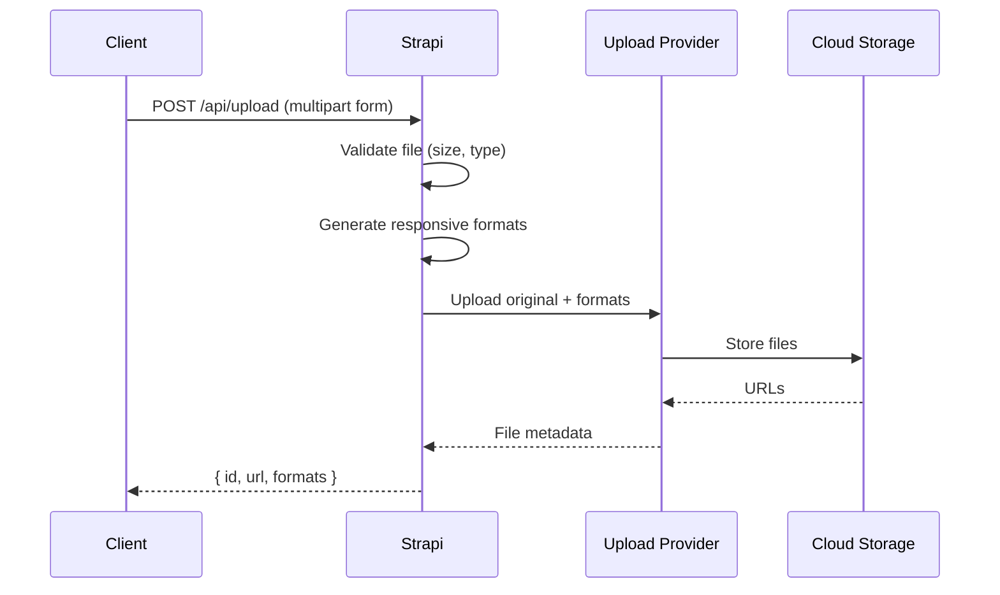

# File Uploads and Media

Strapi's Upload plugin handles file storage, image processing, and media management. By default, files are stored locally, but production deployments should use cloud providers like S3 or Cloudinary.

## Upload flow



---

## Basic file upload

### REST API

```js
const formData = new FormData();
formData.append('files', fileInput.files[0]);

const response = await fetch('/api/upload', {
  method: 'POST',
  headers: {
    Authorization: `Bearer ${jwt}`,
  },
  body: formData,
});

const [uploadedFile] = await response.json();
console.log(uploadedFile.url);
```

### Upload with relation to a content entry

```js
const formData = new FormData();
formData.append('files', fileInput.files[0]);
formData.append('ref', 'api::article.article');       // content type UID
formData.append('refId', 'documentId123');             // document ID
formData.append('field', 'cover');                     // field name

const response = await fetch('/api/upload', {
  method: 'POST',
  headers: { Authorization: `Bearer ${jwt}` },
  body: formData,
});
```

### Multiple file upload

```js
const formData = new FormData();
for (const file of fileInput.files) {
  formData.append('files', file);
}

const response = await fetch('/api/upload', {
  method: 'POST',
  headers: { Authorization: `Bearer ${jwt}` },
  body: formData,
});

const uploadedFiles = await response.json();
```

---

## Upload providers

### Local (default, development only)

Files are stored in `./public/uploads/`. This is the default and requires no configuration.

### AWS S3

```bash
npm install @strapi/provider-upload-aws-s3
```

```js
// config/plugins.js
module.exports = ({ env }) => ({
  upload: {
    config: {
      provider: 'aws-s3',
      providerOptions: {
        s3Options: {
          credentials: {
            accessKeyId: env('AWS_ACCESS_KEY_ID'),
            secretAccessKey: env('AWS_ACCESS_SECRET'),
          },
          region: env('AWS_REGION', 'eu-central-1'),
          params: {
            Bucket: env('AWS_BUCKET'),
            ACL: env('AWS_ACL', 'public-read'),
          },
        },
      },
      actionOptions: {
        upload: {},
        uploadStream: {},
        delete: {},
      },
    },
  },
});
```

### Cloudinary

```bash
npm install @strapi/provider-upload-cloudinary
```

```js
// config/plugins.js
module.exports = ({ env }) => ({
  upload: {
    config: {
      provider: 'cloudinary',
      providerOptions: {
        cloud_name: env('CLOUDINARY_NAME'),
        api_key: env('CLOUDINARY_KEY'),
        api_secret: env('CLOUDINARY_SECRET'),
      },
      actionOptions: {
        upload: {
          folder: env('CLOUDINARY_FOLDER', 'strapi'),
        },
        uploadStream: {
          folder: env('CLOUDINARY_FOLDER', 'strapi'),
        },
        delete: {},
      },
    },
  },
});
```

### S3-compatible (MinIO, DigitalOcean Spaces, Backblaze B2)

```js
module.exports = ({ env }) => ({
  upload: {
    config: {
      provider: 'aws-s3',
      providerOptions: {
        s3Options: {
          credentials: {
            accessKeyId: env('S3_ACCESS_KEY'),
            secretAccessKey: env('S3_SECRET_KEY'),
          },
          endpoint: env('S3_ENDPOINT'),  // e.g., https://minio.example.com
          region: env('S3_REGION', 'us-east-1'),
          params: {
            Bucket: env('S3_BUCKET'),
          },
          forcePathStyle: true, // Required for MinIO
        },
      },
    },
  },
});
```

---

## Image optimization and responsive formats

Strapi automatically generates responsive image formats using [Sharp](https://sharp.pixelplumbing.com/):

| Format | Max width | Default |
|--------|-----------|---------|
| `thumbnail` | 245px | Enabled |
| `small` | 500px | Enabled |
| `medium` | 750px | Enabled |
| `large` | 1000px | Enabled |

### Customizing breakpoints

```js
// config/plugins.js
module.exports = () => ({
  upload: {
    config: {
      breakpoints: {
        xlarge: 1920,
        large: 1200,
        medium: 768,
        small: 480,
        thumbnail: 200,
      },
      // Limit file size (in bytes)
      sizeLimit: 10 * 1024 * 1024, // 10 MB
    },
  },
});
```

### Using responsive images in the frontend

```jsx
function ResponsiveImage({ image }) {
  const { url, formats, alternativeText, width, height } = image;

  return (
    <picture>
      {formats?.large && (
        <source media="(min-width: 1000px)" srcSet={formats.large.url} />
      )}
      {formats?.medium && (
        <source media="(min-width: 750px)" srcSet={formats.medium.url} />
      )}
      {formats?.small && (
        <source media="(min-width: 500px)" srcSet={formats.small.url} />
      )}
      
    </picture>
  );
}
```

---

## Upload validation

### File type restrictions

Set allowed MIME types per media field in the Content-Type Builder, or validate in a lifecycle hook:

```js
// src/index.js
module.exports = {
  register({ strapi }) {
    strapi.documents.use(async (context, next) => {
      if (context.uid === 'plugin::upload.file' && context.action === 'create') {
        const { mime } = context.params.data || {};
        const allowedMimes = [
          'image/jpeg',
          'image/png',
          'image/webp',
          'image/svg+xml',
          'application/pdf',
        ];

        if (mime && !allowedMimes.includes(mime)) {
          throw new Error(`File type ${mime} is not allowed`);
        }
      }

      return next();
    });
  },
};
```

### File size limits

```js
// config/middlewares.js
module.exports = [
  // ...
  {
    name: 'strapi::body',
    config: {
      formLimit: '50mb',    // Form data limit
      jsonLimit: '50mb',    // JSON body limit
      textLimit: '50mb',    // Text body limit
      formidable: {
        maxFileSize: 20 * 1024 * 1024, // 20 MB per file
      },
    },
  },
  // ...
];
```

---

## Media library API

### List all files

```bash
GET /api/upload/files
GET /api/upload/files?filters[mime][$contains]=image
```

### Get a single file

```bash
GET /api/upload/files/:id
```

### Delete a file

```bash
DELETE /api/upload/files/:id
```

### Update file info (alt text, caption)

```js
const formData = new FormData();
formData.append('fileInfo', JSON.stringify({
  alternativeText: 'A sunset over the mountains',
  caption: 'Photo taken in the Alps',
  name: 'alps-sunset',
}));

await fetch(`/api/upload?id=${fileId}`, {
  method: 'POST',
  headers: { Authorization: `Bearer ${jwt}` },
  body: formData,
});
```

---

## Folder management

Strapi 5 supports media folders for organization:

```bash
# List folders
GET /api/upload/folders

# Create a folder
POST /api/upload/folders
{ "name": "Blog Images", "parent": null }

# Upload to a specific folder
const formData = new FormData();
formData.append('files', file);
formData.append('path', '/Blog Images');  # or folder ID
```

---

## Security considerations for media

- **Validate uploads server-side**: never trust client-side MIME type alone
- **Scan for malware**: consider integrating ClamAV for user-uploaded content
- **Use a CDN**: serve media through a CDN for performance and DDoS protection
- **Set proper CORS**: restrict which domains can embed your media
- **Generate signed URLs**: for private media, use pre-signed S3 URLs with expiration

---

## Common pitfalls

| Pitfall | Problem | Fix |
|---------|---------|-----|
| Local uploads in production | Files lost on redeploy, no CDN | Use S3 or Cloudinary |
| Missing `PUBLIC_URL` | Media URLs point to localhost | Set the correct public URL |
| No `forcePathStyle` for MinIO | S3 client tries virtual-hosted-style URLs | Set `forcePathStyle: true` |
| Huge image uploads | Memory spikes, slow responses | Set `sizeLimit` and compress client-side first |
| No alt text | Accessibility and SEO suffer | Require `alternativeText` in your frontend upload form |

---

## See also

- [Configuration and Deployment](configuration-and-deployment.md) -- provider environment config
- [Custom Controllers and Services](custom-controllers-services.md) -- custom upload endpoints
- [Lifecycle Hooks](lifecycle-hooks.md) -- post-upload processing
