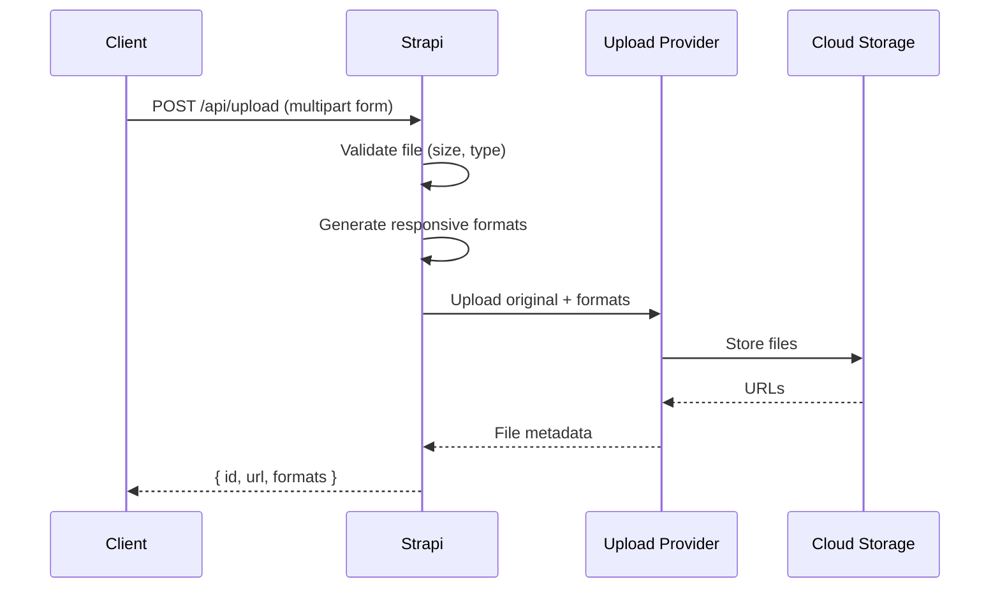

# File Uploads and Media

Strapi's Upload plugin handles file storage, image processing, and media management. By default, files are stored
locally, but production deployments should use cloud providers like S3 or Cloudinary.

## Upload flow


```mermaid
sequenceDiagram
    participant Client
    participant Strapi
    participant Provider as Upload Provider
    participant Storage as Cloud Storage

    Client->>Strapi: POST /api/upload (multipart form)
    Strapi->>Strapi: Validate file (size, type)
    Strapi->>Strapi: Generate responsive formats
    Strapi->>Provider: Upload original + formats
    Provider->>Storage: Store files
    Storage-->>Provider: URLs
    Provider-->>Strapi: File metadata
    Strapi-->>Client: { id, url, formats }
```

---

## Basic file upload

### REST API

```js
const formData = new FormData();
formData.append('files', fileInput.files[0]);

const response = await fetch('/api/upload', {
  method: 'POST',
  headers: {
    Authorization: 'Bearer <api-token>',
  },
  body: formData,
});

const [uploadedFile] = await response.json();
console.log(uploadedFile.url);
```

### Upload with relation to a content entry

```js
const formData = new FormData();
formData.append('files', fileInput.files[0]);
formData.append('ref', 'api::article.article');       // content type UID
formData.append('refId', 'documentId123');             // entry documentId
formData.append('field', 'cover');                     // field name

const response = await fetch('/api/upload', {
  method: 'POST',
  headers: { Authorization: 'Bearer <api-token>' },
  body: formData,
});
```

### Multiple file upload

```js
const formData = new FormData();
for (const file of fileInput.files) {
  formData.append('files', file);
}

const response = await fetch('/api/upload', {
  method: 'POST',
  headers: { Authorization: 'Bearer <api-token>' },
  body: formData,
});

const uploadedFiles = await response.json();
```

---

## Upload providers

### Local (default, development only)

Files are stored in `./public/uploads/`. This is the default and requires no configuration.

### AWS S3

```bash
npm install @strapi/provider-upload-aws-s3
```

```js
// config/plugins.js
module.exports = ({ env }) => ({
  upload: {
    config: {
      provider: 'aws-s3',
      providerOptions: {
        baseUrl: env('CDN_URL'),
        rootPath: env('CDN_ROOT_PATH'),
        s3Options: {
          credentials: {
            accessKeyId: env('AWS_ACCESS_KEY_ID'),
            secretAccessKey: env('AWS_ACCESS_SECRET'),
          },
          region: env('AWS_REGION', 'eu-central-1'),
          params: {
            Bucket: env('AWS_BUCKET'),
            ACL: env('AWS_ACL', 'public-read'),
            signedUrlExpires: env.int('AWS_SIGNED_URL_EXPIRES', 15 * 60),
          },
        },
      },
      actionOptions: {
        upload: {},
        uploadStream: {},
        delete: {},
      },
    },
  },
});
```

### Cloudinary

```bash
npm install @strapi/provider-upload-cloudinary
```

```js
// config/plugins.js
module.exports = ({ env }) => ({
  upload: {
    config: {
      provider: 'cloudinary',
      providerOptions: {
        cloud_name: env('CLOUDINARY_NAME'),
        api_key: env('CLOUDINARY_KEY'),
        api_secret: env('CLOUDINARY_SECRET'),
      },
      actionOptions: {
        upload: {
          folder: env('CLOUDINARY_FOLDER', 'strapi'),
        },
        uploadStream: {
          folder: env('CLOUDINARY_FOLDER', 'strapi'),
        },
        delete: {},
      },
    },
  },
});
```

### S3-compatible (MinIO, DigitalOcean Spaces, Backblaze B2)

```js
module.exports = ({ env }) => ({
  upload: {
    config: {
      provider: 'aws-s3',
      providerOptions: {
        s3Options: {
          credentials: {
            accessKeyId: env('S3_ACCESS_KEY'),
            secretAccessKey: env('S3_SECRET_KEY'),
          },
          endpoint: env('S3_ENDPOINT'),  // e.g., https://minio.example.com
          region: env('S3_REGION', 'us-east-1'),
          params: {
            Bucket: env('S3_BUCKET'),
          },
          forcePathStyle: true, // Required for MinIO
        },
      },
    },
  },
});
```

### Content Security Policy for remote media

When the admin panel loads thumbnails from S3, Cloudinary, or a CDN, allow the provider host in `strapi::security`.

```js
// config/middlewares.js
module.exports = [
  // ...
  {
    name: 'strapi::security',
    config: {
      contentSecurityPolicy: {
        useDefaults: true,
        directives: {
          'connect-src': ["'self'", 'https:'],
          'img-src': ["'self'", 'data:', 'blob:', 'market-assets.strapi.io', 'res.cloudinary.com', 'cdn.example.com'],
          'media-src': ["'self'", 'data:', 'blob:', 'market-assets.strapi.io', 'res.cloudinary.com', 'cdn.example.com'],
          upgradeInsecureRequests: null,
        },
      },
    },
  },
  // ...
];
```

---

## Image optimization and responsive formats

When the Media Library's **Responsive friendly upload** setting is enabled, Strapi generates responsive image formats
using [Sharp](https://sharp.pixelplumbing.com/):

| Format   | Max width | Default |
|----------|-----------|---------|
| `small`  | 500px     | Enabled |
| `medium` | 750px     | Enabled |
| `large`  | 1000px    | Enabled |

### Customizing breakpoints

```js
// config/plugins.js
module.exports = () => ({
  upload: {
    config: {
      breakpoints: {
        xlarge: 1920,
        large: 1200,
        medium: 768,
        small: 480,
        xsmall: 64,
      },
      // Limit file size (in bytes)
      sizeLimit: 10 * 1024 * 1024, // 10 MB
    },
  },
});
```

### Using responsive images in the frontend

```jsx
function ResponsiveImage({ image }) {
  const { url, formats, alternativeText, width, height } = image;

  return (
    <picture>
      {formats?.large && (
        <source media="(min-width: 1000px)" srcSet={formats.large.url} />
      )}
      {formats?.medium && (
        <source media="(min-width: 750px)" srcSet={formats.medium.url} />
      )}
      {formats?.small && (
        <source media="(min-width: 500px)" srcSet={formats.small.url} />
      )}
      
    </picture>
  );
}
```

---

## Upload validation

### File type restrictions

Set allowed MIME types per media field in the Content-Type Builder. For global upload rules, configure the Upload
plugin's MIME-type checks in `config/plugins.js`:

```js
// config/plugins.js
module.exports = ({ env }) => ({
  upload: {
    config: {
      security: {
        allowedTypes: [
          'image/jpeg',
          'image/png',
          'image/webp',
          'application/pdf',
        ],
        deniedTypes: [
          'image/svg+xml',
          'text/html',
          'application/javascript',
        ],
      },
    },
  },
});
```

For business-specific rules, add Document Service middleware for the Upload plugin file content type:

```js
// src/index.js
module.exports = {
  register({ strapi }) {
    strapi.documents.use(async (context, next) => {
      if (context.uid === 'plugin::upload.file' && context.action === 'create') {
        const { mime } = context.params.data || {};
        const allowedMimes = [
          'image/jpeg',
          'image/png',
          'image/webp',
          'image/svg+xml',
          'application/pdf',
        ];

        if (mime && !allowedMimes.includes(mime)) {
          throw new Error(`File type ${mime} is not allowed`);
        }
      }

      return next();
    });
  },
};
```

### File size limits

Use both limits: `upload.config.sizeLimit` is the Upload plugin limit, while `strapi::body` controls the multipart
parser before the Upload plugin receives the file.

```js
// config/plugins.js
module.exports = () => ({
  upload: {
    config: {
      sizeLimit: 10 * 1024 * 1024, // 10 MB
    },
  },
});
```

```js
// config/middlewares.js
module.exports = [
  // ...
  {
    name: 'strapi::body',
    config: {
      formLimit: '50mb',    // Form data limit
      jsonLimit: '50mb',    // JSON body limit
      textLimit: '50mb',    // Text body limit
      formidable: {
        maxFileSize: 20 * 1024 * 1024, // 20 MB per file
      },
    },
  },
  // ...
];
```

---

## Upload security

### Private media on S3

For private blog assets, keep the bucket private and configure the AWS S3 upload provider with `ACL: 'private'`.
Strapi's S3 provider exposes `isPrivate()` when the provider ACL is private and returns presigned URLs from
`getSignedUrl`, using `signedUrlExpires` as the expiration time.

```js
// config/plugins.js
module.exports = ({ env }) => ({
  upload: {
    config: {
      provider: 'aws-s3',
      providerOptions: {
        s3Options: {
          credentials: {
            accessKeyId: env('AWS_ACCESS_KEY_ID'),
            secretAccessKey: env('AWS_ACCESS_SECRET'),
          },
          region: env('AWS_REGION'),
          params: {
            Bucket: env('AWS_BUCKET'),
            ACL: 'private',
            signedUrlExpires: env.int('AWS_SIGNED_URL_EXPIRES', 15 * 60),
          },
        },
      },
    },
  },
});
```

Do not combine private objects with a public bucket policy. If you use CloudFront, use CloudFront signed URLs or a
private origin access setup instead of making the bucket public.

### S3 CSP and bucket CORS

Allow the S3 or CDN domain in `img-src` and `media-src`; see
[Content Security Policy for remote media](#content-security-policy-for-remote-media) for the Strapi middleware
example. S3 bucket CORS is still needed when the browser loads admin thumbnails or downloads private signed URLs. Admin
uploads themselves go through the Strapi server, not directly from the browser to S3.

```json
[
  {
    "AllowedHeaders": ["*"],
    "AllowedMethods": ["GET", "HEAD"],
    "AllowedOrigins": [
      "https://cms.example.com",
      "https://www.example.com"
    ],
    "ExposeHeaders": [],
    "MaxAgeSeconds": 3000
  }
]
```

Use exact origins in production. Avoid `"*"` when media is private or when signed URLs are used.

### Who may upload

The Upload plugin has public API permissions in the Users & Permissions plugin. In **Settings > Users & Permissions
Plugin > Roles**, disable the `upload` actions for the **Public** role and enable them only for trusted authenticated
roles that need frontend uploads. Admin panel uploads are controlled by admin roles and permissions separately.

### Malware scanning pattern

Strapi does not ship with malware scanning. Add it as a custom workflow around uploads. For example, use Document
Service middleware for `plugin::upload.file` to scan or quarantine files with ClamAV after metadata is created:

```js
// src/index.js
module.exports = {
  register({ strapi }) {
    strapi.documents.use(async (context, next) => {
      const result = await next();

      if (
        context.uid === 'plugin::upload.file' &&
        context.action === 'create'
      ) {
        const file = Array.isArray(result) ? result[0] : result;

        // Example only: implement downloadFromProvider() and scanWithClamAv()
        // for your storage provider and deployment model.
        const localPath = await downloadFromProvider(file);
        const clean = await scanWithClamAv(localPath);

        if (!clean) {
          await strapi.documents('plugin::upload.file').delete({
            documentId: file.documentId,
          });
          throw new Error('Upload failed malware scanning.');
        }
      }

      return result;
    });
  },
};
```

For high-volume sites, queue the scan, mark files as `pending_scan`, and keep them out of API responses until the scan
passes.

### Per-user quotas

If authenticated visitors can upload media, enforce quotas in a policy or custom upload wrapper before accepting the
file. Store ownership explicitly, then sum the user's stored file sizes before allowing another upload:

```js
// src/policies/within-upload-quota.js
module.exports = async (policyContext, config, { strapi }) => {
  const user = policyContext.state.user;

  if (!user) {
    return false;
  }

  const used = await strapi
    .service('api::upload-quota.upload-quota')
    .bytesUsedByUser(user.id);

  const incoming = Number(policyContext.request.length || 0);
  const quota = 100 * 1024 * 1024; // 100 MB

  return used + incoming <= quota;
};
```

Apply the same check in any custom upload endpoint, because client-side limits are easy to bypass.

### SVG and HTML XSS risk

Treat SVG, HTML, and scriptable document formats as active content. An uploaded SVG can contain scripts, external
references, or event handlers, and an uploaded HTML file can execute in a user's browser if served inline. Prefer
denying `image/svg+xml`, `text/html`, and JavaScript MIME types with `security.deniedTypes`. If the business must accept
SVG, sanitize it server-side and serve it from a separate domain with restrictive headers.

---

## Media library API

### List all files

```bash
GET /api/upload/files
GET /api/upload/files/page?filters[mime][$startsWith]=image/
```

### Get a single file

```bash
GET /api/upload/files/:id
```

### Delete a file

```bash
DELETE /api/upload/files/:id
```

### Update file info (alt text, caption)

```js
const formData = new FormData();
formData.append('fileInfo', JSON.stringify({
  alternativeText: 'A sunset over the mountains',
  caption: 'Photo taken in the Alps',
  name: 'alps-sunset',
}));

await fetch(`/api/upload?id=${fileId}`, {
  method: 'POST',
  headers: { Authorization: 'Bearer <api-token>' },
  body: formData,
});
```

---

## Folder management

Strapi 5's Media Library folders are an **admin panel feature only** - they are not part of the
public REST or GraphQL API. Files uploaded programmatically via `POST /api/upload` always land in
the auto-created "API Uploads" folder; there is no `path` or folder-ID field on that endpoint to
redirect them elsewhere. To organize uploaded files into folders, move them afterward through the
admin panel's Media Library UI, or use a community plugin that adds folder-aware upload endpoints.

---

## Security considerations for media

- **Validate uploads server-side**: use Upload plugin `security.allowedTypes` and `security.deniedTypes`
- **Limit size twice**: set both Upload plugin `sizeLimit` and `strapi::body` `formidable.maxFileSize`
- **Restrict upload permissions**: do not allow the Public role to upload unless the endpoint is intentionally public
- **Scan untrusted files**: integrate a scanner such as ClamAV before publishing user uploads
- **Use private storage for private media**: private S3 buckets need presigned URLs and tight CORS/CSP
- **Deny active content**: SVG and HTML uploads can become XSS vectors if served inline

---

## Common pitfalls

| Pitfall                       | Problem                                   | Fix                                                    |
|-------------------------------|-------------------------------------------|--------------------------------------------------------|
| Local uploads in production   | Files lost on redeploy, no CDN            | Use S3 or Cloudinary                                   |
| Missing `PUBLIC_URL`          | Media URLs point to localhost             | Set the correct public URL                             |
| No `forcePathStyle` for MinIO | S3 client tries virtual-hosted-style URLs | Set `forcePathStyle: true`                             |
| Huge image uploads            | Memory spikes, slow responses             | Set `sizeLimit` and compress client-side first         |
| No alt text                   | Accessibility and SEO suffer              | Require `alternativeText` in your frontend upload form |

---

## See also

- [Configuration and Deployment](configuration-and-deployment.md) - provider environment config
- [Custom Controllers and Services](custom-controllers-services.md) - custom upload endpoints
- [Lifecycle Hooks](lifecycle-hooks.md) - post-upload processing
