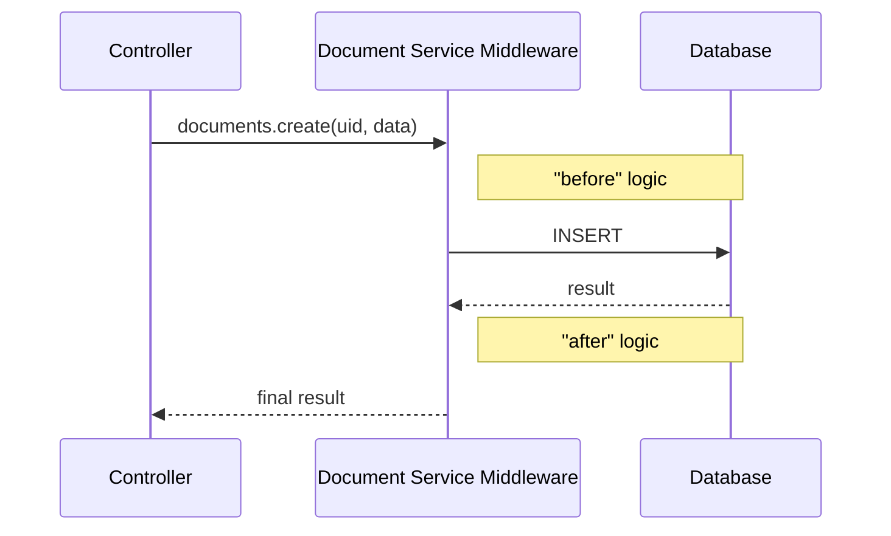

# Lifecycle Hooks

Lifecycle hooks run automatically before or after database operations. They are the right place for auto-computed fields, audit logging, cache invalidation, and side effects that should always happen regardless of which controller triggers the operation.

## Document Service middleware as lifecycle hooks

In Strapi 5, lifecycle hooks are implemented as **Document Service middleware**. They intercept calls on the Document Service API.



### Registration

Register all document service middleware in `src/index.js` (or `src/index.ts`):

```js
// src/index.js
module.exports = {
  register({ strapi }) {
    // Register middleware here
    strapi.documents.use(async (context, next) => {
      // runs for ALL content types and ALL actions
      const result = await next();
      return result;
    });
  },
};
```

### The context object

Every middleware receives a `context` with:

| Property | Type | Description |
|----------|------|-------------|
| `uid` | `string` | Content type UID (e.g., `api::article.article`) |
| `action` | `string` | Method name: `findOne`, `findMany`, `create`, `update`, `delete`, `publish`, `unpublish` |
| `params` | `object` | The parameters passed to the method (data, filters, populate, etc.) |
| `contentType` | `object` | Full content type schema |

---

## Practical examples

### Auto-generate slugs before create/update

```js
// src/index.js
module.exports = {
  register({ strapi }) {
    strapi.documents.use(async (context, next) => {
      if (context.uid !== 'api::article.article') {
        return next();
      }

      if (['create', 'update'].includes(context.action)) {
        const title = context.params.data?.title;

        if (title) {
          context.params.data.slug = title
            .toLowerCase()
            .replace(/[äöü]/g, (c) => ({ ä: 'ae', ö: 'oe', ü: 'ue' }[c]))
            .replace(/[^a-z0-9]+/g, '-')
            .replace(/^-|-$/g, '');
        }
      }

      return next();
    });
  },
};
```

### Audit log: track who changed what

```js
// src/index.js
const auditableTypes = [
  'api::article.article',
  'api::page.page',
  'api::product.product',
];

module.exports = {
  register({ strapi }) {
    strapi.documents.use(async (context, next) => {
      if (!auditableTypes.includes(context.uid)) {
        return next();
      }

      if (!['create', 'update', 'delete'].includes(context.action)) {
        return next();
      }

      const result = await next();

      // Log the change asynchronously (don't block the response)
      setImmediate(async () => {
        try {
          await strapi.documents('api::audit-log.audit-log').create({
            data: {
              contentType: context.uid,
              action: context.action,
              documentId: context.params.documentId || result?.documentId,
              data: JSON.stringify(context.params.data || {}),
              timestamp: new Date().toISOString(),
            },
          });
        } catch (error) {
          strapi.log.error('Audit log failed:', error);
        }
      });

      return result;
    });
  },
};
```

### Validate data before create

```js
module.exports = {
  register({ strapi }) {
    strapi.documents.use(async (context, next) => {
      if (context.uid === 'api::product.product' && context.action === 'create') {
        const { price, name } = context.params.data || {};

        if (!name || name.trim().length < 2) {
          throw new Error('Product name must be at least 2 characters');
        }

        if (price !== undefined && price < 0) {
          throw new Error('Price cannot be negative');
        }
      }

      return next();
    });
  },
};
```

### Cache invalidation after mutations

```js
const Redis = require('ioredis');
const redis = new Redis(process.env.REDIS_URL);

module.exports = {
  register({ strapi }) {
    strapi.documents.use(async (context, next) => {
      const result = await next();

      // Invalidate cache after any write operation
      if (['create', 'update', 'delete', 'publish', 'unpublish'].includes(context.action)) {
        const pattern = `strapi:${context.uid}:*`;

        const keys = await redis.keys(pattern);
        if (keys.length > 0) {
          await redis.del(...keys);
          strapi.log.debug(`Invalidated ${keys.length} cache entries for ${context.uid}`);
        }
      }

      return result;
    });
  },
};
```

### Send email on publish

```js
module.exports = {
  register({ strapi }) {
    strapi.documents.use(async (context, next) => {
      const result = await next();

      if (
        context.uid === 'api::article.article' &&
        context.action === 'publish'
      ) {
        setImmediate(async () => {
          try {
            const article = await strapi.documents('api::article.article').findOne(
              result.documentId,
              { populate: ['author'] }
            );

            if (article?.author?.email) {
              await strapi.plugins['email'].services.email.send({
                to: article.author.email,
                subject: `Your article "${article.title}" has been published!`,
                html: `<p>Your article is now live. <a href="https://example.com/articles/${article.slug}">View it here</a>.</p>`,
              });
            }
          } catch (err) {
            strapi.log.error('Publish notification failed:', err);
          }
        });
      }

      return result;
    });
  },
};
```

### Compute fields after create/update

```js
module.exports = {
  register({ strapi }) {
    strapi.documents.use(async (context, next) => {
      const result = await next();

      if (
        context.uid === 'api::article.article' &&
        ['create', 'update'].includes(context.action)
      ) {
        const content = result?.content || '';
        const wordCount = content.split(/\s+/).filter(Boolean).length;
        const readingTime = Math.ceil(wordCount / 200);

        // Update silently without re-triggering middleware
        await strapi.db.query('api::article.article').update({
          where: { documentId: result.documentId },
          data: { readingTime, wordCount },
        });
      }

      return result;
    });
  },
};
```

---

## Multiple middleware: execution order

Middleware runs in the order it is registered. Each one wraps the next:

```js
module.exports = {
  register({ strapi }) {
    // Middleware 1 -- runs first (before) and last (after)
    strapi.documents.use(async (context, next) => {
      strapi.log.debug('Middleware 1: before');
      const result = await next();
      strapi.log.debug('Middleware 1: after');
      return result;
    });

    // Middleware 2 -- runs second (before) and second-to-last (after)
    strapi.documents.use(async (context, next) => {
      strapi.log.debug('Middleware 2: before');
      const result = await next();
      strapi.log.debug('Middleware 2: after');
      return result;
    });
  },
};

// Output order:
// Middleware 1: before
// Middleware 2: before
// (database operation)
// Middleware 2: after
// Middleware 1: after
```

---

## Common pitfalls

| Pitfall | Problem | Fix |
|---------|---------|-----|
| Not returning `next()` | Breaks the entire middleware chain | Always `return next()` or `return await next()` |
| Blocking side effects | Slow responses if email/webhook is synchronous | Use `setImmediate()` for fire-and-forget tasks |
| Infinite loops | Middleware triggers another `update` which triggers itself | Use `strapi.db.query()` for silent updates |
| No UID guard | Middleware runs for all content types | Check `context.uid` early and `return next()` |
| Heavy computations | Slows down every matching operation | Move to a queue or async job |

---

## See also

- [Custom Controllers and Services](custom-controllers-services.md) -- where requests come from before hitting the DB
- [Middleware and Policies](middleware-and-policies.md) -- HTTP-level middleware (different from DB lifecycle)
- [Relations and Population](relations-and-population.md) -- populating related data in hooks
