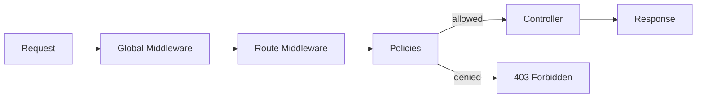

# Middleware and Policies

Middleware and policies sit between the incoming request and the controller. **Policies** decide whether a request is allowed (yes/no). **Middleware** can modify the request or response (transform, log, cache, etc.).



---

## Policies

Policies return `true` (allow) or call `ctx.unauthorized()` (deny). They cannot modify the request.

### Creating a policy

```js
// src/policies/is-authenticated.js
module.exports = (policyContext, config, { strapi }) => {
  if (policyContext.state.user) {
    return true;
  }
  return false; // returns 403
};
```

### Is-owner policy

One of the most common requirements -- only allow the creator to edit/delete their content:

```js
// src/policies/is-owner.js
module.exports = async (policyContext, config, { strapi }) => {
  const user = policyContext.state.user;
  const entryId = policyContext.params.id;

  if (!user || !entryId) {
    return false;
  }

  // Use the contentType from config, defaulting to the route's content type
  const uid = config.contentType || 'api::article.article';

  const entry = await strapi.documents(uid).findOne(entryId, {
    populate: ['createdBy'],
  });

  if (!entry) {
    return false;
  }

  // Compare the authenticated user with the entry creator
  return user.id === entry.createdBy?.id;
};
```

### Applying policies to routes

```js
// src/api/article/routes/article.js
const { createCoreRouter } = require('@strapi/strapi').factories;

module.exports = createCoreRouter('api::article.article', {
  config: {
    update: {
      policies: [
        // Global policy (from src/policies/)
        'global::is-owner',
      ],
    },
    delete: {
      policies: [
        {
          name: 'global::is-owner',
          config: { contentType: 'api::article.article' },
        },
      ],
    },
  },
});
```

### API-level policy

```js
// src/api/article/policies/has-draft-access.js
module.exports = (policyContext, config, { strapi }) => {
  const user = policyContext.state.user;

  // Only editors and admins can access drafts
  const allowedRoles = ['editor', 'admin'];
  const userRole = user?.role?.type;

  if (!allowedRoles.includes(userRole)) {
    return false;
  }

  return true;
};

// Reference in route config as: 'api::article.has-draft-access'
```

---

## Route middleware

Route middleware runs for specific routes. It can modify the request and response.

### Response time middleware

```js
// src/api/article/middlewares/response-time.js
module.exports = (config, { strapi }) => {
  return async (ctx, next) => {
    const start = Date.now();
    await next();
    const duration = Date.now() - start;
    ctx.set('X-Response-Time', `${duration}ms`);

    if (duration > (config.slowThreshold || 1000)) {
      strapi.log.warn(`Slow request: ${ctx.method} ${ctx.url} took ${duration}ms`);
    }
  };
};
```

### Applying route middleware

```js
// src/api/article/routes/article.js
const { createCoreRouter } = require('@strapi/strapi').factories;

module.exports = createCoreRouter('api::article.article', {
  config: {
    find: {
      middlewares: [
        {
          name: 'api::article.response-time',
          config: { slowThreshold: 500 },
        },
      ],
    },
  },
});
```

### Caching middleware

```js
// src/api/article/middlewares/cache.js
const cache = new Map();

module.exports = (config, { strapi }) => {
  const ttl = config.ttl || 60000; // default 60 seconds

  return async (ctx, next) => {
    // Only cache GET requests
    if (ctx.method !== 'GET') {
      return next();
    }

    const key = ctx.url;
    const cached = cache.get(key);

    if (cached && Date.now() - cached.timestamp < ttl) {
      ctx.body = cached.body;
      ctx.set('X-Cache', 'HIT');
      return;
    }

    await next();

    if (ctx.status === 200) {
      cache.set(key, { body: ctx.body, timestamp: Date.now() });
      ctx.set('X-Cache', 'MISS');
    }
  };
};
```

---

## Global middleware

Global middleware runs on every request. Register it in `config/middlewares.js`.

### Request logging middleware

```js
// src/middlewares/request-logger.js
module.exports = (config, { strapi }) => {
  return async (ctx, next) => {
    const start = Date.now();
    await next();
    const duration = Date.now() - start;

    strapi.log.info({
      method: ctx.method,
      url: ctx.url,
      status: ctx.status,
      duration: `${duration}ms`,
      ip: ctx.ip,
      userAgent: ctx.get('User-Agent'),
    });
  };
};
```

### Registering global middleware

```js
// config/middlewares.js
module.exports = [
  'strapi::logger',
  'strapi::errors',
  'strapi::security',
  'strapi::cors',
  'strapi::poweredBy',
  'strapi::query',
  'strapi::body',
  'strapi::session',
  'strapi::favicon',
  'strapi::public',

  // Add your custom global middleware
  'global::request-logger',
];
```

---

## Document Service middleware

These intercept operations on the Document Service API (the data layer):

```js
// src/index.js
module.exports = {
  register({ strapi }) {
    strapi.documents.use(async (context, next) => {
      // Only intercept article creates
      if (context.uid === 'api::article.article' && context.action === 'create') {
        // Auto-generate a slug from the title
        if (context.params.data?.title && !context.params.data?.slug) {
          context.params.data.slug = context.params.data.title
            .toLowerCase()
            .replace(/[^a-z0-9]+/g, '-')
            .replace(/^-|-$/g, '');
        }
      }

      return next();
    });
  },
};
```

---

## Policies vs middleware

| Aspect | Policies | Middleware |
|--------|----------|-----------|
| **Purpose** | Access control (allow/deny) | Request/response transformation |
| **Return value** | `true` or `false` | Calls `next()` |
| **Can modify request** | No | Yes |
| **Can modify response** | No | Yes |
| **Scope** | Route-level only | Global or route-level |
| **Use case** | Is-owner, role check, feature flag | Logging, caching, rate limiting, CORS |

---

## Common pitfalls

| Pitfall | Problem | Fix |
|---------|---------|-----|
| Forgetting `await next()` in middleware | Request hangs, never reaches controller | Always call `await next()` |
| Modifying `ctx.body` before `next()` | Overwrites the controller response | Modify after `next()` for response manipulation |
| Policy returning `undefined` | Treated as `false` (403 Forbidden) | Explicitly return `true` |
| Global middleware not in `config/middlewares.js` | Middleware never loads | Add it to the array |
| Expensive logic in middleware | Runs on every matched request | Guard with conditions, use caching |

---

## See also

- [Custom Controllers and Services](custom-controllers-services.md) -- what runs after middleware/policies
- [Custom Routes and Endpoints](custom-routes-and-endpoints.md) -- where policies and middleware are attached
- [Authentication and Permissions](authentication-and-permissions.md) -- JWT, roles, and access control
- [Lifecycle Hooks](lifecycle-hooks.md) -- database-level hooks (different from middleware)
